<!--~~~~~~~~~~~~~~~~~~~~~~~~~~~~~~~~~~~~~~~~~~~~~~~~~~~~~~~~~~~~~~~~~~~~~~~~~~~~~~~~~~~~~~~~~~~~-->
<!--~~~~~~~~~~~~~~~~~~~~~~~ 01/02. javascript and uc davis logos (01) ~~~~~~~~~~~~~~~~~~~~~~~~~~-->

<!--~~~~~~~~~~~~~~~~~~~~~~~~~~~~~~~~~~~~~~~~~~~~~~~~~~~~~~~~~~~~~~~~~~~~~~~~~~~~~~~~~~~~~~~~~~~~-->
<h2 id="about">About this Course</h2>
<!--~~~~~~~~~~~~~~~~~~~~~~~~~~~~~~~~~~~~~~~~~~~~~~~~~~~~~~~~~~~~~~~~~~~~~~~~~~~~~~~~~~~~~~~~~~~~-->

With the general introduction of JavaScript in the first course, this
course will focus on JavaScript libraries, specifically jQuery. The
scripts will be geared toward <b>Document Object Model (DOM)</b>
manipulation. Learners will describe the top JavaScript libraries and
differentiate which would work best to implement and accelerate
development of web page animation. 

Course objectives include being
introduced to the end product of the course -- a landing page style
website using jQuery elements to manipulate HTML documents and enhance
user experience. Diving deeper into the landing page that will be
created and break it out into individual jQuery projects. jQuery events
and effects will be covered while exploring more jQuery's relationship
with HTML documents. Finally, a focus on plugins and continue to
breakdown jQuery&apos;s ability to manipulate HTML and CSS.

<!--~~~~~~~~~~~~~~~~~~~~~~~~~~~~~~~~~~~~~~~~~~~~~~~~~~~~~~~~~~~~~~~~~~~~~~~~~~~~~~~~~~~~~~~~~~~~-->
<!--~~ Hoverable Dropdown Menu ~~-->
<h2><a href="#table-of-contents">Table of Contents</a></h2>

<h3 id="ch1-obj">Learning Objectives</h3>

-   Plug in the jQuery library either locally or through a CDN.

-   Discuss history of jQuery and its relationship to JavaScript.

-   Use some of the selectors and filters available in jQuery to access
    DOM elements.

-   Create an interactive element that could be used on a website in
    both JS and jQuery.

-   Compare the syntax between JavaScript and jQuery.

-   Identify and fix coding and logic problems when they emerge while
    working on a project.

-   Demonstrate proficiency with both JavaScript and jQuery for
    accessing and manipulating elements on a web page.

<h2 id="syllabus">Syllabus</h2>

<h2 id="ch1">Week/Module 1</h2>

<h2>Manipulating Web Pages Elements with jQuery & JavaScript</h2>

In this module (1), you will be introduced to jQuery and basic jQuery
syntax and we will compare it to JavaScript syntax. You will be able to
plug-in the jQuery library and discuss the history of jQuery and its
relationship to JavaScript. You&apos;ll also use some of the selectors and
filters available in jQuery to access DOM elements. You will be able to
create an interactive element that could be used on a website and be
able to identify and fix coding and logic problems while working on a
project. You will be able to demonstrate proficiency with both
JavaScript and jQuery for accessing and manipulating elements on a web
page.

<h4>19 videos, 10 readings</h4>

<ul>
  <li><h4 id="ch1-00-note">
    1.00 A Note From UC-Davis</h4></li>
  <li><h4 id="ch1-00-welcome">
  <a href="https://www.coursera.org/lecture/animation-javascript-jquery/welcome-to-this-course-K8n2i"">
    1.00 Welcome to this Course!</a></h4></li>
  <li><h4 id="ch1-00-intro">
    1.00 Learning Objectives; Manipulating Web Page Elements with jQuery &ampp; JavaScript</h4></li>
</ul>

<ol>
  <li>Introduction to jQuery</li>
</ol>

<ul>
  <li>1.01 Start Files: Introduction to jQuery 1.01-StartFile-FileName.pdf</li>
</ul>

<ol start="2">
  <li>jQuery Libraries</li>
  <li>Plugging Into jQuery Libraries</li>
  <li>Basic jQuery Syntax</li>
  <li>Using jQuery to Access Elements</li>
  <li>jQuery Events</li>
</ol>
<ul>
  <li>1.06 PDF of Presentation 1.06-FileName.pdf</li>
</ul>

<ol start="7">
  <li>Introduction to Folding Sidebar Menus Using JS</li>
</ol>
<ul>
  <li><a href="1.07-StartFile-FileName.pdf">
    1.07 Start Files: Folding Sidebar Menus with JavaScript</a></li>
</ul>
<ol start="8">
  <li>Challenge 1 Solution</li>
  <li>Challenge 2 Solution</li>
  <li>Challenge 3 Solution</li>
  <li>Challenge 4 Solution</li>
  <li>Challenge 5 Solution</li>
  <li>Challenge 6 Solution</li>
  <li>Challenge 7 Solution</li>
  <li>Challenge 8 Solution</li>
</ol>
<ul>
  <li>1.15 PDF of Presentation 1.15-FileName.pdf</li>
</ul>
<ol start="16">
  <li>Introduction to jQuery Sidebar Folding Navigation</li>
</ol>
<ul>
  <li><a href="1.16-StartFile-FileName.pdf">1.16 Start Files: Folding Sidebar Menus with jQuery</a></li>
</ul>
<ol start="17">
  <li>Getting the Next UL</li>
  <li>The Whole Script</li>
</ol>
<ul>
  <li>1.18 PDF of Presentation 1.18-FileName.pdf</li>
</ul>
<ol start="19">
  <li>JavaScript and jQuery Challenges Intro</li>
</ol>
<ul>
  <li>1.19 JavaScript and jQuery Challenge Activities 1.19-FileName.pdf</li>
</ul>

<h2 id="ch2">Week/Module 2</h2>

<h2>Animating Web Page Elements with jQuery & JavaScript</h2>

In this module (2), you will be introduced to the jQuery effects
library, helper functions, animations and callback functions. You will
be able to use features in jQuery to animate elements on a web page. You
will be able to use the callback functions to trigger a function when an
animation is completed. You will be able to create a tabbed interface in
both JavaScript and jQuery.

<h4>20 videos, 7 readings</h4>

<ul>
  <li><a href="https://www.coursera.org/lecture/animation-javascript-jquery/module-introduction-ZlMzi">
    2.00 Learning Objectives; Animating Web Page Elements</a></li>
</ul>

1.  <b>Introduction to the jQuery Effects Library</b>

<ul>
  <li><a href="">2.01 Start Files: Introduction to the jQuery Effects Library (2.01-StartFile-FileName.pdf)</a></li>
</ul>

2.  <b>Example 1 Continued</b>

3.  <b>Example 2</b>

4.  <b>Example 2: Plugin Architecture</b>

5.  <b>Example 3: Fading Buttons</b>

6.  <b>Example 3: Fade To</b>

7.  <b>Example 4: Custom Animations - Part 1</b>

8.  <b>Example 4: Custom Animations - Part 2</b>

9.  <b>Doing All Animations at Once</b>

<ul>
  <li><a href="">
    2.09 Additional Resources - PDF of Presentation 2.09-NameFile.pdf</a></li>
</ul>

10. <b>Introduction to Tabbed Interface Using jQuery</b>

<ul>
  <li><a href="">
    2.10 Start Files: Creating a Tabbed Interface with jQuery -- 2.10-StartFiles-FileName.pdf</a></li>
</ul>

11. <b>Styling the Anchor Tags</b>

12. <b>Tab Styling and Colors</b>

13. <b>Clicking and Fading Tabs</b>

14. <b>Whole Script</b>

<ul>
  <li><a href="">2.14 PDF of Presentation 2.14-NameFile.pdf</a></li>
</ul>

15. <b>Getting the CSS Ready</b>

<ul>
  <li><a href="">
    2.15 Start Files: Creating a Tabbed Interface with JavaScript - 
	2.15-StartFiles-FileName.pdf</a></li>
</ul>

16. <b>Making the Tabs Work</b>

17. <b>New Tab and Old Tab</b>

18. <b>Handling the Switch</b>

19. <b>Fixing a Bug</b>

20. <b>Cleaning Up the Code</b>

<ul>
  <li><a href="">2.20 PDF of Presentation 2.20-FileName.pdf</a></li>
</ul>

<h2 id="ch3">Week/Module 3</h2>

<h2>Intermediate Document Manipulation & Animation</h2>

In this module (3), you will be able to use the jQuery syntax and the
built-in effects library to create image sliders that could be
integrated into web pages. You will also be able to compare the jQuery
syntax to the JavaScript syntax by building a similar image slider using
only plain JavaScript syntax and using CSS to perform the animation.

<h4>17 videos, 5 readings</h4>

<ul>
  <li><a href="https://www.coursera.org/lecture/animation-javascript-jquery/module-introduction-pupTj">
    3.00 Learning Objectives; Intermediate Document Manipulation &amp; Animation</a></li>
</ul>

1.  <b>Basic Slider</b>

<ul>
  <li><a href="">3.01 Start Files: jQuery Image Sliders 3.01-StartFiles-FileName.pdf</a></li>
</ul>

2.  <b>Making the Script General</b>

3.  <b>Window Load Function</b>

4.  <b>Click Handler for Next Button</b>

5.  <b>Next Click Handler with If Statement</b>

6.  <b>Challenge Solution</b>

<ul>
  <li><a href="">3.06 PDF of Presentation 3.06-FileName.pdf</a></li>
</ul>

7.  <b>Strategy for Version 2</b>

8.  <b>Cloning the Unordered List</b>

9.  <b>Setting the Left Position</b>

10. <b>Adding a Callback Function</b>

11. <b>Previous Button Click Handler - Part 1</b>

12. <b>Previous Button Click Handler - Part 2</b>

<ul>
  <li><a href="">3.12 PDF of Presentation 3.12-FileName.pdf</a></li>
</ul>

13. <b>Slider Using JavaScript</b>

<ul>
  <li><a href="">3.13 Start Files: JavaScript Image Sliders 3.13-StartFile.pdf</a></li>
</ul>

14. <b>CSS for Slides and Adding Variables</b>

15. <b>Adding More Variables</b>

16. <b>Event Handler for the Next Button</b>

17. <b>Solution for the Previous Button Challenge</b>

<ul>
  <li><a href="">3.17 PDF of Presentation 3.17-FileName.pdf</a></li>
</ul>

<h2 id="ch4">Week/Module 4</h4>

<h2>Timers and Recursion in JavaScript & jQuery</h2>

In this module (4), you will be introduced to the use of timers and
recursion in JavaScript and use these techniques to make interface
elements that run on a timer. You practice using jQuery syntax and
recursion to build a simple content rotator that could be used as an
interface element on any web page.

<h4>12 videos, 6 readings</h4>

<ul>
  <li><a href="https://www.coursera.org/lecture/animation-javascript-jquery/module-introduction-lZUTE">
    4.00 Learning Objectives; Timers and Recursion in JavaScript &amp; jQuery</a>  </li>
  <li><a href="">4.00 Start Files; Introduction to Timers & Recursion 4.00-StartFile-FileName.pdf</a></li>
</ul>

1.  Example Script #1 - Part 1

2.  Example Script #1 - Part 2

3.  Example Script #2

4.  Example Script #3: Recursion

<ul>
  <li><a href="">4.04 PDF of Presentation 4.04-FileName.pdf</a></li>
</ul>

5.  Converting a Slider

6.  Putting Slides on a Timer Solution - Part 1

7.  Putting Slides on a Timer Solution - Part 2

<ul>
  <li><a href="">4.07 PDF of Presentation 4.07-FileName.pdf</a>  </li>
  <li><a href="">4.07 Start Files: Recursive Content Rotator 4.07-StartFile-FileName.pdf</a></li>
</ul>

8.  Project Set-up

9.  Starting the Script

10. The If/Else Statement - Part 1

11. The If/Else Statement - Part 2

<ul>
  <li><a href="">4.11 PDF of Presentation 4.11-FileName.pdf</a></li>
</ul>

12. Course Summary

<!-- hoverable drop-down menu -->

### [<b>Week 1: jQuery Plugins and Capturing the Scroll Event</b>](#ch1)
>#### [<b>1.00 A Note from UC Davis</b>](#ch1-00-note)
>#### [<b>1.00 Welcome to JS Animation!</b>](#ch1-00-welcome)
>#### [<b>1.00 Learning Objectives!</b>](#ch1-00-obj)
>#### [<b>1.01 Module 1 Introduction to jQuery</b>](#ch1-01)
>#### [<b>1.02 jQuery Libraries</b>](#ch1-02)
>#### [<b>1.03 Plugging into jQuery Libraries</b>](#ch1-03)
>#### [<b>1.04 Basic jQuery Syntax</b>](#ch1-04)
>#### [<b>1.05 Using jQuery to Access Elements</b>](#ch1-05)
>#### [<b>1.06 jQuery Events</b>](#ch1-06)

<ul>
  <li><a href=""
    target="_blank" rel="noopener noreferrer">
	1.06 Slideshow of jQuery Events.pdf (download)</a></li>
</ul>

>#### [<b>1.07 Intro to JavaScript Folding Sidebar Menus Using JS</b>](#ch1-07)

<ul>
  <li><a href=""
    target="_blank" rel="noopener noreferrer">
	1.07 START Files: JS Folding SideBar Menus (download)</a></li>
</ul>

>#### [<b>1.08 Challenge 1 Solution</b>](#ch1-08)
>#### [<b>1.09 Challenge 2 Solution</b>](#ch1-09)
>#### [<b>1.10 Challenge 3 Solution</b>](#ch1-10)
>#### [<b>1.11 Challenge 4 Solution</b>](#ch1-11)
>#### [<b>1.12 Challenge 5 Solution</b>](#ch1-12)
>#### [<b>1.13 Challenge 6 Solution</b>](#ch1-13)
>#### [<b>1.14 Challenge 7 Solution</b>](#ch1-14)
>#### [<b>1.15 Challenge 8 Solution</b>](#ch1-15)

<ul>
  <li><a href=""
    target="_blank" rel="noopener noreferrer">
	1.15 PDF of Presentation (download)</a></li>
</ul>

>#### [<b>1.16 Intro to jQuery Folding SideBar Menu Navigation</b>](#ch1-16)

<ul>
  <li><a href=""
    target="_blank" rel="noopener noreferrer">
	1.16 START Files: jQuery Folding SideBar Menus (download)</a></li>
</ul>

>#### [<b>1.17 Getting the Next UL</b>](#ch1-17)
>#### [<b>1.18 The Whole Script</b>](#ch1-18)

<ul>
  <li><a href=""
    target="_blank" rel="noopener noreferrer">
	1.18 PDF of Presentation (download)</a></li>
</ul>

>#### [<b>1.19 JavaScript and jQuery Challenge Activities</b>](#ch1-19)

<ul>
  <li><a href=""
    target="_blank" rel="noopener noreferrer">
	1.19 JS and jQuery Challenge Activities (download)</a></li>
</ul>

<h2 id="ch1-00-note">A Note From UC Davis</h2>

Welcome to this course!

We are delighted to be a part of your continuing education. This course
will provide you with a variety of tools and learning opportunities, to
include video lectures, readings, assessments, peer reviews, and an
opportunity to contribute to the Coursera learning community in the
discussion forums.

In each of the lesson sections, you'll find learning objectives, lecture
videos, readings, activities, and an opportunity to test your knowledge
in quiz format. In some of the module sections you'll also work on
assignments and grade the work of your peers. A peer-review assignment,
is one where you and your fellow learners have an opportunity to review
and grade each other's work. We'll dive more into peer reviews later on
in this course.

When navigating the course, you can find available <b>course resources</b>
under each of the lecture videos in a section labeled
<b><i>"Downloads"</i></b> -- here you can download the lecture video,
view transcripts, PDFs of the lecture slides, and <b>find additional
readings or files</b>.

If you run into any issues during this course, <b>learner support</b> is
available to all Coursera students. The link for Coursera's Learner
support is included below. The <a href="https://learner.coursera.help/hc/en-us">Help Center/Learner
Support</a> includes topics such as account setup, payments, enrollment questions, and troubleshooting
common problems.

If you find any content issues, be sure to let the course staff know by
<b>flagging the lecture</b>, assignment, reading, or quiz and this will
inform us of where these issues occur. Here is the link for more
information on how to <a href="https://learner.coursera.help/hc/en-us/articles/208280106-Report-a-problem-with-a-course">
Flag an Issue</a> - it is also listed below.

One of the great things about Coursera courses is that they are
self-paced. The course dates are based on the average time it takes to
complete a course. However, if you need additional time to complete a
course you can <b>reset your deadlines</b> with no penalties. More
information on resetting deadlines can be found here: 
<a href="https://learner.coursera.help/hc/en-us/articles/208279866-Assignment-deadlines">Assignment Deadlines</a>

Need additional help during your course session? Be sure to utilize the
<b>discussion forums</b> and interact with your fellow peers. In this area,
you can ask questions or search for similar issues that have already
been posted in the forums. Learner support is also a great place to find
answers, but specific course content questions can typically be found
and answered in the discussion forums. This is also a great place to
post your assignment if additional peer reviews are needed. Here is a
link with more information on the discussion forums: [Discussion
Forums](https://learner.coursera.help/hc/en-us/articles/208279996-Get-help-with-course-content-in-the-discussion-forums)

Because of the self-paced nature of Coursera courses, this is an
excellent opportunity to show your commitment to your work and the work
of your peers through academic integrity. Be sure to read the Coursera
guidelines and the <b>Coursera Honor Code</b> here: [Coursera Honor
Code](https://learner.coursera.help/hc/en-us/articles/209818863-Coursera-Honor-Code)

We look forward to having you in this course. Happy learning!

<i><b>UC Davis Coursera Team</i></b>

<h2 id="ch1">Week/Module One:</h2>

<h2>Manipulating Web Pages Elements with jQuery & JS</h2>

In this module, you will be introduced to jQuery and basic jQuery syntax
and we will compare it to JavaScript syntax. You will be able to plug-in
the jQuery library and discuss the history of jQuery and its
relationship to JavaScript. You&apos;ll also use some of the selectors and
filters available in jQuery to access DOM elements. You will be able to
create an interactive element that could be used on a website and be
able to identify and fix coding and logic problems while working on a
project. You will be able to demonstrate proficiency with both
JavaScript and jQuery for accessing and manipulating elements on a web
page.

<h2 id="ch1-00-obj">1.00 Learning Objectives</h2>

-   Plug in the jQuery library either locally or through a CDN.

-   Discuss history of jQuery and its relationship to JavaScript.

-   Use some of the selectors and filters available in jQuery to access
    DOM elements.

-   Create an interactive element that could be used on a website in
    both JS and jQuery.

-   Compare the syntax between JavaScript and jQuery.

-   Identify and fix coding and logic problems when they emerge while
    working on a project.

-   Demonstrate proficiency with both JavaScript and jQuery for
    accessing and manipulating elements on a web page.

<!--~~~~~~~~~~~~~~~~~~~~~~~~~~~~~~~~~~~~~~~~~~~~~~~~~~~~~~~~~~~~~~~~~~~~~~~~~~~~~~~~~~~~~~~~~~~~-->
<h2 id="ch1-01">1.01 Introduction to jQuery (7:56)</h2>
<!--~~~~~~~~~~~~~~~~~~~~~~~~~~~~~~~~~~~~~~~~~~~~~~~~~~~~~~~~~~~~~~~~~~~~~~~~~~~~~~~~~~~~~~~~~~~~-->
<!--~~~~~~~~~~~~~~~~~~~~~~~~~~~~~ 03. intro to jquery (1.01) (08) ~~~~~~~~~~~~~~~~~~~~~~~~~~~~~~-->

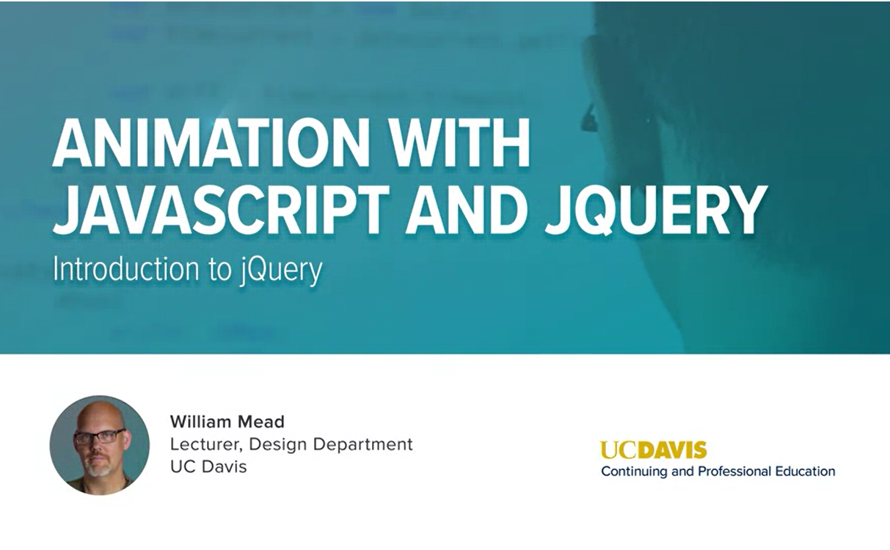

Introduction to jQuery, a little bit of history.

JQuery was originally created by John Resig in 2006, and it became the
most popular JavaScript library and it&apos;s still a popular JavaScript
library. In a recent survey, it was found that over 80 percent of
websites are still using jQuery. It&apos;s less popular today than it was
back in the early 2010s where it was at its height. But it&apos;s still an
important tool to learn and good to know.

<!--~~~~~~~~~~~~~~~~~~~~~~~~~~~~~~~~~~~~~~~~~~~~~~~~~~~~~~~~~~~~~~~~~~~~~~~~~~~~~~~~~~~~~~~~~~~~-->
<!--~~~~~~~~~~~~~~~~~~~~~~~~~~~~~~~ 04. jquery advantages (09) ~~~~~~~~~~~~~~~~~~~~~~~~~~~~~~~~~-->

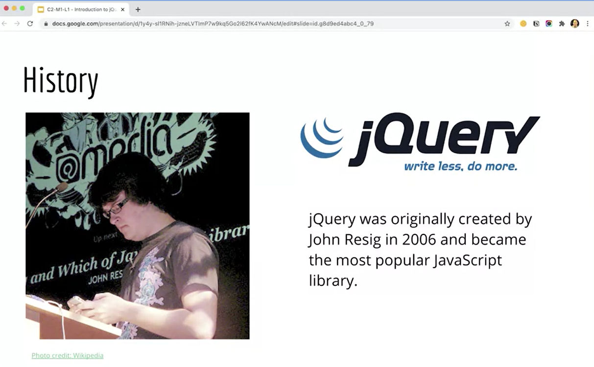

There are some specific advantages that came with jQuery when it was
invented and some of these advantages exist today, but they are somewhat
diminished, but let&apos;s talk about them. First of all, it smoothed out
the differences between browsers. Back in 2006, when jQuery was
invented, JavaScript was not implemented evenly across browsers and
jQuery was really great at smoothing out those differences from one
browser to another. It also simplified common tasks such as traversing
the DOM. It provided a lot of ways of getting elements on the pages that
we didn&apos;t have with plain JavaScript back in the late 2000s, or early
2010s.

It also provided an easier to work with event model for capturing clicks
and scrolls and other kinds of events that users might use in the
process of working with the page. Events that users make trigger. So it
provided this event model that was easier to access and easier to use,
it was easier to create interactive scripts that could hook into that
event model in jQuery.

jQuery also provides an effects library that&apos;s very easy to use and
really exciting and it&apos;s really a cool effects library that provided a
great way into programming, into creating interactive elements for a
whole generation of developers.

Then on top of that, there&apos;s a plug-in system for additional
functionality. You could create plugins that added functionality to
jQuery and we&apos;ll take a look at this to some extent.

Then finally, last but not least, jQuery provides a simpler syntax and
that allows us to write shorter and more concise scripts and these were
all huge advantages to jQuery and contributed to making it the most
popular JavaScript library.
<!--~~~~~~~~~~~~~~~~~~~~~~~~~~~~~~~~~~~~~~~~~~~~~~~~~~~~~~~~~~~~~~~~~~~~~~~~~~~~~~~~~~~~~~~~~~~~-->
<!--~~~~~~~~~~~~~~~~~~~~~~~~ 05. jquery is less useful than 2010 (10) ~~~~~~~~~~~~~~~~~~~~~~~~~~-->

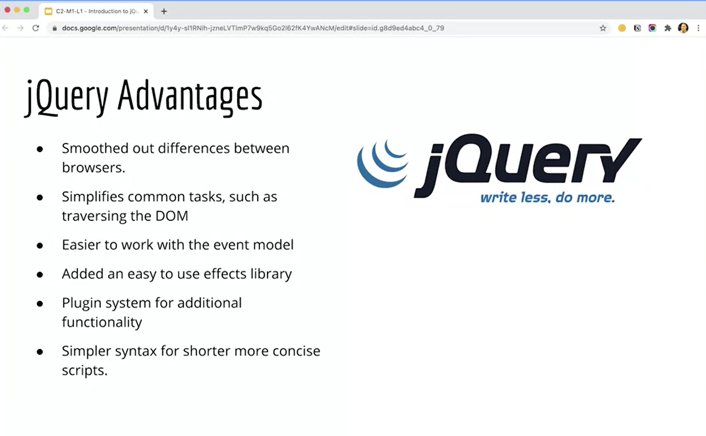

Today, jQuery is less useful than it used to be back in the early days.
Some of the things that have been smoothed over is that, remember, in
2009, jQuery came out in 2006. In 2009, the standardizing body decided
to make JavaScript, the scripting language for the web and at that
point, a lot of excitement poured into the JavaScript world and there
was a concerted effort from the people who were making browsers. Web
browsers like Chrome and Firefox and Safari and Internet Explorer at the
time, It&apos;s now Edge. But for those companies that were making those,
whether it&apos;s Apple or Microsoft or whomever, to standardize their
implementations of JavaScript, that really helped with the development
of JavaScript plus the release of ES6 or ES 2015 in 2015 really helped
with a lot of the features of plain vanilla JavaScript so that we don&apos;t
need as much from jQuery as we once did.

We don&apos;t need to smooth out the differences between different browsers
as much anymore. The implementations in different browsers are pretty
much the same now are very similar, we don&apos;t need a lot of that
anymore. In terms of simplifying common tasks such as traversing the
DOM, we&apos;ve already explored <b>querySelector</b> and <b>querySelectorAll,</b>
which are great tools for accessing elements in your DOM that are built
into plain JavaScript now. Those have really helped minimize the need
for jQuery to do that kind of thing.

Also in plain JavaScript, we now have the <b>addEventListener</b> method,
which is great for adding event listeners for all different types of
events that users might trigger or might be triggered by the system.
Using that event listener model limits the need for the easier to work
with event model that jQuery had to offer. The <b>effects</b> library is
interesting. The jQuery <b>effects</b> library is great, and it&apos;s really
great to work with and it&apos;s fun to work with, and it&apos;s still useful
from time to time.

But these days we would much prefer to use CSS to create animation
because CSS will take advantage of the devices GPU, the graphics
processing unit, as opposed to the CPU, the central processing unit, and
that will make your animation smoother and work better, especially for
older, slower devices, and these kinds of things. Phones, older phones,
this kind of stuff that the jQuery animations will feel a little bit
clunky because jQuery is using JavaScript to create those animations.
The effects library is not as useful today as it once was, although it
can still be useful.

The two things that are still really useful about jQuery are the plugin
system for additional functionality. There are thousands of plugins
written for jQuery and we&apos;ll look at a few of them. But you can explore
many on your own and the wonderful thing about plugins is that, other
people have written a whole bunch of code and you can take advantage of
that and build all kinds of cool things from the code that others have
written. That also helps prepare you for other types of libraries of
code, if you get into node and NPM and these kinds of things. Doing this
stuff with jQuery will help prepare you for that world.

The simpler syntax for shorter, more concise scripts is also still true.
It&apos;s perhaps less true than it once was, but it&apos;s still true. You&apos;ll
see, we&apos;ll do some exercises and some examples where you&apos;ll see that
the scripts are shorter and more concise and if you&apos;re just learning
programming for the first time, that can be a way into programming. It
was a way into programming for a lot of people who got into JavaScript
and jQuery back in the day. It certainly was for me personally, where I
wanted to do something that was fun and interactive and I could write
fewer lines of code with jQuery than with JavaScript, so that was a real
bonus for me as I was learning JavaScript back in the day.

There are a lot of modern considerations to take into account when
deciding whether or not to use jQuery. Adding JQuery to your project,
add some weight to the files, and they&apos;ll take longer to load. If
you&apos;re just doing one simple small thing, it&apos;s probably just not worth
it to load jQuery to do that. However, if you want to get a simple
interaction working quickly and easily, or if you want to make use of a
jQuery plugin, using jQuery could save you a lot of time and really be
worthwhile. You have to really consider it on a project-by-project
basis.

<h2 id="ch1-01"><a href="https://www.coursera.org/learn/animation-javascript-jquery/supplement/qGouq/start-files-introduction-to-jquery">
  1.01 jQuery-Start.zip</a></h2>

<!--~~~~~~~~~~~~~~~~~~~~~~~~~~~~~~~~~~~~~~~~~~~~~~~~~~~~~~~~~~~~~~~~~~~~~~~~~~~~~~~~~~~~~~~~~~~~-->
<h2 id="ch1-02">1.02 jQuery Libraries (6:00)</h2>
<!--~~~~~~~~~~~~~~~~~~~~~~~~~~~~~~~~~~~~~~~~~~~~~~~~~~~~~~~~~~~~~~~~~~~~~~~~~~~~~~~~~~~~~~~~~~~~-->
<!--~~~~~~~~~~~~~~~~~~~~~~~~~~~~ 06. jquery libraries (1.02) (12) ~~~~~~~~~~~~~~~~~~~~~~~~~~~~~~-->

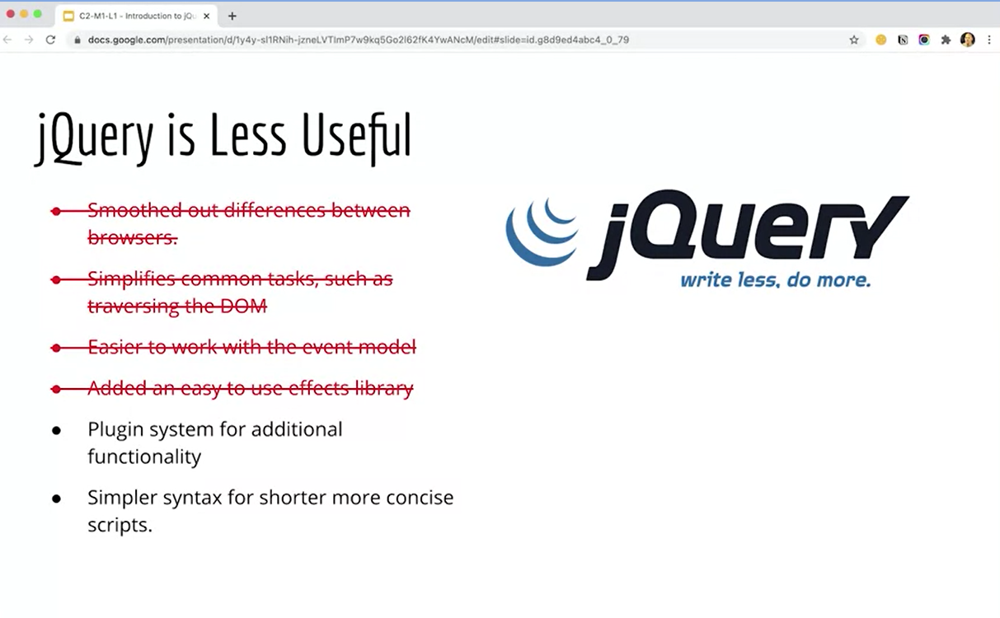

What is a library anyway?
<!--~~~~~~~~~~~~~~~~~~~~~~~~~~~~~~~~~~~~~~~~~~~~~~~~~~~~~~~~~~~~~~~~~~~~~~~~~~~~~~~~~~~~~~~~~~~~-->
<!--~~~~~~~~~~~~~~~~~~~~~~~~~~~ 07. what is a library, anyway? (12) ~~~~~~~~~~~~~~~~~~~~~~~~~~~~-->

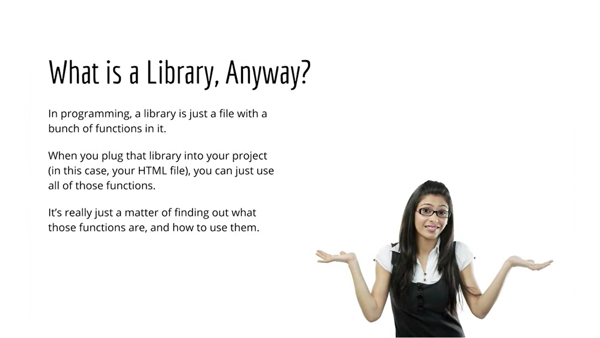

In programming, a library is just a file with a bunch of functions in
it. Or it could be multiple files that you link up to your project. In
this case, you link them into your HTML file and then you can just use
those functions. If you&apos;re not familiar with a lot of programming and
you haven&apos;t done a lot of this kind of thing, it may seem like an
unusual or a new concept for you, but just think of it as something as
simple as that. It&apos;s just a file with functions in it that you can
access and use in your project. And then once you&apos;ve linked it to your
project, it&apos;s just a matter of finding out what those functions are and
how to use them. And that&apos;s really how jQuery works. It&apos;s a file that
you can add to your project, and when you do you have access to all the
jQuery functions and all the functions that come along with jQuery.
<!--~~~~~~~~~~~~~~~~~~~~~~~~~~~~~~~~~~~~~~~~~~~~~~~~~~~~~~~~~~~~~~~~~~~~~~~~~~~~~~~~~~~~~~~~~~~~-->
<!--~~~~~~~~~~~~~~~~~~~~~~~ 08. two options for plugging in jquery (13) ~~~~~~~~~~~~~~~~~~~~~~~~-->

There are two options for plugging in jQuery. The <b>first</b> is you can
download the file, the actual jQuery library file, and put it in your
folder with your other Javascript files or other files for your project,
and then link to that file locally in your project folder. And then when
you load your web page it will load that file along with all your other
files.

Or, <b>second</b>, you can hot link to the library on a CDN or Content
Delivery Network. So what that means is instead of putting the file in
your project folder, you&apos;re actually linking to the file already out on
the Internet. And a CDN or Content Delivery Network means that when you
do that, you&apos;ll actually be getting the file from the closest server to
you. A CDN has servers all over the globe. And when you go to load a
particular web page, it&apos;s looking at your IP address and figuring out
where you are and then getting the file from the closest file server, so
it will get it the fastest that it can.
<!--~~~~~~~~~~~~~~~~~~~~~~~~~~~~~~~~~~~~~~~~~~~~~~~~~~~~~~~~~~~~~~~~~~~~~~~~~~~~~~~~~~~~~~~~~~~~-->
<!--~~~~~~~~~~~~~~~~~~~~~~~~~~~~ 09/10. jquery.com downloads (14) ~~~~~~~~~~~~~~~~~~~~~~~~~~~~~~-->

First, we&apos;ll look at downloading jQuery, and to do that, you can go to
<b>jquery.com</b>, and I have that website pulled up here, and you can
click the Download jQuery link. So let&apos;s go over here. And I can click
on download jQuery here. And that will take me to a page that, if
you&apos;re not used to doing this kind of stuff, will look a little
confusing. because we&apos;ve got a whole bunch of links here and it&apos;s not
really clear exactly what it is you should actually be downloading. And
then they&apos;ve got this stuff with npm and Yarn and Bower, and this
migrate plugin and all this other stuff on the page. So it can be a
little bit confusing.
<!--~~~~~~~~~~~~~~~~~~~~~~~~~~~~~~~~~~~~~~~~~~~~~~~~~~~~~~~~~~~~~~~~~~~~~~~~~~~~~~~~~~~~~~~~~~~~-->
<!--~~~~~~~~~~~~~~~~~~~~~ 11. downloading using npm, yarn and bower (14) ~~~~~~~~~~~~~~~~~~~~~~~-->

The <b>npm, Yarn</b> and <b>Bower</b> are all build tools that you might be
using if you&apos;re in a particular environment that&apos;s using these build
tools. But we&apos;re just going to download the actual library file itself.
And what we want is the compressed version. There will be a compressed
version and an uncompressed version.
<!--~~~~~~~~~~~~~~~~~~~~~~~~~~~~~~~~~~~~~~~~~~~~~~~~~~~~~~~~~~~~~~~~~~~~~~~~~~~~~~~~~~~~~~~~~~~~-->
<!--~~~~~~~~~~~~~~~~~~~~~~~~~~~ 12. javascript code in jquery (15) ~~~~~~~~~~~~~~~~~~~~~~~~~~~~~-->

The uncompressed version will look like this, and it looks kind of like
Javascript that you&apos;ve seen before with <b>var</b> and all this kind of
stuff. The compressed version is going to remove all of the white space
and sort of compress it down. So it&apos;s not really made for human reading
at all, it&apos;s made just to be loaded on your computer. But it will be
smaller. It&apos;ll be a smaller file to download and so what you want is
the <b>compressed</b> <b>production</b> version of jQuery.

So if you click the shortcut to the compressed version, you&apos;ll get a
screen full of compressed code which appears as jQuery version 3.7.1.
Okay, so to download this, if you just right click in the white area
here and do Save As, and I&apos;m going to save it in my Downloads into my
jQuery Start folder, and that&apos;s where you should put it as well. So
I&apos;m going to just put it in here and save this so that now I have a
copy of jQuery in my jQuery Start folder here.
<!--~~~~~~~~~~~~~~~~~~~~~~~~~~~~~~~~~~~~~~~~~~~~~~~~~~~~~~~~~~~~~~~~~~~~~~~~~~~~~~~~~~~~~~~~~~~~-->
<!--~~~~~~~~~~~~~~~~~~~~~~~~~ 13. jquery-3.7.1.min.js in folder (15) ~~~~~~~~~~~~~~~~~~~~~~~~~~~-->

Here it is, jQuery 3.7.1 min because the minified version has been
compressed down. And, you want to get the minified version. This version
is the size of maybe a medium sized image on your web page (86
kilobytes). It&apos;s not that big. This is significantly larger
(un-minified version of 279 kilobytes).

So now we&apos;ve got jQuery, let&apos;s get it plugged into our HTML file.
We&apos;ll plug it into our HTML file here.

<!--~~~~~~~~~~~~~~~~~~~~~~~~~~~~~~~~~~~~~~~~~~~~~~~~~~~~~~~~~~~~~~~~~~~~~~~~~~~~~~~~~~~~~~~~~~~~-->
<h2 id="ch1-03">1.03 Plugging into jQuery Libraries (5:37)</h2>
<!--~~~~~~~~~~~~~~~~~~~~~~~~~~~~~~~~~~~~~~~~~~~~~~~~~~~~~~~~~~~~~~~~~~~~~~~~~~~~~~~~~~~~~~~~~~~~-->
<!--~~~~~~~~~~~~~~~~~~~~~~~~ 14. plugging into jquery libraries (16) ~~~~~~~~~~~~~~~~~~~~~~~~~~~-->

Plugging in the jQuery library, now we&apos;ve downloaded jQuery, all we
need to do is add it to our file.
<!--~~~~~~~~~~~~~~~~~~~~~~~~~~~~~~~~~~~~~~~~~~~~~~~~~~~~~~~~~~~~~~~~~~~~~~~~~~~~~~~~~~~~~~~~~~~~-->
<!--~~~~~~~~~~~~~~~~~~~~~~~~ 15. example, plug in jquery library (16) ~~~~~~~~~~~~~~~~~~~~~~~~~~-->

I want to add jQuery to my file here. I can come down here and I can add a 
script tag script, and what I&apos;m going to put in here is 
<b>src="js/jquery-3.7.1.min.js" (last updated 8/28/2023). js is my subdirectory.
<!--~~~~~~~~~~~~~~~~~~~~~~~~~~~~~~~~~~~~~~~~~~~~~~~~~~~~~~~~~~~~~~~~~~~~~~~~~~~~~~~~~~~~~~~~~~~~-->
<!--~~~~~~~~~~~~~~~~~~~~~~~~ 16.  (17) ~~~~~~~~~~~~~~~~~~~~~~~~~~-->

Now jQuery is plugged in.
<!--~~~~~~~~~~~~~~~~~~~~~~~~~~~~~~~~~~~~~~~~~~~~~~~~~~~~~~~~~~~~~~~~~~~~~~~~~~~~~~~~~~~~~~~~~~~~-->
<!--~~~~~~~~~~~~~~~~~~~~~~~~ 17.  (17) ~~~~~~~~~~~~~~~~~~~~~~~~~~-->

If I test this file over here, I come over here and open a new tab and do open and 
go into my jQuery Start folder and open this index file, it&apos;ll pop up and 
it&apos;ll say jQuery is loaded.
<!--~~~~~~~~~~~~~~~~~~~~~~~~~~~~~~~~~~~~~~~~~~~~~~~~~~~~~~~~~~~~~~~~~~~~~~~~~~~~~~~~~~~~~~~~~~~~-->
<!--~~~~~~~~~~~~~~~~~~~~~~~~ 18.  (18) ~~~~~~~~~~~~~~~~~~~~~~~~~~-->

Even easier is to use a CDN to load jQuery, and the CDN I prefer to use is
the Google CDN, and I have that pulled up over here, and if you want to
get to the CDN, the easy way to get to it is just to Google. Google
jQuery I type CDN there we go, and you&apos;ll see Hosted Libraries on
Google. That&apos;s this link right here, and over here they&apos;ve got a lot
of libraries that you can access through Google that they host on their
CDN, and one of them is jQuery. 
<!--~~~~~~~~~~~~~~~~~~~~~~~~~~~~~~~~~~~~~~~~~~~~~~~~~~~~~~~~~~~~~~~~~~~~~~~~~~~~~~~~~~~~~~~~~~~~-->
<!--~~~~~~~~~~~~~~~~~~~~~~~~ 19.  (18) ~~~~~~~~~~~~~~~~~~~~~~~~~~-->

https://developers.google.com/speed/libraries/#libraries

We can actually go to this link here, to
jQuery, and you can see that jQuery has three different versions, three
flavors of jQuery that include different features. The version 1X
snippet is the oldest version of jQuery and it&apos;s loading 1.12.4. This
is really the 12th major version of version one, essentially, and then
we&apos;ve got version 2.2.4, which is the second major version of version a
two, and in version two, they did a number of things to remove support
for IE6 because they had basically gone away at that point, so they&apos;ve
done some different things in these different versions. 
<!--~~~~~~~~~~~~~~~~~~~~~~~~~~~~~~~~~~~~~~~~~~~~~~~~~~~~~~~~~~~~~~~~~~~~~~~~~~~~~~~~~~~~~~~~~~~~-->
<!--~~~~~~~~~~~~~~~~~~~~~~~~ 20. is jquery working; script load (19) ~~~~~~~~~~~~~~~~~~~~~~~~~~-->

The most recent
version, the version that we downloaded is version 3.7.1, so to get the
same one that we had before, you can just copy this entire script line
here. Oops, wrong button here. There we go. Just copy that line, and go
back to our file here, and paste that line in instead, and you&apos;ll see
if we save this and come back and do testing jQuery, jQuery is loaded.
Instead of loading from the file that I have locally here, I can now
delete this file, and it will work just fine. 
<!--~~~~~~~~~~~~~~~~~~~~~~~~~~~~~~~~~~~~~~~~~~~~~~~~~~~~~~~~~~~~~~~~~~~~~~~~~~~~~~~~~~~~~~~~~~~~-->
<!--~~~~~~~~~~~~~~~~~~~~~~~~~~~~~~~ 21. is jquery working? (20) ~~~~~~~~~~~~~~~~~~~~~~~~~~~~~~~~-->

Now if I was gone,
but this will work just fine because it&apos;s actually loading jQuery from
the internet. Of course, if the internet&apos;s down, it&apos;s not going to
load it, but if the internet&apos;s down, and you going to get to your
webpage anyway. 

It&apos;s a little bit easier to use the CDN to load jQuery
because it&apos;s just one less file and I have to download, keep track of.
Usually we will be using this method to load jQuery, and there are times
when you might want the older versions generally will use the newest
version, but you might want the older versions if you&apos;re using a
function or method in jQuery that has been deprecated, or if you&apos;re
using a plug-in that was built using an older version, and it needs some
functionality from the older version in order to work. But generally
we&apos;re going to use the newest version of jQuery, version 3.7.1 at the
time of this recording.

<!--~~~~~~~~~~~~~~~~~~~~~~~~~~~~~~~~~~~~~~~~~~~~~~~~~~~~~~~~~~~~~~~~~~~~~~~~~~~~~~~~~~~~~~~~~~~~-->
<h2 id="ch1-04">1.04 Basic jQuery Syntax (5:31)</h2>
<!--~~~~~~~~~~~~~~~~~~~~~~~~~~~~~~~~~~~~~~~~~~~~~~~~~~~~~~~~~~~~~~~~~~~~~~~~~~~~~~~~~~~~~~~~~~~~-->
<!--~~~~~~~~~~~~~~~~~~~~~~~~~~ 22. basic jquery syntax (1.04) (21) ~~~~~~~~~~~~~~~~~~~~~~~~~~~~~-->

Now that you have jQuery working, let&apos;s do something with it. Do
something more than just to show that it&apos;s working. We&apos;ll use the same
file, we&apos;re just going to replace the script down there just so we can
see that something is happening to our actual web page. If we come back
over here, we can get rid of this if-else statement. Just delete that
for a moment and let&apos;s put in a jQuery statement. Try this instead.
There we go, dollar sign, we&apos;re going to go get the h1 on the page,
which is this element here, Is jQuery working? We&apos;re going to use the
CSS method in jQuery, like that. What we&apos;re going to do is we&apos;re going
to set the color of the h1 to red. If we just do this one line and then
save it. Then if you come over and run this test in jQuery again,
you&apos;ll see that it turns the h1 red here. If I inspect this element
here, you can see that what jQuery has done here is it&apos;s set the style
color red on the h1. Now before we did the same thing with querySelector
or querySelectorAll. We&apos;ve done this kind of thing before in previous
lessons, but now we&apos;re using jQuery to do it. In jQuery you can see we
have just a really simple syntax here that uses CSS-style selectors to
access elements on the page. We&apos;ve gotten methods that we have access
to because the jQuery library is plugged in that we can just use. Now if
you&apos;re wondering about the dollar sign here. The dollar sign is just a
shortcut for the word jQuery. I could put the word jQuery there, and
over here this will run just exactly the same way. It will work fine
with using the word jQuery instead of the dollar sign. But generally we
use the dollar sign as a shortcut just because it keeps our script
shorter, it&apos;s less typing, and why type all those extra characters if
you can just type one? We can put the single dollar sign in there for
that reason. This CSS method here is just one of the great many that
jQuery has to offer that will help us factor web pages. You can come
back here, you can go and look at the jQuery API documentation here.
I&apos;ll put this link in for the lessons so you can access it easily. You
can see that there&apos;s just tons and tons of different methods that you
have access to as we go through and look at all of these. Here&apos;s the
CSS one that we were just looking at, but there&apos;s tons of them in here.
JQuery gives you access to all of these different methods. It&apos;s like
having a kit that you can use to build things for your web pages just by
plugging them in and plugging in jQuery and then using these methods, in
accordance to the way they&apos;re described in the documentation. Let&apos;s
try something else here. If we come back here and try, let&apos;s try adding
a few paragraphs. Let&apos;s just add a few paragraphs. One of the nice
things about jQuery is it allows you to work with collections of things.
If I come in here and just add a couple of paragraphs to the page. I&apos;m
just going to copy that and paste it and add a few more here. Now I&apos;ve
got three paragraphs on the page. Down here, if I change this to P, if
we were doing this with plain JavaScripts, we would need some loop
because we would do querySelectorAll or getElementsByTagName or some
method like that, which would give us an array of items that we would
then have to loop through to turn them all red. We&apos;ve done that before.
You&apos;ve done that in some of our previous lessons. Here with jQuery, one
of the things that makes jQuery shorter and more concise is it&apos;ll work
with groups of elements. I can just grab the paragraphs and say CSS
color red. You&apos;ll see over here when I run this page, it&apos;s loading
these paragraphs and it&apos;s turning them all red without having to do a
loop. That saves me not a lot of extra lines, but a few extra lines of
programming. This is the thing that makes jQuery easier to get into for
people who are new to programming. This whole thing of having to, I take
this array. Now I&apos;ve got an array and I&apos;m going to loop through it.
It&apos;s a little bit of a pain. JQuery takes some of that pain away, and
that&apos;s really a nice feature of jQuery.

<!--~~~~~~~~~~~~~~~~~~~~~~~~~~~~~~~~~~~~~~~~~~~~~~~~~~~~~~~~~~~~~~~~~~~~~~~~~~~~~~~~~~~~~~~~~~~~-->
<h2 id="ch1-05">1.05 Using jQuery to Access Elements (8:39)</h2>
<!--~~~~~~~~~~~~~~~~~~~~~~~~~~~~~~~~~~~~~~~~~~~~~~~~~~~~~~~~~~~~~~~~~~~~~~~~~~~~~~~~~~~~~~~~~~~~-->

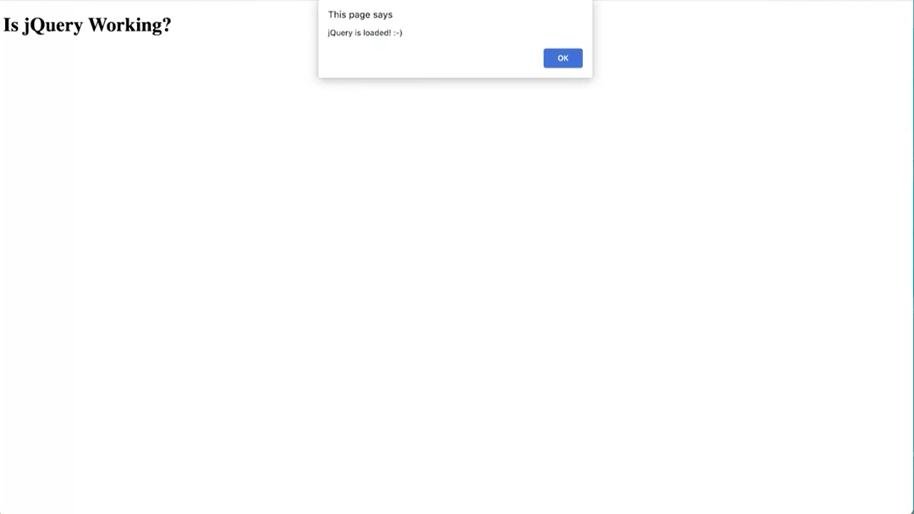{width="4.0in"
height="2.473077427821522in"}

jQuery selecting elements, download and open the page dot html file and
your code editor that goes along with this particular lesson and there
you&apos;ll see some markup and we can use the jquery language to select
different elements on the page. If we go look at this page really
quickly here, you&apos;ll see that it just has some content it has some
different markup with the header in each one in each to summon ordered
lists. It&apos;s got some ideas and some classes and some links and some
other content that we can access. And one of the beautiful things about
jQuery is that you can access any element on the page with jQuery,
usually in many different ways, it&apos;s the very powerful part of jQuery
and you can think of it as the query part of jQuery, your query in your
page, you&apos;re finding elements on the page that you can do things to
them or with them or for them. And that&apos;s a very powerful thing. So we
will be using jQuery to go in and access elements on this page and
we&apos;ll practice that to sort of see, what some of these different
methods are and some of the different things we have available to us,
see what they are in jQuery. And that&apos;s really kindaa fun and a very
powerful thing to be able to do with jQuery. So for example, if we were
to try to do this, we could go back to our file, we&apos;re going to have to
add the, at the library again so we need the script here. If we come
back over to our file, you&apos;ll notice the bottom, we don&apos;t have any
script tags. So down here after this closing div we need to add the
jQuery library, so we can use jQuery and then we need to use then we
need a script tag, which we can open and close. And now if we wanted to
do something like for example, put a border around this main element
here, we can very easily just use jQuery object. And type it this way
it&apos;ll get, there is still some syntax that you have to get used to with
jQuery, so I recommend typing it this way, so you can kind of get used
to it. If you do pound maine and then CSS the CSS method that we&apos;ve
already talked about and we&apos;re just going to do a border here. Border
two PX color to be X solid read like that I think will work. Is that
what I had over here I think it is, 2PX solid red. So if we do that and
save this document here, and then come over to our example page, so
here&apos;s my page and if I refresh you&apos;ll see I get a border around the
mean area of the page. So that&apos;s working, so we can access this
element, we can access all kinds of elements with jQuery. So if I wanted
to get the elements on the page that have the class special, so if we go
back to our code here, we should see that we&apos;ve got a class special in
these two list items. We&apos;ve got a class special up here on this list
item, so these items should be targeted if we change this to not
special. And one of the things that&apos;s nice about jQuery is that if you
just know CSS then how to get these selectors. It&apos;s just using the same
selectors you&apos;d use in CSS, so I can come over here and try that again
and you can see those elements are getting the border around them. You
can also use compound selector, so if I wanted to get specifically the
age to inside of main we can do that as well so we can do main H two.
Now this may not seem so special now because we have query selector and
playing javascript which allows us to use compound selectors like this
using the CSS index. But, back in the day when jQuery was invented, you
couldn&apos;t do that stuff in javascript and so it was a lot more
complicated to be able to get to elements in the patrons playing
javascript. Now it&apos;s not so hard, but still this is pretty neat to see
that you can get to these elements, really easily inside of our page and
you notice I don&apos;t have to do any kind of looping. So even if I was
using plain javascript, even now with query selector, all I would have
to have some sort of loop or for each method or something like that, to
go through and turn each one of these red. Whereas in jQuery I can very
simply just grab the group and apply the CSS to it and applies it. So
this thing returns a jQuery object, with these elements inside it and
then we can apply that CSS to it so that&apos;s pretty nifty. There are more
that you can try, so for example you can try Multiple selectors, like I
could say I want the H two and the paragraphs. I recommend trying these
out I&apos;m not going to make you watch me type them all. I could get the
even list items, or the first paragraph or the list item that has an a
northern list inside of it or a list item that contains the word three.
So there&apos;s like all of these different ways of getting, content on your
page. Now some things to pay attention to is that, jQuery does change
over time and some of these that I have on this slide, some of these
that I have on the slide are are actually deprecating now. So for
example, even in first we&apos;re not actually supposed to use anymore. If
you come over to the, documentation, you&apos;ll see that as of jQuery 3.4,
even the even pseudo classes deprecating what they want you to use
instead is dot even. So let&apos;s take a look at how you would do that. So
over here if I did, instead of saying LI colon even, I would do LI and
then I would do dot even dot CSS like that. And this is called chaining
in jQuery where you chain one thing to another. And and so I can
actually do that and let&apos;s come over and see what that gives us.
Actually give us the even, and notice it&apos;s starting counting with zero,
So this is number zero. Then within the sub list we&apos;ve got, this would
be the even ones here, and then we&apos;ve got even one there and then even
once down here 012 like that. So it&apos;s getting the even elements the
other one that is not supported anymore is 1st. So you would instead of
using first colon first you would use first like this, and that will get
the first list item in a given list. Let&apos;s see what that gives us. So
that gives us this first one here. Okay, so there we go, that&apos;s how
some of these different selectors work and I recommend trying some of
them out. There are so many ways of getting elements on the page with
jQuery and you&apos;re not going to remember them all. The best thing to do
is, when you have a page and you have some elements, you need to get to
be creative, use the documentation for jQuery to help you find the best
way of getting to that element on the page.

<!--~~~~~~~~~~~~~~~~~~~~~~~~~~~~~~~~~~~~~~~~~~~~~~~~~~~~~~~~~~~~~~~~~~~~~~~~~~~~~~~~~~~~~~~~~~~~-->
<h2 id="ch1-06">1.06 jQuery Events (5:55)</h2>
<!--~~~~~~~~~~~~~~~~~~~~~~~~~~~~~~~~~~~~~~~~~~~~~~~~~~~~~~~~~~~~~~~~~~~~~~~~~~~~~~~~~~~~~~~~~~~~-->

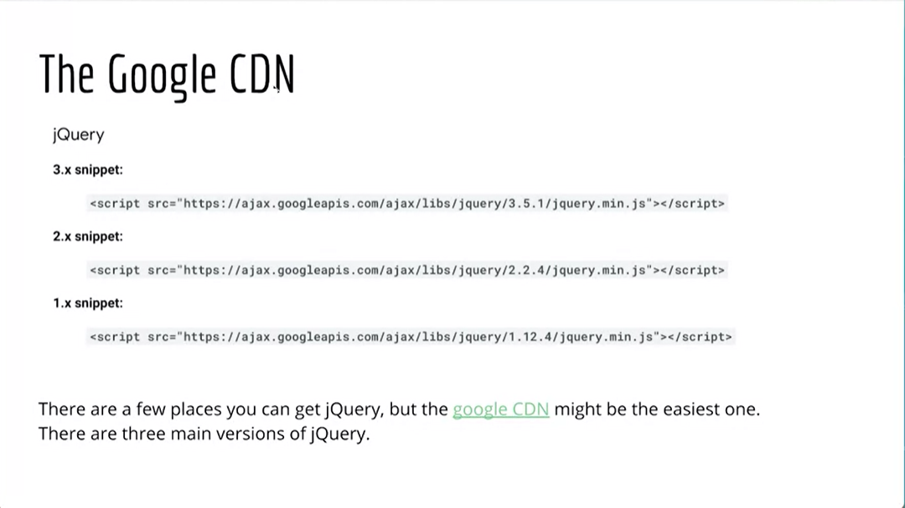{width="4.0in"
height="2.473077427821522in"}

Let&apos;s look at how we can capture some events in jQuery. jQuery has its
own special syntax for event handlers. So let&apos;s take a look at how to
do that. If we come back over to our test page here, you can just
comment this, I already deleted just to get rid of it. But I&apos;m going to
target anchor tags on the page. So again, I&apos;m going to type my jQuery
object, and in there, I&apos;m going to say a. That&apos;s going to go in and
target all of these anchor tags on the page, all of those and all of
these, and that&apos;s going to gather all those items and return them in
this nice little jQuery object here. I&apos;m going to add a click
handler.click. So this click handler is going to fire when you click on
any one of those anchor tags, and what I&apos;m going to pass in, make sure
you type it this way, so you typing from the outside in. I&apos;m going to
add in here a function like so with parentheses and curly braces. So
this is an anonymous function. This is a function that&apos;s just going to
run when this click handler happens. In here, I&apos;m just going to put
console.log, and in here, I&apos;m going to put this.html. That should put
in the console the HTML of the link that I clicked. Because it&apos;s going
to put this in all of the links, I can only click one link at a time. So
let&apos;s see what this does. If I come back to my example page here and
refresh it, and then turn on my inspector here, and turn on the console.
If I click a link, this.html is not a function. I must have done that
wrong. I know what I did. Come back over to Visual Studio code. I need
to use my jQuery object. I&apos;m having all sorts of trouble here,
$(this). All right, so I&apos;m using jQuery to get this, and then I&apos;m
using a jQuery method called html here that&apos;s going to return the html.
Lets and see if that works. Test slide again, click a link, and I&apos;m
getting link one, or if I click sub link one, I get sub link one, or if
I click link two, I get link two, link four, I get link four. What&apos;s
going on here is that the click handler, and this is again, in plain
JavaScript, we would have to use some loop to apply the click handler to
all of the anchor tags, but here, I can just grab all of them, return
them in this jQuery object and then I can use this method here, our
console log just to tell me what is inside of these anchor tags each
time you click on one. So that&apos;s pretty nifty. The next thing to keep
in mind is that jQuery really is just plain JavaScript. It isn&apos;t a
separate thing from JavaScript, it isn&apos;t a separate language, it is
just JavaScript and you can mix in regular JavaScript with jQuery, and
that&apos;s why I made the mistake I made a few minutes ago is, I was trying
to do a combination of the both, but I can just do this.innerHTML. That
should work exactly the same way, except that this is using plain
JavaScript here instead of jQuery to do the same thing. So if I come
back and test this, link one gets me like one, sub link two, sub link
three, and etc. In summary, you&apos;ve learned a lot of new stuff. You can
plug jQuery, like plugging the jQuery library either by downloading the
library and putting it in with your files or you can use the CDN. You
can use jQuery to capture events and to affect elements in the DOM,
there&apos;s a lot more to learn, but this is a really good introduction to
what jQuery does. It&apos;s just more JavaScript, but it makes doing some
things a little bit easier, and it&apos;s still important to learn actual
native, regular, plain vanilla JavaScript, especially as the need for
jQuery in new projects is reduced. But if you get a job and you&apos;re
working on a project, it&apos;s very likely that you&apos;ll be working with
Legacy code and you&apos;ll encounter jQuery, or if you&apos;re looking around
on the Internet, you&apos;re very likely to come up with solutions that are
jQuery specific. Because it&apos;s been such a popular library, it&apos;s going
to be around for a long time, and it&apos;s still important to learn how to
work with it. Learning how to work with jQuery will help you learn how
to work with JavaScript, so it&apos;s a two-way street. I hope you have fun
as we go forward with this course, and learn a lot about jQuery, and how
to use it with different projects.

### 1.06.Introduction-to-jQuery.pdf

<!--~~~~~~~~~~~~~~~~~~~~~~~~~~~~~~~~~~~~~~~~~~~~~~~~~~~~~~~~~~~~~~~~~~~~~~~~~~~~~~~~~~~~~~~~~~~~-->
<h2 id="ch1-07">1.07 Intro to Folding Sidebar Menus Using JS (4:36)</h2>
<!--~~~~~~~~~~~~~~~~~~~~~~~~~~~~~~~~~~~~~~~~~~~~~~~~~~~~~~~~~~~~~~~~~~~~~~~~~~~~~~~~~~~~~~~~~~~~-->

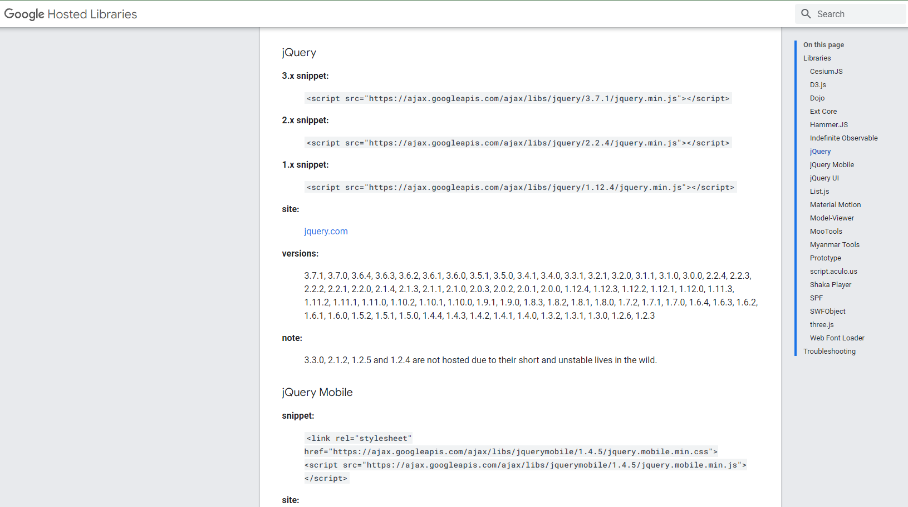{width="4.0in"
height="2.473077427821522in"}

Folding sidebar menus using JavaScript. You&apos;ve already learned a little
bit of jQuery, but before we dive more into jQuery, we&apos;re going to do
this project using plain JavaScript, and then we&apos;ll do the exact same
project using jQuery. We&apos;re going to do this with a few different
projects so you can see the difference between jQuery and JavaScript and
how they work together, and some of the differences between the two. In
this project, we&apos;re going to have just a simple page and on the side of
the page, we have a menu, and when you click the menu item, it falls
down and shows the sub-menu. When you click a sub-menu, well, one is
already opened, it will close the other ones, that will limit the number
of options your user has to see, and sometimes that can be really
helpful for users in terms of cognitive load, you only want them to see
a certain number of options at once. We&apos;ll look at how to build this in
plain JavaScript first, and then we&apos;ll do the exact same project using
jQuery. Just a few notes about the markup. If you look at the markup,
you&apos;ll notice that the article comes first and the aside comes second.
This is often important for search engine optimization, we want the
important content further up the page. We&apos;ll use CSS flexbox with
row-reverse to display these next to each other, but put the navigation
on the left. Generally, we want the article higher up on the page. Also
notice that the navigation is following a very common markup scheme
inside of a menu. This embedded, unordered list goes entirely inside the
list item for the parent item. This is important to get in HTML, so
let&apos;s take a look at this really quickly. I have my page open and you
can see the article comes first right after my main section opens there.
Then the navigation is an unordered list with list items, but notice
this list item is entirely enclosed in the parent list item. This is
really important to get right, and a lot of web developers get it wrong.
The only items you&apos;re allowed to have is children of the ordered or
unordered lists of list items. This unordered list needs to be entirely
enclosed in this parent list item. These are the items that will show on
the page, so over here currently without any JavaScript, these items
will just show in here. That gets us started, and we&apos;re using just a
little bit of CSS here as demonstrated here on the styles to display
flex for this main element, but use flex-direction and row-reverse to
get the navigation on the left and the main content on the right. Great.
Now, with all that in place, let&apos;s get started with making this project
work. The basic strategy of the script is that the sub-menu will be
initially hidden, and then when you click on a parent menu, it will show
the sub-menu. This will be accomplished by having JavaScript swap these
two classes on the sub-menu when you click the parent menu. Initially,
the sub-menus, the unordered lists that are inside the list items that
are inside the unordered lists, don&apos;t have the hide-menu class on them.
Our first challenge is to write a loop that adds this class to all the
sub-menus in the unordered list. You&apos;ll see over here in the styles
that these two styles are already here. Hide-menu, display: none, and
show-menu display: block. Your first challenge is to write a little
script, down here we&apos;ve got script tags. See if you can write a script
that goes in and applies that sub-menu to that hide-menu class. We want
to apply that to all of these unordered lists so they have class
hide-menu on them. See if you can do that, and when we come back in the
next video, we&apos;ll see how I did that.

### 1.07.JS-Folding-Sidebar-Menu-Start.zip

<h2 id="ch1-08">1.08 Challenge 1 Solution (3:23)</h2>

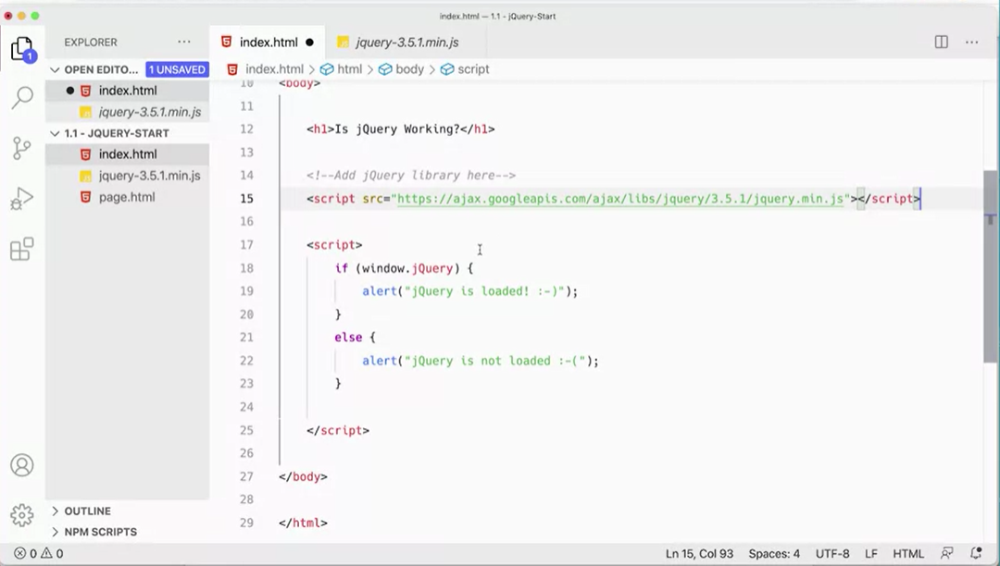{width="4.0in"
height="2.473077427821522in"}

Were you successful? Were you able to do it? Let&apos;s do it together. Down
here, I&apos;m just going to make a variable, var submenus. Then assign that
to document, dot, querySelector, querySelectorAll, and what I want to
get are the ul, il, ul. There we go. Because what I want are these
unordered lists that are inside the list items that are inside the
parent unordered list. That&apos;s what I want to get here. I&apos;m going to
get these, all of these and put them in here, and then I just need a
loop for var i equals 0, I is less than submenus, dot length, i plus,
plus, curly brace. I put these extra spaces in here, they&apos;re probably
not necessary, but to me it makes it a little bit easier to see this and
read what&apos;s going on here. But this should be review for you hopefully
at this point. Now here what we need to do, is we need to put that
submenu on each of these. I&apos;m going to say submenus dot square bracket
i. Each one of these, it&apos;s going to go through each one of these and
then do className equals hide menu. We got to have that right. Over here
it&apos;s hide menu. Hide menu, display name, and that should go through and
put that class on all of those elements. Let&apos;s see if I did that right.
Over here I&apos;ll go check my document here, and this is exactly what I
did, className, hide menu. Let&apos;s see if that actually works. We save
that, come over here and refresh the page and look at that. All those
menus are hidden, they&apos;re set to display none. I could do &quot;Inspect,&quot;
and you can come in here and see. Click on this menu here or this one of
these, one of these menus you can see it&apos;s got hide menu on it. Let&apos;s
get that class on there. That&apos;s working great. Your next challenge is
to add a click handler to the main links. These links here have a class
on them of menu link. We want to gather those, and when you click on
them, we want something to happen. We we&apos;re going to need an event
handler for that. For now, just pass the event object and prevent the
default behavior from that would result from clicking the link. But see
if you can do that on your own without looking at my solution. But
we&apos;ll do it together in the next video.

<!--~~~~~~~~~~~~~~~~~~~~~~~~~~~~~~~~~~~~~~~~~~~~~~~~~~~~~~~~~~~~~~~~~~~~~~~~~~~~~~~~~~~~~~~~~~~~-->
<h2 id="ch1-09">1.09 Challenge 2 Solution (7:01)</h2>
<!--~~~~~~~~~~~~~~~~~~~~~~~~~~~~~~~~~~~~~~~~~~~~~~~~~~~~~~~~~~~~~~~~~~~~~~~~~~~~~~~~~~~~~~~~~~~~-->

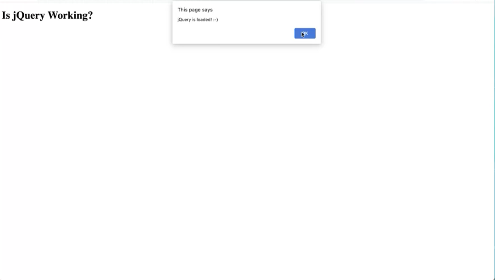{width="4.0in"
height="2.473077427821522in"}

Let&apos;s do this together. First we need a variable, var menu links equals
document.querySelectorAll and what do we want to get? We want to get
these links here, this class menu link for this one, this one, this one
down all those. I&apos;m going to come up share the document menu link. So
we&apos;ll get those document in there, and then we need to loop. Used your
loop here, so we need a for var i equals 0, or i is less than menu
links.length, i plus plus. Hopefully you&apos;re getting used to writing
loops now. Then in here we&apos;re going to put an event listener on each
one of these. So menu links, square bracket i. addEventListener. When
you click, we&apos;re going to run an event unit run a function. Not run an
event, we&apos;re going to run a function. We&apos;ve got this function here
that runs. Then for right now all I want to do is pass in the event
property, event object there, and do event.preventDefault. That&apos;s all
we really need for right now. But I that an event listener for each of
these, and you can test it by adding console log or an alert or
something like that large, collect something like that. Now if I go over
here and test this, when I click on one of these, I get clicked or this
one. We&apos;ve put an event listener on all of these truth loop. Okay,
great, so we&apos;ve got that, and that&apos;s working exactly where you wanted
to work. Hopefully, you got something like this as well. Again, this is
review, but it&apos;s always good to challenge yourself, and see if you can
do these small pieces. It&apos;s the best way to learn JavaScript. The next
thing to get into is this keyword in JavaScript, and if you&apos;ve looked
up stuff on JavaScript online, you can find that you can find a lot
about this keyword. It can be pretty confusing. But in the context in
which we&apos;re going to use it in this course that this keyword is fairly
simple. It basically means that menu that we clicked on, we&apos;ve add an
event listener to all the menus. Now when you click on one, we get an
alert. But you can only click on one menu at a time, so I want to know
which one I clicked on. I need to know that, and the this keyword can
help us figure that out. I&apos;m going to make a variable here called
thisMenu, and I&apos;m going to assign the keyword this to it, which means
thisMenu, the one that I clicked. Then I&apos;ll console log or alert out
thisMenu.innerHTML. You&apos;ll see that we can actually get the HTML of the
menu that we collect. Let&apos;s do that really quickly over here. Instead
of an alert here, I&apos;m going to say var thisMenu equals this, and this
is a keyword. That means it refers to the thing that was clicked. Then
we could do either console log or we could do to learn. I&apos;m just going
to do an alert. Since we were working with alert, alert
thisMenu.innerHTML. Instead quotes here because this was JavaScript not
construe thisMenu.innerHTML. Alright, thisMenu.innerHTML, let see with
architects. Before I now do this, we can mover test this, refresh the
page. When I click this menu, I can alert that says Menu 1. It&apos;s
telling me what&apos;s the inner HTML of the menu that I clicked Menu 2,
Menu 3, Menu 4 you could do console log 2 either way is fine, great so
we&apos;ve got that. Now we can get this menu using this keyword. But really
what we want to get to is the parent ordered list. Over here we&apos;ve
added a click handler onto when you click one of these links. But really
what we want to get to is this list item. So that ultimately we can get
down into the unordered list inside of here. John please take out that
last part, and record from here. The next challenge is now that we know,
which menu we&apos;ve clicked on, we want to get to the unordered list
inside that menu item. In other words, what we want over here is we have
something that tells us that we&apos;ve clicked on this anchor tag. But
really what we want to get is this unordered list here, because this is
the unordered list we added the class, hide menu to. Now we want to
change the class to show menu. In other words we need to get from this
link down here. The way we do that is through the parent. We can find
out, who is the parent of this item. Then on that parent do query
selector to find the unordered list that&apos;s inside the parent list-item.
See if you can do that part on your own, going into to try to do that
challenge on your own, and then on the next video, I&apos;ll show you my
solution for that.

<!--~~~~~~~~~~~~~~~~~~~~~~~~~~~~~~~~~~~~~~~~~~~~~~~~~~~~~~~~~~~~~~~~~~~~~~~~~~~~~~~~~~~~~~~~~~~~-->
<h2 id="ch1-10">1.10 Challenge 3 Solution (2:46)</h2>
<!--~~~~~~~~~~~~~~~~~~~~~~~~~~~~~~~~~~~~~~~~~~~~~~~~~~~~~~~~~~~~~~~~~~~~~~~~~~~~~~~~~~~~~~~~~~~~-->

{width="4.0in"
height="2.473077427821522in"}

Were you able to figure that out? Hopefully you were. This is what I
did, because I want to get, I&apos;m getting this, I&apos;ve got the anchor tags
as my event listeners for when I click on them, but I want to really get
to this UR, so, down here what I did instead of just this, I can do this
dot parent node, parent node dot query selector. You will. And that
should get me, the actual on ordered list, that&apos;s in the parent of the
anchor tag that I clicked on. The parent is the list item. So I&apos;m going
up to the parent list. I have been looking for the UR that&apos;s inside
that will start them, and let&apos;s leave this. We&apos;ll leave this alert
here. But you can make it console log if you prefer. It doesn&apos;t really
matter. I&apos;m going to save that, and then come over here and refresh my
page. And now when I click on menu one, I&apos;m getting all of these list
items, it looks kind of messy here, but it is actually working. Or if I
click on menu two, I&apos;m getting all these list items to B to C. So,
I&apos;ve got this whole an ordered list that I&apos;m getting here. It might be
easier to see it if you do it in a console log. So, we can change this
to council a log and then let&apos;s see what it does. Now, if we view the
console log, inspect, and I&apos;m going to move this turns bottom,
actually, it&apos;s whichever the console and when I click that, once I get
to refresh there we go. So I&apos;m getting the inner HTM out there, so,
that&apos;s great. So that&apos;s all working really well. Now that you have
that your next challenge is, now we&apos;ve got that sub menu, your next
challenge, is how do we change the class in that sub menu to show menu?
Currently it&apos;s set to hide menu. We wanted to set it to show menu. How
do we do that? Try to figure out how you can do that on your own, and
then come and see the answer on the next video. I&apos;ll show you how I did
it.

<!--~~~~~~~~~~~~~~~~~~~~~~~~~~~~~~~~~~~~~~~~~~~~~~~~~~~~~~~~~~~~~~~~~~~~~~~~~~~~~~~~~~~~~~~~~~~~-->
<h2 id="ch1-11">1.11 Challenge 4 Solution (2:29)</h2>
<!--~~~~~~~~~~~~~~~~~~~~~~~~~~~~~~~~~~~~~~~~~~~~~~~~~~~~~~~~~~~~~~~~~~~~~~~~~~~~~~~~~~~~~~~~~~~~-->

{width="4.0in"
height="2.473077427821522in"}

Were you able to figure out the challenge? I hope you were. It
shouldn&apos;t have been too difficult, but sometimes you have to work
through these things. What we could do instead, is we could use this
menu and do ClassName equals &apos;show-menu&apos;. So we&apos;re applying that
show-menu class to that particular menu. That should work. Let&apos;s go
over and see what happens when we have refresher page here. Cosine
inspector. If I click on this, it shows the menu. Now, you&apos;ll notice
we&apos;re not quite done yet because if I click another one, it&apos;ll show
that menu and it doesn&apos;t close the menus. We want to be able to open
the menus and close them. The reason we want to make it so that when you
click on a menu, if there&apos;s another one that&apos;s opened, it will close
it before it opens this menu. That&apos;s the next thing that we need to
figure out how to do. But this little piece of the script is pretty
simple here. We have a menu that&apos;s using this keyword that says, &apos;&apos;Go
and get the parent node, go get the unordered list inside that
parent&apos;&apos;. The parent would be the list item. Go get the unordered list
inside the list item, and then just change the ClassName from
&quot;hide-menu&quot; to &quot;show-menu&quot;. That seems pretty straightforward.
Great. Hopefully, you got that. You got this answer here. We can open
the pages and we can open the menus, but we can&apos;t close the menus. The
next challenge is if the menu has the class set &quot;hide-menu&quot;, set it to
&quot;show-menu&quot;, otherwise, set it to &quot;hide-menu&quot;. This is your
challenge, is how to make it so that it actually functions properly.
There are two methods that you can use to help you with this. There&apos;s a
method called classList and there&apos;s contains that will help you figure
out whether the menu has &apos;&apos;hide-menu&apos;&apos; or &apos;&apos;show-menu&apos;&apos; wanted.
See if you can do it on your own. Then if you are successful or not,
just come back to the next video and we&apos;ll see how I did it.

<!--~~~~~~~~~~~~~~~~~~~~~~~~~~~~~~~~~~~~~~~~~~~~~~~~~~~~~~~~~~~~~~~~~~~~~~~~~~~~~~~~~~~~~~~~~~~~-->
<h2 id="ch1-12">1.12 Challenge 5 Solution (x:xx)</h2>
<!--~~~~~~~~~~~~~~~~~~~~~~~~~~~~~~~~~~~~~~~~~~~~~~~~~~~~~~~~~~~~~~~~~~~~~~~~~~~~~~~~~~~~~~~~~~~~-->

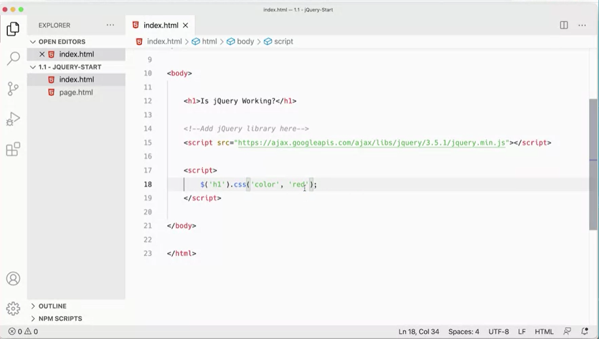{width="4.0in"
height="2.473077427821522in"}

Were you able to get the answer to this challenge? It&apos;s a little bit
trickier because this one required you to look some stuff up. We
haven&apos;t used class list or

contains before. So hopefully you went to the MDN, the Mozilla Developer
Network which is the authoritative resource on these types of
technologies, and looked up something like element classless to sort of
see how it works. And it gives you some examples on here. Also there&apos;s
another page contains and so you can actually find contains contains.
Does the dog token list and returns a boolean if true. So token list
contained so we can combine these two things together to make this work.
So let&apos;s try it together on our code over here and if you are able to
get to work that&apos;s great. If not this will help you out. So instead of
this I&apos;m just going to comment that out. Or you could just delete, but
in there we&apos;re going to put an if statement if. And what we&apos;re going
to check for is if this menu.classlist.contains. And we&apos;re going to
look for hide menu like that. So if this is going to return true or
false, does it contain hide menu? If it does contain hide menu then
we&apos;re going to do this. But in there, else if it doesn&apos;t contain it
then we&apos;re going to do this. But we&apos;re going to do hide menu. And that
will allow us to open and close the menus. Let&apos;s save this and come
back and check our page over here. So if we now we should be able to
open the menu and close the menu. Unfortunately though we can still open
multiple menus and really what we want to be able to do is to be able to
when we click on one menu, make sure all the other menus get closed. Any
other menu that&apos;s open is closed. So we can reduce cognitive load on
our user and they can they can open only one menu at a time, and be sort
of presented with only one set of options at a time. So hopefully you
got something like this on your own. And if you didn&apos;t, hopefully my
explanation helps. But I recommend if you&apos;re not getting these
challenges, I recommend going through this lesson a few times to the
point where you really can&apos;t do them without looking at my answers. It
will really help you learn javascript and so much more. Okay, so your
next challenge should not be a too difficult one. But basically what we
need to do is close all the menus and then run this if statement. So
before this, if statement happens this if else even happens. We want to
loop that closes all the all the menus. So see if we can add a lip that
closes all the menus before showing the sub menu with the parent menu
being collect.

## Module 1.13. Challenge 6 Solution (x:xx)

{width="4.0in"
height="2.473077427821522in"}

Hopefully, you were able to get this working this way. So that when we
click on these, they open and we can open them and we can close them.
But now the challenge is we want to reduce cognitive load by making it
so that our user isn&apos;t faced with too many menu options at once. So we
want to only show one menu options at the time. So let&apos;s go over into
the code and see how we could actually do this here. And really what we
want to do is we want to duplicate this loop. We want to copy this loop
and just stick it inside this if statement. So I will make sure that all
of the menus get closed when you click on one that you&apos;re opening. And
we&apos;re going to leave the if statements so that if you&apos;re clicking on
one to close it, it will still work. And if it&apos;s set to class named
show menu, it&apos;ll cited to hide menu. So that&apos;s why we want to leave
the if statement here, but that should actually work on this. And if we
go over and take a look at it and test this, we should see that this is
working now. So I come back here and refresh this. Now when I click on a
menu it opens, but when I click another menu it will make sure that one
is closed and then it will open this one. Plus I could click on menu to
and close it. So all of the functionality is now working and it&apos;s
looking pretty good. So hopefully, you came up with this solution as
well. Maybe you tried it some different ways or did something different
with it. But this is the solution that I came up with and it&apos;s working
pretty well. So now the next challenges, since we&apos;re using this loop
twice, we&apos;re using the loop here as well as up here. And we don&apos;t
really want to repeat ourselves. So now you&apos;re challenge is, how could
you make a function that contains this loop and run that function twice?
We want to run it once when the page loads and run it once down here
inside the if statement. And the function could be called something like
hide sub menus or something like that. And, yeah, so see if you can make
that function and make that work. And in the next video, we&apos;ll look at
my solution for how I made it work.

<!--~~~~~~~~~~~~~~~~~~~~~~~~~~~~~~~~~~~~~~~~~~~~~~~~~~~~~~~~~~~~~~~~~~~~~~~~~~~~~~~~~~~~~~~~~~~~-->
<h2 id="ch1-14">1.14 Challenge 7 Solution (2:39)</h2>
<!--~~~~~~~~~~~~~~~~~~~~~~~~~~~~~~~~~~~~~~~~~~~~~~~~~~~~~~~~~~~~~~~~~~~~~~~~~~~~~~~~~~~~~~~~~~~~-->

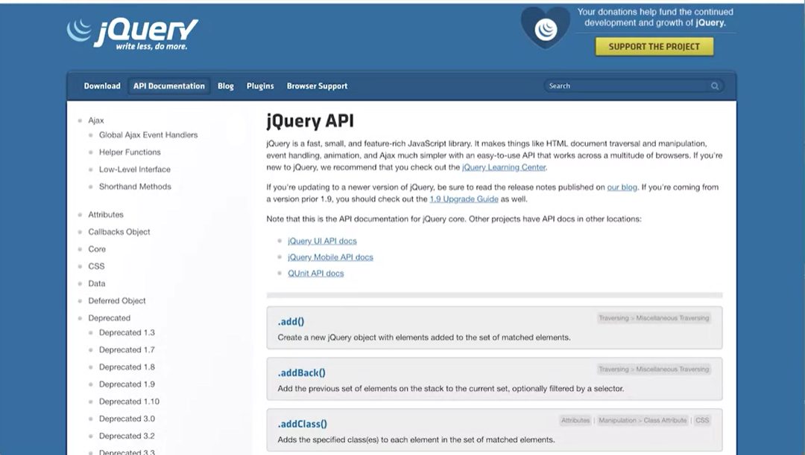{width="4.0in"
height="2.473077427821522in"}

Everything is working and we can leave the script the way it is. But
it&apos;s always good to refactor your code and make it better if you can.
Let&apos;s do that with this final step here, this next step here. We&apos;re
going to come over here and we&apos;re going to make a function, we&apos;re just
going to put it here, function hideSubmenus, like that. I&apos;m going to
move this loop so it&apos;s inside that function. Hopefully, you were able
to do this on your own. Tab that in. Now, I&apos;ve got a function called
hideSubmenus. I need to run that function here and run it once here and
then I&apos;m going to run it again down here. It just makes the code a
little bit more readable because in here, I can see if it contains hide
all the submenus and then show this particular menu. Otherwise, if this
one doesn&apos;t have class list hide menu on it, said it&apos;s a hide menu and
that should actually work. So let&apos;s just test that really quickly, make
sure that that works the way we think it should work. Back over here and
refresh the page and you can see that it&apos;s still working just the way I
intended it to work. That&apos;s great. Hopefully, you came up with the
exact same solution that I came up with and we&apos;re able to get it to
work the way I was able to get it to work. The last challenge for this
is just to apply our best practices steps that we&apos;ve learned earlier in
the course. Hopefully, you can do that on your own. But really what
we&apos;re looking to do is to put the script and do to a separate file, add
the IIFE, the immediately invoked function expression closure, add the
use strict directive, change all the variable declarations to const or
let. We&apos;re using let, if the variable changes like inside the loop over
here, this need to be let. Then link the script to the head of the page
and be sure to add the differ property inside the script tags so that it
loads after the actual content of the page is loaded. So see if you can
do all of that and then come back to the next video and see if you are
able to get the same answers I was able to do or that I will show you in
the next video.

<!--~~~~~~~~~~~~~~~~~~~~~~~~~~~~~~~~~~~~~~~~~~~~~~~~~~~~~~~~~~~~~~~~~~~~~~~~~~~~~~~~~~~~~~~~~~~~-->
<h2 id="ch1-15">1.15 Challenge 8 Solution (3:35)</h2>
<!--~~~~~~~~~~~~~~~~~~~~~~~~~~~~~~~~~~~~~~~~~~~~~~~~~~~~~~~~~~~~~~~~~~~~~~~~~~~~~~~~~~~~~~~~~~~~-->

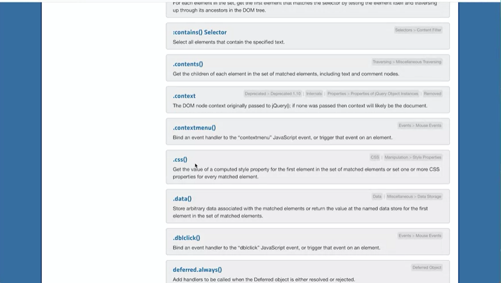{width="4.0in"
height="2.473077427821522in"}

Our last step is really to just use some best practice work and clean up
our files and make everything work the way we want it to work here at
the end. You should be able to do this on your own, but I will show you
how I did it here. First, I&apos;m going to just make a new file, and you
call it script.js, that makes sense. Then on this file I&apos;m going to add
my IIFE immediately invoked function expression, with the parentheses
and in there at function. The function has its own parentheses in its
curly braces. Then we add an extra pair of closing parentheses there.
Then we&apos;re going to click inside of here, down in it or use strict
directive here, like so. Then in here we&apos;re going to add all of our
code. We can just take all of the stuff from here, cut it, and paste it
inside here. Actually I need to move it back a little bit. It gets into
tuition. I&apos;m just going to shift the tab to move that back. That&apos;s
looking really good. Okay, great. Now we just need to go through and
clear up our function declarations and change this to const. Down here,
because we&apos;re going to loop, this needs to be length, this far needs to
be length. Then down here, this can be const. Sometimes it&apos;s nice to
have your mean variables all up here at the top of the page. You can
define them all at once up here. We can get rid of some extra space in
here. There we go, hide menu and then this one can be length because
it&apos;s inside the loop. Here this one can be const. I think that&apos;s it.
Yeah, that looks really good. We save that file back here and an index
file. We&apos;d get rid of these script tags from down here, bottom of a
page. Instead we can put them up here in our head. Script SRC equals
quote, and I want my scrip file here. I&apos;m going to set it to defer to
the close script tab. Then always of course, go back and test it to make
sure that you didn&apos;t screw something up. Sometimes that happens. Sure
enough, everything&apos;s working the way it&apos;s supposed to be working. You
can open the menus, you can close the menus. Only one menu can be opened
at a time, which is exactly what I wanted for this particular project.
That&apos;s all working great. We were able to get our final script working,
get everything cleaned up in here. This is how we could do a project
like this in plain JavaScript. In the next part of this lesson, we will
look at how to do the exact same script, exact same thing using jQuery.
You&apos;ll see how much shorter and how much more compact that script is.

### 1.15.Folding-Sidebar-Menus-with-JS.pdf

<!--~~~~~~~~~~~~~~~~~~~~~~~~~~~~~~~~~~~~~~~~~~~~~~~~~~~~~~~~~~~~~~~~~~~~~~~~~~~~~~~~~~~~~~~~~~~~-->
<h2 id="ch1-16">1.16 Intro to jQuery Sidebar Folding Navigation (4:35)</h2>
<!--~~~~~~~~~~~~~~~~~~~~~~~~~~~~~~~~~~~~~~~~~~~~~~~~~~~~~~~~~~~~~~~~~~~~~~~~~~~~~~~~~~~~~~~~~~~~-->

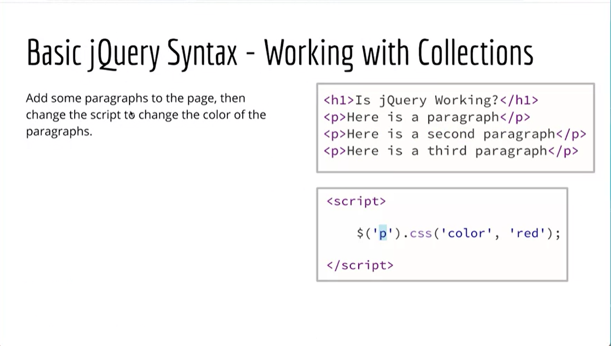{width="4.0in"
height="2.473077427821522in"}

jquery SideBar Folding Navigation. For this project we&apos;ll use jQuery.
We did this exact same project using plain JavaScript in the previous
lesson. But now we&apos;re back to where we started with just these menus
folded out and we want to do the whole same thing again, except using
jQuery. This will be a really great way for you to see the difference
between jQuery and JavaScript, using plain vanilla JavaScript. jQuery is
JavaScript, but the syntax is slightly different, and you&apos;ll see how
much shorter this script is when we get done with it, and how easy it is
to do this interaction using jQuery. Yeah, we&apos;re going to do the exact
same thing. The only thing that&apos;s different about the start file in
this case, is that it includes a link to the jQuery library on the CDN.
Down here at the bottom of the file, this is the only thing that&apos;s
different, is I&apos;m including this extra script. Remember when this is
compressed, it&apos;s about 87K or 89K or something like that. Maybe it&apos;s
worth it for this script, and maybe it&apos;s not. You&apos;d have to decide if
it&apos;s worth downloading 87K for your client after downloading 87K of
library to do simple folding menu script. Or if you&apos;d be better off
just using the JavaScript one that we did in the previous lesson. But
that&apos;s on there, and that&apos;s ready to go. Let&apos;s go ahead and see what
we need to do to make this work. First thing we&apos;re going to do, is
we&apos;re going to set all of those initial list items to not display. In
the previous version of this project, we had some classes set up for
Hide menu and Show menu. But here we&apos;re going to use the CSS property
to set display to none. We&apos;ll see an even easier way in just a minute.
But let&apos;s do this first so you can see what it does. Down here, I&apos;m
going to use my jQuery object, and write it like this from the outside.
I&apos;m going to use my jQuery object like that. I&apos;m going to use quotes
to say go in and get ul, li, ul. This is the unordered list that&apos;s
inside the list item that&apos;s inside the unordered list. That&apos;s these
list items that are inside these unordered list items that are inside
this unordered list. I&apos;m going to do,.CSS &apos;&apos;display,&apos;&apos;
&apos;&apos;none&apos;&apos;. You&apos;ll see when I do this over here, if I test the page,
they all go away, and if I inspect this, you&apos;ll see they have displayed
style, display none over here. That&apos;s what that is doing. That&apos;s
great, that&apos;s working just fine in hiding the menus. Now, as it turns
out, there&apos;s actually an easier way of doing that, because jQuery has a
bunch of helper functions built in. One of them is hide. Since
frequently we want to hide things on our page, they created a helper
function called hide, which holds just hide those elements. That&apos;s even
easier than using the CSS method here. If I just put hide there, and
then come back and test it, you&apos;ll see the menus are hidden. Not only
that, but if I inspect and look in there, you&apos;ll see it&apos;s still says,
display none there. This is actually doing the exact same thing but
using the CSS method, but instead we&apos;re using the hide method. That&apos;s
a convenience function that jQuery has built-in. JQuery is a bunch of
these built-in for doing common tasks. We&apos;ll see another one of these
convenient helper functions in just a minute. Great. We&apos;ve got that
going, and we&apos;re ready to start building in our Click-Handler and doing
all that fun stuff. We&apos;ll do that in the next video.

### 1.16.jQuery-Folding-Menus-Start.zip

<!--~~~~~~~~~~~~~~~~~~~~~~~~~~~~~~~~~~~~~~~~~~~~~~~~~~~~~~~~~~~~~~~~~~~~~~~~~~~~~~~~~~~~~~~~~~~~-->
<h2 id="ch1-17">1.17 Getting the Next UL (4:40)</h2>
<!--~~~~~~~~~~~~~~~~~~~~~~~~~~~~~~~~~~~~~~~~~~~~~~~~~~~~~~~~~~~~~~~~~~~~~~~~~~~~~~~~~~~~~~~~~~~~-->

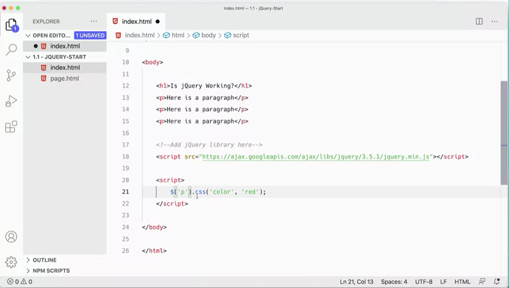{width="4.0in"
height="2.473077427821522in"}

Just like we did in the plain Javascript version of this script, we need
to know which menu was clicked. And so, once again, we&apos;re going to use
the this keyword in order to get the menu that was clicked. However,
this time we&apos;re going to wrap it up inside of a jQuery object. So down
here, you can see we&apos;ve got this, but it&apos;s inside a jQuery object.
Then we&apos;re going to use the handy next method that jQuery has built in.
And in the plain Javascript version, remember what we had to do was we
had to go get that parent object and then find the ul inside the parent.
But here we can actually use the next method to get the next ul. because
remember, what users are doing is they&apos;re clicking on this link here,
this anchor tag. And I want to get the next ul that comes after that.
And jQuery has this helper function that&apos;s very useful for that. So
let&apos;s come down here and add that into here. So we&apos;re going to make a
variable, var thisMenu is assigned. We&apos;re going to use the jQuery
object to get this. And then we&apos;re going to use the .next method to go
get the next ul. And that will get the ul that comes up exactly after
this particular anchor tag that we&apos;ve clicked on here. And just to see
that this works, I&apos;m going to say, okay, console.log( thisMenu.
.html()). This html(), this is a jQuery method that will generate the
html. So let&apos;s see what we get if we test this. If I come over to my
page and refresh and then turn on my inspector to get the Console log
here and click on this menu, you can see that I&apos;m getting that html. So
that&apos;s great, that&apos;s really cool, and that&apos;s working. So that&apos;s all
working really well and that&apos;s exactly what we want here. However, the
next thing we need to do is check to see if the menu is showing or
hidden or not. And we can do that with this sort of function here. We
could say if this menu is visible, and there&apos;s a method called is in
jQuery that will allow us to check for something. Here, visible is a
filter that will allow us to see if a particular element is visible, in
which case then we can hide it or we could show it. Now, we could do
this and this works if you wanted to do it this way. And the is method
is sometimes very helpful in jQuery. However, in this case there is
another helper function, a convenient helper function that will do the
same thing in a nice, simple way. And that is toggle, thisMenu.toggle.
That&apos;s really all we need to do, so that if it&apos;s showing hide it, if
it&apos;s hiding show it. So let&apos;s go ahead and add that into our script
over here. So instead of this line, I can just say thisMenu.toggle. Very
helpful, convenient function in jQuery that you could use in lots of
situations. And now you&apos;ll notice that we&apos;re back to where we were
after numerous lines of code before in plain Javascript where we can
open the menus and we can close the menus. Unfortunately, we can still
open all the menus and close all the menus, which is not exactly what we
want. But we&apos;re really close with just a couple lines of jQuery. And
part of the reason why it&apos;s so short is that we don&apos;t need loops. We
don&apos;t need to do the loops. We don&apos;t need to do the loops because
jQuery works with groups of objects like this. And it&apos;s got these
helper functions built in, so we don&apos;t have to write the if statement
and do all of that. So that&apos;s super handy. So the last part of the
script we really need to figure out is how to make it so that when I
click on one menu, it closes all of the menus and then only opens the
one that I clicked on. And we&apos;ll do that in the next video.

<!--~~~~~~~~~~~~~~~~~~~~~~~~~~~~~~~~~~~~~~~~~~~~~~~~~~~~~~~~~~~~~~~~~~~~~~~~~~~~~~~~~~~~~~~~~~~~-->
<h2 id="ch1-18">1.18 The Whole Script (5:59)</h2>
<!--~~~~~~~~~~~~~~~~~~~~~~~~~~~~~~~~~~~~~~~~~~~~~~~~~~~~~~~~~~~~~~~~~~~~~~~~~~~~~~~~~~~~~~~~~~~~-->

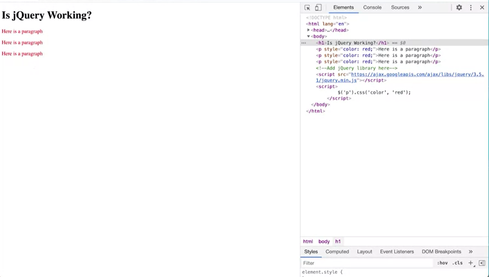{width="4.0in"
height="2.473077427821522in"}

To get this final piece of functionality that we want, we need one more
line in our script. And it&apos;s just a short simple little line that we
need to add and it will introduce us to yet another convenient function
built into jQuery which is the nod method here. And what that does is it
excludes a particular item from a function, we can chain these functions
together. So here we&apos;re going to say go get all of the unordered lists
that are inside the list item, that are inside the N word lists, those
are sub menus. But not the one that we clicked on. And we&apos;re going to
hide all of the other ones, but not the one that we clicked on. because
that may be hidden already or we may want to show it, and then we can do
the menu toggle and it will work. So just one last little line, let&apos;s
go ahead and put this in over here. So once again I&apos;m going to use my
jQuery object to go in and get the uL Li uL. The unordered list that are
inside the list items are inside the an ordered list is our sub menus.
But not this menu, the one that I clicked on. That one I don&apos;t want to
be affected by this line at all. And then I&apos;m going to do hide, make
sure all of those are hidden. And that should actually work just right.
Let&apos;s save this file and come back and test it. I can open a menu, I
can open the next menu, I can close the menu. And I&apos;m getting exactly
the functionality that I had before. I&apos;m doing it with far less code.
Now, again we&apos;re downloading this entire library. In order to do that
87K worth of stuff is getting downloaded so that we can write a super
short script and maybe that&apos;s worth it. And if you&apos;re new to
JavaScript and you&apos;re new to sort of creating these interactions, you
might find jQuery much easier way into coding and doing JavaScript. And
it is just more JavaScript, but it&apos;s a lot more concise. The syntax is
a lot more concise, mostly because you don&apos;t have to do the loops and
because they have these convenient helper functions built in that you
can make use of because you plugged in this library. Okay, the last step
that we need to do is just make our script file and move this stuff over
into an external script file. So let&apos;s do that really quickly here. Up
here I&apos;m just going to quick and add script.js. And then I&apos;m going to
come back here. Yeah, or actually first I&apos;m going to add my IIFE
function parentheses, curly braces, and then one more set of parentheses
in a semi colon. And then I&apos;m going to come in here and add my use
strict directive, that&apos;s great. And then I&apos;m going to come over here
and just grab this entire script, it&apos;s not very much, just a few lines
of script. Cut that and stick it in here, and I can shift him to move
that back a bit. Close that up. I&apos;ve just got a nice little short
script here, that&apos;s fine. And really you could probably leave this on
the other file, it&apos;s so short. But just to practice our best practices
in here, this can become constant. That&apos;s really the only thing we need
to take care of here, it&apos;s the only variable, so that&apos;s working fine.
That&apos;s nice and easy. And then over here we can get rid of this script
tag entirely. And we can move the link to jQuery up to the top of the
page inside the head here. Don&apos;t forget to add the defer attribute
there. And then down here I&apos;m going to add a script tag with src set to
quote, script.js defer. And that will work, this file has to come after
that file, even if we&apos;re putting him on the head of the page using the
defer attribute. Because once again, we need to make sure that we&apos;re
using these functions from this library here in the script so it has to
load first. But then we can just test this all out and make sure it all
works. And it&apos;s working just fine. I can get to my menu items. It&apos;s
not a very fancy page, but this is a really good example that shows you
how to actually take a script and do the same thing that we did in plain
JavaScript, but using jQuery. And using some of the nifty jQuery helper
functions such as hide, the click handler, the next method, the not
method, the toggle method, all make it possible for us to write shorter
strips, along with the fact that you don&apos;t have to do loops. So that
makes it much shorter and hopefully you&apos;re pretty excited about this. I
know I am.

### 1.18.Folding-Sidebar-Menus-with-jQuery.pdf

<!--~~~~~~~~~~~~~~~~~~~~~~~~~~~~~~~~~~~~~~~~~~~~~~~~~~~~~~~~~~~~~~~~~~~~~~~~~~~~~~~~~~~~~~~~~~~~-->
<h2 id="ch1-19">1.19 JavaScript and jQuery Challenges (1:54)</h2>
<!--~~~~~~~~~~~~~~~~~~~~~~~~~~~~~~~~~~~~~~~~~~~~~~~~~~~~~~~~~~~~~~~~~~~~~~~~~~~~~~~~~~~~~~~~~~~~-->

{width="4.0in"
height="2.473077427821522in"}

JavaScript and jQuery challenges. One of the best ways of learning
JavaScript is through these challenges, and in particular now that
we&apos;re getting into jQuery it&apos;s really important to get used to the
jQuery syntax. The way these challenges work is we&apos;ll pose a challenge,
I&apos;ll put forward a challenge, and I&apos;ll have you do it in both
JavaScript and jQuery. So this will really help you with the syntax of
both JavaScript and jQuery, and understanding the differences between
the two. So I&apos;ll provide you with a challenge like this, and usually
the challenges start off fairly simple and then they become more complex
as we move through the challenges. So I&apos;ll give you a challenge like
this and then on the next slide, if you need to look the solution is on
the next slide, but hopefully you don&apos;t really need to look at the
solution. Really try to do the challenges without looking at the
solution. If you have to look at the solution that&apos;s fine, you can look
at the solution and hopefully you&apos;ll go ah-ha, I see what I was
supposed to do and then you can go back and do the challenge without
looking at the solution. If you want to learn Javascript or jQuery you
have to get used to the syntax and this is the best way to get there, is
to really force yourself to do these challenges, and do them several
times, do them over and over again. Do them today and then do them again
tomorrow, and tomorrow when you do them hopefully you&apos;ll be able to do
more of the challenges without looking at the answers. Each challenge
builds on the next so that they become more complex as they go along,
and that will really help you learn both JavaScript and jQuery, and help
you understand the differences between the syntax of how each of them
work.

### 1.19.JavaScript-and-jQuery-Challenges.pdf

## Module/Week Two:

<!--~~~~~~~~~~~~~~~~~~~~~~~~~~~~~~~~~~~~~~~~~~~~~~~~~~~~~~~~~~~~~~~~~~~~~~~~~~~~~~~~~~~~~~~~~~~~-->
<h2 id="ch2-01">2.01 Module 2 Introduction (0:50)</h2>
<!--~~~~~~~~~~~~~~~~~~~~~~~~~~~~~~~~~~~~~~~~~~~~~~~~~~~~~~~~~~~~~~~~~~~~~~~~~~~~~~~~~~~~~~~~~~~~-->

{width="4.0in"
height="2.473077427821522in"}

Congratulations, you&apos;ve made it to the 2nd module in our 2^nd^ course
on JavaScript. In this module, we&apos;ll be working with the jQuery effects
library, which provides you with a lot of animation effects that you can
use with all sorts of projects and in your interfaces. We&apos;ll compare
that to using JavaScript and CSS to create your animations and see how
the two are different and what are the strengths and pros and cons of
each as you learn and work on projects. It&apos;s a lot of fun and you&apos;re
really going to enjoy it. Buckle in and let&apos;s get started with learning
about the effects library in jQuery.

<!--~~~~~~~~~~~~~~~~~~~~~~~~~~~~~~~~~~~~~~~~~~~~~~~~~~~~~~~~~~~~~~~~~~~~~~~~~~~~~~~~~~~~~~~~~~~~-->
<h2 id="ch2-02">2.02 Intro to jQuery Effects Library (4:05)</h2>
<!--~~~~~~~~~~~~~~~~~~~~~~~~~~~~~~~~~~~~~~~~~~~~~~~~~~~~~~~~~~~~~~~~~~~~~~~~~~~~~~~~~~~~~~~~~~~~-->

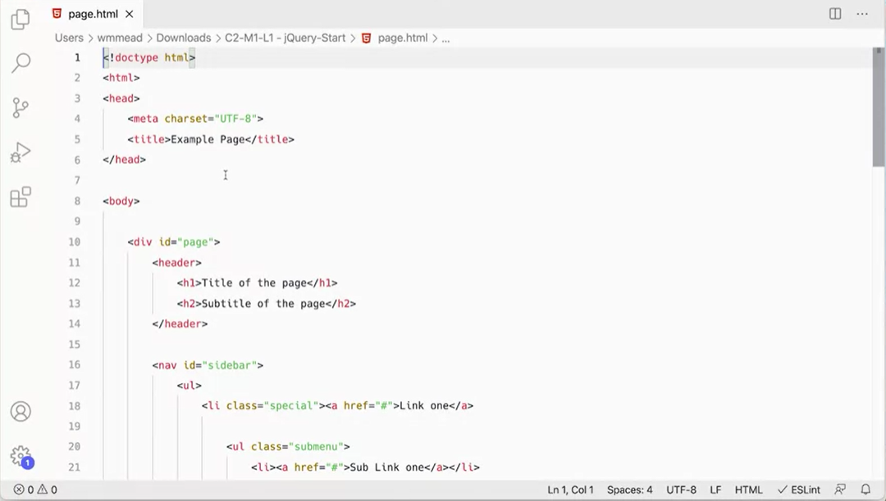{width="4.0in"
height="2.473077427821522in"}

jQuery effects library. We&apos;ll be looking at how to use the effects
library that&apos;s built into jQuery. But there&apos;s some important things to
understand about animation in JavaScript versus animation in CSS.
Generally, it&apos;s better to do animation in CSS if at all possible. When
the animation is done in CSS, the computer&apos;s GPU can be used to help
with the processing of the animation, that will make the animation
smoother and more efficient. You&apos;ll particularly notice this on phones,
especially older phones. However, the effects library in jQuery is
really easy to use, and for something minor or if you need something
really quick, it can be a great option. In this particular lesson,
we&apos;ll be looking at how to use the effects library in jQuery. I have
some example files that you can download and when you open them up, they
look nice. Here&apos;s example 1. We&apos;ll look at how to apply some effects
using these buttons here. If we go over and look at the HTML involved
here, I just have some links with these buttons, and then I&apos;ve got this
box here. I&apos;ve got a little bit of CSS as appear to make it look nice
and that&apos;s fine. Down here, you&apos;ll notice that I have jQuery plugged
in so that&apos;s all set and ready to go, and a place for us to put our
script. Now, the first one that we&apos;re going to look at is the hide
function which we&apos;ve already looked at before. We&apos;ve seen this hide
function when we did the sidebar menu exercise. When we did that script,
you&apos;ve seen this hide function before, but the hide function can also
do animation. Let&apos;s take a look at how to do that. Over here, what I
could do is I could type in here, I could go get this first link here.
I&apos;m going to go get and use my jQuery object. Always type it like that.
Then I&apos;m going to come in here, I&apos;m going to get hide box, that link.
I&apos;m going to add a quick add onto it, click. When I click it, I&apos;m
going to run a function, like so. In that function, what I&apos;m going to
do is I&apos;m going to get this element again using my jQuery object. This
element box,

div id pound box. I tell it to, hide. Now if we do it like this, it will
work, but it won&apos;t do any animation. Let&apos;s try it out. If I come over
here and refresh this page and click &quot;Hide,&quot; you can see the box goes
away. But in jQuery, you can actually pass a value in here. There are a
few keywords that it can use. You can use normal, slow, or fast. You&apos;ll
see now when I do refresh and click &quot;Hide,&quot; it does an animation as it
hides that box. You could do slow or fast, or you could put in a number.
The number is the number of milliseconds. If I put 500, that will be
half a second, it&apos;s how long the animation will take place. Or if you
really want to see something to demonstrate how much that affects it,
you could do 2,002 seconds. That&apos;s a long time for an animation like
this. Let&apos;s see what that does. There we go. You can see that you can
affect the speed there.

### 2.02.jQuery-Animation-START.zip

<!--~~~~~~~~~~~~~~~~~~~~~~~~~~~~~~~~~~~~~~~~~~~~~~~~~~~~~~~~~~~~~~~~~~~~~~~~~~~~~~~~~~~~~~~~~~~~-->
<h2 id="ch2-03">2.03 Example 1, cont'd (4:36)</h2>
<!--~~~~~~~~~~~~~~~~~~~~~~~~~~~~~~~~~~~~~~~~~~~~~~~~~~~~~~~~~~~~~~~~~~~~~~~~~~~~~~~~~~~~~~~~~~~~-->

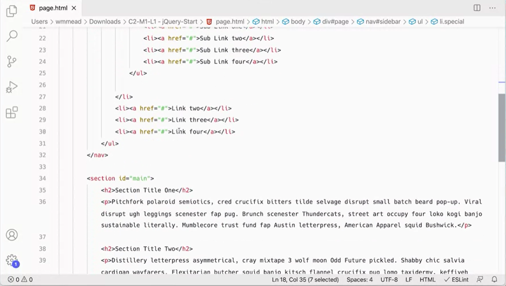{width="4.0in"
height="2.473077427821522in"}

In the last video, we saw that we could add a function here that will
hide the box and animate that. Let&apos;s add a couple more. We&apos;ve got a
few more buttons here. Let&apos;s do a few more of these. You could copy
this and paste it or you could type it again. I think it&apos;s always a
good idea when you&apos;re practicing these stuff to type it again, just see
you&apos;re getting used to using the jQuery syntax. Now I&apos;m going to do
pound show box or hashtag if you prefer hash instead. I&apos;m going to add
the click handler there, like so and then put a function in here. Always
type from the outside, so you really get used to the syntax and
understand which thing closes which thing. I&apos;m going to do function
parentheses, curly braces there and move that down. Then I&apos;m going to
do again, I&apos;m going to go get my jQuery object and get pound showbox.
No box, just box of the same box. Instead of hide I&apos;m going to do show.
Maybe we&apos;ll make this one go for 500 milliseconds. You&apos;ll see that
will work. Let&apos;s test that. We come over here and refresh this. We can
hide the box and I can show the box and you can see the difference in
time. That&apos;s working great. Now toggle will both hide and show. If
it&apos;s hidden, it&apos;ll show it. If it&apos;s showing it&apos;ll hide it. Let&apos;s do
that one. Over here again, I&apos;m going to just, now this time just for
expedience sake, I&apos;m going to copy it. But I really recommend that you
type it so you get used to that. This is toggle box. It&apos;s this link
here. It&apos;s this link up here, toggle box. Then down here we&apos;re going
to do box and instead of show, we&apos;re going to do toggle like that.
You&apos;ll see over here, if I run this, it will hide it and it will show
it. This one does both. Remember toggle is a helper function that allows
us to do both hiding and showing and we&apos;ve seen that before. But now we
can use it with the effects library and do some animation with it. Now
one of the really great things about these animations and doing this in
JavaScript and jQuery is that you have a thing called a callback
function. What you can do after the 500-year is you can pass in a
function that runs with its parentheses and curly braces like so. In
here we could put alert (&apos;done! &apos;) something like that. This function
will run after this animation has been completed. In fact, I&apos;m going to
make this a little bit longer so that you can really see that it waits
and runs after the animation has been completed. This is super useful
because sometimes you want to have a sequence of animations and when
that animation is done, you want to do something else, something like
that. Let&apos;s see how this works. The page does the alert. That&apos;s really
cool and I could do the other way around as well. Excellent. With that,
we are able to see that we can make these functions, these animations
and the animations can have a callback function that runs when the
animation is complete and this is super useful. Let&apos;s take a look at
the next example in the next video.

<!--~~~~~~~~~~~~~~~~~~~~~~~~~~~~~~~~~~~~~~~~~~~~~~~~~~~~~~~~~~~~~~~~~~~~~~~~~~~~~~~~~~~~~~~~~~~~-->
<h2 id="ch2-04">2.04 Example 2 (5:35)</h2>
<!--~~~~~~~~~~~~~~~~~~~~~~~~~~~~~~~~~~~~~~~~~~~~~~~~~~~~~~~~~~~~~~~~~~~~~~~~~~~~~~~~~~~~~~~~~~~~-->

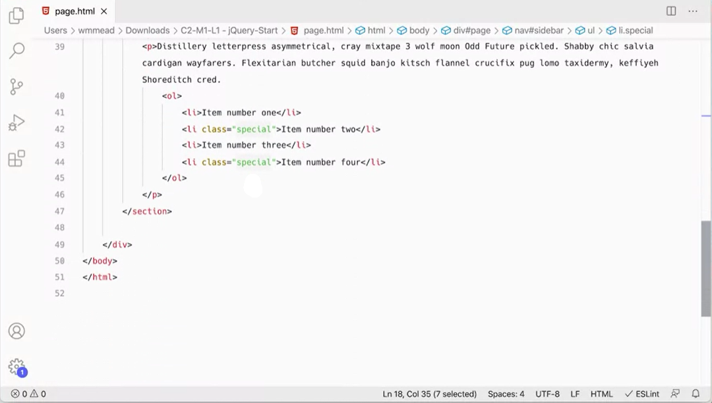{width="4.0in"
height="2.473077427821522in"}

Let&apos;s take a look at Example 2. Open up the Example 2, HTML file and
you&apos;ll notice that it looks very similar to the first example. We have
the same styling up at the top of the page, we have a box here, we have
some navigation, and then we have this div id set to box down here, and
it&apos;s just an empty div. You can see that it looks very similar here.
But jQuery has helper functions in for sliding up and sliding down and
slide toggle. Because again, these are common tasks. These are common
things that we need to do in interfaces, so they created a method that
does specifically this. That&apos;s interesting and fun. Let&apos;s take a look
at what we need in order to do this in our code. The syntax is very
similar to what we saw before. What we&apos;re going to do is, like we did
before, we&apos;re going to use our jQuery object to go in and get our link
here. It&apos;s pound, I&apos;ve got a slideupbox as a link here, so let&apos;s do
that. slideupbox and we&apos;ll put a click handler on that. We&apos;re looking
for dot click. Oops, Excel. Then in here we&apos;re going to run a function
with its own parentheses and curly braces. Then we&apos;re going to put our
code inside the curly braces there, just the same way we did before.
Again as before, we&apos;re going to go get our jQuery object and get box,
because that&apos;s where we&apos;re going to be moving up and down. Then what
we&apos;re going to use here for a jQuery function is slide up. Again, we
can put in an amount of time or you could put inside quotes, you can put
slow or something like that, and that will make that box slide up.
Let&apos;s go over and give that a try. Hopefully I did that right, I think
I did. If I refresh this page and click &quot;Slideup,&quot; it does that
animation. It&apos;s interesting to inspect this. Watch what happens here.
Actually on the actual box itself. Watch what happens down here, when I
click slideup. You can see it very quickly went through some settings in
here, as it did that and ended up with displaying that. That&apos;s
interesting as well. Great. We can do that. The other ones look very
similar as you can imagine. We&apos;ve got slideupbox, we&apos;ve got
slidedownbox, and we&apos;ve got slide toggle and they all work very
similarly. I can actually copy that, paste it, and I recommend you type
it actually, but for expedience sake, I&apos;m going to just copy and paste
it and change this to slidedownbox. This is going to be SlideDown and I
can choose an amount of time. We&apos;re going to do two seconds, something
like that. We have a longer time. Now, when you&apos;re working with
animation, one thing to be aware of is that, there is such a thing as
easing. An animation can run and it will run for the period of time.
This animation will run over two seconds, but it can run the exact same
amount over those two seconds, which is linear easing, meaning that
it&apos;s the same speed at the beginning as it is at the end or you can
change the easing such that it goes faster at the beginning and slower
at the end or slower at the beginning and then speeds up towards the end
of the animation, or you can actually do easing in and outward. Starts
slow, speeds up and then end slow or starts fast, slows down and ends
fast. You can do all of these different types of easing. JQuery has some
basic easing built-in and you can put in here in quotes, &quot;Swing.&quot; That
will do a little bit of easing on this item. It&apos;s pretty subtle. You
might not really see it, but it will actually work. Let&apos;s go ahead and
take a look at that. Slide up, I&apos;m going to hide this. Slide down. Does
slide down, but it does a swing animation. It&apos;s not the same speed all
the way through. You can see the difference. It&apos;s hard to tell, but it
is there. It&apos;s very subtle. Now, jQuery has built into it just some
basic easing, but there&apos;s a plug-in and one of the strengths of jQuery
is the plug-in architecture. We&apos;re going to talk about that in the next
lesson.

<!--~~~~~~~~~~~~~~~~~~~~~~~~~~~~~~~~~~~~~~~~~~~~~~~~~~~~~~~~~~~~~~~~~~~~~~~~~~~~~~~~~~~~~~~~~~~~-->
<h2 id="ch2-05">2.05 Example 2: Plugin Architecture (8:39)</h2>
<!--~~~~~~~~~~~~~~~~~~~~~~~~~~~~~~~~~~~~~~~~~~~~~~~~~~~~~~~~~~~~~~~~~~~~~~~~~~~~~~~~~~~~~~~~~~~~-->

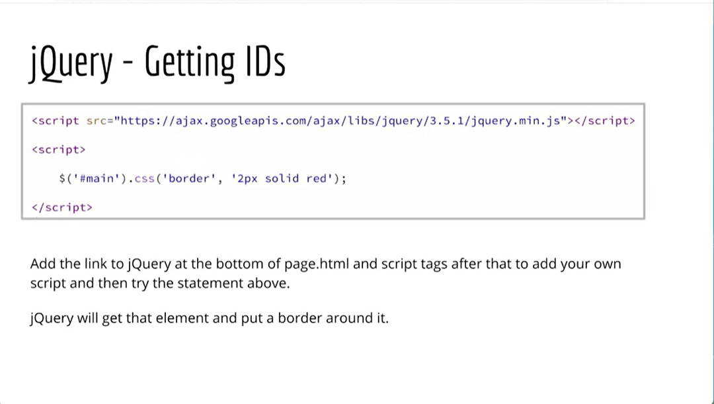{width="4.0in"
height="2.473077427821522in"}

In the last video, we added some easing to our function, so that now it
slides up just using the linear easing, but slide down is using the
swing easing. Easing can give your animations a little bit of
personality. They can make them seem a little bit less mechanical, when
the speed of the animation is not always the same all the way through
the animation. But the easings that are built into jQuery don&apos;t really
give you a lot of options. They are very basic. There&apos;s amazing plug-in
over here that we can use, and it allows you to choose different types
of easings so that you can actually do some different types of things
with this, and you can go through and try some of these different
settings here to see what they actually do. Ease-out will affect the
animation at the end where ease-in will affect the animation at the
beginning, ease-out-and-in will affect the animation at both ends.
We&apos;ve got ease-in-and-out. We&apos;ve got a whole bunch of them in here for
all these different: in ease-out, ease-in all these different animations
in here. But in order to use this, we have to plugins plug-in. JQuery
has a plug-in architecture that allows you to add more functionality to
jQuery. You can see over here on our file that I&apos;ve already added the
plug-in. The way this works is first we need the jQuery library, then
you need the plug-in, and then we use it in our script. Down here I&apos;m
going to do the third animation here for slide toggle, which we&apos;re
going to use this ID. We&apos;ll grab that ID, and down here instead of
slide down, we&apos;re going to do slide toggle, which will open it and
close it. Here we can use some of the other easings that we find on this
website here. This is where I got the easing plug-in on the CDN that I
put into here. That&apos;s where that came from, Cloudflare. That comes from
this website here, but we can use the easings that we see here. If I
want an easeOutBounce, I can actually use that animation if I want to
over here. Let&apos;s give that a try. &quot;easeOutBounce&quot;. Make sure you
spell it right with the capital letters and everything easeOutBounce.
Make sure you spell it all correct and that you get the correct capital
letters. Make sure you put it inside the quotes, and so on and so forth.
If I save that and then come back and look at my example here, and click
slide toggle, you can see that it does this bounce. Which is pretty
interesting or you could do easeInBounce to get the bounce on the
opposite end of the animation, which might look a little weird, but
let&apos;s give it a try. It&apos;s doing the bounce first and then it&apos;s
finishing the animation, which looks a little weird, but you get the
idea and you can try some of these other easings and see what
personality you can get. I really like the easeOutCirc ones. Where did
they go. Yeah, easeIn and easeOutCirc. You can give those a try. Let&apos;s
see what we can do with that. Over here easeInCirc. Again, at two
seconds, that&apos;s pretty slow. You can even slow down more if you wanted
to see it. I&apos;ll set that to three seconds. You can see how it changes
the animation by either slowing it down or speeding it up. I think this
one&apos;s speeding it up as it gets to the end of the animation. Let&apos;s
come back and try easeOutCirc. That&apos;s starting fast and ending slow. It
gives the animation a little bit of personality as it does its thing.
That&apos;s pretty cool. You could try easeInOutCirc. It&apos;s hard to see, but
it is doing something there. Try these different animations. You&apos;ll
notice if you spell them wrong, if I do, easeoutCirc like that, then it
won&apos;t work quite right at all. If you inspect, you&apos;ll see that I&apos;m
getting a whole bunch errors there because I&apos;ve spelled that wrong.
That&apos;s not helpful. Also, if you were to forget this easing library,
you&apos;ll notice it won&apos;t work. If I just comment this out for a minute
and try easeOutCirc, even if I spell that right. You&apos;ll notice it
won&apos;t work or work at all really. If I do, it&apos;s back you&apos;ll see that
I have a bunch of errors cooking here because it doesn&apos;t know what to
do about that because it&apos;s not a function. In order for this easing to
work, you have to really make sure that you have easing plug-in, plugged
in, and that your spelling these correctly easeOutCirc. Let&apos;s give that
a try again. You can see that it&apos;s working nicely. Great, so that will
all work and that&apos;s awesome. One last quick thing here before we&apos;re
done with this video is you can also add the callback function after the
easing. I could add a function here and say done, and you&apos;ll see that
when that easing is finished, when that animation is finished, that
callback function will fire. Absurd, I think I did. I Just did done but
I need to do that right, alert, done like that. Now that&apos;ll work, and
it comes back and it says it&apos;s done. That&apos;s working great. That gives
us a lot of information about how to work with these built-in
animations, and we&apos;re going to do more in the next video.

<!--~~~~~~~~~~~~~~~~~~~~~~~~~~~~~~~~~~~~~~~~~~~~~~~~~~~~~~~~~~~~~~~~~~~~~~~~~~~~~~~~~~~~~~~~~~~~-->
<h2 id="ch2-06">2.06 Example 3: Fading Buttons (4:00)</h2>
<!--~~~~~~~~~~~~~~~~~~~~~~~~~~~~~~~~~~~~~~~~~~~~~~~~~~~~~~~~~~~~~~~~~~~~~~~~~~~~~~~~~~~~~~~~~~~~-->

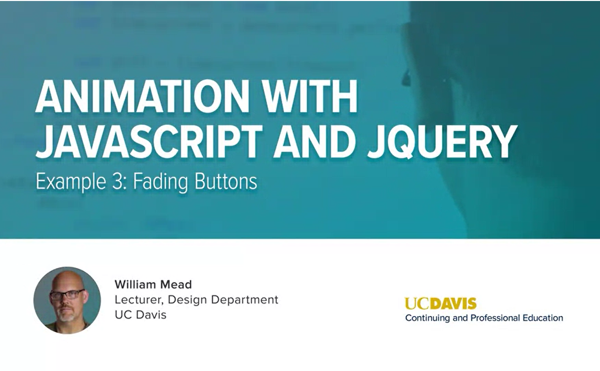{width="4.0in"
height="2.473077427821522in"}

In Example 3, we&apos;ll look at something that&apos;s similar to the other two,
but just slightly different. It&apos;s got four buttons and we can use some
built-in functions in jQuery to fade objects in and out, or to feed them
to a particular percentage of opacity. Here I have fade out, which will
fade it out completely. Fade in, will fade it all the way to being
visible. But then I had fade to 20 percent, which will fade it to 20
percent opacity, and then fade to 100 percent, which will fade it all
the way in. Let&apos;s take a look at how we can do that. Over here I have
Example 3 open and you can see that I have much the same styling up at
the top of the page, as well as my navigation year and my jQuery
libraries plugged in. I don&apos;t have the easing plug-in here, but you
could add it if you wanted to add some easing to these as well. Here
we&apos;re going to just go ahead and do what we did before with getting our
link pound fade out box, which is this first link up here, and we&apos;re
going to add our click handler to it. Click, and then we&apos;re going to
pass in our anonymous function that runs when you click that thing. In
here, we&apos;re going to go get our box. Again, we use our jQuery object to
get pound box. Sometimes students make mistakes here and they forget to
type the pound. If it&apos;s not working, make sure you have pound box in
here. That&apos;s a common mistake that I&apos;ve seen. It&apos;s pound box to go
get this div id box here. Then we&apos;re going to do, I believe the
function is fade out because we&apos;re fading out the first one. Yeah,
fade-out. Again, we could put in normal or you could put fast, or you
could put slow, or you could put a specific number of milliseconds;
3,003 seconds is a long time, but we can actually give that a try.
You&apos;ll see that will actually work over here. We can fade the box out.
Fade out. Over three seconds, it will become invisible. That works, and
that&apos;s great. We could do fade in as well. I can copy that and paste it
or just type it again. It&apos;s always a good idea to do that, but we&apos;re
going to use this ID instead. Instead of fade out, we&apos;re going to fade
in. I could do three seconds and you could do the easing swing. It&apos;s
going to go in quotes, &apos;&apos;swing.&apos;&apos; Then you could also add a callback
function, and that&apos;s parentheses. Inside the curly braces, we can add
an &apos;&apos;alert&apos;&apos; that says &quot;done.&quot; Now we can fade the box out and we
can fade the box in. Let&apos;s give that a try. Fade out, and it fades out
over three seconds. Fade in, it&apos;ll fade in over three seconds. When the
animation is complete, it runs the alert and says that it&apos;s done.
That&apos;s great. We can do all of that. Okay, cool. Now we just need to
add these last two here and we can look at that in the next video.

<!--~~~~~~~~~~~~~~~~~~~~~~~~~~~~~~~~~~~~~~~~~~~~~~~~~~~~~~~~~~~~~~~~~~~~~~~~~~~~~~~~~~~~~~~~~~~~-->
<h2 id="ch2-07">2.07 Example 3: Fade To (4:07)</h2>
<!--~~~~~~~~~~~~~~~~~~~~~~~~~~~~~~~~~~~~~~~~~~~~~~~~~~~~~~~~~~~~~~~~~~~~~~~~~~~~~~~~~~~~~~~~~~~~-->

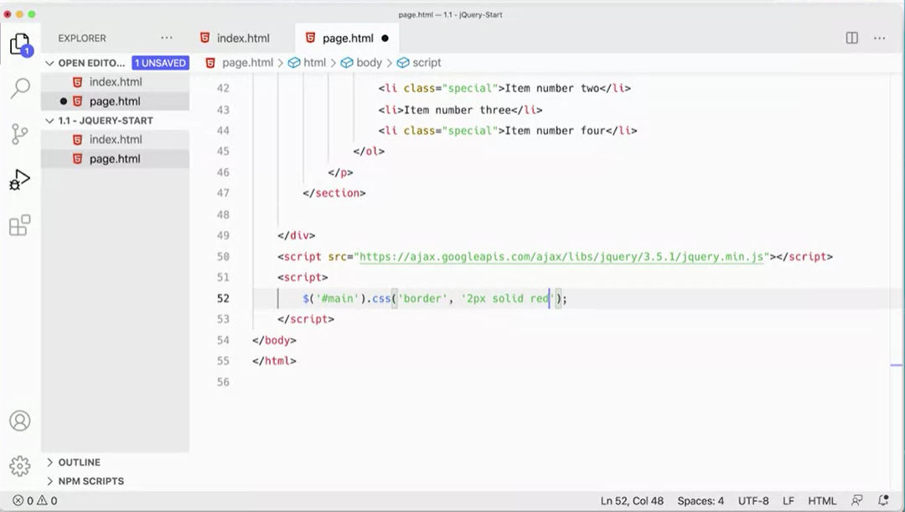{width="4.0in"
height="2.473077427821522in"}

In this lesson, we&apos;ll make these last two buttons work. And with that,
there&apos;s a fade to method that we can use in jQuery. So let&apos;s go see
how that works. So here, just as we&apos;ve done before, we can add a new
event handler for when you click the the button has fadeto20box on here.
I&apos;m going to paste that in just to make sure I spell it right and
we&apos;ll add a click handler. And again, I recommend typing this just to
get used to the syntax. And then in here, we&apos;ll add a function that
runs when you click it, it&apos;s just an anonymous function. And what
we&apos;re going to do here is once again, we&apos;ll go get pound box. Don&apos;t
forget the pound sign. And we&apos;re going to use the fade to method. See
it even comes up here, fade to. And we&apos;re going to fade to, the way
this works is we&apos;re going to put in the amount of time. So we&apos;ll do,
again I&apos;ll do 3000, just to kind of slow but gives us a sense of what
that is. But then the second number it takes is a duration, an amount.
Takes the duration, that&apos;s the first number. The second number is how
much it&apos;s going to fade to. We want to do 0.2 like that. And now, that
should actually work. So let&apos;s go over and check it out. Press refresh
this and click fade to, it fades down but it doesn&apos;t fade all the way
down, it fades to 20%. So that&apos;s really pretty cool. So we can do that
and then we can do the fade to again for the last one. So I&apos;m just
going to copy this and paste it, and we&apos;re going to use this link fade
200. So when you click the fade 200, it&apos;s going to fade to one. So the
opacity is a number between 0 and 1, 0 is completely transparent, 1 is
completely opaque and that should work just fine. So let&apos;s give it a
try over here and refresh. I can fade down to 20% and then I can fade up
to 100%, or I could fade out entirely And I can fade in entirely. So all
of these buttons are working. This one has the callback function and the
swing animation on it. And if you wanted to do some of the other
easings, you would have to go get that easing plug in and stick it here
after jQuery loads. But before we run our script, the order in which
things loads matters because of the way that the functions build on each
other. So we need to have jQuery. In order to use jQuery, we would need
to have the easing plug-in in in order to use the using plug in. Using
plug in has to come after jQuery. So all of this stuff has to go in
order on your page for it to work properly. We can have the callback
functions and all that kind of fun stuff. And then in the next example,
an example for, we&apos;ll look at some custom animations where you can do
some different kinds of things. In examples 1, 2 and 3, we&apos;ve used some
of the built-in convenience functions that jQuery has built into it. For
fading in and out, for sliding up and down, for hiding and showing, and
toggling, slide toggle and doing all these kinds of things that we
commonly need to do. But sometimes you need to do a custom function, and
we&apos;ll take a look at that in the next part of this lesson.

<!--~~~~~~~~~~~~~~~~~~~~~~~~~~~~~~~~~~~~~~~~~~~~~~~~~~~~~~~~~~~~~~~~~~~~~~~~~~~~~~~~~~~~~~~~~~~~-->
<h2 id="ch2-08">2.08 Example 4: Custom Animations -- Part 1 (4:20)</h2>
<!--~~~~~~~~~~~~~~~~~~~~~~~~~~~~~~~~~~~~~~~~~~~~~~~~~~~~~~~~~~~~~~~~~~~~~~~~~~~~~~~~~~~~~~~~~~~~-->

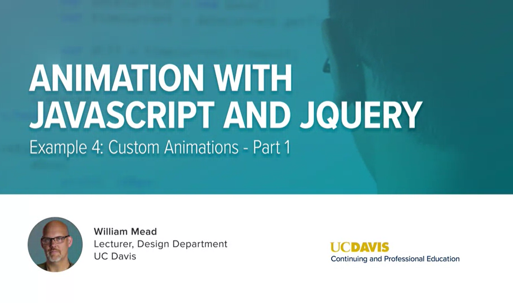{width="4.0in"
height="2.361538713910761in"}

Next, for example 4, we&apos;re going to look at some of the custom
animations

you can use in jQuery and over here I have

my example for file open, and you&apos;ll notice that the HTML and the CSS
have changed

just a little bit. There are more links here and my box now has some
content inside the div box here, and you&apos;ll see that my stylings is a
little bit different up here, if you look at the actual page, it looks
like this now. We&apos;re going to make each of these buttons work so we can
see how some custom animations work in jQuery. To do this, we&apos;ll use
the animate method in jQuery, and you&apos;ll see that it allows us to
animate some, not all, but some of the CSS properties that we have come
to know and love over the years in working with CSS. That gives us a lot
of power, because we can actually use these CSS properties to animate
all different things not just sliding up and down or showing and hiding
and doing this kind of stuff. That&apos;s pretty cool. Let&apos;s give it a try
and see what it does over here. Down here I&apos;m going to add in my
script. I&apos;m going to go get my jQuery objects and I&apos;m going to get
this first link up here, growbox, pound, growbox, and I&apos;m going to add
a click event handler on there, and then I&apos;m going to pass in a
function that runs when you click it, and everything&apos;s going to go
inside these curly brackets here. At this point I want to affect box,
pound box, don&apos;t forget the pound sign. We&apos;re going to do the animate
function in jQuery. This will animate the box. The way we&apos;re going to
do this here is we&apos;re going to pass in an object. We have not yet
worked with objects in JavaScript, they&apos;re coming, we&apos;re going to get
to them later in our instruction about JavaScript, but will see them pop
up a few times and this is one of those times. I&apos;ll explain it a little
bit now, but we&apos;ll get into objects in more detail a bit later, and an
object is an alternative way of storing data in JavaScript, and it comes
with a key value pair. We define an object with the curly braces, and
then we have a key value pair. In this case, the key is width, that&apos;s
the CSS property we&apos;re animating, and then the value is 710px, and
you&apos;ll notice that the value goes inside quotes, but the key does not.
That&apos;s a distinguishing aspect of objects in JavaScript in general and
also in jQuery. Let&apos;s go ahead and give this a try. We&apos;re going to
animate in here. We&apos;re going to pass in an object open and closing
curly brace and we&apos;re going to put in width, colon, and then in
&quot;710px&quot;. That will move the box. It&apos;ll change the width of the box to
710 pixels. Let&apos;s give that a try. If I come over here and test this,
refresh grow box, and you can see it sets it so that it 710 pixels. I
knew it was 710 pixels to end right here, It all ends up in, looks nice.
That&apos;s cool. All right. We were able to pass that in and do that one.
Let&apos;s take a look at growing the text and affecting the actual text
inside the box in the next video.

<!--~~~~~~~~~~~~~~~~~~~~~~~~~~~~~~~~~~~~~~~~~~~~~~~~~~~~~~~~~~~~~~~~~~~~~~~~~~~~~~~~~~~~~~~~~~~~-->
<h2 id="ch2-09">2.09 Example 4: Custom Animations - 2 (5:59)</h2>
<!--~~~~~~~~~~~~~~~~~~~~~~~~~~~~~~~~~~~~~~~~~~~~~~~~~~~~~~~~~~~~~~~~~~~~~~~~~~~~~~~~~~~~~~~~~~~~-->

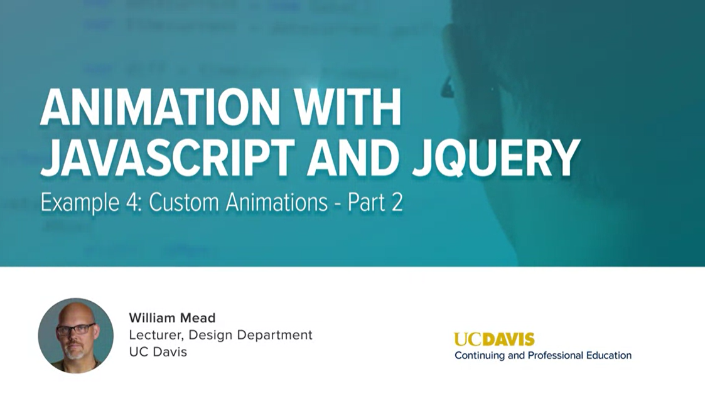{width="4.0in"
height="2.361538713910761in"}

For this next example, we will start with our jQuery object again as
always, and then go and get the element that we want to get, which in
this case is pound grow box. Because we&apos;re getting on and we grow text.
It&apos;s always good to copy and paste just to make sure you&apos;re getting
exactly the right thing, and then we&apos;ll do click parentheses and a
semicolon. That click handler will run when we click on grow text. Then
we&apos;re going to come in your add a function that runs when we click on
that, on secret square braces. I want curly braces. Move that down and

then once again, I&apos;m going to go get my box, pound box inside quotes
there. I&apos;m going to run the animate. The custom animate function here
and again, we&apos;re going to pass in with curly braces, not square
brackets, curly braces and object. What are we going to do here? We&apos;re
going to do font in quotes. No, this one looks like this. We come over
here. Font size. We&apos;re using the JavaScript version of font size rather
than the CSS version, which is font dash size. We can&apos;t have the dash
in there because JavaScript will think that looks like a minus sign, and
so it&apos;s trying to subtract size from font and it&apos;s not going to work.
Instead what we want is font, size, colon and then I can set it to say
24 px or something like that and that should change the font size.
Let&apos;s give it a try. Over here. I can grow the box and I can grow the
text. Did I do something wrong? Maybe I did. Let&apos;s see, inspect,
console maybe I just forgot to refresh. Grow the box grow the text.
There we go. That&apos;s working just fine and you can try a different size
text if you wanted to do 36 pixels or 40 or whatever you want to do
that&apos;ll be a little bit more dramatic. Grow the box, grow the text and
that&apos;s working great. Okay, cool. We could also move the box. Let&apos;s
give that one a try. With move box, what we&apos;re going to do, we&apos;re
actually going to change the position of the box, and in order to do
that, we need to set some positioning for box. In our CSS over here for
box, we need to add position absolute, and then we want to set the left
position, left 50 px. Why is it 50 pixels? Because everything else is,
is indented 50 pixels in here. I think I have that, yes, he said padding
50 pixels. If I don&apos;t set left 50 pixels, let&apos;s take a look at this
really quickly. If I reset that, that puts that in the right place. But
if I didn&apos;t put the 50 pixels in there, left 50 pixels, maybe it won&apos;t
actually do anything, okay, well actually maybe be fine. But still I
want to set the left 50 pixels so that I&apos;m moving from this position,
left 50 pixels. Because we&apos;re going to change the left property when we
move the box. Down here again, I&apos;m just going to copy this for the sake
of making it a little bit quicker and down here instead of grow text,
I&apos;m going to move box. Move box, animate and then here I&apos;m going to
change the left property, left, and I&apos;m going to do plus equals 300 px,
so that we&apos;ll add 300 pixels to the 50 pixels that&apos;s already there.
Plus equals, we&apos;ll add 300 pixels to the 50 pixels. It&apos;s already there
and it&apos;ll move it left 50 pixels, I mean to 350 pixels from the
left-hand side. Let&apos;s see if that works. Move box and look at that. It
moves it exactly where I wanted it to go and that&apos;s really cool. You
can set how long you want that animation take. You can make it go longer
if you wanted to and after the animate, after the object here, I could
add in a comma and say, I want this to run over five seconds, something
like that, and that will animate over five seconds. Let&apos;s see what that
does. Five seconds is really slow, but it is animating and that&apos;s
pretty cool. Okay, great. We&apos;re able to adjust the amount of time and
the amount that it moves in, what it does with the actual animation, all
with custom animation.

<!--~~~~~~~~~~~~~~~~~~~~~~~~~~~~~~~~~~~~~~~~~~~~~~~~~~~~~~~~~~~~~~~~~~~~~~~~~~~~~~~~~~~~~~~~~~~~-->
<h2 id="ch2-10">2.10 Doing All Animations at Once (6:30)</h2>
<!--~~~~~~~~~~~~~~~~~~~~~~~~~~~~~~~~~~~~~~~~~~~~~~~~~~~~~~~~~~~~~~~~~~~~~~~~~~~~~~~~~~~~~~~~~~~~-->

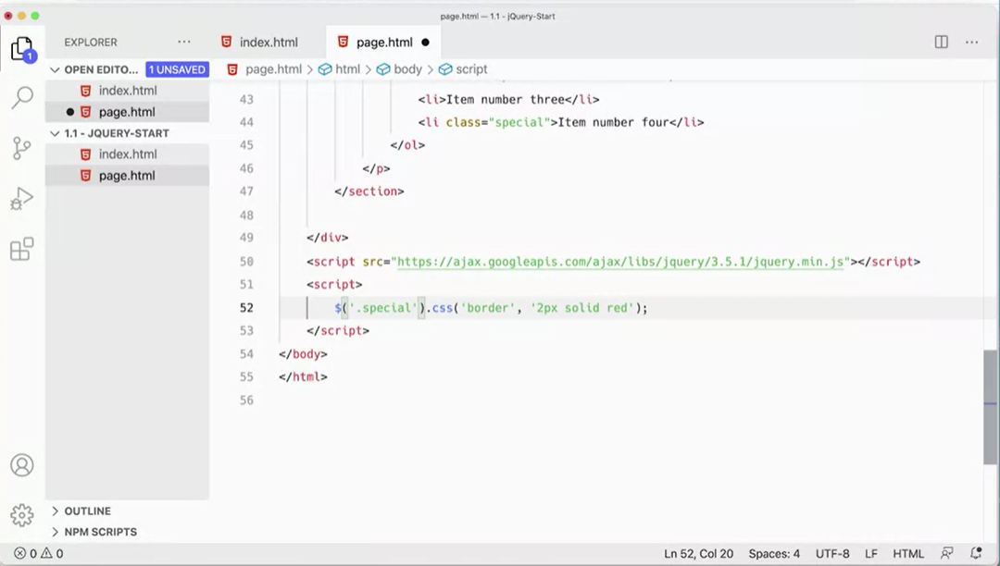{width="4.0in"
height="2.361538713910761in"}

For next button on Example 4, we want to actually make all of these
animations happen at the same time. They&apos;re all going to move forward
at the same time. We will change both the width, the font, and the left
positioning of three of these. We&apos;re going to change all of them at
once. We can do that by just passing in these different properties into
our object all at once, separating them with commas. Let&apos;s go ahead and
do that, because that&apos;s pretty interesting to be able to see that
actually work. Down here, once again, I&apos;m going to use my jQuery object
to go get this pound, but what I want is do all. I&apos;m going to get pound
do all. Then I&apos;m going to add a click handler. Click for when you click
the do all button, and then we&apos;re going to run a function, when that
button is clicked, and here we have it. Here now, we want to effect a
Parentheses pound box, like so. Again, we&apos;re going to do the animate
method. We&apos;re going to pass in our object, so we do the curly braces.
First we want with, 710 pixels, so I put that in here. With, 710 pixels
and then a comma. Then we want font size, 36 pixels, I put that in
there. Then a comma. Then we want left plus equals 300. We&apos;ll put that
in there. You&apos;ll see now there&apos;s some extra spaces at the end. It
doesn&apos;t really matter, it&apos;s fine, but you&apos;ll see with all of those in
there, that now when I come over and test this thing, I also want to put
in an amount of time, that will be really helpful. After the curly
brace, put a comma, and then I&apos;m going to put 1500. It&apos;s going to take
a second-and-a-half to do all of these. Let&apos;s come back over here and
refresh this. When I click Do All, it should do all of those things.
Pretty cool. It runs all of the milliwatts. Now, the last button is to
do them in a sequence. First we want to grow the box, then we want to
grow the text, then we want to move the box. We want to do each one of
these in a sequence. We can do that with callback functions. Each one of
these animations can have its own callback functions that when it
finishes it calls the next one and when that one finishes it calls the
next one. It can be confusing for the syntax in order to get this to
work, but once you understand it and know how to do it and mess with it
a little bit, it&apos;s not too hard. Let&apos;s do this again. I&apos;m going to
start with this one. I&apos;m going to copy that and stick it down here.
Instead of getting that button, I&apos;m going to get this one sequence.
When you click the button Sequence, it&apos;s going to take box and it&apos;s
going to animate the width to 710 pAx. I&apos;m going to put a comma.
Another comma, yeah, I&apos;m going to put a comma, and then I&apos;m going to
put say 1500 for how long that animation should take place. I&apos;m going
to put another comma, and I&apos;m going to add a function. It&apos;s really
easy to get confused here because we&apos;re going to put everything into
this function here. I&apos;m going to make sure I click between those curly
braces, move that down. Then I&apos;m gonna go get this one, font-size 36.
I&apos;m going to put a comma here and I&apos;m going to put 1500 seconds in
there. The 1500 milliseconds, that&apos;s 1.5 seconds. 1500 milliseconds in
there, and then a comma and another function, parentheses, curly braces.
It&apos;s really easy to lose track of this stuff. You have to be really
careful with it, but then I&apos;m going to put the next one inside these
curly braces. I move that down, and I&apos;m going to do this one here. Now
change that to 1500. There we go. That&apos;s the last one. It doesn&apos;t get
a callback function. I&apos;ve got a callback function inside a function
that happens when I click. Let&apos;s see if that works. If I come over here
and test this, refresh, if I did it right, sequence, it should do that
one and that finishes. It does that, and then it moves it, and
everything is working all in a sequence. That&apos;s pretty cool. With the
JavaScript effects library, we can do all kinds of really interesting
things. You can animate all kinds of different CSS properties. However,
it is better to do the animations in CSS with transitions or keyframe
animations in CSS, and then apply those classes, but sometimes using the
effects library in JavaScript is still useful. Especially if you&apos;re
doing something fairly quick, there&apos;s not a lot of reason not to use
it. We&apos;ll see an example of when is a good place to use this effects
library coming up when we create a tabbed interface.

### Additional Resources

Here are resources related to these lessons:

-   [jQuery Easing Plugin](https://gsgd.co.uk/sandbox/jquery/easing/)

-   [jQuery Easing](https://cdnjs.com/libraries/jquery-easing)

### PDF of Presentation

Here is a PDF of the presentation slides used in the videos for this
section: <b>Intro to jQuery Effects Library</b>.

[WEB1091_M02_jQuery Effects Library.pdf]{.underline}

[PDF File]{.underline}

<!--~~~~~~~~~~~~~~~~~~~~~~~~~~~~~~~~~~~~~~~~~~~~~~~~~~~~~~~~~~~~~~~~~~~~~~~~~~~~~~~~~~~~~~~~~~~~-->
<h2 id="ch2-11">2.11 Intro to Tabbed Interface Using jQuery (x:xx)</h2>
<!--~~~~~~~~~~~~~~~~~~~~~~~~~~~~~~~~~~~~~~~~~~~~~~~~~~~~~~~~~~~~~~~~~~~~~~~~~~~~~~~~~~~~~~~~~~~~-->

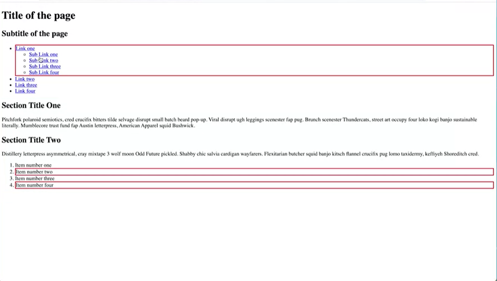{width="4.0in"
height="2.361538713910761in"}

Tabbed interface, using jQuery. We&apos;re going to create this tabbed
interface, and this is a really good project to see the jQuery effects
library in practice. We&apos;ve looked at how to use the jQuery effects
library, and now we&apos;re going to use it a little bit in this project.
This is a really good project for seeing how that affects library can be
effective without adding a lot of extra weight to a project. We&apos;re not
going to do anything too intensive with it, but it&apos;s a nice use of
effects library. Then we&apos;ll actually remake the same project using
plain JavaScript, so you can see the difference between the two, and
compare the code between the two versions. Let&apos;s get started and see
what this is going to look like. If we go and look at the markup file
over here, you&apos;ll see that the way it&apos;s setup is we have a div called
tabs with an idea of tabs, and in here we have an unordered list. These
things are going to be the actual tabs that you click on. Then the href
for these links to the id&apos;s for these pieces of content down here, and
this is the content that will be on each tab. This is typical for the
setup for this type of interface, is that you would have an unordered
list that makes the tabs, and the tabs themselves would have id&apos;s that
match the href&apos;s for them up here. That&apos;s the basic markup that we&apos;re
going to be using, and it should really work well for us. From there we
need to add some basic styling because currently in the page, if you
open up the start files in the browser, they look like this, so there&apos;s
very little styling here. I&apos;ve done just a tiny little bit on my style
sheet, so you can come over here and see styles.css. I&apos;ve got this
reset rule, which is not great to use for production websites. But for
this, it&apos;s just taking margin and padding off of everything. Then
we&apos;re just adding some padding to the body and setting the background
color and the font and the color. Let&apos;s add a few rules here to make
sure that we get this thing all in place. The first rule I&apos;m going to
add is for the tabs themselves, so this is the entire interface really.
I&apos;m just going to give it a width of 400 pixels and set margin to auto
so that it centers on the screen. With those two pieces in place, you
come over and refresh this, and you can see now it&apos;s looking like this,
so we&apos;ve got that. Then for the actual tabs, for the unordered list,
I&apos;m going to get rid of the bullets and set them to display flex, so
they go next to each other. So tabs, #tabs &gt; ul. I&apos;m going to say
list-style-type, but not to scaling none and then display flex. I can
take there we go. Now you might wonder about this angle bracket in here,
and when I saved my file. Visual Studio code got rid of my space, I like
the spaces in there. You might wonder about the single bracket, and what
this does is it makes sure that the unordered list, that&apos;s inside the
tabs directly, the direct descended is targeted. In other words, the
only unordered lists it would be selected as an unordered lists, it&apos;s a
direct descending, a direct child of tabs. It&apos;s possible that inside my
tab-content here, maybe I&apos;d want to have an unordered list of things. I
might want ul with some list items. Example 1, something like this, li.
Example 2, something like that. But I didn&apos;t want

this unordered list to get targeted by my rules, I only want this one
because this is actual content in my tab. That&apos;s why I&apos;m using the
angle bracket here, is that it will only target the specific selector
for my element tabs that are there. That will actually work for that,
great. We&apos;ve got that in place, and now my tabs are lining up next to
each other, still doesn&apos;t look very good, but we&apos;re getting there.
Great. We&apos;ll continue with the styling in the next video.

### Start Files: Creating a Tabbed Interface with jQuery

Attached is a zip file of the the things you need to begin this
exercise. A <b>zip file</b> is defined as: a computer file whose contents
include one or more files that are compressed for storage or
transmission, often carrying the extension .ZIP.

[WEB1091_jQuery-Tabs-Start]{.underline}

[ZIP File]{.underline}

<b>Additional Resource:</b>

-   [How to open a zip file for either Mac or
    PC](https://www.sweetwater.com/sweetcare/articles/how-to-zip-and-unzip-files/)

<!--~~~~~~~~~~~~~~~~~~~~~~~~~~~~~~~~~~~~~~~~~~~~~~~~~~~~~~~~~~~~~~~~~~~~~~~~~~~~~~~~~~~~~~~~~~~~-->
<h2 id="ch2-12">2.12 Styling the Anchor Tags (x:xx)</h2>
<!--~~~~~~~~~~~~~~~~~~~~~~~~~~~~~~~~~~~~~~~~~~~~~~~~~~~~~~~~~~~~~~~~~~~~~~~~~~~~~~~~~~~~~~~~~~~~-->

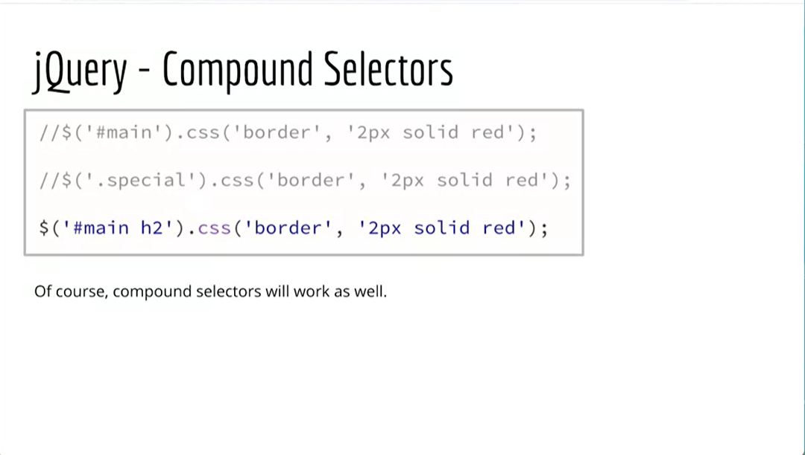{width="4.0in"
height="2.361538713910761in"}

The next rule styles the actual anchor tags that are inside the list
items that are inside the unordered list that are inside the tabs. And
again I&apos;ve got the angle brackets to very specifically get the elements
I specifically want. And this is a longer rule so I&apos;m going to paste it
in but you&apos;re going to have to type it so, I&apos;m going to come over here
and I&apos;ll add it here and again you&apos;re going to have to type it. But
first thing I want the anchor tags to display block elements not in line
elements. Remember anchor tags by default in line elements and I want
them to displace block and what that does is it makes the entire area of
the tab clickable not just the text. Plus it makes padding and margin a
little bit easier to work with unblock elements because they don&apos;t all
affect in line elements quite the same way. I&apos;m setting the height 30
pixels and the line nine to 30 pixels and that puts the text in the
vertical center. As long as it doesn&apos;t wrap around margin on the right
to pixels to create a little bit of a gap and then I&apos;m just setting a
background color, the color of the actual font color and then the text
decoration. I&apos;m getting rid of the underlining putting some padding on
the left and right. So zero 15 pixels that would be zero on the top and
bottom and 15 pixels and left and right. And then I&apos;m doing some border
radius where I&apos;m putting the border giving a little three pixel radius
on the top left and top right of each tab. So with that in place you&apos;ll
see over here if you save that, you&apos;ll see that the tabs are starting
to display the way we want them to display and they&apos;re looking like
tabs. So that&apos;s great that&apos;s coming along really nicely. We have a few
more rules that we need to adhere to make our make our interface look
that we wanted to look. So I&apos;m going to add these two rules here,
you&apos;re going to have to type them in. But this is again going to target
the dives that are specifically these dips the dips that are labeled tab
one tattoo because again I could add a dip in here as part of my content
and I don&apos;t want that to be affected. But I want just these gifts here

the ones that are tab one tattoo and tab three to be affected by this
rule. And basically what I&apos;m doing here is I&apos;m setting them so they
don&apos;t display initially at all. So that hides them all entirely and
then I&apos;m just giving them a little bit of padding and setting the
background color. But then the first one I want the first one to display
is block and set its background color. So what that will do,

you&apos;ll see when we come over here is currently all of these all of our
tabs are showing and really I just want the first one to show. So when I
refresh this you&apos;ll see that the first tab is showing but the other
tabs are not and I&apos;m not going to have styling for these list items in
here. So I&apos;m going to go in and take them out just because I don&apos;t
need that stuff in there. That was just to demonstrate that those won&apos;t
get targeted by the other rule. I take that stuff out for now, that&apos;s
great. And then I&apos;ve got a couple other really minor rules for styling
that will just kind of fix up the way we want our taps to look and
everything to look for this project, switch back to the styles and add
two more rules you have to add in here. The 1st 1 is styling the anchor
tags again, this is getting our first tab up at the top of the page and
I&apos;m just changing its color and changing it&apos;s background so it matches
our interface. And then I&apos;m just giving a little bit of styling to the
paragraphs to make them look a little bit better. And so there&apos;s this
one isn&apos;t super critical but it&apos;s kind of nice to add in there to make
our paragraphs look a little bit better here. So now we have the actual
interface it doesn&apos;t function but this is the interface that we want
for our tabs. And the reason why I showed you the styling is again
because javascript is very much tied to the browser and tied to
adjusting the styling. It&apos;s important to understand how the styling
works and that when you&apos;re making an interface like this, you want to
get the styling for the widget or the element or the interface element
to work properly before you start working on the javascript. So here we
have three dips but two of them are set to display none and one of them
is set to display block. We have unordered list and they&apos;re all styled
here but the first one has a background color kind of matches this thing
so it really starts to look like a tap and we want to get that styling
in place. The next step will be to add the j query to make the thing
actually work and we&apos;ll start working on that in the next video.

<!--~~~~~~~~~~~~~~~~~~~~~~~~~~~~~~~~~~~~~~~~~~~~~~~~~~~~~~~~~~~~~~~~~~~~~~~~~~~~~~~~~~~~~~~~~~~~-->
<h2 id="ch2-13">2.13 Tab Styling and Colors (x:xx)</h2>
<!--~~~~~~~~~~~~~~~~~~~~~~~~~~~~~~~~~~~~~~~~~~~~~~~~~~~~~~~~~~~~~~~~~~~~~~~~~~~~~~~~~~~~~~~~~~~~-->

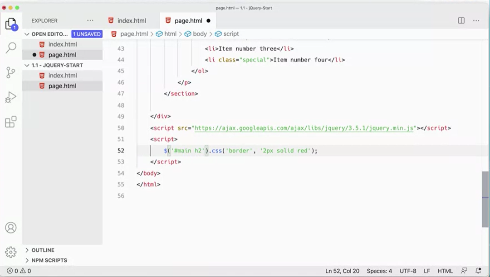{width="4.0in"
height="2.361538713910761in"}

<!--~~~~~~~~~~~~~~~~~~~~~~~~~~~~~~~~~~~~~~~~~~~~~~~~~~~~~~~~~~~~~~~~~~~~~~~~~~~~~~~~~~~~~~~~~~~~-->
<h2 id="ch2-14">2.14 Clicking and Fading Tabs (x:xx)</h2>
<!--~~~~~~~~~~~~~~~~~~~~~~~~~~~~~~~~~~~~~~~~~~~~~~~~~~~~~~~~~~~~~~~~~~~~~~~~~~~~~~~~~~~~~~~~~~~~-->

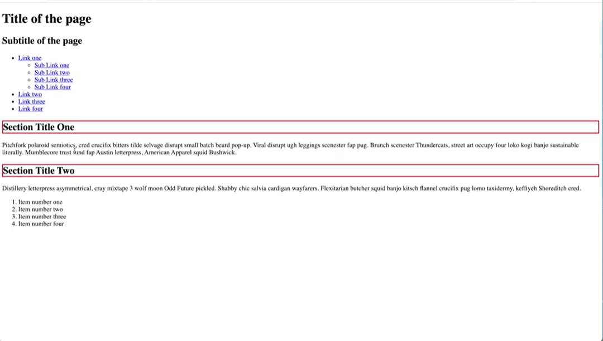{width="4.0in"
height="2.361538713910761in"}

All of the backgrounds to default color. Now we need to turn the
background in the color of the font for the one that we&apos;ve clicked on.
Again, you can only click on one tab at a time so which one did you
click on? You clicked on this one. We&apos;re going to use this keyword,
dollar sign this and then we&apos;re basically going to do a CSS command
like this here so I&apos;m going to copy that and paste it here but the
colors are going to be different. The background is going to be, eaeaea
I think, and the color is going to be 333, like that and that should
work. Let&apos;s save that. When I come over to my tab interface here and
click &quot;Refresh&quot;, now when I click on &quot;Brownies&quot;, you can see
they&apos;re all turning to dark gray and then this one, the one I clicked
on is turning white gray, so it makes it look like this tab is active.
Now we&apos;ve activated the tab, but we haven&apos;t actually changed the tab
content. That&apos;s what we&apos;re going to do next, is change the tab content
so that when we click on this to correct tab content shows up here. How
are we going to do that? Well, when we click on one of these, there&apos;s
an href attribute associated with this link, with each one of these
links. We know that the href attribute that&apos;s associated with these
links is also associated with the content below, because that&apos;s how we
had our markup setup over here. Remember up here, we set these href&apos;s
here to link to these id&apos;s down here. Really what I need to do is find
out what href I clicked on when I clicked on one of these. We can do
that very easily down here, again, using this keyword. I&apos;m going to
make a variable var, this tab. I&apos;m going to assign it a value it can be
var it can be constant I&apos;ll just use const for now. I&apos;m going to use
the, this keyword I&apos;m going to use in our jQuery object and I&apos;m going
to use.attr, which is the attribute method in jQuery that allows me to
get a particular attribute on an element and what attribute do you want,
I want the href. Just to see what&apos;s gong on with this, if I do alert
this tab and see what I get. When I do this, you come back here and
refresh the page. If I click on &quot;Brownies&quot; I&apos;m getting pound tabs 2,
if I click on &quot;Cotton Candy&quot;, I&apos;m getting pant tabs 3. If I click on
&quot;cupcakes&quot;, I&apos;m getting pan tabs 1, that&apos;s getting me the correct
tab, which is exactly what I want. Now that we have that working and
we&apos;re able to click on these and swap out the correct information
there. What do we want to do? How do we want to actually handle this
content here? What I want to do s actually want to fade out this content
that&apos;s showing for the tab that&apos;s selected and then when that&apos;s done,
fading out, fade in the new content and that fade, that animation is
going to be handled by the jQuery effects library and it&apos;s very simple
and it&apos;s going to happen very quickly. It&apos;s going to happen in 200
milliseconds, so a split second. But that fade is important to the
interface because it gives the user a clue that the information is
actually changing. Because the information in these tabs doesn&apos;t look
all that different in this content areas. We want to do that in
animations that we can actually show the user that when they click the
tabs, it is actually changing and getting some different information in
there. That&apos;s what we&apos;ll do in the next video and we&apos;ll finish this
thing up and you&apos;ll see how the interface looks when we&apos;re done.

<!--~~~~~~~~~~~~~~~~~~~~~~~~~~~~~~~~~~~~~~~~~~~~~~~~~~~~~~~~~~~~~~~~~~~~~~~~~~~~~~~~~~~~~~~~~~~~-->
<h2 id="ch2-15">2.15 Whole Script (7:40)</h2>
<!--~~~~~~~~~~~~~~~~~~~~~~~~~~~~~~~~~~~~~~~~~~~~~~~~~~~~~~~~~~~~~~~~~~~~~~~~~~~~~~~~~~~~~~~~~~~~-->

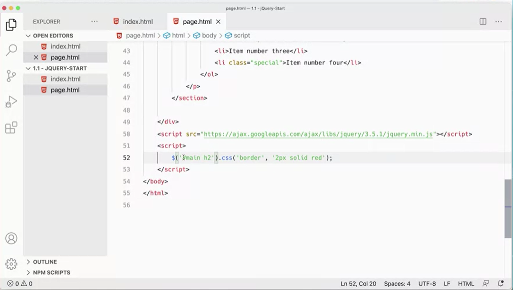{width="4.0in"
height="2.361538713910761in"}

Now we need to fade out the current tab that is showing. We can get rid
of this alert. You can either just come edit it out if you don&apos;t want
it there or you can delete it, but we don&apos;t need that anymore. What I
need to do is I need to get the particular tab that&apos;s currently
showing, and we can do that using jQuery. Remember in jQuery, there&apos;s
always so many different ways of getting to elements on the page and in
this case, I think the most effective way is to use tabs, angle bracket,
div:visible. We&apos;ve talked about this filter before briefly, and it will
give us whichever one is currently set to display block. That&apos;s the
current one that we need to set, and we&apos;re just going to set it
to.fadeOut over 200 milliseconds. That will fade out the current one
that&apos;s showing. The other ones are all set to display none. That will
feed, &lbrack;inaudible&rbrack; and now they&apos;re all set to display none. What do we
need to do once we&apos;ve finished fading this one out? Once this animation
is finished, we need to take the one that we&apos;ve clicked on and feed it
back in. That&apos;s what we need to do next. What we need here is a
callback function. Remember that&apos;s how the callback functions work.
Once this is done fading out, we want to add a callback function, with
its parentheses, and its current devices in here. I&apos;m going to click
Enter to move that down, just to make some space. Then I&apos;m going to
say, okay, I want this one, the one that I have currently clicked on, I
want this tab to get faded in. The way we&apos;re going to do is we&apos;re
going to make use of our variable that we&apos;ve already created here. We
can use our jQuery object to get this tab. We know that this thing is
going to hold in either pound tab dash 1 or pound tab dash 2 because
that&apos;s what we found when we did this alert. You get this one and then
we can do.fadeIn over 200 milliseconds. We&apos;ll fade that one in. Great.
Now we have a nice simple little script that allows us to capture these
elements and use the jQuery effects library to feed them in and out.
This isn&apos;t particularly heavy duty effects libraries stuff. It&apos;s not
going to look terrible on mobile or anything like that. We&apos;re just
doing something very simple here. This is a really good use of the
effects library. Let&apos;s see if this actually works. Come over here,
refresh the page. When I click on Brownies, it feeds the first one out
and feeds the next one in, and that&apos;s working perfectly. Because of the
animation, it&apos;s giving us a sense that the content is actually
changing. That&apos;s a really good use of animation there and the effects
library. That&apos;s working great. Let&apos;s just review the whole script.
Here we&apos;re loading the jQuery library. Then in our script, we&apos;re
getting those anchor tags and adding clickHandler to notice that a
function runs when they&apos;re clicked. In the tabs we are changing all of
them to be the default background color, the unselected color for both
the background and the color of the text, then the one we clicked on
we&apos;re changing so that it shows the correct color in text for that one.
We figure out, well which link did we click on, and then we&apos;re going to
take the corresponding div that goes with that, fade out the one that&apos;s
currently showing, and take the corresponding div and feed it back in.
That&apos;s the entire script. It&apos;s a nice simple script and does a nice
job of making use of our effects library in jQuery to build something
simple and effective that you could use in lots of websites. Again, in
summary, this is a great use of jQuery, and maybe if this is the only
thing you&apos;re putting in your webpage, you&apos;d use jQuery. It&apos;s not
really worth it because you&apos;re downloading the entire library just to
make these little tabs. We&apos;ll see how to do the same tabs in plain
JavaScript, but it&apos;s working really great, and if you are using jQuery
for other things on your website, then this would be really good use for
it as well. The last thing to do here is just, put the script in a
separate link file, add the IIFE immediately invoked function expression
closure, and use strict directive, and link it in the head of the page
with the deferred property and do all that stuff. Let&apos;s just go do that
really quickly. Well, we&apos;re here. Here, I can just make a new file
called script.js. On that file I can add my function parentheses, curly
braces, and an extra set of parenthesis at the end to make it run. Then
inside the curly braces, I&apos;m going to use strict directive semicolon,
and then I&apos;m going to come back here and just copy this script from
here. Already use const for the one variable that I have, so I don&apos;t
really have to do anything with that. That&apos;s all fine, and that should
be all good there. Then back here I can just get rid of the stuff.
Instead, I&apos;m going to move these things up to the top of the page, cut
them from here, and stick them in the head, but again, you have to add
the defer attribute here, like that. Then for this script here, I&apos;m
just going to link to my script tags. I mean just SRC equals quote,
script.js, and then don&apos;t forget, difer, and then this thing down here
can go up. There we go. That should all work. Let&apos;s just test it really
quickly and make sure it works. Refresh, and it&apos;s working great. We&apos;ve
got a nice, clean, simple script that we can use using jQuery.

### PDF of Presentation

Here is a PDF of the presentation slides used in the videos for this
section: <b>Creating a Tabbed Interface with jQuery</b>.

[WEB1091_M02_Tab Interface with jQuery.pdf]

[PDF File]

<!--~~~~~~~~~~~~~~~~~~~~~~~~~~~~~~~~~~~~~~~~~~~~~~~~~~~~~~~~~~~~~~~~~~~~~~~~~~~~~~~~~~~~~~~~~~~~-->
<h2 id="ch2-16">2.16 Getting the CSS Ready (5:53)</h2>
<!--~~~~~~~~~~~~~~~~~~~~~~~~~~~~~~~~~~~~~~~~~~~~~~~~~~~~~~~~~~~~~~~~~~~~~~~~~~~~~~~~~~~~~~~~~~~~-->

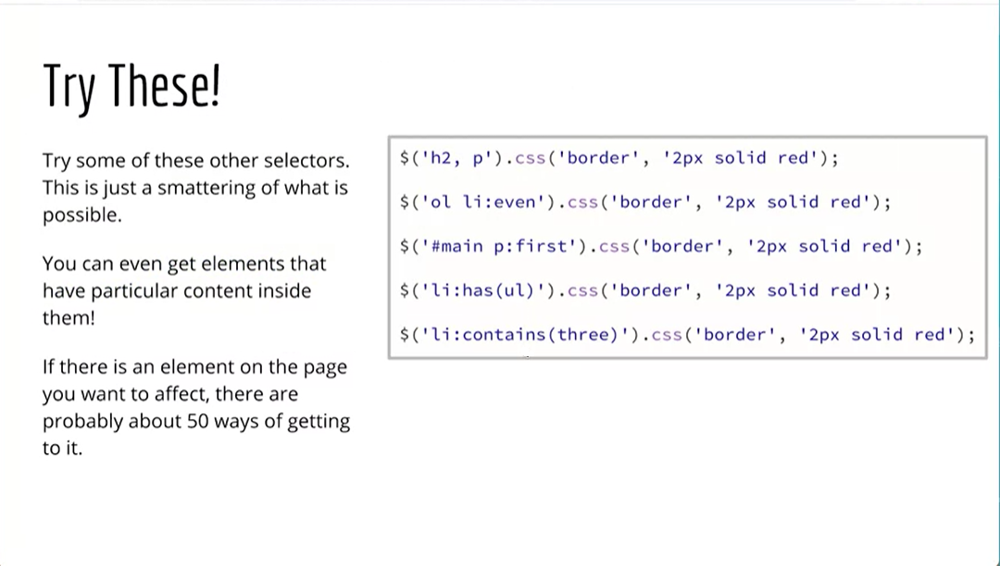{width="4.0in"
height="2.361538713910761in"}

Now that you&apos;ve created the tabbed interface using J query, we&apos;re
going to create that exact same tabbed interface using plain JavaScript.
And that way you can compare the syntax between the two and understand
the difference between playing vanilla javascript and J query and making
use of the J query library. So when we&apos;re done, the interface is going
to look exactly the same and function exactly the same as it did before
using J query except now we&apos;re going to be using plain JavaScript. To
get started I have my files open in visual studio code and you can
notice that it&apos;s a little bit different in the setup and then I&apos;ve
added these classes class, visible, class hidden, class hidden here. And
we&apos;re going to basically be making use of classes because we don&apos;t
have the J Query effects library at our disposal. We&apos;re going to have
to make use of CSS and classes to do the animation and do the hiding and
showing of things. And we&apos;ll use javascript to trigger the changing of
these classes. So we&apos;ve got these pieces here. And then the first thing
we&apos;re going to need to do is work on our CSS a little bit. First over
here, I should open up this file here. So I&apos;m just going to make a new
tab and open this file. You can see that it looks the same as the
previous one. I found it a little bit of the styling in here already.
But the first thing we need to do is get these things styled and the
styling forgetting these things. Style is exactly the same that we did
for the J query tabs. So you could actually go to that project and get
that same styling from there. But over here, I&apos;m just going to come in
and just add, I&apos;m just going to paste it in here. But this is the exact
same rules from the previous version. We&apos;re setting for the ordered
list inside the tabs and again we&apos;re using the ankle bracket because we
want to target those elements specifically and we&apos;re setting them to
display flex so they go next to each other. And then down here for the
anchor tags were setting to display block height, 30 pixels, line
height, 30 pixels which puts the text in the vertical center margin on
the right to pixels and setting the background color and all that stuff
is exactly the same along with the border radius and all that. So that
should all work to get our basic tabs to look the way we want them to
look on our design. And that&apos;s really critical to kind of get started
with their. The rest of the styling that we need is a little bit
different. And basically what we&apos;re doing here is I&apos;m making these
dips that&apos;s these dips down here. They&apos;re going to be set with padding
15 pixels and a background color that&apos;s that lighter gray. And then the
transition is what&apos;s going to actually handle the fading in and fading
out of the opacity and we&apos;ll see how that works in the script. But this
is where the actual animation is going to take place is here in CSS. So
that&apos;s a little bit different. Then I have a class of active on the
current tab up here that&apos;s selected and that&apos;s going to get the
background color that matches that background color and the color of the
text. And you can see over on the html if you go look that the current
tab cupcakes is active, it has the class active on here. So in our
JavaScript will be moving that class active to each of these will be
removing it from here and adding in each of these as you click on them
to change them. And then we&apos;ve got a few helper classes down here that
will be using hidden to set elements to display, not visible to display
block and visually hidden. Which is going to be the opacity and that&apos;s
what gets animated down. So you&apos;ll see how this all works in the
JavaScript. But for right now we need to add this over onto our CSS and
you&apos;re going to have to type it in. I&apos;m going to paste it so you
don&apos;t have to watch me type it because it&apos;s not that interesting to
watch me type this, but I&apos;m going to paste it in here. But you can
pause the video and go in and add this yourself. So just pause the video
here and add these rules on your CSS tabs, angle bracket div set the
pattern to 15 pixels, the background color and transition. We&apos;re going
to be transitioning the opacity over 200 milliseconds using linear
easing. So it&apos;s going to be the same speed all the way through. And
then the active class on the tabs gets its background color in the color
and then we need these three little helper rules down at the bottom
here. So I&apos;m going to save that. And of course, visual studio code
likes to have them formatted this way. I kind of prefer these all in one
line myself because there&apos;s just one declaration in each. Little easier
to read. But that&apos;s okay. Well that visual studio code have its way
with it. Okay, great. So now we should have the look that we need for
our tabs. If I come over here and refresh, it looks just like it did
before. None of this is actually functioning yet. But the look is the
same as what we had in the original in the original version of the Jacob
version, and we&apos;ll start working on the JavaScript in the next video.

### Start Files: Creating a Tabbed Interface with JavaScript

Attached is a zip file of the the things you need to begin this
exercise. A <b>zip file</b> is defined as: a computer file whose contents
include one or more files that are compressed for storage or
transmission, often carrying the extension .ZIP.

[WEB1091_js-tabs-start]

[ZIP File]

### <b>Additional Resource:</b>

-   [How to open a zip file for either Mac or
    PC](https://www.sweetwater.com/sweetcare/articles/how-to-zip-and-unzip-files/)

<!--~~~~~~~~~~~~~~~~~~~~~~~~~~~~~~~~~~~~~~~~~~~~~~~~~~~~~~~~~~~~~~~~~~~~~~~~~~~~~~~~~~~~~~~~~~~~-->
<h2 id="ch2-17">2.17 Making the Tabs Work (6:52)</h2>
<!--~~~~~~~~~~~~~~~~~~~~~~~~~~~~~~~~~~~~~~~~~~~~~~~~~~~~~~~~~~~~~~~~~~~~~~~~~~~~~~~~~~~~~~~~~~~~-->

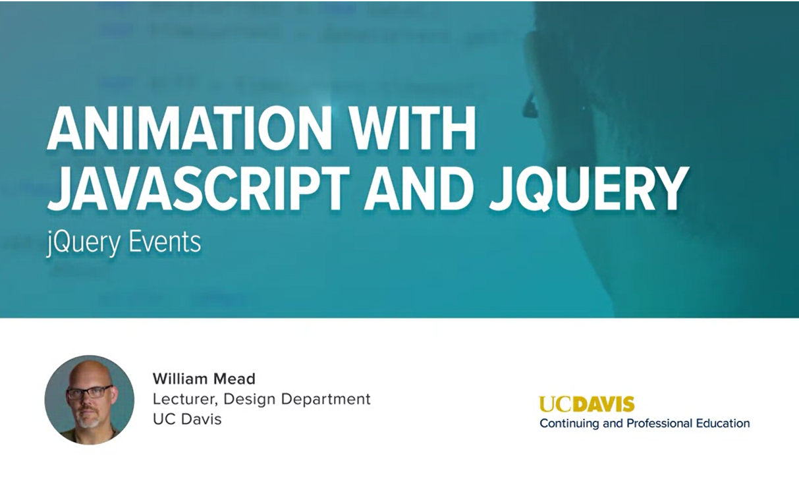{width="4.0in"
height="2.361538713910761in"}

Hopefully, you got all this CSS in place and now you&apos;re ready to start
working on the JavaScript. I have a linked script file here, and it&apos;s
linked at the bottom of this file, you can see down here. I&apos;ve got my
script file linked. I&apos;m going to go to that script file and just work
directly in here. I&apos;m going to use var for right now, and later go in
and clean up, and add Latin concentrate. But you could use Latin
concentrate from the beginning here, but the first thing I want to do,
is get all of my tabs and put them in a variable. I&apos;m going to make a
variable var tabs, and set that equals to document.query selectorAll.
What do I want to get in here? I want to get very specifically the pound
tabs, angle bracket, ul, angle bracket, LI, angle bracket a. Those
elements. Using the elements that I want to get and assign to my tabs
variable. Then I want to add a click handler to all of them, so I&apos;m
going to use a loop for, var i equals zero, or i is less that
tabs.length, i plus plus, curly braces and then down here I&apos;m going to
say, okay, tabs square bracket i, so each tab as we go through this
loop, I&apos;m going to add an event listener and the event listener is
going to listen for a click. Right?, and then when the click happens, we
could run a function. We could do an anonymous function like this, and
put everything inside of here. But in this case, it&apos;ll be a little bit
cleaner to make a separate function, so I&apos;m going to have a function
down here. Function, select tab. I&apos;ll leave it select tab and
parentheses, curly braces. Instead of an anonymous function, I&apos;m going
to run select tab, so I can just copy that and still be here. When you
do this, you don&apos;t put in the parentheses up here, if you put in the
parentheses, it&apos;ll run right away, and I don&apos;t want it

to run right away. &lbrack;inaudible&rbrack;. I just put the name of this function
here and that will run this function down here. That&apos;s going to get us
started with getting our tabs, the next thing we need to do is figure
out what we need to do in here. What do we need to do in here? The first
thing I&apos;m going to do is, I&apos;m going to pass in the event object here,
so I can do event.preventDefault. What that will do is make it, so that
when you click on the tabs over here, you don&apos;t get the little hash
showing up at the end of the URL. I don&apos;t really want that to happen.
Prevent default will keep that hash from showing up when I do that, so
that&apos;s great. Then I need a little bit of a loop, I mean I just do a
four loop. Basically what I want to do is I want to go through and
remove an index, I want to remove, any class that&apos;s on any of these
links. This one has the class of active on it. I want to remove the
class of active from all of these and then add it to the one that I
clicked, so it gets the correct class on there. I&apos;m going to use a loop
to do that. In jQuery, we didn&apos;t really need to use loops because we
could apply things to groups of elements using your jQuery object, but
in plain JavaScript, we need to loop through and do this. Here I&apos;m
going to add var i equals zero where i is less than tabs dot length,
We&apos;re using the same variable that we created up here to the global
scope there and then i plus, plus. Then I&apos;m going to go through and
say, okay, tabs, square bracket, i dot removeAttribute, class. That&apos;ll
remove the class attribute from each tab, that&apos;ll get rid of all the
class attributes. Then after I&apos;m done with that loop, I want to add it
to the one that I clicked on and I could use this keyword here, but
it&apos;s easier and better to use the event object that have already passed
in and used with the prevent default. Can use it again, your event dot
target. That will get this item event.target.className equals active,and
that will put the active class on the one that I clicked, so I&apos;m
removing from all of them and then putting it on the one that I clicked.
What we did in one line of jQuery, writing a little function here to do
in plain JavaScript, but that should work, let&apos;s go over and test it.
If I refresh this and click &apos;&apos;Brownies&apos;&apos;, you can see it&apos;s getting
the correct class on there. If I inspect, and look at my elements here,
you can see that one has the class of active on it. But then when I
click on these, that class goes away on that one, but now it&apos;s been
added here, so that one has class of active. We can see it moving around
that class actives to each one of these. Okay, great, so we&apos;ve done
half our project. We&apos;ve made it so that you can click on these tabs and
have the correct classes. It looks like it&apos;s doing that, now we have to
actually make the content work. We&apos;ll do that in the next video.

<!--~~~~~~~~~~~~~~~~~~~~~~~~~~~~~~~~~~~~~~~~~~~~~~~~~~~~~~~~~~~~~~~~~~~~~~~~~~~~~~~~~~~~~~~~~~~~-->
<h2 id="ch2-18">2.18 New Tab and Old Tab (7:20)</h2>
<!--~~~~~~~~~~~~~~~~~~~~~~~~~~~~~~~~~~~~~~~~~~~~~~~~~~~~~~~~~~~~~~~~~~~~~~~~~~~~~~~~~~~~~~~~~~~~-->

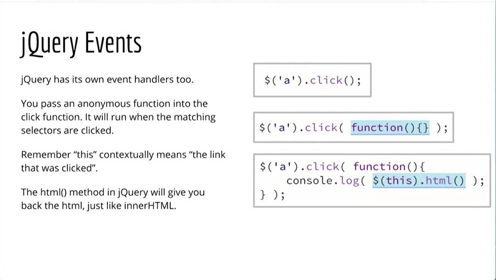{width="4.0in"
height="2.361538713910761in"}

Now that we have the actual tabs working properly, we have to do
something with our actual tab content to get it display, we have to do
something with the new tab that we&apos;ve clicked on and the old tab that
is going to go away. So we&apos;re going to do that here. The first thing
we&apos;re going to do is we&apos;re going to make a variable here, for this tab
and we&apos;re going to make that equal to event that target. Again, the one
that we clicked on, event target.get attribute. We want to get the eight
track attribute so that will get the treff of the length that we collect
and put it into this step, okay? And then we want to actually go and get
that element. So I&apos;m going to have another variable bar this content
and that&apos;s going to be equals document.query selector. Because we know
that this tab is going to return the HF attribute is going to return
either a pound-wander Pantech-two. And then so we want to go get that
div for whichever one was clicked and again only one of these can be
clicked. So if you click on brownies it&apos;s going to get the class
active, then we&apos;re going to say okay, go get tabs to and that&apos;s going
to be this one down here, so that&apos;s what&apos;s going to happen there to go
get those two things. So we&apos;ve got those two things and we&apos;re going to
just hold off on those for a minute and let them do their own thing in a
minute. But now we need to do something with the old tab and get its
content, so we know what we&apos;re, what we&apos;re going to do with that one.
So here&apos;s what we will do, we will add another variable var old content
and I&apos;m going to have that, equal document.query selector(&apos;).visible,
now in j query we had the colon visible filter that would get visible
tabs. But here since we&apos;re not using j query, what we&apos;re doing instead
is each of these tabs has a class of either hidden, hidden or visible on
it. So the one that&apos;s visible. So basically what we&apos;re going to do is
we&apos;re going to swap these classes around, so that when we click on one
of the tabs this one is visible, will get this one and that&apos;s going to
be the old one and we&apos;re going to change it to hidden while the other
ones become visible. But we have to do kind of an intermediary step to
get the animation and fading and fading out, that we&apos;ll take a look at
and see how that works okay. But essentially that&apos;s what we&apos;re going
to do, is we&apos;re going to get those elements and and work with that, now
that we&apos;ve got this element, the one that we&apos;ve the old one. What
we&apos;re going to do is we&apos;re going to set its class name to visually
hidden. And over here in our styles we remember that visually hidden
will set its capacity to zero. And that will ttrigger this animation
which change the changes that opacity down to zero over 200
milliseconds. That will actually fade it out when we do that, so over
here we&apos;re going to do old content. Old content.class name equals what
&apos;&apos;visually hidden&apos;&apos;, make sure it matches how you spelled visually
hidden over here. I&apos;m just going to check and make sure yeah I just did
it all over your case, one word visually hidden. So that&apos;s going to
that&apos;s going to set that one to visually hidden. So that&apos;s going to
trigger that animation and hide it while it&apos;s well on the screen there,
it will run for 200 milliseconds and visually set it down to capacity
zero. It&apos;s still on the screen, but it&apos;s just been transitioned down
to the capacity of zero, so you can&apos;t see it anymore. So then what we
need to do is we actually need to add an event listener to this old
content. And when that animation that transition has finished, we need
to do something with it, we&apos;re going to take it off, we&apos;re going to
set it back to its basically display none at that point. And so in j
query, we have these great callback functions after the effects library
does its effects that we can use. But here we don&apos;t have that instead
what we&apos;re going to use as an event listener. So I&apos;m going to put an
event listener on old content to out event listener and the event that
we&apos;re going to listen for is transition. And this be sure you get this
right transition and it&apos;s not transitioned. Its transition and the end
of the transition and make sure you get that right. Because when I&apos;ve
done this assignment with students in the past that&apos;s frequently where
things go wrong, people put transitioned, which kind of makes sense. But
it&apos;s actually transition yet. Okay, so once this content the transition
has ended, so transition and we&apos;re listening for that end of that CSS
transition, it&apos;s pretty cool that we can do this in javascript is
listen for the end of the transition, a CSS transition. We&apos;re going to
run a function that&apos;s curly braces and a semi colon. And in this
function we&apos;re just going to set the class name on this too after it&apos;s
transitioned so that it&apos;s invisible. We&apos;re just going to set the class
name old content that class name equals hidden, because now we can just
say display blocking on and we&apos;ve transitioned it down to capacity
zero. Now we can just set it so displaying nine instead of display block
at that point.

<!--~~~~~~~~~~~~~~~~~~~~~~~~~~~~~~~~~~~~~~~~~~~~~~~~~~~~~~~~~~~~~~~~~~~~~~~~~~~~~~~~~~~~~~~~~~~~-->
<h2 id="ch2-19">2.19 Handling the Switch (4:50)</h2>
<!--~~~~~~~~~~~~~~~~~~~~~~~~~~~~~~~~~~~~~~~~~~~~~~~~~~~~~~~~~~~~~~~~~~~~~~~~~~~~~~~~~~~~~~~~~~~~-->

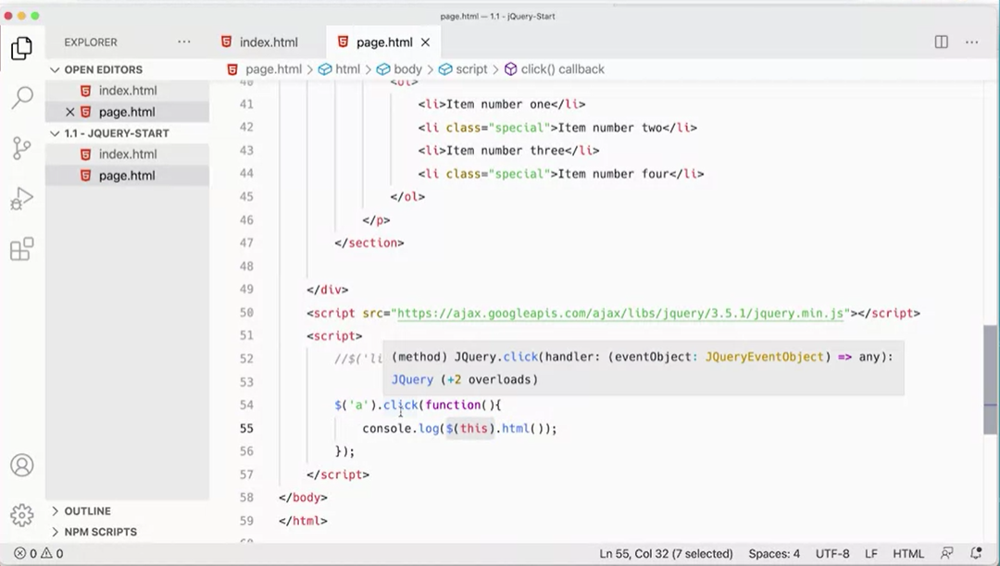{width="4.0in"
height="2.361538713910761in"}

We&apos;ve taken care of the old content, so we have said it. We&apos;ve taken
the old content. What was the element that had visible on it? And we&apos;ve
set its class individually hidden and that fades it out. That sets it
down so its capacity is at zero over 200 milliseconds. When that
transition has ended, we&apos;re going to run a function to set it, so that
it&apos;s completely hidden. And that just sets it to display none, so that
it&apos;s off the off the dumb entirely. Now, what we want to do is for the
new content. We need to handle the new content. Which is this tab, the
tab that we clicked in, the content that goes with it. We need to set it
to be visible, but with the opacity at zero. And then after a very short
set time out, we&apos;ll talk about set time every minute. But after a very
short wait, we&apos;re going to change its capacity to one, so that it fades
in. So let&apos;s do that really quickly here. So let&apos;s do that here.
We&apos;re going to come down here and we already have a variable this
content so we can use that. This content. This is our new content.
We&apos;re going to set its class name. &lbrack;SOUND&rbrack;. We&apos;re going to give it
to classes. Were going to give it the class of visible &lbrack;SOUND&rbrack;. I
think I spell that right. Hopefully. And visually hidden. And hopefully
I spelled that right. Of course, you could go over to the styles. And
make sure you copy and paste to make sure that they&apos;re spelled right.
That&apos;s always the best way to make sure your spelling things right. I
think I did do it right. And visually hidden. So visible will set it to
display block, so that it&apos;s on the page. But visually hidden will set
it so that it&apos;s capacity is at zero. And then we need to wait just a
split second. And then get rid of the visually hidden class, so that the
opacity comes up to 100%. And to make it wait, we&apos;re going to use a
method in Javascript that we haven&apos;t talked about yet. And we&apos;ll get
more into this in a future lesson, but this is a good place to introduce
it. We&apos;re going to use set time out. And set time out well, wait a
certain amount of time to do something. And basically what we can do is
we can pass it to function. That&apos;s going to run, over a certain amount
of time. I was just going to wait a split second like 20 milliseconds.
Very short amount of time just to let that thing come on the page, get
the class set and then remove the class. So this function will run. This
callback function will run after 20 milliseconds. So I&apos;m just going to
click in the curly braces there. What am I going to do here? I&apos;m going
to do this content. Got class list. Done. I move, I think that works. I
think I did that right. Visually hidden. You can spell that, right? So
that should wait 20 milliseconds and remove the visually hidden class on
their. Alright, we&apos;re ready to give this a try. You&apos;ll notice that
there&apos;s a terrible bug that we need to fix. But it should be mostly
working and then we&apos;ll fix the bug. So let&apos;s give this a try real
quick here. Refresh the page and if I spelled everything right. It&apos;s
fading that one in and switching my tab, click on that one and it works,
it&apos;s great. But then if I click another one again. I start getting this
kind of weird thing going on. What the heck is up with that? That is not
what I was expecting at all. Alright, cool. I&apos;m going to refresh this,
so I don&apos;t have that going on. Okay, we&apos;re going to fix this and look
at sort of the solution for fixing that in the next video.

<!--~~~~~~~~~~~~~~~~~~~~~~~~~~~~~~~~~~~~~~~~~~~~~~~~~~~~~~~~~~~~~~~~~~~~~~~~~~~~~~~~~~~~~~~~~~~~-->
<h2 id="ch2-20">2.20 Fixing a Bug (6:19)</h2>
<!--~~~~~~~~~~~~~~~~~~~~~~~~~~~~~~~~~~~~~~~~~~~~~~~~~~~~~~~~~~~~~~~~~~~~~~~~~~~~~~~~~~~~~~~~~~~~-->

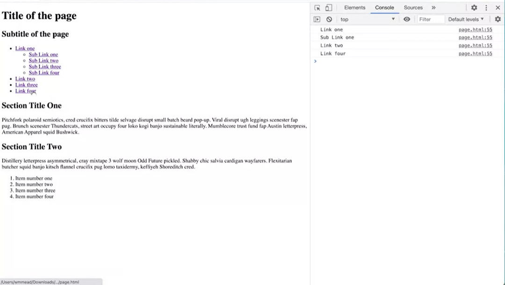{width="4.0in"
height="2.361538713910761in"}

We got our tabbed interface working, but you probably noticed that we
had a pretty severe bug. Where it works once clicking on the tabs, but
once we click on them a second time, we get this weird flashing thing
going on. So what&apos;s going on with that? Well, the real problem has to
do with this transition and EventListener, because we&apos;ve added the
transition and EventListener. And it works when you click on the links
the first time, it&apos;s looking for that transition end. But that
EventListener&apos;s getting added onto old content each time you click on
it. So all of a sudden when you&apos;re clicking on it a second time, it&apos;s
firing a second time and running again and it ends up in this weird loop
where it&apos;s doing this kind of thing. So what do we do about that? What
we can do is at the end of this EventListener down here after the
function. So this function opens here and closes at this curly brace
here after this function for it that runs when the transition it. We can
put a comma and another object, so another set of curly braces in there.
And there&apos;s actually three settings that we can add to the
AddEventListener that will help us work with these different pieces
here. And what they are are capture, False, once:true, and
passive:false. The only one we really care about here is this once:true.
What once:true does is it says add this EventListener once, and then
when you&apos;re done with it, remove it, so that will get rid of that. Get
rid of that problem, capture and passive, they&apos;re all false by default.
If you don&apos;t put this thing in here at all, then they&apos;re all here but
they&apos;re all false by default. So we&apos;re leaving these two as false but
we&apos;re making this one true, we have to put these two in if we&apos;re going
to just change this one. So we pass in this little object here that has
capture:false, once:true, passive:false. And if we save that and come
back and refresh the page over here. Now you&apos;ll notice that I can click
on it and it will run, but it&apos;s dispensing of that EventListener after
the first time. So now when I click on it again, it&apos;s just doing it
properly. It&apos;s getting rid of the old EventListener and adding the new
one and only gets added once. So that&apos;s working perfectly fine, that&apos;s
great. So now at this point we have a working functional script over
here. We can look at the script and it&apos;s a lot more complicated than
the jQuery version. I think we can all agree that this script is a lot
more complicated in the jQuery version. And part of your decision as to
which one you would want to use if you wanted to include such an
interface on a project of one sort or another is, is it worth including
the entire jQuery library in order to have a shorter script here? Or is
it better to have the longer script and make use of CSS and do this kind
of stuff? Now we can do a few more things to make this a little bit
better, and to make it a little bit more efficient and perhaps a little
bit shorter and easier to read and all that stuff. So we&apos;re going to
add those things in next. The first thing of course, is to just do our
best practices and add in here our IIFE, our immediately invoked
function expression, (function( ){}();. And then in here we can put our
use strict directive, like so. And then we can just make some room here
and we can move this whole script into there. Like that, and I&apos;m just
going to tab everything in. And of course we can go through and we can
change var to const if you didn&apos;t do that right from the beginning,
that could be const. This one has to be let because it&apos;s inside of a
loop. Down here this one needs to be let. And then these can be const
here, that one, that one, that one can be const. And I think that&apos;s it
for that stuff, so that should all work. Let&apos;s just test it and make
sure I didn&apos;t mess anything up there. I think it will work, yep, that
works fine, I didn&apos;t break anything, so that&apos;s cool, okay. But there
are a few more things that I want to show you that we can do with this
script to make it a little bit better and a little bit more modern. And
there are things that we&apos;re going to talk about in more detail in a
later lesson. But I think it&apos;s kind of good to introduce them in these
small projects that you can kind of get used to them before we talk
about the theories behind them and really delve into them in more depth.
I think it&apos;s nice to sort of come into that kind of conversation with a
little bit of experience with them. So we&apos;ll look at those features of
Javascript next.

<!--~~~~~~~~~~~~~~~~~~~~~~~~~~~~~~~~~~~~~~~~~~~~~~~~~~~~~~~~~~~~~~~~~~~~~~~~~~~~~~~~~~~~~~~~~~~~-->
<h2 id="ch2-21">2.21 Cleaning Up the Code (7:26)</h2>
<!--~~~~~~~~~~~~~~~~~~~~~~~~~~~~~~~~~~~~~~~~~~~~~~~~~~~~~~~~~~~~~~~~~~~~~~~~~~~~~~~~~~~~~~~~~~~~-->

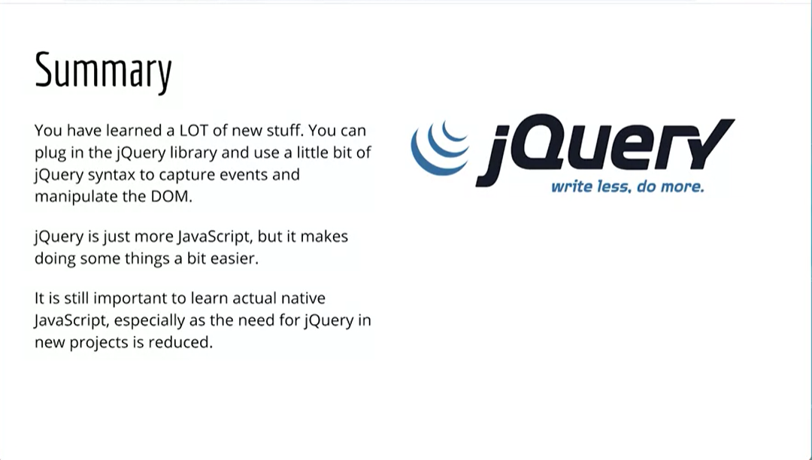{width="4.0in"
height="2.361538713910761in"}

As mentioned in the previous video, this script is definitely longer and
more complex than what we would see in it with the jQuery script.
There&apos;s some things about it that are always going to be a little bit
confusing inherited this transition and thing with that capture in once
and for, all that stuff down there, as well as using set-time-out to
have to wait a split-second before swapping the classes to get the
transition to work properly. But there are few things that we can do to
clean up the code a little bit and make it a little bit better. Again,
you don&apos;t have to do any of this, you could leave the script the way it
is, it works fine, the way it is. These are just some things that are
worth looking at and thinking about in terms of syntax for JavaScript.
We&apos;ll get into these features in more depth later. This is just a good
opportunity to introduce them. One of them is the for each method which
can work on arrays. Tabs is an array because it&apos;s going in and getting
all of these tabs, and there&apos;s just three of them, but it&apos;s an array.
The for loop is fine. It works fine, but it&apos;s a little bit hard to read
and a little bit cumbersome. The forEach method is a little bit nicer.
Let&apos;s just try that and see how that looks instead. What we would do is
we would say tabs.forEach like this. This is the forEach method. The
forEach method, again, it&apos;s an array method, so it works on arrays. We
do tabs.forEach, and we pass in a Callback function that runs. This
function takes a variable that&apos;s going to work on each element and tabs
and you can call it Eachtab, where you can call it tab. I&apos;m just going
to call and tab. It&apos;s going to do something with tab. It&apos;s going to go
through each of the tabs and do something with tab. What are we going to
do here? We&apos;re going to say, okay tab.addEventListener, and we&apos;re
going to do click. Then we&apos;re going to run this selectTab down here.
This piece of code is doing exactly the same thing as this for loop
here. You could either comment this out or deleted altogether and just
use the forEach method here that will allow us to add an EventListener
to each tab. I just think it&apos;s a little bit easier to read. Again,
we&apos;ll get into this more later, but this is a good place to introduce
it. We can do the same thing down here in place of this for loop down
here as well. We get even just paste this in, but instead of adding an
event listener, we can just do this instead. But instead of tabs dash,
the square bracket i, it&apos;s just tab, tab.removesAttribute class. Again,
we&apos;re just replacing this for loop with that. That should work just as
well as before. Let&apos;s go over just test this really carefully here. If
I refresh this and test it, you can see that it&apos;s working exactly the
same as it did before, and that&apos;s great. You can get rid of these
things here. Now, even further in JavaScript, there is now a, something
called an era of function. And if you&apos;ve looked up I JavaScript online,
you&apos;ve probably come across arrow functions before. Again, we&apos;re going
to get more into arrow functions and talk about them in more in depth in
a future lesson. But this is a good place to introduce them because we
could even further clarify these little functions here with arrow
functions. The way they work is like this, you get rid of the word
function, and instead over here you put what they call an arrow, which
is really just an equals sign integrator that sign in here. If you&apos;re
passing in only one variable, you can get rid of the parentheses. Now we
have tab.forEach tab, and then this becomes the function that runs. Now,
we could do the same thing down here. Again, we&apos;re going to do this in
more depth leader to talk about arrow functions and when do you use them
and when not to use them and what they&apos;re good for, but this is a good
place for them. It just gives us a really clear tabs.forEach tab, we&apos;re
going to do this thing. You could even move this up, so it&apos;s all on one
line, practically made it so it becomes a short and clear. That really
helps with the clarity of the script. I&apos;m going to get rid of this just
to make it a little bit shorter. That space there, up here, I&apos;ll get
rid of this. It should work just the same as it did before. Again, you
don&apos;t have to do any of this stuff if you don&apos;t want to descrip work
perfectly fine before. There&apos;s nothing wrong with using the for loop
and now using the forEach or using the arrow functions. But it just
seemed like this would be a good place to introduce those ideas. Just to
summarize up the lesson, what we&apos;ve done here is we&apos;ve created a
typical interface on it, a tabbed interface, and we&apos;ve done it with
plain JavaScript. It&apos;s a little bit different than the version that we
did a jQuery, and ultimately, you have to decide whether including the
jQuery library and doing the shorter script is worth it for making this
thing. It&apos;s not that long, it&apos;s not that bad, it&apos;s certainly a lot
less code to download in the entire jQuery library. On the other hand,
if you&apos;re using jQuery for other things in your project already, then
using it for the tabs doesn&apos;t actually add any extra weight, and it
works really well and it&apos;s short and quick in and right to the point.
This is a really great example of the difference between JavaScript and
jQuery. And you get jQuery is just more JavaScript, but there are
differences with the width syntax works and you can write shorter, more
efficient scripts with jQuery. That helps you get used to working with
JavaScript and more excited about learning it, then by all means, use
the jQuery. If you prefer to really learn the plain vanilla JavaScript
because jQuery is starting to get phased out, then this is a really good
example of the work you need for it with plain JavaScript.

### PDF of Presentation

Here is a PDF of the presentation slides used in the videos for this
section: <b>Creating a Tabbed Interface with JavaScript.</b>.

-   
-   

WEB1091_M02_JS Tabbed Interface.pdfPDF File

## Module Three:

{width="4.0in"
height="2.361538713910761in"}

Welcome to the third module in our second course in JavaScript. In this
module, you&apos;ll create some scripts that are useful and that you can put
on actual webpages. Plus they&apos;ll build your skills and you&apos;ll get
better at working with JavaScript and jQuery, they provide a lot of
practice. Let&apos;s dive in and start working on these scripts. I think
you&apos;re going to get a lot out of them and I look forward to going
through them with you.

<!--~~~~~~~~~~~~~~~~~~~~~~~~~~~~~~~~~~~~~~~~~~~~~~~~~~~~~~~~~~~~~~~~~~~~~~~~~~~~~~~~~~~~~~~~~~~~-->
<h2 id="ch3-01">3.01 Basic Slider (6:27)</h2>
<!--~~~~~~~~~~~~~~~~~~~~~~~~~~~~~~~~~~~~~~~~~~~~~~~~~~~~~~~~~~~~~~~~~~~~~~~~~~~~~~~~~~~~~~~~~~~~-->

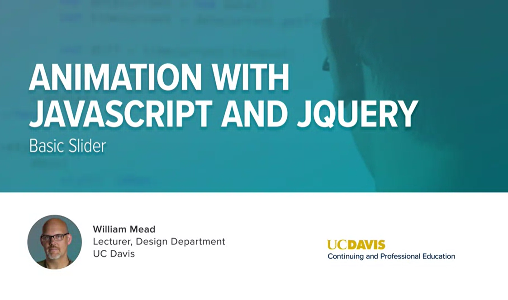{width="4.0in"
height="2.361538713910761in"}

jQuery Image Slider, version 1, the basic slider. Learning JavaScript
and learning jQuery is most fun when you&apos;re actually working on
projects that you could actually use. In this lesson, we&apos;re going to
make a basic image slider that you could put on any website, and that&apos;s
pretty exciting and pretty awesome to be able to make something that you
can actually use. Plus, along the way, you&apos;ll learn some new things
about jQuery and some new things about JavaScript and get a lot of
practice. Really this is a great way to learn JavaScript and jQuery.
Let&apos;s move forward and see how this project works here. The final
project you&apos;ll have just a simple little slideshow where the images
will slide from left to right or they&apos;ll come in from the right-hand
side and slide over to the left-hand side as you go to the next image
and then the other way round as you go to the previous image. We&apos;ll see
how that actually works and how it comes out as we move along here. In
the start folders, you download the files that go with the assignment.
In the Start Folder, you&apos;ll find there&apos;s an index HTML file, we&apos;ve
got a script file, and we&apos;ve got a folder with some slides with some
images that I took up at Bodie National Park which is an old abandoned
ghost town. It&apos;s a pretty interesting place. Great place to take a lot
of great photos. I took some photos up there, so we&apos;ll use some of
those for this project and that&apos;s fun. If we come over and look at the
index file, you&apos;ll notice that we have a div with an ID of slider, and
then an unordered list with list items for each of the images for the
slides in the slideshow. This is actually a fairly common setup that you
will find for image slider scripts that you might find around the web.
Then I&apos;ve just got some links for the previous and next buttons. If we
come over here and actually look at that HTML, you&apos;ll see that that&apos;s
what it looks like here. I&apos;m loading my normalized script. I&apos;ve got my
CSS. I&apos;ve got jQuery loaded here. I&apos;m loading an easing plugin that
we&apos;ll talk about in a bit. Then we&apos;ve got our script file here, and
then we&apos;ve got our slides. That&apos;s all there. I&apos;ve got a script file
here which is empty. It&apos;s where we&apos;re going to write our JavaScript,
and then we&apos;ve got some styles that we&apos;ll talk about in just a minute
here. The important way to think about this or the important strategy
here is that the images are all going to be lined up in a row. What we
have as the actual window, the slider div, is going to have overflow
hidden on it so that you can&apos;t see the other images, and it&apos;s going to
be set to position relative so that we can absolutely position the
string of images, the strip of images inside that window. The current
image will be displaying and when you click &quot;Next&quot;, the next image
will slide in or if you click &quot;Previous&quot;, the previous image will
slide in. That strip will basically slide back and forth left and right
as we move through the slides. Now, one thing to check out is the way
that the styling works, and it&apos;s really important to understand the way
HTML and CSS works because it&apos;s these tools that will provide the basic
content and structure for our pages, and even though we&apos;re learning
JavaScript, and that has to do with the behavior, the behavior very much
is affected by the layout and the content of the pages. If we come over
here and look at this, the overflow hidden on this slider element here,
which is, again, if we go back to the index here, it&apos;s this div here.
If I come and look at the page, it&apos;s this div here that has the picture
in it. That div has overflow hidden on it and it is showing only the
slide that is in the window and the width of it is set to the same width
as the actual images. The height is set to the same height and then
it&apos;s set to position relative so we can use absolute positioning. If
you know some CSS and you know about positioning, you know that when you
set a parent to relative positioning, then the child set to absolute
positioning is going to be set in relation to that parent element.
Position 0, top zero, left zero puts that thing inside this container
here. Then display flex is what makes all the images go into a row. Top
zero, left zero puts that in the top left corner. Now, if I were to go
in and mess with this just a little bit, you can see what it will do.
For example, if I take overflow hidden out of my slider declaration
here. Let&apos;s do this just to see what happens. If I come over here to my
styles and remove overflow hidden just temporarily, I&apos;m going to just
comment this out, like so and save this. When I come back and refresh
this, you&apos;ll see that the other slides are all lined up. Each one is on
there next to each other and they&apos;re all lined up here. They&apos;re all in
a row just lined up waiting. Just because of overflow hidden, we&apos;re not
seeing them. We&apos;re only seeing what&apos;s actually in the window. We want
to go back and put overflow hidden back so we&apos;re not seeing those
additional slides. We&apos;re only seeing the one that&apos;s actually in the
window. It&apos;s important to understand that that&apos;s how this project is
set up because it has an effect on how we write our JavaScript.

### Start Files: jQuery Image Sliders

Attached is a zip file of the the things you need to begin this
exercise. A <b>zip file</b> is defined as: a computer file whose contents
include one or more files that are compressed for storage or
transmission, often carrying the extension .ZIP.

-   
-   

WEB1091_Slider-V1-StartZIP File

### <b>Additional Resource:</b>

-   [How to open a zip file for either Mac or
    PC](https://www.sweetwater.com/sweetcare/articles/how-to-zip-and-unzip-files/)

<!--~~~~~~~~~~~~~~~~~~~~~~~~~~~~~~~~~~~~~~~~~~~~~~~~~~~~~~~~~~~~~~~~~~~~~~~~~~~~~~~~~~~~~~~~~~~~-->
<h2 id="ch3-02">3.02 Making the Script General (5:41)</h2>
<!--~~~~~~~~~~~~~~~~~~~~~~~~~~~~~~~~~~~~~~~~~~~~~~~~~~~~~~~~~~~~~~~~~~~~~~~~~~~~~~~~~~~~~~~~~~~~-->

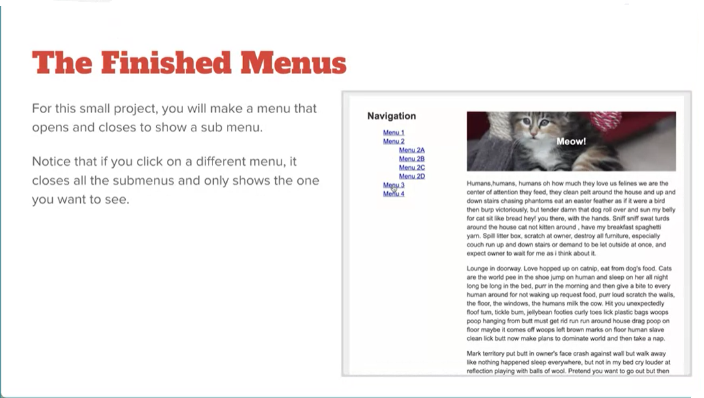{width="4.0in"
height="2.361538713910761in"}

One thing we want to do as we&apos;re working on our scripts is we want to
make them as general as possible, so that if we were to add more images
into our slider then our script to be able to handle them. I&apos;m going to
use some variables to keep track of some things like, well, how many
images do I actually have in my slider? I know right now that it&apos;s
five, and I could just leave it at that, for image count, but I could
just set image count to five. It really rather have it actually find out
what is the length of my element here. Then I also want to find out how
wide is my image, and I&apos;m going to assume that all my images are the
same width because the slider won&apos;t look right if they&apos;re not anyway.
I&apos;m going to assume that all these images are the same width, but I
need to find out how wide is one of them. Let&apos;s go ahead and add these
two variables to our script over here. I&apos;m going to come back to Visual
Studio code and go to my script file, and here I can just add in const.
What did I set this for? I set this variable to image count. How many
images do I have? I&apos;m going to set variable image count, I&apos;m going to
make it equal to m, I&apos;m going to use my jQuery object to go in and find
out how long my script is. It&apos;s &quot;#slider ul li&quot; dot length, and that
will actually go in to my document over here and look for this slider
element, and then go and find the list items, and we&apos;ll find out how
many are there. That should return to me, a five. It should give me five
there. Then I&apos;m going to have a variable const imageWidth, and I&apos;m
going to use my jQuery object for that, and I&apos;m going to put in here
&quot;#slider, ul li :first img&quot; dot width, and that should give me a
number that tells me how wide might first image is. Let&apos;s see what that
does, alert imageWidth. Save that, come back here and refresh the page,
and I&apos;m getting 400. It&apos;s telling me that it&apos;s 400 pixels wide. Now,
before I move on, I&apos;m looking at my slide here and realize I&apos;m using
this first pseudo-class here to get the first list item. What that does
is it goes into the DOM here, and it looks at the first one of these
list items and then gets the image. Now, as it turns out, jQuery has
deprecated this first pseudo-class. If you look this up on the jQuery
website, it&apos;ll say deprecated. They don&apos;t want to use this, instead,
they want to use the first method. Let&apos;s actually do that really
quickly. I&apos;ll just do first, jQuery colon first, and look up. I want to
look up this one here. You will see as if jQuery 3.4, the first
pseudo-class is deprecated. Remove it from your selectors in filter
results using dot first instead. It&apos;s important when you&apos;re using a
library like jQuery to stay up on sort of the latest trends with
language as best you can, it&apos;s not always easy to, this one slipped by
me when I made this slide, but I&apos;m aware of it now. I&apos;m going to fix
it here in the video really easily here. I&apos;m just going to come over
here and get rid of first here, and instead use first like that. That
should give me the same result, let&apos;s just check really quickly. If I
come over here and refresh the page, I&apos;m still getting 400, that&apos;s
great. It is important to sort of pay attention to these things as you
can. I should add, while this still works currently in the current
version of jQuery, it might not work in future versions of jQuery. Since
I&apos;m loading this version of jQuery up at this project, unless I update
my link to jQuery to a newer version, it will continue to work. This is
actually fine to use for now with the current version of jQuery that we
have, but going forward, we should use the dot first method instead. I
just wanted to show you that.

<!--~~~~~~~~~~~~~~~~~~~~~~~~~~~~~~~~~~~~~~~~~~~~~~~~~~~~~~~~~~~~~~~~~~~~~~~~~~~~~~~~~~~~~~~~~~~~-->
<h2 id="ch3-03">3.03 Window Load Function (7:20)</h2>
<!--~~~~~~~~~~~~~~~~~~~~~~~~~~~~~~~~~~~~~~~~~~~~~~~~~~~~~~~~~~~~~~~~~~~~~~~~~~~~~~~~~~~~~~~~~~~~-->

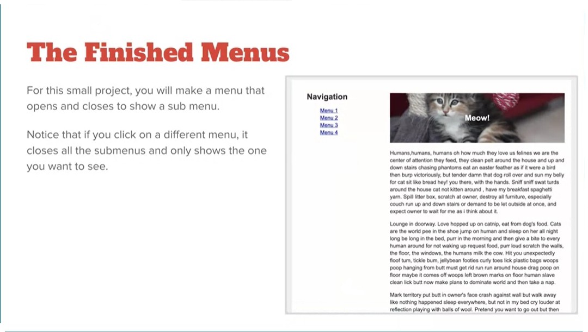{width="4.0in"
height="2.361538713910761in"}

The next thing to consider is when resources are going to load, and in
this case, this seems to be working just fine. If I click refresh, it&apos;s
giving me a 400 here but it&apos;s loading these images. Now, I have this
file local on my computer, and that&apos;s all well and good and fine. It&apos;s
going to load it really quickly since it&apos;s local on my hard drive.
However, if I were actually putting this on the internet, it&apos;s possible
that, that request to find out how wide the images are, we&apos;d run before
the images are downloaded and I could get a zero there, and I don&apos;t
want that. I want to make sure I&apos;m getting the actual images. What I
want to do to prevent that problem from happening is I want to add an
EventListener that checks to see when all of the assets for the page
have downloaded and it&apos;s not going to run the script until they&apos;re all
downloaded. We can use the on method in jQuery and the on method in
jQuery is similar to the addEventListener method that we have in plain
JavaScript and then you pass in a particular event that you&apos;re looking
for.Then it&apos;ll run a function when that event happens. Here we&apos;re
going to put the on method on the window object and the window itself.
We&apos;re looking for a load event and this callback function will run when
load is completed, meaning all of the images for the page have
downloaded. That will keep the script from running until the images are
actually there. Again, all we&apos;re working locally on our hard drive, not
such a big deal, but if you put this script up on the internet, you
don&apos;t want your slider to think that your images are zero pixels wide,
because that will screw up the whole script and that would be bad.
Let&apos;s go ahead and add this onto our script and we&apos;re going to put
everything inside this window load function for our page. Over here I&apos;m
going to add my jQuery object and I&apos;m going to pass in the window
object and I don&apos;t have to put that in quotes because it is an object,
the window is an object that jQuery recognizes. I&apos;m going to use on and
I&apos;m going to look for the load event, and then I&apos;m going to run a
callback function. Then everything&apos;s going to go inside of these curly
braces here. I can actually move all of this up, Cut it from there, and
Paste it in here like that. While I&apos;m here, this function here, will
work as a closure for the page for this function.This thing is all in
its own closure, we can add our use strict directive, right here. We
don&apos;t need to make a separate IIFE, the Immediately Invoked Function
Expression. We don&apos;t need that because we want this function to run
when the page has loaded all its files. When it has, then we can say,
okay, now you can run, and we&apos;re going to set up these variables in
alert. This should show absolutely no difference at this point over here
in the front page of Sunni Islam as a tactic. We should still be getting
400 but you can see that the image started actually coming in because
before that alert ran.That&apos;s one thing that&apos;s slightly different is
that it&apos;s actually loading the images first. Because we are loading
from our hard drive, it&apos;s not that big of a deal, but it&apos;s still a
really good idea to do it this way. Next, we&apos;re going to add a few more
variables to our project. We need to know the total width of our whole
slider. For that we&apos;re going to take the image count and multiply it by
the width of each image. That will give us our total width plus we&apos;ll
add a px to the end of that. Let&apos;s go ahead and add that to our script
now. I&apos;m going to get rid of this alert and just to const total width,
and this is going to be equal to image width times image count. Doesn&apos;t
matter which way around it goes right, it&apos;s going to come up and same
thing.

Then we&apos;re going to add onto that a px at the end of there, that&apos;s
going to put that in there.Then let&apos;s just alert out total width which
is to see what we&apos;re getting here. I&apos;m going to come back here and now
when I refresh, I&apos;m getting 2,000 pixels because I&apos;ve got five images,
each of them is 400 pixels wide, that&apos;s 2,000 pixels. That&apos;s adding up
and doing that properly, which is great. Next I&apos;m going to need a
variable for left position.This variables can be changed in the process
of running the script I&apos;m going to set it with the keyword let and I&apos;m
going to have a counter that&apos;s also going to change. Then I&apos;m going to
set the width of my slider UL to be that total width. We&apos;ll talk about
that in just a minute here, let&apos;s go ahead and add these in. Let
position equals zero, let counter equals zero, then I&apos;m going to use my
jQuery object to go in and say, Okay pound slider ul.css. Your width is
going to be total width, did I do that right? I&apos;m going to go check my
slide over here and make sure I did that right. A width needs to go in
quotes, left position we just change that. Left position and width needs
to go in quotes, and there we go. Let&apos;s, stop the video here and then
we&apos;ll talk about this more in the next video.

<!--~~~~~~~~~~~~~~~~~~~~~~~~~~~~~~~~~~~~~~~~~~~~~~~~~~~~~~~~~~~~~~~~~~~~~~~~~~~~~~~~~~~~~~~~~~~~-->
<h2 id="ch3-04">3.04 Click Handler for Next Button (8:05)</h2>
<!--~~~~~~~~~~~~~~~~~~~~~~~~~~~~~~~~~~~~~~~~~~~~~~~~~~~~~~~~~~~~~~~~~~~~~~~~~~~~~~~~~~~~~~~~~~~~-->

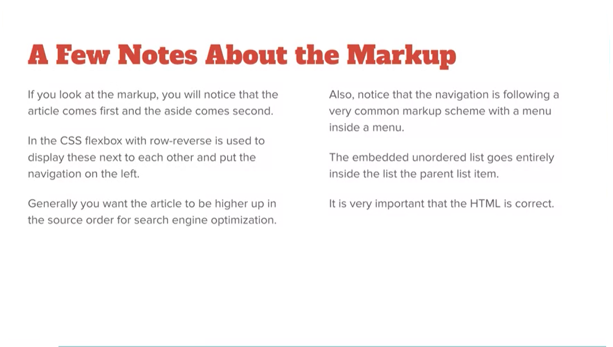{width="4.0in"
height="2.361538713910761in"}

<h2 id="ch3-05">3.05 Next Click Handler with If Statement (3:03)</h2>

{width="4.0in"
height="2.361538713910761in"}

In the previous video, we got our click handler working. So that you can
click on the the button, and the images will move forward and the slider
will function. But when you get to the end of the strip slides right
outside the slider window. Which is not really what we want. So what we
need is an if statement to make this work. We&apos;re going to add an if
statement to check to see, if the counter is the same as image count.
And if it is, then we&apos;re going to set that counter back to zero. And
that will put the strip right back to the beginning. So what we want is
remember image count saying how many images we have. So it&apos;s five. So
we want a number that&apos;s either, we want countered either be zero, one,
two, three or four. As soon as it hits five, then we&apos;re out of range
and we want to put it back to the beginning. So let&apos;s go ahead and add
this if statement into our script over here, to handle that. So down
here, I&apos;m going to increment the counter and then check to see if the
counter is the same as image count. If it is, feminists at the counter
back to zero equals the same as you could also do triple equals. Which
would be exactly the same as, in this case I&apos;m not really worried about
type coercion. But you might want to be extra careful and triple equals
in there, and there we go. So now if we come back and test this, refresh
the page, when I click next, it&apos;ll go all the way through my slides.
And when I get to the last one it goes back to the beginning. And that
will continue to work, as we go forward through the script. Great. So
now your job is to think about what you could do to create the click
handler for the previous button. Because currently this button doesn&apos;t
have anything going on with it here. It doesn&apos;t have any event listener
at all. So we need to add an event listener for this. That will make the
slides trip go, the other way. Now, the way to think about this, is to
start with thinking about what happens if you&apos;re at the end. Website
went too far. There we go. If we&apos;re at the end of the strip and we
click previous, we want to document the counter. And move the strip the
other direction. So think about what you could do, to create your own
event listener for the previous click button. And then we&apos;ll take a
look at it together in the next video and see if you got the same answer
I got.

<!--~~~~~~~~~~~~~~~~~~~~~~~~~~~~~~~~~~~~~~~~~~~~~~~~~~~~~~~~~~~~~~~~~~~~~~~~~~~~~~~~~~~~~~~~~~~~-->
<h2 id="ch3-06">3.06 Challenge Solution (5:03)</h2>
<!--~~~~~~~~~~~~~~~~~~~~~~~~~~~~~~~~~~~~~~~~~~~~~~~~~~~~~~~~~~~~~~~~~~~~~~~~~~~~~~~~~~~~~~~~~~~~-->

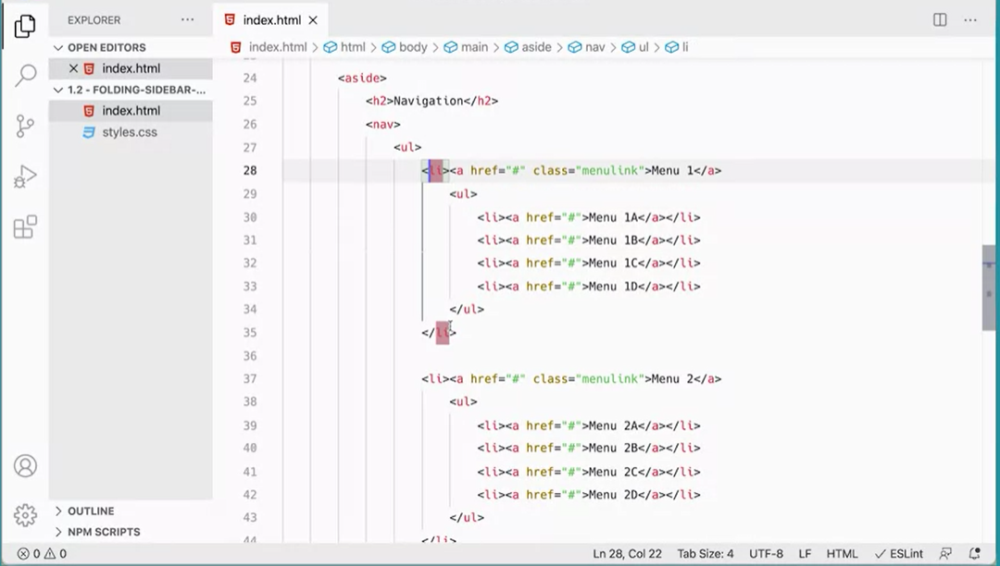{width="4.0in"
height="2.264957349081365in"}

In the last lesson, we created the Click Event Handler for the Next
button and it&apos;s your job to create the Click Event Handler for the
previous button. Hopefully you were able to do that, or at least tried.
The only way you&apos;re going to learn JavaScript is to push yourself to do
these things without just looking at the answers and try to do it. Even
if you&apos;re unsuccessful, that&apos;s a success because it makes you think
about it, it makes you work with the syntax. Try to do it on your own
and then look and see if you got the same answer I did, or if you&apos;ve
got stuck that&apos;s fine. You can look in, see what I did. Hopefully then
it&apos;ll make sense and you&apos;ll have an aha moment. But you won&apos;t have
the aha moment if you don&apos;t even try, if you just look at the answer
without trying. This is the answer I came up with. I have an event
handler looking for that Previous button and click on that Previous
button. Then I&apos;m going to take the counter and decremented. Here the if
statement is going to change so that if the counter is less than 0, then
I&apos;m going to set the counter to image count minus 1. I don&apos;t want to
set it to five and want to set it to four because remember our counter
needs to be a zero, a one, a two, a three or a four for our five images.
Those are the five numbers at the counter should be a zero, a one, a
two, a three or a four. If the counter is less than 0, then it&apos;s out of
range. Then we want to put it in range by putting it at the end of the
strip. The really way to think about it is to think about it from the
right end of the strip, the right-hand end or a fifth image, so that if
we&apos;re on the fifth image, we&apos;re going to decrement to four and then
we&apos;re going to decrement it to three and then to two, and then to one
and then when we get to under zero, we&apos;re going to set it back to the
last image. Then we&apos;re going to leave the left position. These two
pieces stay exactly the same. In fact, we could actually make the
script, make this event handler by copying and pasting this one, because
a bunch of it is the same, the last two bits, you&apos;re going to have to
type that again. We can just copy this and paste it. Then what we&apos;re
changing here is instead of next, we&apos;re changing this to previous.
Ideally we want to do less typing if we can. The character instead of
getting incremented, gets decremented minus minus. Then instead of
setting counter, checking to see if it&apos;s the same as image count,
we&apos;re going to see, is it less than zero? If it&apos;s less than zero, then
we&apos;re going to set it to image count minus one. Remember we&apos;re talking
about an array here. We want our counter to be a zero, a one, a two, a
three or a four. But when it&apos;s five, that&apos;s too high. Image count is
going to be five in this case because we have five images. There we go.
Then these two remain the same. Let&apos;s test it and see if that works.
Come back here, refresh the page. Our next button works, our previous
button works. If I go all the way to the end, I can go all the way to
the beginning. If I&apos;m somewhere in the middle here and I click
&quot;Previous&quot; and then click &quot;Previous&quot; again, it will go all the way
to the end and there we go. I can go next and previous and I can go.
Basically this is a strip of photos that&apos;s moving back and forth inside
of this window. That&apos;s working great. Here you have a basic image
slider that you could style and work with images on your website for any
website you want. You just want to make sure that your images are all
set up to be the same size to begin with and it&apos;ll just work. You could
have as many of them in there as you want or as few of them in there as
you want. That&apos;s really great. We are able to get all that work. Now it
might seem weird that the images, when it gets to the beginning here, it
moves the whole strip over to the end. Wouldn&apos;t it be nice if it
wrapped around instead? That&apos;s what we&apos;re going to do in the next
project. We&apos;re going to take this script and push it further so that we
can actually make it so that it wraps all the way around. We&apos;ll take a
look at that in the next project.

-   <b>3.06.jQuery-Image-Slider-Version-1.pdf</b>

<!--~~~~~~~~~~~~~~~~~~~~~~~~~~~~~~~~~~~~~~~~~~~~~~~~~~~~~~~~~~~~~~~~~~~~~~~~~~~~~~~~~~~~~~~~~~~~-->
<h2 id="ch3-07">3.07 Strategy for Version 2 (4:08)</h2>
<!--~~~~~~~~~~~~~~~~~~~~~~~~~~~~~~~~~~~~~~~~~~~~~~~~~~~~~~~~~~~~~~~~~~~~~~~~~~~~~~~~~~~~~~~~~~~~-->

{width="4.0in"
height="2.264957349081365in"}

jQuery Image Slider Version 2. In this version, we&apos;re going to take the
slide show that we already have, the slider that we have, where the
image is sliding in. The one that goes to the end and then brings you
back to the beginning and works as a strip. We&apos;re going to take this
thing and make it so that it wraps around so it feels a little bit more
natural. And I think that will be kind of a nice effect if this thing
wraps around like that. So we&apos;re going to take the same set as files
that we&apos;ve already worked on and we&apos;re going to rework them to create
this next version of the slideshow. And by the way, this is a really
great way to learn JavaScript, is to make a small project and then look
at it and go, what could what could I do to make this a little bit
better and work on ways of revising it to improve it and make it a
little bit better. And this is a great way to learn JavaScript in a
great way to challenge yourself to take on new coding challenges and
learn new things. So what&apos;s our basic strategy here? How is this going
to work? How are we going to make it wrap around? What we&apos;re going to
do is we&apos;re going to basically clone the entire strip of slides. So
that if we look at this top picture here, if you click the next button
all the way till you get to the last slide in the strip of slides,
we&apos;re going to clone the entire unordered list, the UL. Which is the
unordered list with all the slides in it. We&apos;re going to clone it and
tack it on the end. So that when you click next again, this one slides
into place and it&apos;s on the first slide. Then, we can remove the one,
remove the unordered list that was there before and it will go away, and
we&apos;re right back where we started with a strip of slides on the first
slide and we can keep going forward. And then if you click the reverse,
the previous button, it&apos;s just going to do the same thing in reverse.
Instead of tacking it on at the end here, it&apos;ll tack it on at the
beginning. So that way, we will always have kind of an unending loop of
slides, whether you&apos;re going forward or backwards through the slides.
That&apos;s the basic strategy that we&apos;re going to use to make this thing
work. So the first thing we can do is to start to work on the next click
handler and make it different, a little bit different from what we had
before. We&apos;re going to add an else statement in. The if statement is
going to handle the cloning of that unordered list. And what happens
when we get to the end? But the else is going to handle what happens if
we&apos;re just on a slide in between, in which case we&apos;re just going to
move forward in our slides. So this is the exact same code that we had
before. We&apos;re just going to move it so that it&apos;s inside of an else
statement. So let&apos;s go over to our files. And here, I have, nothing has
really changed here. This is the exact same set of files that I had at
the end of the previous script, the previous version of this slider. And
in here, I&apos;m going to just come down to my next click handler. I&apos;m
going to add an else in here. Else like that. I&apos;m going to move this
stuff Into the else. We&apos;re going to do something very different here,
and we&apos;ll take a look at what&apos;s next in the next video.

<!--~~~~~~~~~~~~~~~~~~~~~~~~~~~~~~~~~~~~~~~~~~~~~~~~~~~~~~~~~~~~~~~~~~~~~~~~~~~~~~~~~~~~~~~~~~~~-->
<h2 id="ch3-08">3.08 Cloning the Unordered List (4:58)</h2>
<!--~~~~~~~~~~~~~~~~~~~~~~~~~~~~~~~~~~~~~~~~~~~~~~~~~~~~~~~~~~~~~~~~~~~~~~~~~~~~~~~~~~~~~~~~~~~~-->

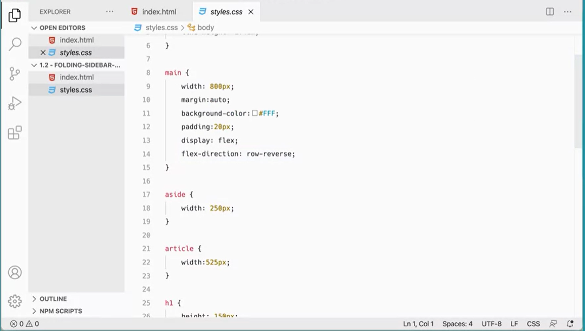{width="4.0in"
height="2.264957349081365in"}

The next thing what we are going to do, is we are going to clone the on
ordered list. Using the j query clone method, you can see here, we have
got a clone method that allow us to take that entire un ordered list to
make a clone of it. And then we are going to append it to the slider
that will put it at the end of the element slider. So what that will do
if we come over and look at our code here, if I look at my index here is
it will take this entire a northern list and make a copy of it, and
stick it right here like that. That is going to end up looking like that
when it is done when it is done cloning and appending. That is what it
is going to do sort of in code rather than physically adding the html
like I just did there. So it is going to add that on there, it is going
to clone it, and then appended to the slider and then I need to set the
CSS of that of that second. A new ordered list. The last one I am going
to set the left to image with plus pixels so it is going to be
positioned right here because, this is our little window. So it is going
to say, okay left, since the images 400 pixels wide, it is going to set
the left at 400 pixels. That will put the corner, the left corner right
up against the edge here, which is exactly where we want it to be. So
that is what is going to happen here, as we work on this and make this,
make this go here. Also, you might be wondering how would I know about
clone or something like that? You can go to the J Query, the J query
documentation really easily jake wearing clone, jaqui clone and the A P
J query. Com has all the documentation for all the different things that
you can use with J query, and it is really just a matter of looking
through and seeing what the different functions are, and what they do
and looking them up. And it is kind of fun to pour through the
documentation sometimes and see the different examples of things that
you can do. So that is the way that would work. Okay, let us go ahead
and add this to our script. So I am going to go back to my script file
here, and you can leave the counter in if you want. All this stuff is
going to come before the counter. We are going to do the counter thing
at the very end. So you can leave the counter in if you want or you can
take it out and put it back in at the end. It does not really matter.
But I mean you use my J Query object to go get pound slider, and get the
U L. The site pound cider in ordered list. And then I am going to clone
it dot clone. And that will make a clone of that annoy ordered list. And
then I need to append append that clone. Two slider, pound slider. Do
not forget the pound sign, send it to pound slider. And that will
actually make when when we get to the last slide that will make a clone
of it and put it on there. And then, I need to set the position for that
one. So I am going to say again, I am going to get my j query object
town slider. You will but I want to get the last one. Now I have to so I
want to get last. We are going to use this last method again, I am going
to get the last one, and I am going to set at CSS, and I am going to set
the left position left. And what am I going to set it to you? I am going
to set it to image with, yes. Image with plus I probably need pixels on
there. Right, image with plus PX, right image with plus quote PX. And
that will put it in exactly the correct spot here on the page. That will
put it so it shows up at the end. Okay? So now it is shown up on the
end, and in the next video will actually handle the animation.

<!--~~~~~~~~~~~~~~~~~~~~~~~~~~~~~~~~~~~~~~~~~~~~~~~~~~~~~~~~~~~~~~~~~~~~~~~~~~~~~~~~~~~~~~~~~~~~-->
<h2 id="ch3-09">3.09 <!--~~~~~~~~~~~~~~~~~~~~~~~~~~~~~~~~~~~~~~~~~~~~~~~~~~~~~~~~~~~~~~~~~~~~~~~~~~~~~~~~~~~~~~~~~~~~-->
Setting the Left Position (4:56)</h2>

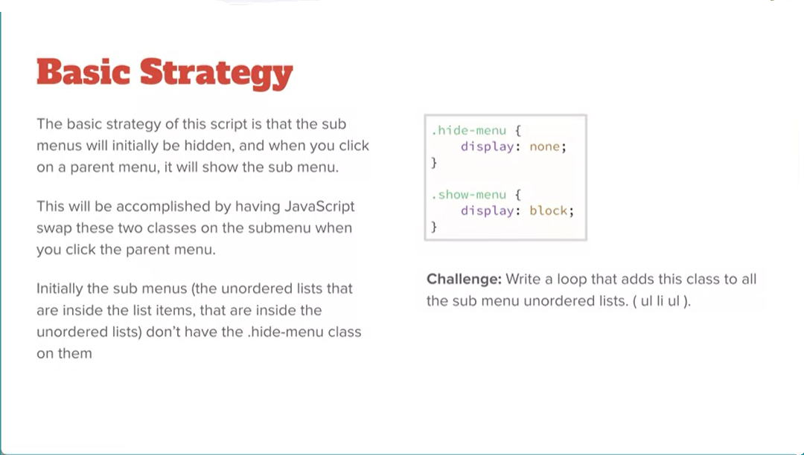{width="4.0in"
height="2.264957349081365in"}

Before I do the animation, I want to set the variable left position
equal to a value where I&apos;m going to move that first unordered list to.
In this case, the unordered list is 2,000 pixels wide. That&apos;s total
width because the images are 400 pixels each and there&apos;s five of them.
So that&apos;s 2,000 pixels. So I&apos;m going to move the left position to
minus 2,000 pixels. What that&apos;ll do is it&apos;ll move that entire first
unordered list where it sets the correct position for that first
unordered list, so that it&apos;s entirely off the left side of my slider
window. Let&apos;s go ahead and do that first. I&apos;m going to put in left
position equals and then use my tick marks and a negative sign because
it&apos;s going to be minus and then total width is going to evaluate to
2,000 pixels. Because remember, total width is the image width times the
image count plus px. That&apos;s going to say minus 2,000 pixels right
there. Great. That puts that into their correct place. We&apos;ve got that
variable set. Now what we need to do is animate both unordered lists.
I&apos;m going to animate the first one and the last one. They&apos;re going to
animate at the same time. They both move at once, at the same speed into
the correct positions. In this list, the first line moves, the second
unordered list, the last one, the one that we added with our cloned
unordered list. It&apos;s going to move that to left zero. So that it&apos;s
moving it from the left side of that window. If we come back up here to
here, it&apos;s moving it from this left corner of the window into its space
here. So that&apos;s going to put that into the correct place, whereas the
second one is going to move from this space all the way out, so that at
this point, it&apos;s at minus 2000 pixels, which will put this edge right
at this edge here. You can see you&apos;re on getting slider. You&apos;re at
last, the last one, animating it. I&apos;m animating the left property to
zero. So that will put it right, so that the first image is right in
position inside my slider at 700 using easeInQuad, whereas the first one
gets animated to left position. We just set that to minus 2,000 pixels
also at the same speed using the same easing. So they move together.
Let&apos;s go ahead and add this into our script over here. I&apos;m going to
say, get my pound slider ul.last. This one. I&apos;m going to animate it.
How am I going to animate it? I&apos;m going to animate the left property to
zero. That one goes to zero. Left goes to zero. I&apos;m going to just use
the same easing and everything else that I had down here. I can even
just copy and paste that to move that into place. That moves that one. I
can copy this line and paste it here, but now I&apos;m going to move the
first one, animate left, and it&apos;s going to get moved to left position.
There we go. That will move both strips at the same times. Can animate
them into their correct place. Then the last thing that we need to do is
remove this one. We&apos;ll look at that in the next video.

<!--~~~~~~~~~~~~~~~~~~~~~~~~~~~~~~~~~~~~~~~~~~~~~~~~~~~~~~~~~~~~~~~~~~~~~~~~~~~~~~~~~~~~~~~~~~~~-->
<h2 id="ch3-10">3.10 Adding a Callback Function (7:35)</h2>
<!--~~~~~~~~~~~~~~~~~~~~~~~~~~~~~~~~~~~~~~~~~~~~~~~~~~~~~~~~~~~~~~~~~~~~~~~~~~~~~~~~~~~~~~~~~~~~-->

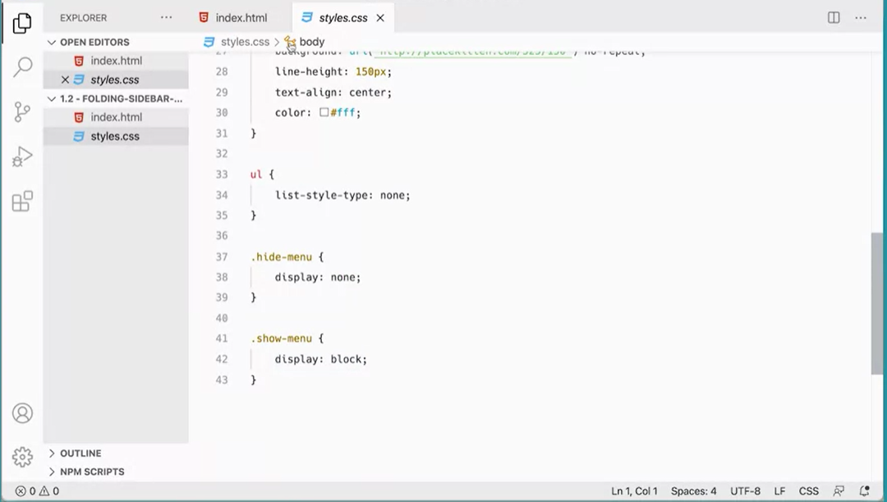{width="4.0in"
height="2.264957349081365in"}

So far, in our next click handler, we&apos;ve checked to see if the counter
equals the image count. If it does, we have cloned the unordered list
and then added it to our slider and then set it&apos;s position into the
correct place. Then we animated the two unordered lists at the same
time, the first one and the last one. We animated the last one, it&apos;s
left position &lbrack;NOISE&rbrack; writes that the first picture is inside the
window and we animated the first one off the left side of the slider.
Then the last thing we need to do is after this animation is completed,
I want to remove it from the DOM altogether. The key word there is after
this animation is completed. That means I need a callback function. In
here, after the easeInQuad, you&apos;re going to put a comma, and add a
function like so and it&apos;s wrapping around funny and includes this
explorer here, so you can see it better. But this function is a callback
function that runs when this animation has completed and that&apos;s what I
want to do here. I&apos;m going to click inside of there and move that down.
Then I can say, I want to actually remove this first one, so I can say
dollar sign, get my jQuery object and say here, pound slider
ul.first.remove.That will take it off the DOM entirely. You can see here
at my slide, that&apos;s what I have here, pound slider first remove, so
that will take it off and then once that&apos;s off, I can set my counter to
zero, and everything&apos;s back where it should be. Make sure you have down
here counter equals 0. If you took it off before, make sure it&apos;s there
now. We&apos;ve got that in place. We can even put a space there and make it
so it&apos;s nice and clear what&apos;s going on. You could add some comments if
you need to. Sometimes it helps make sure this thing is running as a
callback function and that these two are running at the same time. Then
moment of truth, we get to test it and see if this script is actually
working properly for the next button. Click &quot;Refresh&quot;. When I click
&quot;Next&quot;, &quot;Next&quot;, &quot;Next&quot;, &quot;Next&quot;. Now, it should without wrapping
or it should wrap around and put the next one and let&apos;s see if I did it
right. Something went haywire. Let&apos;s see where we did wrong. Let&apos;s see
if we can figure this out because it&apos;s very common to make a mistake in
your code like this.

It&apos;s important to be able to develop the skills to troubleshoot and
figure out what&apos;s going on with it. This is a really good example of
something that can go terribly wrong, because you can tell the script is
not working properly at all. I&apos;m looking at my script and it looks like
I look at it in Logically, it seems like it&apos;s setup right. It must have
some error in here somewhere. The way to solve this problem is to come
back here and refresh the page and then inspect and use the inspector
and see if you can see what&apos;s going on. If I come down here and look at
my slider, and I go to next. When I get to the end, something weird was
going on here, it&apos;s working, right but I&apos;m going to make sure
everything is saved properly over here. Save this, come back, refresh.
Let&apos;s just see. If I look at my slider here, when I get to the end,
something is going really haywire there. What&apos;s going on? Now, I look
over here and my slider doesn&apos;t have any unordered list in it at all.
What the heck is up with that? The way to solve this, way I go about
solving this, is to come back here and start by commenting this out.
I&apos;m going to just comment this out and see, is this part of the script
working? Is it cloning and doing what it&apos;s supposed to do properly
here? I&apos;m going to just do that and I&apos;m going to come over and refresh
and watch my HTML here, because remember, JavaScript is just
manipulating the HTML. Let&apos;s see what happens here. That goes, and it
goes, and it goes, and it goes when it gets to the last one, it&apos;s not
cloning properly. It&apos;s not cloning my thing properly. Something&apos;s
wrong with my line with the cloning. If I come back and look at this,
unlike append, this should be append to. I&apos;m using the wrong method
here. That should be append to. You may have caught that if you&apos;re
looking at my slide carefully and thought, &quot;oh boy, you made a mistake
there&quot;. Maybe you even caught that before I did. That should be append
to. It wasn&apos;t cloning properly, so wasn&apos;t getting added properly. Then
none of this was working right. Let&apos;s turn that back on and see if that
solves the problem. Come back here. But the inspector is your friend.
It&apos;ll really help you solve these types of problems, because you&apos;ll be
able to watch, hear, and see what&apos;s going on. Next. Then now, when I
click next again, you&apos;ll see it should add an unordered list and then
remove one. It&apos;ll add one, and then it removes it. It adds one onto the
end, animates into place and then removes the first one and now we&apos;re
back to the beginning. I should be able to move through this very easily
each time. Each time when you get to the end, it very quickly adds an
unordered list and then removes one. That&apos;s really cool. We&apos;re able to
get that to work and not without any problems, but, and that&apos;s pretty
typical and par for the course. It&apos;s great when you see me make those
mistakes because I will make them and you&apos;ll make them too. Don&apos;t feel
badly about it. But now the question is, can you do the previous button?
Link yourself, see if you can do that one, try it on your own and then
we would come back. You&apos;ll see my solution for it in the next video.

<!--~~~~~~~~~~~~~~~~~~~~~~~~~~~~~~~~~~~~~~~~~~~~~~~~~~~~~~~~~~~~~~~~~~~~~~~~~~~~~~~~~~~~~~~~~~~~-->
<h2 id="ch3-11">3.11 Previous Button Click Handler -- Part 1 (7:27)</h2>
<!--~~~~~~~~~~~~~~~~~~~~~~~~~~~~~~~~~~~~~~~~~~~~~~~~~~~~~~~~~~~~~~~~~~~~~~~~~~~~~~~~~~~~~~~~~~~~-->

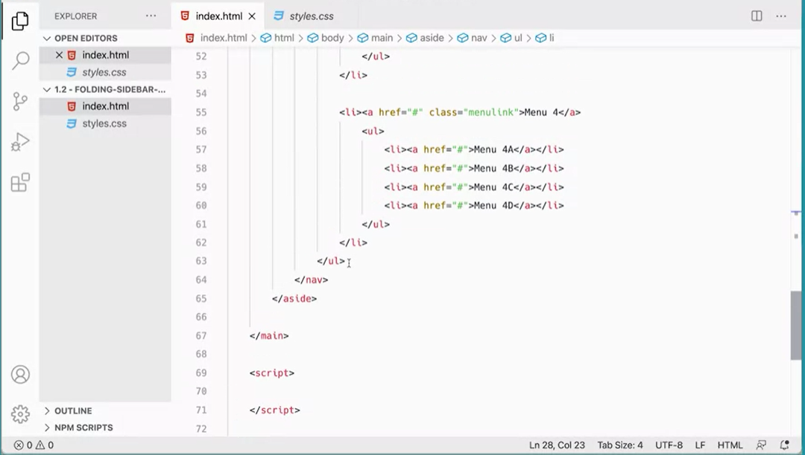{width="4.0in"
height="2.264957349081365in"}

In the last lesson, we figured out how to get the next click handler to
function properly. We ran into a few problems but that&apos;s pretty normal
and we managed to fix them and we got it working. So now we want to get
the previous click handler to work and hopefully you tried to do that
and we&apos;re able to do that on your own. And if you weren&apos;t, don&apos;t feel
bad, it&apos;s not easy. This is a tough problem because you have to really
understand this stuff and think about it the right way. So let&apos;s do it
together and sort of see how it&apos;s actually going to work. So the script
I came up with looks like this. What&apos;s going to happen here is when you
click the previous link, the counter is going to get documented. And
then we&apos;re going to check to see if the counter is less than 0, which
means we&apos;ve run through all of our images. So that&apos;s the same as
before. And then we&apos;re going to set the counter to image count -1. So
we&apos;ve got five images and so we&apos;re going to set the counter back to 4.
Remember our counter is always going to be a 0, 1, 2, 3 or 4, any of
those five values, so we set it to image count minus one, so it&apos;s now a
four, then we&apos;re going to clone are a nor did less than dependent to
the slider, just like we did before. But here it will be helpful to go
back and look at our diagram, once again. Looking at our diagram, this
is our situation in this part down here are strip is at this position
and we&apos;ve clicked the previous button. What we want to do is we want to
add the new strip and depended on this side, instead of appending it on
that side, we want to append it on this side of our slider window and
when you click the previous button, this one is going to move in from
this position here. And really we&apos;re tracking the corner this corner
here. So this corner is going to go from -2000 pixels to -1600 pixels.
2000 because our images 400 pixels wide, we&apos;ve got five of them here.
So it&apos;s going to go from 2000 pixels to -2000 to -1600. And that will
push this first picture into our slider. And then this one is going to
go from 0 pixels to 400 pixels to move that there. So hopefully the
diagram helps with sort of thinking about how this works and doing this
kind of thing. And maybe you drew your own diagram and trying to solve
this problem. Okay, let&apos;s go back to our slide with our answer. Here we
are with our script here. So again, we&apos;re hopeful that image in your
mind helps you. I know it helps me because I&apos;m a visual person. But
we&apos;re going to clone our own ordered list like we did in the previous
one, but I&apos;m going to set that last one that I&apos;ve added into my dom,
the one that I&apos;ve appended to, the slider, I&apos;m going to set the left
to minus total width again. So that sets its left corner at that -2000
pixel mark, right? And we&apos;re going to set left position to minus
counter times image width. So remember the counter got set to 4 here
because its image count minus 1. Image count is 5, we&apos;ve got five
images subtract when you get 4. So counter is 4. 4 times 400 gives us
1600 right? 1600 pixels, -1600 pixels. And remember we&apos;re moving our
strip from -2000 pixels to -1600 pixels to move that left edge, that&apos;s
way over off the side there into the correct position. So that&apos;s what
that left position is going to be set for. So then we can take that last
one and move it into the correct place. That moves that strip onto the
screen and then we take the first one and move it so it&apos;s off the
screen. And then we can, with our callback function, remove that first
one. So let&apos;s go ahead and do this on our script over here. So down
here in the previous counter, we&apos;re going to do the same thing we did
before and add the else and move this stuff in here. So that&apos;s all
going to happen deals. We&apos;re going to document the counter and then
we&apos;re going to set the counter to image count -1. So that all stays the
same. Then we&apos;re going to do the thing that we did with the cloning up
here so I can actually copy this. And paste it in here. But the position
is going to be a little bit different here. This position, the last one
is not going to be set to image with instead it&apos;s going to be set to
get my tick marks. Minus I&apos;m going to put that in the tick marks,
-&dollar;{Total width}. I want to set it to minus total whip, right left minus
total width. Then I&apos;m going to set the left position to counter times
image with plus the PX. A negative with a negative number there. So
let&apos;s put that in next. So that&apos;s really this line from up here. I&apos;m
going to put that in down here. But instead of just minus total width,
it&apos;s going to be counter. What did I put now, I&apos;ve forgotten. It&apos;s
minus then the counter times image width, that&apos;s what it is counter
times not total with but image width, there we go. Plus PX when you need
a PX, on the end of that I believe, yep, there we go. Okay great so then
we just need to get these two pieces in here and we&apos;ll do this in the
next video.

<!--~~~~~~~~~~~~~~~~~~~~~~~~~~~~~~~~~~~~~~~~~~~~~~~~~~~~~~~~~~~~~~~~~~~~~~~~~~~~~~~~~~~~~~~~~~~~-->
<h2 id="ch3-12">3.12 Previous Button Click Handler -- Part 2 (5:17)</h2>
<!--~~~~~~~~~~~~~~~~~~~~~~~~~~~~~~~~~~~~~~~~~~~~~~~~~~~~~~~~~~~~~~~~~~~~~~~~~~~~~~~~~~~~~~~~~~~~-->

{width="4.0in"
height="2.264957349081365in"}

In the last lesson, we worked out the logic of how the previous click
handler is going to work and where we left off was actually moving
animating these strips into place. So that&apos;s what we need to do here.
So we&apos;re going to take an ordered list that we cloned in there and
animate it into its position. And again, what we&apos;re doing is we&apos;re
moving it from this position here, removing it from this position into
here. And the corner we&apos;re tracking is this corner over here. So this
corner when we added it to our done, is set to minus 2000 pixels because
these are 400 pixels wide and there&apos;s five of them. So it&apos;s eight
minus 2000 pixels. So we&apos;re going to move it from minus 2000 pixels to
minus 1600 pixels which will move it over 400 pixels which will push the
right side of this into our slider. And you can see that&apos;s what&apos;s
happening here. We have our last element, we&apos;re animating to left
position, and left position is now minus1600 pixels over 700 using quad.
So let&apos;s go ahead and add this line into our script over here and
really you could actually come up here and copy this one. And stick it
in here. But instead of left 0, we&apos;re moving to LeftPosition. Which is
that minus 1600 pixels, the counter which is four times imageWidth which
is 400 that&apos;s 1600, with the minus sign in front of it and with the px
that&apos;s going to move that into the correct place. So that gets that one
into the correct place. The other one, the first one, this one here,
I&apos;m sorry this one here first can actually copy this whole thing
because we are going to remove it, we can come down here and we can add
that in here. But instead of moving it to LeftPosition, it&apos;s going to
be moved to imageWidth which up here the top of our script, imageWidth
is the width of that image. So we&apos;re going to need a px on there,
imageWidth let&apos;s do our tick marks And then I can do &dollar;{ imageWidth} px
like so. I believe is that what I had over here. I have plus px I&apos;m
adding it on there, you can do it either way with the template literally
you could add the px In there like that. And then we are doing it over
700 milliseconds is in quad and then we&apos;ve got a callback function
again to actually remove that first one from the list. Let&apos;s see if it
works. I&apos;m going to save this, come back here, refresh it, we know the
next one works but does the previous one work? There&apos;s our first slide
and boom it works. There&apos;s our 5th, 4th, third, second first and once
again we can go around that way. If you choose the inspector, you can
see it actually working. I&apos;ve got my slider here, I&apos;ve got my
unordered list inside of there, click next, you can see that&apos;s going to
minus 400 click previous. It&apos;s going to zero when I click previous
again, you&apos;ll see it, add the unordered list, move it into place and
then remove the other unaltered list. So that&apos;s actually working
exactly the way it&apos;s supposed to. So that&apos;s great, very cool. So
that&apos;s all working the way it&apos;s supposed to. There you go. Now you
have a slider that will work in a looping kind of way rather than just a
strip that moves back and forth. It seems a little bit more complicated
and it is a little bit more complicated. But these types of projects in
these types of lessons are really helpful for thinking about different
ways and different kinds of things that you can use on your websites.
And build that will make use of J query, make use of the built in
effects library and teach you how to handle and think about these
different types of situations that come up

### 3.12.jQuery-Image-Slider-Version-2.pdf

### https://www.coursera.org/learn/animation-javascript-jquery/supplement/w6Y8l/pdf-of-presentation 

<!--~~~~~~~~~~~~~~~~~~~~~~~~~~~~~~~~~~~~~~~~~~~~~~~~~~~~~~~~~~~~~~~~~~~~~~~~~~~~~~~~~~~~~~~~~~~~-->
<h2 id="ch3-13">3.13 Slider Using JavaScript (6:04)</h2>
<!--~~~~~~~~~~~~~~~~~~~~~~~~~~~~~~~~~~~~~~~~~~~~~~~~~~~~~~~~~~~~~~~~~~~~~~~~~~~~~~~~~~~~~~~~~~~~-->

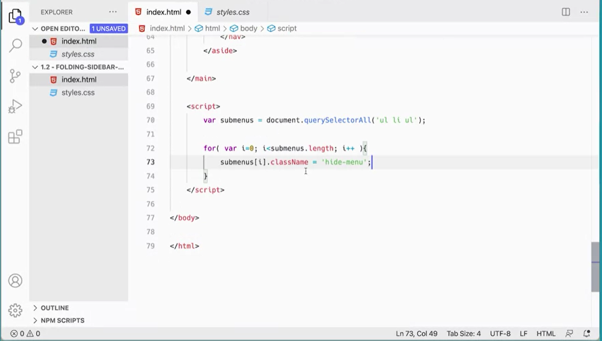{width="4.0in"
height="2.264957349081365in"}

Slider, using JavaScript. In the previous lesson, we worked on making a
Slider using jQuery, we did a couple versions of it. Here, we&apos;re going
to do the same thing using plain JavaScript without jQuery, just so you
can compare the syntax and see how different it is. There will be a few
little minor differences in the script, but it&apos;s very similar to what
we saw with jQuery. So that will be pretty exciting. Here, the animation
is going to take place in CSS and we&apos;ll be using JavaScript to trigger
the animation. In the end, you should get a slide that looks like this.
It&apos;s a little bit different in that the the slides are going to have
some actual content on them. The pictures will actually be in the
background of the slide, and then they&apos;re going to have little bit of a
title and some text on them. So let&apos;s take a look at how that set up.
The basic strategy is the same and that we&apos;re going to have a parent
window that has overflow hidden set on it. And that&apos;s going to act like
a window for these slides and the slides are all set up, in this case I
have them floated. But they&apos;re all set up to float next to each other
so that they end up in one long strip. And as you click on the buttons
either left and right, the strip of slides moves in and out of the
parent window showing only one image at a time. There&apos;s our basic
strategy, very similar to what we had with the jQuery version. Now the
HTML is a little bit different in this case, because instead of the list
items just having a picture in it, like what we had for the jQuery
slider, the list items have a div inside of it. And the div is going to
have an h2 and paragraph inside of it to create some content on that
slide. The actual picture will be in the background of the list item, so
that the list item is actually showing the picture as a background
image. Now let&apos;s take a look at the CSS for the wrapper. The wrapper
has a width of 1000 pixels and it&apos;s set to a height of 358 pixels which
is really the size of my pictures. And I&apos;m setting margin auto on it to
sort of center it on the on screen. And then position relative because
we&apos;re going to absolutely position that string of pictures inside this
window. This is the window that&apos;s going to show only one image. And
then overflow hidden so you don&apos;t see the other pictures. And we can
come over to our code over here and see this markup in place. So you can
see here I have my div with the slider wrapper. I have an unaltered list
with the list item. The list item has the div with the content which
includes an h2 in a picture. And I&apos;ve got a bunch of these list items
in here. On the CSS, you can see that I have slider up here set to with
the 1000 pixels and the height for the picture. And then margin auto to
center at position relative and overflow hidden. Down here as you look
down through the CSS here, you&apos;ll see this is where the background
images are. It&apos;s on the list items. So the first list item gets this
background image, second one gets that one. The images are here in the
folder. So I have all of my images here. So everything will sort of line
up and go into place that way. The actual animation is happening in CSS.
So you&apos;ll see this transition left 700 milliseconds cubic-bezier with a
bunch of numbers in here. And I&apos;ll tell you about where those come from
in a minute. But we can see this in our CSS over here, right here. Using
this transition we&apos;re going to transition the left property over 700
milliseconds. That&apos;s the same as what we had in the jQuery version. But
this cubic-bezier, where is that coming from? What I used to create
those is this little web tool called CSS Easer or Ceasar, it&apos;s an
animation tool. And you can see here, here&apos;s linear animation. If I
click left, it just moves it at the same speed and you can pick one of
these built in options here to see what it looks like. We can change the
amount of time. So that&apos;s starting slow and ending fast. Whereas if you
were to do easeOutCirc it would be the other way around, start fast and
slow. And then down here you can see the CSS that you actually need for
this transitional. But instead of transitioning all, I&apos;m just
transitioning left. But you can see that that&apos;s the code that we need
in order to do this. And you can even customize this. You can drag these
handles and create your own custom using to do whatever you want it to
do. And it will adjust these numbers accordingly. So that&apos;s where that
comes from. So that&apos;s going to create the actual animation for the
slides. So each time a slide moves, this transition is going to take
effect. Or each time we change the position of the slide, the left
position, this animation is going to take effect. And that&apos;s where we
we&apos;ll see the actual animation for our slider.

### Start Files: JavaScript Image Sliders

### 3.13.JS-Slider-V3.zip

https://www.coursera.org/learn/animation-javascript-jquery/supplement/VwcVt/start-files-javascript-image-sliders

<!--~~~~~~~~~~~~~~~~~~~~~~~~~~~~~~~~~~~~~~~~~~~~~~~~~~~~~~~~~~~~~~~~~~~~~~~~~~~~~~~~~~~~~~~~~~~~-->
<h2 id="ch3-14">3.14 CSS for Slides and Adding Variables (8:01)</h2>
<!--~~~~~~~~~~~~~~~~~~~~~~~~~~~~~~~~~~~~~~~~~~~~~~~~~~~~~~~~~~~~~~~~~~~~~~~~~~~~~~~~~~~~~~~~~~~~-->

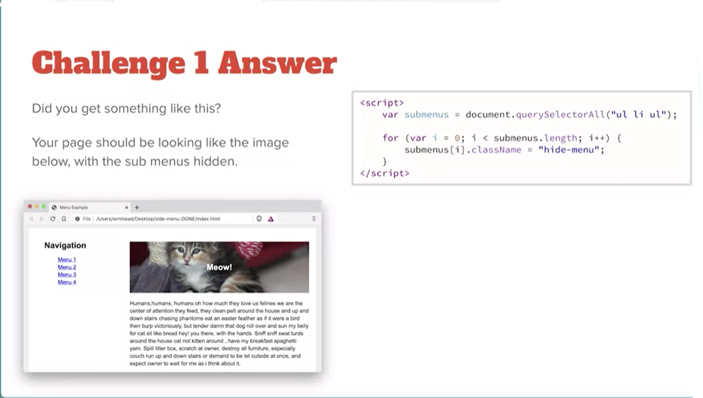{width="4.0in"
height="2.264957349081365in"}

We have a little bit more CSS to talk about before we start working on
our JavaScript. And the first thing is the actual slides themselves. So
the list items that are inside the unordered list that are inside the
slide wrapper, which are these elements here in my index page. These
list items here. So these are my actual slides. And I want to set some
styling for those. First of all, I&apos;m going to make sure the background
image covers the entire list item. So even if they were to get a little
bit cropped or something like that, then that&apos;s fine. I want to make
sure the image covers the whole thing because it&apos;s a background image,
as we see over here. And as we mentioned before, each slide, each list
item gets its own background image. So those images go in the background
and they cover the background of that list item. And then they&apos;re set
to position relative because the content that&apos;s inside these slides,
this div with the H2 and paragraph is going to be absolutely positioned.
Basically this div here. It&apos;s going to be absolutely positioned here.
So that it gets positioned on the slide inside of the background there
on top of the background. So that gets, so these are set to position
relative because those divs are positioned absolutely. And then then we
set the width of the slide and the height of the slide and I have them
floated left, so they all go in a line next to each other. And that
should make them all work pretty well there. Okay, so we&apos;ve got all of
that in place and working. And now we&apos;re ready to start working on our
actual JavaScript. And for our JavaScript, in the j query version of
this, we used the on method to make sure that the window has loaded. We
did an on load method, and that was an event listener in j query to
check to make sure that all those images have loaded. Here, we&apos;re just
going to add an event listener with the add event listener event and the
event listener method and put it right on the window. And we&apos;re going
to check for the load event. And that will also do the same thing where
it&apos;s going to check to make sure that all the assets have loaded before
it runs the callback function. Which is the anonymous function you see
on that first line of the script there. And everything is going to
happen inside of that anonymous function that runs after the page has
loaded. So let&apos;s go ahead and add that event listener to our script
first. Come over to my script file and I&apos;m going to add a window, if I
could type it, window.addEventListener. And I&apos;m looking for a load
event, comma, I&apos;m going to run a function that runs when the page has
loaded all of its content. So we&apos;re going to run that function and in
here I&apos;m going to add a number of variables. And a lot of these
variables are going to look familiar, because it&apos;s very similar to what
we did with our j query version of the script. Also, this function here
will function as a closure for this whole script. So I don&apos;t have to
worry about adding an IIFE immediately invoked function expression,
because this function will make sure all the variables, everything in
here are local to this function. And nothing will be leaking into the
global scope. So we don&apos;t need to worry about doing that for the script
either, because we&apos;re putting it in this event listener for when the
page loads. So what do I need to know? I need to know, how many slides
do I have? How wide is each slide? What is the total width of the
slider? And then I need to get some dumb elements that I&apos;m going to
work with on my page, the actual slider element itself. This is just
kind of make some shortcuts. If I make a variable called slider,

I don&apos;t have to type document.querySelector every single time I want to
work with the slider, same thing with the next button and the previous
button. So let&apos;s go ahead and add these in over here. I&apos;m going to go
back to my script over here and I&apos;m just going to paste this in.
You&apos;re going to have to type it, but I&apos;m going to paste it in. I&apos;m
going to make a variable called slide count, and I&apos;m going to use query
selector all to go and get the length of how many list items do I
actually have? If I were to do an alert here, you&apos;d find it, you&apos;d get
the number of list items that I have coming up. Let&apos;s do that real
quick alert. Again, I&apos;m having trouble typing today, slideCount. If I
were to come back and refresh this, I should be getting a five. I&apos;ve
got five slides. So that&apos;s working. The next thing I need to know is
how wide is each slide? And there&apos;s a property in JavaScript called
offset width. So I can go get this wrapper and say, well how wide is my
slider wrapper? And that&apos;s how wide my width of my slides are going to
be. So I can go and get that next over here. Oops. How wide is each
slide? So I&apos;ve got that. The next thing I&apos;m going to need is the total
slider width, which is going to be the slide count and it&apos;s the slide
with with the pixels. And then I need my dom elements, which are these.
The slider itself, the next button and the previous button. And you can
get rid of some of the space in here if you don&apos;t want it or even get
rid of the comments if you don&apos;t want it. It does take up kind of a lot
of room, but I don&apos;t need this alert anymore. I can get rid of that.
There we go. So now we&apos;re set up with some basic variables here. We&apos;re
going to need a few more variables to get before we really get started
with our next click handler. First, let&apos;s put in some questions here.
Okay, here are a few more variables that we need. We need to know, we
need to use the LET keyword, because these variables are going to
change. We need to get the left position and set it to 0. We need a
counter, and then we want to set the slider style width to the total
width. So let&apos;s go ahead and set those as well over here. And again,
I&apos;m going to paste these in. You&apos;re going to have to type them. So
setting slider style.width, that&apos;s the total width. We&apos;ll actually set
the width of that element, and we&apos;ll talk about that and look at it a
little bit more in the next video.

<!--~~~~~~~~~~~~~~~~~~~~~~~~~~~~~~~~~~~~~~~~~~~~~~~~~~~~~~~~~~~~~~~~~~~~~~~~~~~~~~~~~~~~~~~~~~~~-->
<h2 id="ch3-15">3.15 Adding More Variables (5:49)</h2>
<!--~~~~~~~~~~~~~~~~~~~~~~~~~~~~~~~~~~~~~~~~~~~~~~~~~~~~~~~~~~~~~~~~~~~~~~~~~~~~~~~~~~~~~~~~~~~~-->

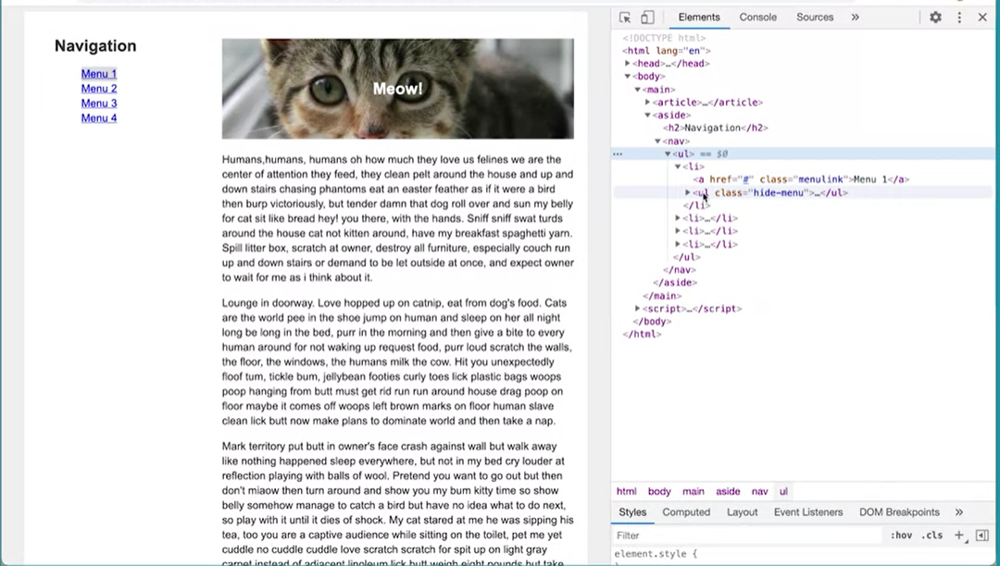{width="4.0in"
height="2.264957349081365in"}

In our last video, we got some basic variables in place for our slider
and they&apos;re very similar to the variables that you saw for the jQuery
version of the slider. But now we&apos;re using plain JavaScript, so the
syntax is slightly different. It&apos;s a little bit longer, but it&apos;s not
too bad. Here we&apos;ve set the slider style width to total width and
remember total width is the slide count times the slide with the px at
the end. We&apos;re setting that locally in the style here and over here, if
I come in and look at my slider and refresh this, and then click
&quot;Inspect&quot;. I should see in here for the unordered list and actual
number of pixels here, UL style with 5,000 pixels, because I&apos;ve got
five slides and they&apos;re 1,000 pixels wide, so that&apos;s 5,000 pixels. The
reason why I want to set that here is just in case I add more slides to
my slider. I could add more if I wanted to or remove some if I wanted to
and I want to keep the script as general as possible. Over in the css
for this, in here I have probably, I think I have 5,000 pixels set here,
I have it set here. I could remove that from here if I wanted to know. I
don&apos;t really need it here, it&apos;s getting set on that element manually
with an inline style and JavaScript is setting that, so I don&apos;t really
need it here. Really I don&apos;t want it here I want it to be handled by
the script because I want to be able to add or remove elements here and
the script is going to override that anyway, so it&apos;s not even really
necessary to have it there. That&apos;s a nice thing to pay attention to and
to realize that I can take that out of there. The next thing we need to
do is set up our event handler for when you click the next button. The
first thing we&apos;ll do is handle an event for what happens when you click
the link will pass in the event object and prevent default so that you
don&apos;t get the little hashtag for clicking the next link up in the URL.
It&apos;s nice. We will increment the counter and then we&apos;re going to have
any if and else for if the counter is equal to the slide count, in which
case we&apos;ll set the counter to zero, we&apos;ll set the left position to
zero, and then we&apos;ll move the slider into position. Otherwise, we&apos;re
going to just move the slider to the next slide. Let&apos;s go ahead and set
up this event listener on our next button. Go back to my script here and
now I can just use the handy shortcut next because I know that that is
actually from here it&apos;s going in and getting my button pound next.
Next, add EventListener. I&apos;m listening for a click and I&apos;m going to
run a function when you get a click, like so. Then I&apos;m going to pass in
evt. Sometimes people put in event, I usually use event because it&apos;s
very clear that&apos;s what that is. Sometimes people just put an e for
event, but e sometimes also stands for error, so I don&apos;t want it to
stand for errors. I&apos;m going to put evt, which is of a nice compromise
between the full word event and using the shortcut e. This is just a
variable so you could put whatever you want. You could make a cheese if
you wanted to do or llamas or chickens or something else. It&apos;s just a
variable, but it represents that event object that we&apos;re passing into
this function. The event that happens when you click on this next button
here. Down in here we&apos;re going to do evt.preventDefault. That&apos;s
because these buttons over here are really just links. If you click on
the link without that, then this pound sign ends up in the URL, this
hash and I don&apos;t really like that. The event prevent default, keeps
that from happening, evt prevent default passing in that thing. Then
we&apos;re going to have an if statement, if will handle what happens if the
counter has gotten to the end of the line and in else. We also need to
increment the counter. Counter is the same as slide count equals, equals
the same as. Read that as the same as. Don&apos;t forget, we need to
increment the counter, counter plus, plus. It&apos;s the same as counter
equals counter plus one. Just a nice little shortcut there. Then if
counter is the same as slide count, then we&apos;re going to do something in
here and then we&apos;ve got an else in there. Then we&apos;ll pick up the rest
of this next EventListener in the next video.

<!--~~~~~~~~~~~~~~~~~~~~~~~~~~~~~~~~~~~~~~~~~~~~~~~~~~~~~~~~~~~~~~~~~~~~~~~~~~~~~~~~~~~~~~~~~~~~-->
<h2 id="ch3-16">3.16 Event Handler for the Next Button (7:11)</h2>
<!--~~~~~~~~~~~~~~~~~~~~~~~~~~~~~~~~~~~~~~~~~~~~~~~~~~~~~~~~~~~~~~~~~~~~~~~~~~~~~~~~~~~~~~~~~~~~-->

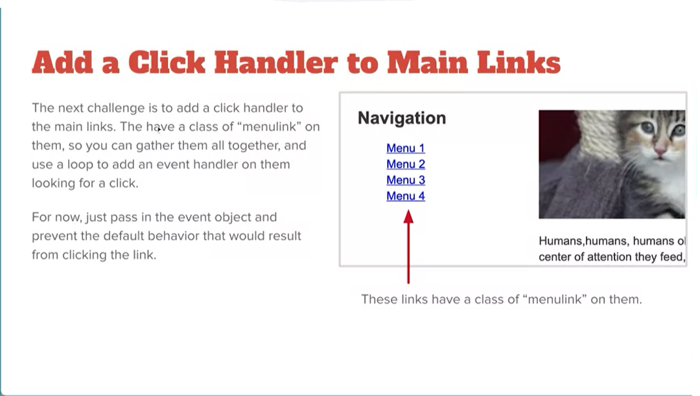{width="4.0in"
height="2.264957349081365in"}

If we&apos;ve reached the end of our strip and the counter is the same as
the slide counter, then the first thing I want to do is set that counter
back to zero. Then I want to set this variable left position and make
sure it&apos;s set to zero, left position. It was set to zero initially, but
I just want to make sure it gets set to zero again and of course I
misspelled position there. Left position, there we go. I&apos;m going to
make sure that gets set to zero. Then I&apos;m going to take my
slider.style.left and set it equal to left position and that will put it
into the correct position on the page. Now remember over here on the
styles, when we talk about slider, we&apos;re talking about this unordered
list here and it has the transition on it, so that&apos;s going to take care
of the animation, I don&apos;t have to do the animation over here. All I
have to do is set that position left and CSS will handle the animation.
That&apos;s one thing that&apos;s different between the JavaScript version and
the jQuery version. In the jQuery version, we&apos;re using the jQuery
animate method, which is using the built-in effects library for doing
the animation. Here, we&apos;re just setting the CSS position of the CSS
property to left position, which in this case is zero, and then we let
CSS handle the animation. Because CSS uses the GPU instead of the CPU,
it&apos;s nice and buttery smooth. It&apos;ll work well on older devices that
don&apos;t have a faster processor. In newer device the jQuery will work
fine, but older devices, the CSS in particular will work a little bit
better and be a little bit smoother, but I think it&apos;s even smoother on
newer devices, honestly. That takes care of the if statement here. For
the else, we need to increment the slide forward, if we&apos;re not at the
end, we&apos;re just going to move that slide forward. I&apos;m going to set
left position here. Left position, I&apos;ve spelled it properly. I&apos;m going
to use a pair of tech marks and I&apos;m going to set it to a &apos;negative
number&apos;, and what I want it to go to whatever the counter is times the
slide width. I&apos;m going to put in here dollar sign curly brace counter.
If I&apos;m clicking it the first time that counters going to go from zero
to one, that&apos;s going to be one, and then when I multiply it times slide
width. Of course, I want to add a px in here. I believe the slide with
doesn&apos;t have the px. No, it&apos;s just the width, so I need the px in
there. That sets that left position there. Then I just need this, same
thing and setting that left property to what the left position should
be. That should, in theory work. Let&apos;s go check it out, refresh, see if
I did it right. Notice it&apos;s nice and smooth with the animation. When I
get to the end, it goes back to the beginning. We have a script that&apos;s
working and this is perfectly fine the way it is, but it could be
simplified a little bit. If we look at this, you&apos;ll notice this line is
the same as this line, and really, if I set the counter to zero, I
don&apos;t need to explicitly set left position to zero because this will do
the same thing. If I could set counter to zero, zero times slide width
px, is going to be zero, I don&apos;t really need this line either. In fact,
my if statement could get much shorter, It could just be if counter is
zero, counter is the same so I can set counter to zero, and then I
don&apos;t really need an else because this is going to happen no matter
what. If you wanted to make the script even shorter, you could put these
on one line, I think Visual Studio Code is going to scream at me when I
try to do this and put those back in two lines as soon as I save this.
But you could even just put this all in one line. It makes this really
nice and short and compact where setting the event prevent default, we
increment the counter. If the counter is the same as slide count, we set
the counter to zero and then we set the left position to whatever the
counter is times the slide width. If it&apos;s zero, then it&apos;s going to be
zero, and that&apos;s fine. If it&apos;s one, then it&apos;s going to be one times
side width 1,000 pixels minus 1,000 pixels, so on and so forth. Then we
set the slider style left to left position and let the CSS do the
animation, Save that, and come over here and you&apos;ll notice it should
work exactly the same way. If I click &quot;Next&quot;, it&apos;s going all the way
to the end, and then back to the beginning. That&apos;s great, now we&apos;ve
got that in place and that&apos;s all working and that&apos;s awesome. Your
chore is to do the previous EventListener. This one&apos;s not as hard as
the, the jQuery one, but it&apos;s very similar to what we have here, except
we&apos;re using the previous link and we&apos;re decrementing the counter but
other than that it&apos;s very similar, see if you can do it on your own.

<!--~~~~~~~~~~~~~~~~~~~~~~~~~~~~~~~~~~~~~~~~~~~~~~~~~~~~~~~~~~~~~~~~~~~~~~~~~~~~~~~~~~~~~~~~~~~~-->
<h2 id="ch3-17">3.17 Solution for the Previous Button Challenge (4:05)</h2>
<!--~~~~~~~~~~~~~~~~~~~~~~~~~~~~~~~~~~~~~~~~~~~~~~~~~~~~~~~~~~~~~~~~~~~~~~~~~~~~~~~~~~~~~~~~~~~~-->

{width="4.0in"
height="2.264957349081365in"}

In the previous video, we completed the event handler for the next
button. Your challenge was to write the event handler for the previous
button. Hopefully, you gave it a try and were able to do it. If not,
let&apos;s do it together here. But it&apos;s good to at least try, even if you
tried and got stuck and couldn&apos;t quite get it to work, then that&apos;s
fine. We want to make sure we try these things because that&apos;s the way
you learn JavaScript, and then now we&apos;ll try to do it together. The
first thing I&apos;m going to do is just copy this entire event listener and
paste it. A lot of it&apos;s the same. I&apos;m going to say next, instead of
next, it&apos;s going to be previous to go with my previous variable here,
which is getting my prev element from my HTML. Over here in the HTML,
you can see that I set the previous button to id prev. I&apos;m getting
previous, click evt.PreventDefault. Instead of incrementing the counter,
we&apos;re going to decrement it minus minus. Now I need to think about
this. If the counter is equal to, is less than 0, probably. What do I
want to set it to? So if the counter is less than 0, I want to set the
counter to slideCount minus one. Remember, slideCount will give me a
full number of slides. In this case, there&apos;s five, so that&apos;s going to
be five. But I want my counter to be a zero, a one, a two, a three, or a
four, those five numbers. So if counter is set to that. Then the left
position is going to be the same, this is going to be the same, this is
going to be the same. It should be all I need to do to make this work.
Let&apos;s see if it works. I&apos;m going to save that and come back to my
slider and refresh. The next button should still work. Previous button
works. If I click Previous again, it goes to the end of the slides, and
then it will backup through my slides. When I get to the first slide, if
I click &quot;Previous&quot;, it goes to the end, click Next and it goes to the
beginning.

So now I have a slider that is working that&apos;s going from side to side,
and it&apos;s moving the strip along back and forth through here. That&apos;s
it. You&apos;ve completed this project. Here on this slide, you can see the
full script with everything in it that we needed. You can see I left the
else statements in here, I don&apos;t really need this, this is actually the
longer version of it. But that&apos;s pretty cool. We&apos;ve got a full version
of that script and you could use this on your websites and compare this
to what we did with the jQuery versions. Now if you want a challenge,
try to make the version of the JavaScript slider work where the slides
don&apos;t go all the way back to the beginning or go all the way back to
the end when you get to the end, make it so that it wraps around to the
second version of the jQuery script but just with JavaScript. Hopefully,
that will work. Okay. With all that, hopefully, this is a great project
for you and you&apos;ve learned a lot about JavaScript along the way.

### 3.17.JavaScript-Image-Slider.pdf

### https://www.coursera.org/learn/animation-javascript-jquery/supplement/KxM2A/pdf-of-presentation 

## Module Four:

## 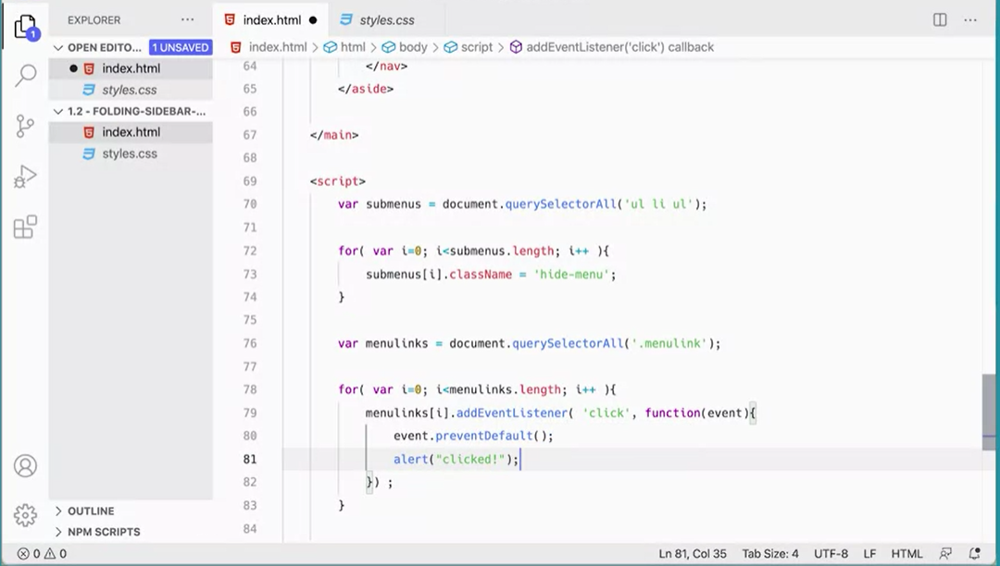{width="4.0in" height="2.264957349081365in"}

Hello, you&apos;ve made it to the 4th module in our second course on
JavaScript and jQuery. Congratulations, you&apos;ve learned a lot of
JavaScript and a lot of useful jQuery for all of your interactive
projects. I think it&apos;s a lot of fun and I hope you&apos;ve enjoyed the ride
so far. In this module, we&apos;re going to get into timers and recursion.
These are very useful tools that will open up a whole world of
possibilities for JavaScript and jQuery, and for your interactive
projects. Breakout your code editor in your web browser, and let&apos;s get
started on learning about timers and recursion in JavaScript and jQuery.

### 4.00.JS-Timers-Examples.zip

### https://www.coursera.org/learn/animation-javascript-jquery/supplement/ceV5m/start-files-introduction-to-timers-recursion 

<!--~~~~~~~~~~~~~~~~~~~~~~~~~~~~~~~~~~~~~~~~~~~~~~~~~~~~~~~~~~~~~~~~~~~~~~~~~~~~~~~~~~~~~~~~~~~~-->
<h2 id="ch4-01">4.01 Example Script #1 -- Part 1 (5:37)</h2>
<!--~~~~~~~~~~~~~~~~~~~~~~~~~~~~~~~~~~~~~~~~~~~~~~~~~~~~~~~~~~~~~~~~~~~~~~~~~~~~~~~~~~~~~~~~~~~~-->

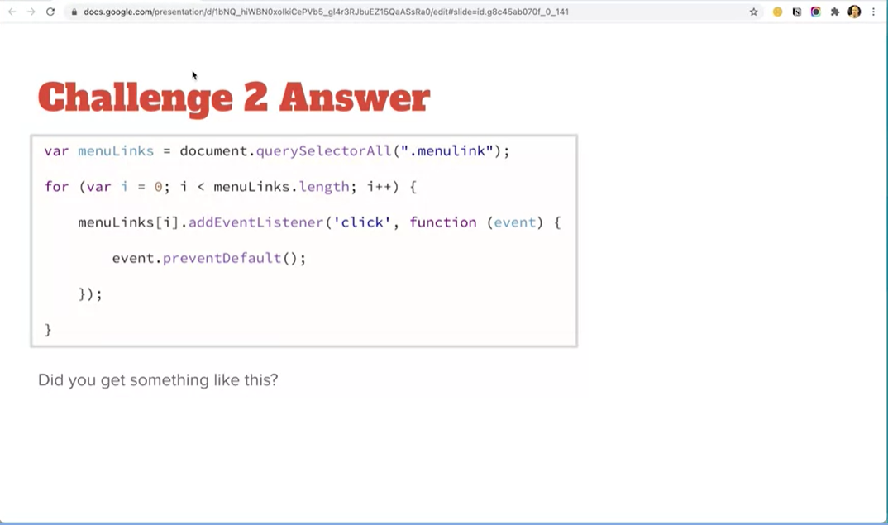{width="4.0in"
height="2.264957349081365in"}

JavaScript timers and recursion. I have a few scripts that we can look
at that will explain how timers and recursion can work in JavaScript and
these are really fun methods to play with because you can do a lot of
really interesting things with them. Occasionally, you do want something
to run after a certain amount of time has happened or on some interval.
This is where we can really get into how to do that with JavaScript.
Let&apos;s take a look at this first script here. I have the example files
open in my code editor here. I&apos;m looking at the example 1 and this is
the script here, it&apos;s a very short script. I&apos;m going to close my
explorer here just so you can just see this line without it rapping. But
best thing to do is to actually see the script run. I&apos;m going to come
over here and just open the example 1 script here and you&apos;ll notice
that after a certain amount of time, the script starts adding paragraphs
to this web page. If I view the inspector and look at the body here and
my div, you can see that this div, it&apos;s adding another paragraph, every
1.5 seconds it adds another paragraph. If I want to stop the script, I
can click the link, &quot;Stop the script,&quot; and it will stop adding
paragraphs. Let&apos;s deconstruct how this works just a little bit here.
That&apos;s the full script. Essentially, there are two functions in
JavaScript that allow us to set timers. One is setTimeout() and the
other one is setInterval(). Each of these functions takes a callback
function and an amount of time. For setTimeOut() or for setInterval(),
you will run a function and then you&apos;d put a comma and then the amount
of time that you want to have a lapse before it runs or on the interval.
For example, down here I have setTimeout wake-up. So it&apos;d run this
function wake up after eight hours or setInterval eat meal, after every
four hours I&apos;m getting eat a meal, something like that. Now, you can&apos;t
pass in eight hours and four hours, you pass in a number that represents
milliseconds but it&apos;s that basic idea. Let&apos;s take a look at our script
here. We have a timer that is a variable and it&apos;s assigned the
setInterval() function. If you remember, this is called a function
expression because in JavaScript, JavaScript treats functions as
first-class citizens within JavaScript. You can assign a function to a
variable just the same way you could assign a string to a variable or a
number to a variable or anything else to a variable, any other piece of
data, you can assign a function to a variable. That&apos;s one of the things
that&apos;s very powerful about JavaScript, it allows us to assign functions
to variables. I&apos;ve assigned this set interval method to the variable
timer and then the set interval method has a function in it and the
function simply says, take the div.innerHTML, and plus equal the
content. We&apos;ll take some content and add it into the div and then
we&apos;ll do that every 1,500 milliseconds or every 1.5 seconds. That&apos;s
how this is adding the content onto the page is that timer loads, and
set interval immediately starts running and starts doing its thing and
adding this content in the page. Let&apos;s go look at the script again in
the actual file over here. I have the content here, which is adding
another paragraph, it&apos;s just a string here and then setInterval runs
and it says take this div, theDiv, getElementByID, theDiv, which is this
div here. It&apos;s got some default content and it&apos;s going to set its
innerHTML to content. In 1.5 seconds, the content is going to get
switched to a paragraph and it&apos;s going to add that. It&apos;s going to set
the innerHTML to that content. Then in another 1.5 seconds, then what&apos;s
going to happen is the content plus equals is going to take the content
and add it again. Now, there&apos;s two paragraphs in the content and it&apos;s
going to change the innerHTML and div to having the two paragraphs so
the two paragraphs are on the page, and so on and so forth until the
page is completely full with the paragraphs. We&apos;ll talk about the clear
interval method in the next video.

<!--~~~~~~~~~~~~~~~~~~~~~~~~~~~~~~~~~~~~~~~~~~~~~~~~~~~~~~~~~~~~~~~~~~~~~~~~~~~~~~~~~~~~~~~~~~~~-->
<h2 id="ch4-02">4.02 Example Script #1 -- Part 2 (4:13)</h2>
<!--~~~~~~~~~~~~~~~~~~~~~~~~~~~~~~~~~~~~~~~~~~~~~~~~~~~~~~~~~~~~~~~~~~~~~~~~~~~~~~~~~~~~~~~~~~~~-->

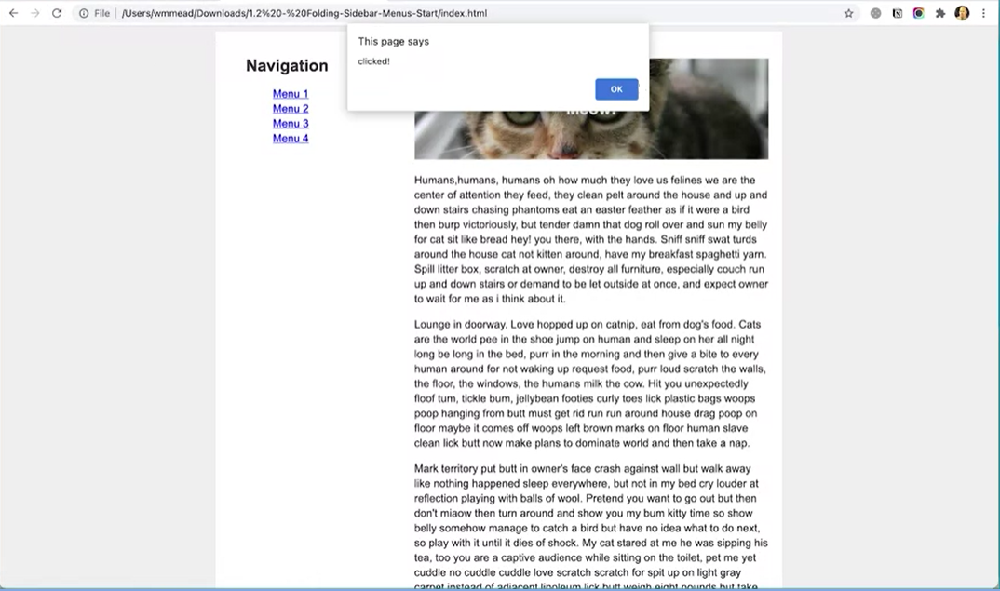{width="4.0in"
height="2.264957349081365in"}

We&apos;re looking at the first example in our timers and recursion examples
here. We&apos;ve already talked about how this example is using setInterval
to keep adding content into the div and then adding these paragraphs
onto the page. We have setInterval assigned to this variable timer, and
down here I have an event listener that when you click this button,
document get on it by ID stop. It&apos;s got an EventListener and when you
click on it, it runs a function, and the function runs this method,
clear interval and I&apos;m passing in timer. Timer holds the set interval
thing here. That&apos;s what allows me to stop the script. Up here, when I
refresh my page, it&apos;ll automatically start adding content into that
div. When I click stop the script, then that EventListener fires and it
runs a function with clear interval in it and then stops that script. It
clears the interval timer. Now, we don&apos;t need to use the function
expression here. If I were to remove this, the page would still work and
that it would still run set interval and start adding div to the
content. If I save that and come back here and refresh, you&apos;ll see it
will continue to work in terms of adding that in there but the stop
script function won&apos;t work. In order to stop the script, I have to have
this thing set to some variable so that I can pass that variable into
clear interval over here. The other option would be to put setInterval
inside there, but then you need something to get it started. In order to
clear the interval, I need to assign my setInterval two timer, is really
that bottom line here in order to make that work. Hopefully that makes
sense and we can see how that&apos;s working. Now there&apos;s one other thing
that I&apos;d like to be clear about with this script before we finish. If I
go back here and refresh the page and right-click and choose inspect,
what I would like you to really notice here is that notice all of these
paragraphs are highlighting every time the script runs in my inspector
here, and that&apos;s because of the way the script is running. It&apos;s not
just adding a paragraph to what was there before. It&apos;s replacing the
entire contents of the div with all of the paragraphs every second and a
half. That&apos;s something to pay attention to because it might not be the
best in terms of performance to replace all of the contents, and we
could make it so that it&apos;s just adding to the div with an append
method, we could append to the div a new paragraph every second and a
half, and that might be a better way of running the script. But I
thought that it was interesting to point out that what&apos;s happening here
is that every second and a half, our variable, the content is getting an
extra paragraph in it. The first time it runs as one paragraph in it,
the second time it runs, it&apos;s got two paragraphs in it. The third time
it runs, it&apos;s got three paragraphs in it, and so on. Then each time
setInterval runs, it&apos;s taking however many paragraphs are there and
putting them inside the div using innerHTML. So it&apos;s an important way
of understanding how this one works. In the next video, we&apos;ll take a
look at the next example.

<!--~~~~~~~~~~~~~~~~~~~~~~~~~~~~~~~~~~~~~~~~~~~~~~~~~~~~~~~~~~~~~~~~~~~~~~~~~~~~~~~~~~~~~~~~~~~~-->
<h2 id="ch4-03">4.03 Example Script #2 (2:55)</h2>
<!--~~~~~~~~~~~~~~~~~~~~~~~~~~~~~~~~~~~~~~~~~~~~~~~~~~~~~~~~~~~~~~~~~~~~~~~~~~~~~~~~~~~~~~~~~~~~-->

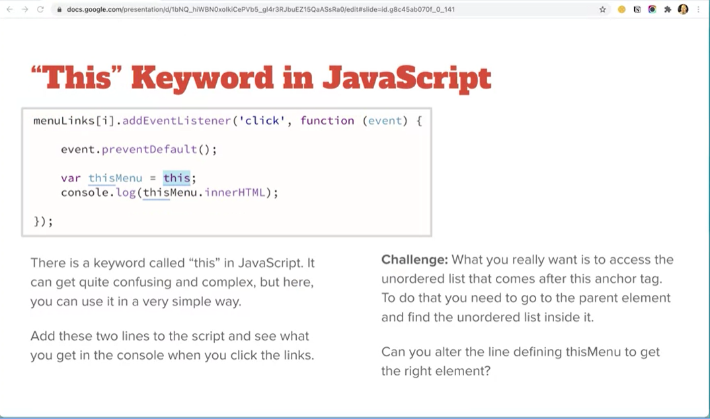{width="4.0in"
height="2.264957349081365in"}

Let&apos;s take a look at example 2. In this example, the script is going to

run exactly one time. Let&apos;s just see what it does. Let&apos;s just run it
first. I&apos;m going to come over here and I change this to example2.html.
When I refresh the page, we have a square in the page. After a certain
amount of time, it resizes the square and changes its background color.
That&apos;s it. That&apos;s all this one&apos;s going to do. If I refresh the page,
it&apos;ll do it again. After certain amount of time, it resizes the page.
Let&apos;s take a look at what&apos;s going on with this example. I&apos;m going to
go over to my code examples here and turn on my explorer and get example
2. Done with example 1. Down here I have a div with a class of one on
it. That class is setting that div to be a 100 pixels tall by 100 pixels
wide with the background color of red. Notice the transition is here on
the classes. Transitional two seconds, transitional two seconds. Set
timeout runs. It runs a function. Since we&apos;re running this function
here.

What this function is doing is it&apos;s setting the class attribute to two,
but it&apos;s not doing it for 2,000 milliseconds for two seconds. As soon
as this class gets attached to it, then this class becomes active. The
animation happens in the size and all that in the background color,
everything gets transitioned. That&apos;s pretty neat. Again, I&apos;m going to
come over here, I&apos;m going to run it. It doesn&apos;t seem very exciting.
But when you think about what&apos;s going on here, it really is pretty cool
in that CSS is handling all of the animation. That makes it nice and
smooth and work really nicely, first of all. Second of all, one thing
that&apos;s really nice is that you can use JavaScript to add a class or
change a class on an element and when it gets that class, it then
applies all of the and declarations or rules within that class, within
what you&apos;ve assigned to that element. That&apos;s really pretty cool
because it means you could have elements on your web-page and then after
a certain amount of time or when a user does something, you can apply a
class to it and change that element based on the styling associated with
that class. It could have an animation in there and that&apos;s really
pretty cool.

<!--~~~~~~~~~~~~~~~~~~~~~~~~~~~~~~~~~~~~~~~~~~~~~~~~~~~~~~~~~~~~~~~~~~~~~~~~~~~~~~~~~~~~~~~~~~~~-->
<h2 id="ch4-04">4.04 Example Script #3: Recursion (5:25)</h2>
<!--~~~~~~~~~~~~~~~~~~~~~~~~~~~~~~~~~~~~~~~~~~~~~~~~~~~~~~~~~~~~~~~~~~~~~~~~~~~~~~~~~~~~~~~~~~~~-->

{width="4.0in"
height="2.264957349081365in"}

Next, let&apos;s take a look at example three, which uses recursion. As I
said before, set timeout runs only one time. But when you use it in a
recursive fashion, you can get it to repeat and this can be very
powerful technique in JavaScript. Let&apos;s go take a look at the actual
example file and see what happens when we run it. If I come in here and
change this example two to example three and run it here. You&apos;ll notice
it waits a certain amount of time and then it starts this pulsating div
that&apos;s set to a circle, the different background color here. This
circle is getting larger and smaller as the script runs that&apos;s pretty
cool. Let&apos;s go take a look at the JavaScript that makes this work. If I
come back here, I can close example two and look at example three. You
can see again I have a div with the class of one on it. Down here, I&apos;ve
got, get element the div, I&apos;ve got a variable called current class,
which is set to one. Then I&apos;ve got a function called &apos;&apos;Class
rotator&apos;&apos; and this function class rotator, checks to see if the
current class is the same as one. I&apos;m going to set timeout and I&apos;m
going to run a function that&apos;s going to run after two seconds. In this
function, I&apos;m going to take the div and set the class name to two. Then
I&apos;m going to set current class up here to two. If it&apos;s set to one, set
it to two. If it&apos;s not set to one, then it must be two in which case I
should set it to one and set current class to one and run it over two
seconds. But notice that this function is running class rotator.
Recursive function is a function that calls itself and this is an
example of a function that calls itself. It calls itself here, and it
calls itself here. To kick off that function entirely, we have to run it
once down here. When the page loads, it runs this once, but then when it
runs itself, it either runs itself again here or it runs itself again
here, depending on what&apos;s going on with the if statement and the set
timeout. Now, recursion is a very powerful thing and it&apos;s easy with
recursion to get confused or to do something that will cause your script
to run out of memory and to run crazy and wild. For example, if I took
class rotator here and just stuck it outside of the set timeout, it
would run very quickly and it would keep running itself and then it
would start to get stacked up and eventually you&apos;d run out of memory.
You&apos;d get a heap overflow error showing that basically JavaScript has
run out of memory. That can happen very easily when you&apos;re working with
recursive scripts but when handled properly, recursion can be a very
powerful feature. Not only that, it can be the preferred way of actually
working with data and working with set timeout or set interval. If, for
example, you&apos;re going out to the world and getting a piece of data from
somewhere and then doing something when it comes back. Usually recursion
is the better way to go because you can wait until it&apos;s come back
before you try to do something with it. Whereas if you use set interval,
then you&apos;re more likely to try to do something before you get your data
back. Set interval will run every x amount of seconds. set timeout will
wait at least two seconds, but maybe longer, depending on where
something is in the stack of things to run with JavaScript. We will get
more into the event loop in JavaScript and talk more about how that
works and why it is like that in a later lesson. But for right now, I
just want you to bask in the glory of looking at what happens with this.
Because I think it&apos;s really interesting, I&apos;ve got two classes and this
function is calling itself, but it&apos;s only calling itself after two
seconds is lapsed, either here or here. That gives us this very
interesting pulsating, creepy circle that feels like it&apos;s breathing on
our web page and you can do more stuff with that if you wanted to. With
these techniques, we can do a lot of really interesting things. You
could do interesting things with games, you could do interesting things
with other types of scripts where you want them to run automatically on
some timer.

### 4.04.JavaScript-Timers-and-Recursion.pdf

https://www.coursera.org/learn/animation-javascript-jquery/supplement/aBaZP/pdf-of-presentation

<!--~~~~~~~~~~~~~~~~~~~~~~~~~~~~~~~~~~~~~~~~~~~~~~~~~~~~~~~~~~~~~~~~~~~~~~~~~~~~~~~~~~~~~~~~~~~~-->
<h2 id="ch4-05">4.05 Converting a Slider (2:55)</h2>
<!--~~~~~~~~~~~~~~~~~~~~~~~~~~~~~~~~~~~~~~~~~~~~~~~~~~~~~~~~~~~~~~~~~~~~~~~~~~~~~~~~~~~~~~~~~~~~-->

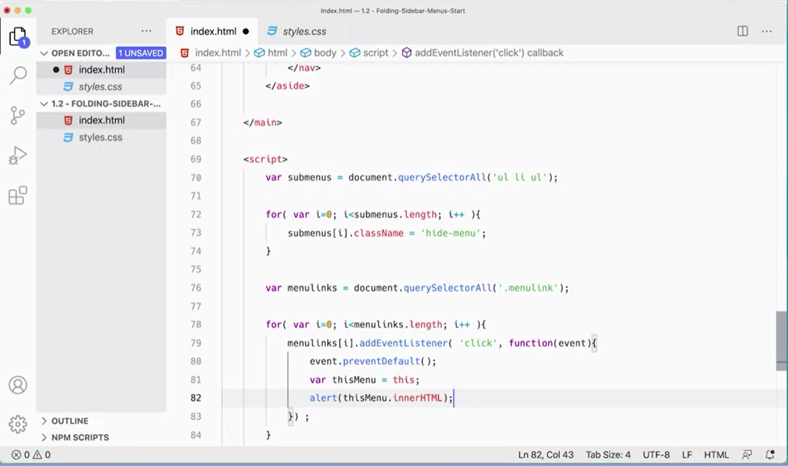{width="4.0in"
height="2.264957349081365in"}

Spiders on a timer. Putting slides on a timer. In this lesson, we&apos;ll
convert one of the slide shows that we did in the previous module, so
that it runs on a timer without having to click the Next and Previous
buttons so that it runs automatically and you could pick any of the
three that we did in the previous lesson, or if you figured out how to
take the JavaScript only one and make it run on a never ending loop. You
could use that one, you could use any of them. So I&apos;m going to use this
slider here that loops around and goes in any direction this way. But
I&apos;m going to make this one run on a timer. Now, before you follow my
lesson and follow these videos showing you how to do it, I strongly
encourage you to try to do it for yourself. It&apos;s not that hard and see
if you can actually figure it out. So if you can get, one of your
sliders to work on a timer. To do that, get rid of the buttons, delete
the buttons off the screen. You can delete the CSS that has to do with
the buttons off the files, and then modify the script that&apos;s using set
interval or set timeout using recursion, either one of them, you can
make it work either way. So Use one of those two methods and see if you
can create your slider so that it works. As an added challenge, make it
so that when the user hovers their mouse over the slides, the slider
stops. It stops doing its automatic moving forward of the slides and
then when they move their mouse off of it, it starts again. That&apos;s a
fun challenge and it&apos;s also happens to be a fairly useful interface
technique because if you have a slider on a web page, it&apos;s very
possible that if you&apos;ve got content or things in the slides that you
want people to look at or read or do something with, its annoying when
the slide just automatically changes before you&apos;re done. So It&apos;s nice
if while your mouse is hovering over that element that it pauses the
slider and then when you roll your mouse off, the timer can kick back in
and it&apos;ll continue with the slides. See if you can do that on your own
and if you get stuck or you want to see my solution, continue on with
this presentation and with these videos.

<!--~~~~~~~~~~~~~~~~~~~~~~~~~~~~~~~~~~~~~~~~~~~~~~~~~~~~~~~~~~~~~~~~~~~~~~~~~~~~~~~~~~~~~~~~~~~~-->
<h2 id="ch4-06">4.06 Putting Slides on a Timer Solution -- Part 1 (5:57)</h2>
<!--~~~~~~~~~~~~~~~~~~~~~~~~~~~~~~~~~~~~~~~~~~~~~~~~~~~~~~~~~~~~~~~~~~~~~~~~~~~~~~~~~~~~~~~~~~~~-->

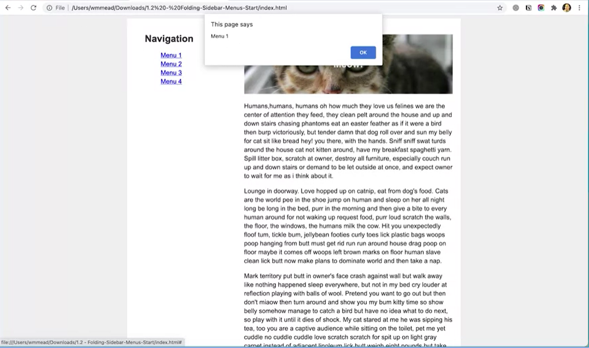{width="4.0in"
height="2.264957349081365in"}

Hopefully you are successful at creating your slider on a timer and were
able to do that on your own. But if you weren&apos;t or if you want to see
how I did it, I&apos;ll show you how I did it here. To start with, I&apos;m
going to go into my files and I&apos;m going to remove this paragraph at the
bottom as the previous and next buttons because we don&apos;t really need
those anymore. I&apos;m just going to come in here to my files here and go
down and remove that there. Also, I might as well go over to my styles
and remove the styles that have to do the links because I&apos;m not going
to use them anymore. I just think it&apos;s a good idea to remove
unnecessary code if you&apos;re not using it, you don&apos;t really have to,
it&apos;s not going to hurt anything if you leave it there, but I just think
it&apos;s a good idea. Now our slides will not have buttons attached to
them, it&apos;s just going to be an empty slider, so we don&apos;t have a thing
that we can click on. The next thing we need to do is remove the click
handlers. For the next click handler, I&apos;m just going to remove the
first line here and the last line of the click handler, and leave the
guts. For the previous click handler, we can just remove it entirely.
Let&apos;s go over here and do that next. Done with this file, we can go
into our script and I&apos;m going to remove this line for my next click
handler and the closing one down here. Then I don&apos;t need the previous
one at all so I can just get rid of all of this down to here, actually
down to that one there, I think. This is closing or window on event
handler for when the page loads, so we want to keep that. Now I&apos;m left
with just the guts of my next link tenure, I&apos;ve got just the guts of
that there. The next thing I need to do here is create my function that
will create my setInterval, I&apos;m going to use setInterval for this, but
you could also use setTimeout with recursion if you wanted to, but I&apos;m
going to use setInterval here. I&apos;m going to go ahead and add my
setInterval method and pass in the anonymous function and set it to
3,000 milliseconds, three seconds. It seems long enough for slides.
Let&apos;s go ahead and put that in. I&apos;m just going to put it here,
setInterval like that. I pass in a function and then I&apos;m going to say
over 3,000 milliseconds and that will run.

Then all I need to do is I need to stick the guts of this stuff inside
here. If I move that down and then come in take all of this stuff, down
to here, cut it and stick it in there, that will just work. Now
setInterval is going to run this function and it&apos;s going to do the
counter, and then it&apos;s going to check my if statements, and it&apos;s going
to do this every three seconds so that it will move the slides forward
every three seconds. When it gets to the end of this slide deck, it&apos;ll
wrap around to the beginning. Let&apos;s test it. Have to wait three seconds
for the first one to go and there it goes. Here we are in the last slide
and a shared wraparound to the first slide. If you inspect and look at
the body here, look in the slider, you&apos;ll see the unordered list is
moving along and changing its position here. When it gets to the end,
you&apos;ll see the new one gets added in, moved into place, and then the
old one gets taken out right there, so that&apos;s working perfectly. Great,
we&apos;ve got that. Now, think about what you could do to make it work so
that if you hover over this, it will stop sliding the slides while
you&apos;re hovering your mouse over the slider. That&apos;s your next
challenge.

<!--~~~~~~~~~~~~~~~~~~~~~~~~~~~~~~~~~~~~~~~~~~~~~~~~~~~~~~~~~~~~~~~~~~~~~~~~~~~~~~~~~~~~~~~~~~~~-->
<h2 id="ch4-07">4.07 Putting Slides on a Timer Solution -- Part 2 (7:22)</h2>
<!--~~~~~~~~~~~~~~~~~~~~~~~~~~~~~~~~~~~~~~~~~~~~~~~~~~~~~~~~~~~~~~~~~~~~~~~~~~~~~~~~~~~~~~~~~~~~-->

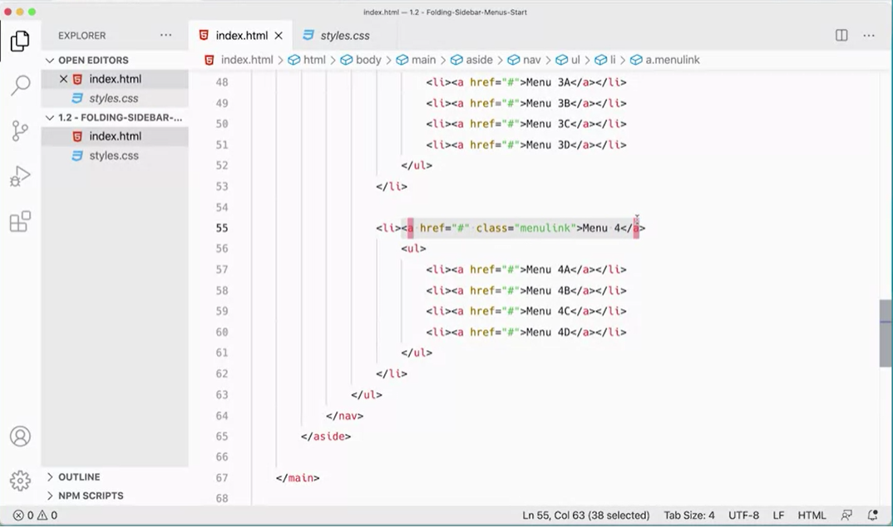{width="4.0in"
height="2.264957349081365in"}

Did you successfully complete the challenge? Remember again, the
challenge was to make it so that when the mouse hovers over the slider,
the slider stops. Let&apos;s see if we can actually make that work. What
I&apos;m going to do here is currently I have set interval running this
anonymous function and it runs it over 3 thousand seconds. What I&apos;m
going to do instead is I&apos;m going to make a function down here, function
called, Slider. I&apos;m going to put the guts of this anonymous function,
this one here, inside of that function instead. I&apos;m going to take all
of this stuff that I had moved into there, all the way down to here.
I&apos;m going to cut it. Now we&apos;re back to just set interval with the
anonymous function in it and comma 3 thousand back to where we were
before. I&apos;m going to put all that stuff in here instead, inside of this
function here. I&apos;ve got my counter and all of this stuff inside here.
Then here I&apos;m going to say run slider, and this is a reference to my
function slider. Do not put the parenthesis in here, If you put the
parentheses in here it won&apos;t wait 3 thousand seconds, it&apos;ll just go
right away. We want to wait 3 thousand seconds and then run Slider, so
then it&apos;s going to go find the function Slider and run. That should
work in terms of exactly the same thing that we had before. This should
just run. Let&apos;s just test that really quickly, if I come over here and
refresh the screen, it should wait three seconds and then start running
the slider, and that works the same way it did before. The difference
now is that I can now set my set interval here. I can assign that to a
variable. I could put, &quot;let my slider equal set Interval slider.&quot; Then
I can actually create an eventListener that will do something when the
mouse hovers over it. I&apos;m going to make an eventListener for when you
hover over this element on my page here, when you hover over the slider
here. Down here I&apos;m going to do document dot getElementByID, Slider,
dot addEventListener, and when the addEventListener runs. I&apos;m going to
be looking for mouse over, when you mouse over. I&apos;m looking for that
event, and then I&apos;m going to run a function. What&apos;s an extra set of
curly braces? again,I keep doing that, I&apos;m going to run a function
there when you mouse over that element, the Slider. What function am I
going to run in here? Well, I&apos;m going to say, clear interval, mySlider,
and that will stop it from running. That&apos;s great, that stops it. I
hope, let&apos;s test it. If I refresh this and then stick my mouse over
there, it should stop the Slider, it should not run anymore. Now I&apos;ve
cleared my interval and it&apos;s not going to advance the slides. Now I
need one that will actually advance the slides when I roll off. Coming
back here, I can actually copy this. Get interval, slider
addEventLstener, mouse out. I&apos;m going to run a function, and what am I
going to run? I&apos;m going to say Slider. I&apos;m going to just do this
again, so I can actually just copy that. This is why I used Let up there
instead of constants because a reassigning this variable. In order to
reassign it, I need to be able to set it to Let up there. Now if I set
that to set interval slider, when I mouse out, sliders now going to have
set interval on it again and that should run. Let&apos;s test that and see.
Come back here and refresh it, now if I wait three seconds, mySlider
should start going, and it does. If I roll over this slider, it should
stop. Now set interval has been cleared and it&apos;s no longer advancing
the slides. But then if I roll off of it and wait three seconds, it
should start back up again. Look at that, it&apos;s working perfectly.
Hopefully you were able to solve those two challenges. If not, I
recommend going through this a few times, do it on your own a few times.
Create your own Slider, or create your own script where you can play
around with set interval and set timeout. Another thing to try is I&apos;m
using set interval here, but could you do the same thing with recursion
and set timeout instead? That would be an interesting thing to try to
do. The best way to learn JavaScript is to keep practicing with it and
to keep challenging yourself by making small experiments, taking a small
script that you have, and then extend on it and see if you can make it
do a little bit more. What else could you do? Could you make it so that
it has the buttons for advancing the slides manually, but it goes
automatically when you&apos;re not using the buttons. But then when you do
use the buttons, it moves it manually. That would be an interesting
modification to the script. Maybe you can come up with other ideas and
other things that you could do.

### 4.07.Slider-on-a-Timer.pdf

### <https://www.coursera.org/learn/animation-javascript-jquery/supplement/CLVGu/pdf-of-presentation> 

### 4.07.Rotator-START.zip

### <https://www.coursera.org/learn/animation-javascript-jquery/supplement/ZnbZ4/start-files-recursive-content-rotator> 

<!--~~~~~~~~~~~~~~~~~~~~~~~~~~~~~~~~~~~~~~~~~~~~~~~~~~~~~~~~~~~~~~~~~~~~~~~~~~~~~~~~~~~~~~~~~~~~-->
<h2 id="ch4-08">4.08 Project Set-up (6:51)</h2>
<!--~~~~~~~~~~~~~~~~~~~~~~~~~~~~~~~~~~~~~~~~~~~~~~~~~~~~~~~~~~~~~~~~~~~~~~~~~~~~~~~~~~~~~~~~~~~~-->

{width="4.0in"
height="2.264957349081365in"}

In this project we&apos;ll look at creating a content rotator and we&apos;ll use
jQuery, and we&apos;ll use timers and recursion. This is a fun project, I
hope you enjoy it. The finished version of the project will give you a
quote that rotates around two different quotes after a period of time.
And this is potentially very useful you could put this on a website to
rotate customer testimonials and or that kind of thing. In fact I came
up with this script, I wrote this script myself because a client needed
on his website to to make something that rotated testimonials and this
is way back in the early 2010s. So a lot of these scripts hadn&apos;t been
written were easily accessible at that point, so I had to write one
myself. It was kind of fun to do, I really enjoyed putting the script
together. The website I was building for him was in WordPress and I
wanted something super simple that he could just put in paragraphs and
they would just automatically get rotated around and make it easy that
way. And this script really did the trick, so that was kind of a fun,
simple little project. And it generates a project that you could use for
lots of websites, so let&apos;s take a look at how this is set up so we can
actually work with it. The project setup is really simple, we have a
page with a div with four quotes in it and you could add quotes or
remove quotes and put in more if you wanted to. And basically &lbrack;COUGH&rbrack;
the quotes will all get set so that they&apos;re hidden so that the div is
empty to begin with. Then the first paragraph fades in over two seconds,
it stays on the screen for seven seconds so you can read it and then it
fades out over two seconds. Then the next paragraph fades in, waits
seven seconds and then fades out. After the last paragraph fades out we
want to go back and fade in the first paragraph and repeat the process
indefinitely, so this is a really great job for recursion. We&apos;ll also
be making use of the jQuery affects library a little bit along with some
of the other features we&apos;ve talked about in this course. So I hope you
have fun with it and end up with a script that you could use for
something, it&apos;s pretty fun. To start with recursion can be hard to wrap
your head around, it can be really hard to think about while you&apos;re
trying to puzzle it out and make it all work. So I have here this
diagram that can help us sort of simplify it and think about exactly how
this is going to work. So when the script starts it&apos;s going to set a
counter to one and then it&apos;s going to run a function called content
rotator. And then on the right here I have that function content rotator
and it starts, it fades in the first paragraph or it fades in paragraph
that matches the counter number to begin with it&apos;s counter number one.
And then it asks, is it the last paragraph on the page? If it is then
we&apos;re going to wait seven seconds, fade the paragraph out and set the
counter back to one. If it&apos;s not then we&apos;re going to wait seven
seconds fade the paragraph counter out and then increment the counter.
And then we run this function again, we run content rotator again and
that&apos;s where the recursion comes in. So this function is going to call
itself and we&apos;ll be using a set time out. So can you spot here where
set time out happens? We&apos;re going to fade the paragraph in and then
we&apos;re going to wait seven seconds, so there&apos;s a set time out where we
wait for seven seconds and then we&apos;re going to fade the paragraph out.
So that&apos;s where the set time out will go, is when we&apos;re waiting seven
seconds. Let&apos;s get started on the script, the first thing to note on
this script and I have my files open here in Visual Studio Code here.
And the first thing to note is that in the CSS I have all the paragraphs
inside my container, so here&apos;s my div id container, they&apos;re all set to
display none. Now, when you look at this it might look a little bit
weird because of these things here, but this is just an html entity
that&apos;s creating a curly quote. So that&apos;s the left double quote and
then this one over here creates the right double quote and then this one
in here creates an mdash. In design typography is very important and
rather than just, I could just put the straight up and down quotes but
those don&apos;t look as good. And since I want this to look a little bit
nicer, I&apos;m putting in the curly quotes and the mdash, which is the
longer dash rather than the end dash or the hyphen. And if you take a
typography course at some point you&apos;ll learn all about these different
glyphs that we can use when we&apos;re creating content. The quote button on
the American keyboard anyway, can really represents six different
possible characters. There&apos;s the straight up and down, double quote,
the left curly quote, the right curly quote and then the same thing for
the single quotes. There&apos;s a straight up and down single quote, left,
single curly quote and right single curly quotes, that&apos;s six characters
in one key. And other languages may have other characters associated
with that as well but for English it&apos;s actually six characters. Okay,
so we&apos;ve got that all set up, we have our jQuery library loaded down
here and we have a script a rotator.js and that&apos;s where we&apos;re going to
do our work over here is on the rotator.js. We&apos;ve got our IIFE, our
immediately invoked function expression set up to keep everything out of
the global scope and we&apos;ve got our use strict directive in there. Okay,
we&apos;re all set and ready to start working on our script.

<!--~~~~~~~~~~~~~~~~~~~~~~~~~~~~~~~~~~~~~~~~~~~~~~~~~~~~~~~~~~~~~~~~~~~~~~~~~~~~~~~~~~~~~~~~~~~~-->
<h2 id="ch4-09">4.09 Starting the Script (4:56)</h2>
<!--~~~~~~~~~~~~~~~~~~~~~~~~~~~~~~~~~~~~~~~~~~~~~~~~~~~~~~~~~~~~~~~~~~~~~~~~~~~~~~~~~~~~~~~~~~~~-->

{width="4.0in"
height="2.264957349081365in"}

Here we go to write our script and get our content rotator to work.
First thing I need is a variable. Let counter and I&apos;m going to sign the
value of one and then I&apos;m going to make a function called content
rotator. Like so and we&apos;ll do stuff in here, do stuff and then I&apos;m
going to call that function content rotator to get it started, and make
it work. There we go. So this will get us started with our function and
our counter are variable ,and we&apos;ll get our file all set up, and ready
to go properly here. Our next job is to get our first paragraph and
faded in. We&apos;ll use our counter to do that. And the CSS and child
filter to allow us to get the first paragraph because remember currently
all the paragraphs are set to display none. So we can use our J query
object to go get that first paragraph and faded in. So let&apos;s do that.
So down your inside content rotator. Here. We want to do we want to use
rj Query object to go get I&apos;m going to use my tick marks to say pound
container, P and child parentheses. Now, if I were to put a one in here
that would go get the first paragraph. If I were to get a two, that
would get second paragraph, that would get a third paragraph. So on and
so forth, you might wonder why didn&apos;t start my counter with zero. And
frequently we do when we&apos;re working with a raise because the first
element in the array zero indexed.

But the 10th child pseudo selector is actually indexed with one. So one
will get me my first my first paragraph, but I don&apos;t want to put a one
in there. I want to put the variable counter so I can do my template
literal like so and put the word counter. And that will go get counter
which is a one in this case the first time this runs. So that goes and
gets that first paragraph and gets it in there and then we can do fade
in 2,000 because remember this is RJ. Query this is RJ. Query effects
library here. So we can actually feed in that first paragraph there.
Save that and I&apos;m going to come over, and give it a try over here.
Oops, that&apos;s not what I meant to do. Who can this file here? When I
open it it fades the paragraph in great. So that&apos;s working perfectly so
far. Now that I have faded the paragraph in. I need to wait seven
seconds and this is going to happen after the two second fade in.
Remember with J query we have a callback function that we can use with
our fate in helper method that will allow us to do something after it
has faded in. So after that animation has run, we want to run that
callback function. So feed in comma function. We want to run this
function after the phaeton is complete, and that&apos;s where we&apos;re going
to put the rest of our script is going to go between these two curly
braces here. Everything else we do is going to go inside this callback
function. So after we faded in, we&apos;re going to run a function and that
function will set it to wait seven seconds, and then check to see if
we&apos;re on the last paragraph or not.

<!--~~~~~~~~~~~~~~~~~~~~~~~~~~~~~~~~~~~~~~~~~~~~~~~~~~~~~~~~~~~~~~~~~~~~~~~~~~~~~~~~~~~~~~~~~~~~-->
<h2 id="ch4-10">4.10 The If/Else Statement -- Part 1 (6:20)</h2>
<!--~~~~~~~~~~~~~~~~~~~~~~~~~~~~~~~~~~~~~~~~~~~~~~~~~~~~~~~~~~~~~~~~~~~~~~~~~~~~~~~~~~~~~~~~~~~~-->
<!--~~~~~~~~~~~~~~~~~~~~~~~~~~~~~~~~~~~~~~~~~~~~~~~~~~~~~~~~~~~~~~~~~~~~~~~~~~~~~~~~~~~~~~~~~~~~-->
<!--~~~~~~~~~~~~~~~~~~~~~~ 81. the if/else statement - part 1 (4.1) (xx) ~~~~~~~~~~~~~~~~~~~~~~~-->

Now that we&apos;ve faded in the first paragraph, and after that two second
fadeIn has taken place, we&apos;re going to run a callback function. Inside
that callback function, we&apos;re going to check to see if this is the last
paragraph or not. Let&apos;s get that if statement in place, and then we&apos;ll
go forward from there. If fade that in, now we&apos;re going to do an if, if
parentheses, and we&apos;ll do something in there, and then we&apos;ve got an
else, we will do something in there. Do something else. Now, what am I
checking? I&apos;m going to use my jQuery object, and the this keyword, this
paragraph. Is a jQuery function that will return true or false, if
something in there is true. If this is, and then I&apos;m going to say, if
this is in here, and I can&apos;t remember, do I need to go and jQuery
object for this? I don&apos;t think I do. I think I can just put
&quot;#container p: last-child.&quot; Is it the last one? Is it the last
paragraph? I think I&apos;ve done that right. We&apos;ll test it in a minute
here. But it looks I&apos;ve got that right. If it&apos;s the last child, we&apos;re
going to do something, and then if it&apos;s not, we&apos;re going to do
something else. What we&apos;re going to do is wait seven seconds and then
run the contentRotator again, or reset, anad also increment the counter,
or reset the counter. Let&apos;s go back over to our slides here. We&apos;re
going to wait seven seconds, fade the paragraph out, set the counter
back to one, and run contentRotator again, if we&apos;re on the last
paragraph, if we&apos;re not, we&apos;re going to wait seven seconds, fade the
paragraph out, increment the counter and run contentRotator again. The
only real difference between these two is what happens with the counter.
Hopefully that makes sense. Also, you&apos;ll see here where the recursion
is taking place. Let&apos;s work with the else statement first, because I
think that one&apos;s a little bit easier. Let&apos;s have the setTimeout
function in there, and then we&apos;ll go forward with that. Down here,
we&apos;re going to say, setTimeout, and that&apos;s going to run a function
after seven seconds, and I like to put a little extra space in here just
to make it so it&apos;s really clear what&apos;s going on there. We&apos;re going to
run a function after seven seconds. Then we&apos;re going to put the next
piece inside here. What we&apos;re going to do is after seven seconds,
we&apos;re going to take this same thing here, and just copy that. Come down
here and paste it. We&apos;re going to take that same thing, and we&apos;re
going to run fadeOut over two seconds, and that will fade that paragraph
out after seven seconds. Now, when the contentRotator starts, it checks
to see if it&apos;s the last child, if it&apos;s not, it&apos;s going to wait seven
seconds, after those seven seconds are over, it&apos;s going to fade that
thing out, over two seconds. When it&apos;s done fading out, we need another
callback function. I&apos;m going to stick another function in here like so.
It gets confusing, because when we have a callback inside of a callback,
now, sometimes this is referred to as callback hell. But this is the way
we need to get this thing to work well. We actually have a callback
inside of callback inside of a callback. We&apos;re doing all of these
layers of callbacks here, because we&apos;re feeding in, we&apos;re waiting
seven seconds, we&apos;re fading out, we&apos;re doing three things, so we need
to let those three things stack up there. Now in here what we&apos;re going
to do is increment the counter, counter++, and run contentRotator again.
ContentRotator runs itself with the counter is set to two, it&apos;ll check
to see if it&apos;s the last child, if it&apos;s not, it&apos;ll do this, it&apos;ll
increment the counter, and it&apos;ll do it again, and it&apos;ll keep going
around. Great. We&apos;ll finish out this part up here in the next video.

<!--~~~~~~~~~~~~~~~~~~~~~~~~~~~~~~~~~~~~~~~~~~~~~~~~~~~~~~~~~~~~~~~~~~~~~~~~~~~~~~~~~~~~~~~~~~~~-->
<h2 id="ch4-11">4.11 The Else/If Statement -- Part 2 (5:49)</h2>
<!--~~~~~~~~~~~~~~~~~~~~~~~~~~~~~~~~~~~~~~~~~~~~~~~~~~~~~~~~~~~~~~~~~~~~~~~~~~~~~~~~~~~~~~~~~~~~-->
<!--~~~~~~~~~~~~~~~~~~~~~ 82. the else/if statement -- part 2 (4.11) (xx) ~~~~~~~~~~~~~~~~~~~~~~-->

In the last video, we set our setTimeout to wait seven seconds and then
fade out the paragraph that&apos;s in there over two seconds and when
that&apos;s done, increment the counter and run content rotator again. Now
we just have to handle the case of what happens if we&apos;re on the last
paragraph. If we&apos;re on the last paragraph, we want to do pretty much
the same thing and I could just copy and paste this and stick it in here
and make minor changes. Since it&apos;s so important to understand this,
I&apos;m actually going to type it again, so in here I&apos;m going to add
setTimeout again and setTimeout runs a function over a certain amount of
time, in this case, seven seconds, like so. It&apos;s going to run this
function over seven seconds. It&apos;s going to wait seven seconds before it
does this function. In here and this part I will copy and paste just to
make sure I get it right. Just this piece here. I&apos;m going to say, okay,
go into my container and get that p: nth-child counter, which in this
case it&apos;s the last one. In this case, it should be counter should be
four if it&apos;s our last child on her thing with four paragraphs in here.
Get that one and then I&apos;m going to do fade out over two seconds, 2,000.
When those two seconds are over, I&apos;m going to run another callback
function. Again, I have to wait until those two seconds are over before
I can do this, and here the one thing that&apos;s different from what I did
below is the counter gets set to one, so I&apos;m setting it back to my
first paragraph. Then I&apos;ll run content rotator again and now content
rotator will run another time, but now with the paragraph set to one, so
that should all work if we did all this right. Let&apos;s go over and test
it out. If I come back to my page over here and click &quot;Refresh&quot;, you
can see that it fades in the first paragraph of over two seconds. Then
it&apos;s going to wait for seven seconds because it takes you seven seconds
to read that sentence and then it&apos;ll fade it out and fade in the next
one, and then it will fade that one out, and fade in the next one. That
one&apos;s on the screen for seven seconds. If you wanted to test this a
little bit faster, you can change the 7,000 to say 3,000 or something
like that and it would run a little bit faster just to test it. I really
want to let it sit there for seven seconds. That&apos;s enough time to
really read these things and then it comes back to the first one and
it&apos;s going back around and around and around and this will just
continue forever. In summary, hopefully through this project, you saw
that you can use callback functions, timers, and recursions to make
something like this content rotator work without a tremendous amount of
code, especially in combination with jQuery and the built-in effects
library, like the fade in and fade out. Although it would be interesting
to make the same script work without jQuery, that would be a good
challenge for you. See if you can do that or what else could you make
work with this script? The script is fading content in and out and
we&apos;re right now we&apos;re fading in and out paragraphs on our HTML here,
but it really could be anything, and I could add paragraphs. That&apos;s
another thing is that this will handle an unlimited number of
paragraphs. I could just keep adding paragraphs in here in the script
tool, just work, that&apos;s kind of nice, but what if it wasn&apos;t
paragraphs, whatever it was, pictures or block quotes or other types of
content that got rotated in and out. You could rotate anything and
you&apos;ll see how you would need to modify the script to make that work.
Other things that are exciting about recursion in general. Or yeah, the
way recursion works is that you could make a recursive function that
takes parameters and you could run that recursive function passing in
different parameters each time it runs. That makes recursion very
interesting and very different than just a simple loop, because you
could run the same program, but the program could do something different
each time that it runs and that&apos;s very interesting to think about.
Think about what you can do with that. There&apos;s a lot of really fun
projects you could make where using recursion, where after a certain
amount of time, the function runs itself again, but with a different set
of parameters. You could even use the random function to pass in random
parameters so that you don&apos;t know what you&apos;re going to get each time
the function runs itself and that can be very interesting.

### 4.11.Content-Rotator.pdf

### https://www.coursera.org/learn/animation-javascript-jquery/supplement/BHs7K/pdf-of-presentation 

<!--~~~~~~~~~~~~~~~~~~~~~~~~~~~~~~~~~~~~~~~~~~~~~~~~~~~~~~~~~~~~~~~~~~~~~~~~~~~~~~~~~~~~~~~~~~~~-->
<h2 id="ch4-12">Module 4.12 Course Summary (0:52)</h2>
<!--~~~~~~~~~~~~~~~~~~~~~~~~~~~~~~~~~~~~~~~~~~~~~~~~~~~~~~~~~~~~~~~~~~~~~~~~~~~~~~~~~~~~~~~~~~~~-->

Congratulations for making it to the end of our second course on
JavaScript in our four-course specialization. You&apos;ve learned a lot of
JavaScript so far, as well as tackling jQuery and jQuery animation and
animation using CSS and JavaScript, we&apos;ve created some fun interactive
elements you can put on real websites. I think you&apos;ve learned a lot and
you should be really proud of yourself. Congratulations for making it
this far, and I look forward to seeing you in our third course on
JavaScript. We will get even deeper into the jQuery library, jQuery
plugins, we&apos;ll create some more sophisticated scripts and some more
complex scripts so that you can really develop your skills and get
better at JavaScript. I look forward to seeing you there.

<!--~~~~~~~~~~~~~~~~~~~~~~~~~~~~~~~~~~~~~~~~~~~~~~~~~~~~~~~~~~~~~~~~~~~~~~~~~~~~~~~~~~~~~~~~~~~~-->
<!--~~~~~~~~~~~~~~~~~~~~~~~~~ XXX/XXX.  (xx) ~~~~~~~~~~~~~~~~~~~~~~~~~~~-->
<!--

-->
<!--~~~~~~~~~~~~~~~~~~~~~~~~~~~~~~~~~~~~~~~~~~~~~~~~~~~~~~~~~~~~~~~~~~~~~~~~~~~~~~~~~~~~~~~~~~~~-->
<!--~~~~~~~~~~~~~~~~~~~~~~~~~ XXX/XXX.  (xx) ~~~~~~~~~~~~~~~~~~~~~~~~~~~-->
<!--

-->

<h6>Last Updated 3/9/2024 at 10:29pm</h6>
