<!--~~~~~~~~~~~~~~~~~~~~~~~~~~~~~~~~~~~~~~~~~~~~~~~~~~~~~~~~~~~~~~~~~~~~~~~~~~~~~~~~~~~~~~~~~~~~-->
<!--~~~~~~~~~~~~~~~~~~~~~~~ 01/02. javascript and uc davis logos (01) ~~~~~~~~~~~~~~~~~~~~~~~~~~-->

<!--~~~~~~~~~~~~~~~~~~~~~~~~~~~~~~~~~~~~~~~~~~~~~~~~~~~~~~~~~~~~~~~~~~~~~~~~~~~~~~~~~~~~~~~~~~~~-->
<h2 id="about">About this Course</h2>
<!--~~~~~~~~~~~~~~~~~~~~~~~~~~~~~~~~~~~~~~~~~~~~~~~~~~~~~~~~~~~~~~~~~~~~~~~~~~~~~~~~~~~~~~~~~~~~-->

With the general introduction of JavaScript in the first course, this
course will focus on JavaScript libraries, specifically jQuery. The
scripts will be geared toward <b>Document Object Model (DOM)</b>
manipulation. Learners will describe the top JavaScript libraries and
differentiate which would work best to implement and accelerate
development of web page animation. 

Course objectives include being
introduced to the end product of the course -- a landing page style
website using jQuery elements to manipulate HTML documents and enhance
user experience. Diving deeper into the landing page that will be
created and break it out into individual jQuery projects. jQuery events
and effects will be covered while exploring more jQuery's relationship
with HTML documents. Finally, a focus on plugins and continue to
breakdown jQuery&apos;s ability to manipulate HTML and CSS.

<!--~~~~~~~~~~~~~~~~~~~~~~~~~~~~~~~~~~~~~~~~~~~~~~~~~~~~~~~~~~~~~~~~~~~~~~~~~~~~~~~~~~~~~~~~~~~~-->
<!--~~ Hoverable Dropdown Menu ~~-->
<h2><a href="#table-of-contents">Table of Contents</a></h2>

<h3 id="ch1-obj">Learning Objectives</h3>

-   Plug in the jQuery library either locally or through a CDN.

-   Discuss history of jQuery and its relationship to JavaScript.

-   Use some of the selectors and filters available in jQuery to access
    DOM elements.

-   Create an interactive element that could be used on a website in
    both JS and jQuery.

-   Compare the syntax between JavaScript and jQuery.

-   Identify and fix coding and logic problems when they emerge while
    working on a project.

-   Demonstrate proficiency with both JavaScript and jQuery for
    accessing and manipulating elements on a web page.

<h2 id="syllabus">Syllabus</h2>

<h2 id="ch1">Week/Module 1</h2>

<h2>Manipulating Web Pages Elements with jQuery & JavaScript</h2>

In this module (1), you will be introduced to jQuery and basic jQuery
syntax and we will compare it to JavaScript syntax. You will be able to
plug-in the jQuery library and discuss the history of jQuery and its
relationship to JavaScript. You&apos;ll also use some of the selectors and
filters available in jQuery to access DOM elements. You will be able to
create an interactive element that could be used on a website and be
able to identify and fix coding and logic problems while working on a
project. You will be able to demonstrate proficiency with both
JavaScript and jQuery for accessing and manipulating elements on a web
page.

<h4>19 videos, 10 readings</h4>

<ul>
  <li><h4 id="ch1-00-note">
    1.00 A Note From UC-Davis</h4></li>
  <li><h4 id="ch1-00-welcome">
  <a href="https://www.coursera.org/lecture/animation-javascript-jquery/welcome-to-this-course-K8n2i"
    target="_blank" rel="noopener noreferrer">
    1.00 Welcome to this Course!</a></h4></li>
  <li><h4 id="ch1-00-intro">
    1.00 Learning Objectives; Manipulating Web Page Elements with jQuery &ampp; JavaScript</h4></li>
</ul>

<ol>
  <li>Introduction to jQuery</li>
</ol>

<ul>
  <li>1.01 Start Files: Introduction to jQuery 1.01-StartFile-FileName.pdf</li>
</ul>

<ol start="2">
  <li>jQuery Libraries</li>
  <li>Plugging Into jQuery Libraries</li>
  <li>Basic jQuery Syntax</li>
  <li>Using jQuery to Access Elements</li>
  <li>jQuery Events</li>
</ol>
<ul>
  <li>1.06 PDF of Presentation 1.06-FileName.pdf</li>
</ul>

<ol start="7">
  <li>Introduction to Folding Sidebar Menus Using JS</li>
</ol>
<ul>
  <li><a href="1.07-StartFile-FileName.pdf"
    target="_blank" rel="noopener noreferrer">
    1.07 Start Files: Folding Sidebar Menus with JavaScript</a></li>
</ul>
<ol start="8">
  <li>Challenge 1 Solution</li>
  <li>Challenge 2 Solution</li>
  <li>Challenge 3 Solution</li>
  <li>Challenge 4 Solution</li>
  <li>Challenge 5 Solution</li>
  <li>Challenge 6 Solution</li>
  <li>Challenge 7 Solution</li>
  <li>Challenge 8 Solution</li>
</ol>
<ul>
  <li>1.15 PDF of Presentation 1.15-FileName.pdf</li>
</ul>
<ol start="16">
  <li>Introduction to jQuery Sidebar Folding Navigation</li>
</ol>
<ul>
  <li><a href="1.16-StartFile-FileName.pdf">1.16 Start Files: Folding Sidebar Menus with jQuery"
    target="_blank" rel="noopener noreferrer"</a></li>
</ul>
<ol start="17">
  <li>Getting the Next UL</li>
  <li>The Whole Script</li>
</ol>
<ul>
  <li>1.18 PDF of Presentation 1.18-FileName.pdf</li>
</ul>
<ol start="19">
  <li>JavaScript and jQuery Challenges Intro</li>
</ol>
<ul>
  <li>1.19 JavaScript and jQuery Challenge Activities 1.19-FileName.pdf</li>
</ul>

<h2 id="ch2">Week/Module 2</h2>

<h2>Animating Web Page Elements with jQuery & JavaScript</h2>

In this module (2), you will be introduced to the jQuery effects
library, helper functions, animations and callback functions. You will
be able to use features in jQuery to animate elements on a web page. You
will be able to use the callback functions to trigger a function when an
animation is completed. You will be able to create a tabbed interface in
both JavaScript and jQuery.

<h4>20 videos, 7 readings</h4>

<ul>
  <li><a href="https://www.coursera.org/lecture/animation-javascript-jquery/module-introduction-ZlMzi"
    target="_blank" rel="noopener noreferrer">
    2.00 Learning Objectives; Animating Web Page Elements</a></li>
</ul>

1.  <b>Introduction to the jQuery Effects Library</b>

<ul>
  <li><a href="">2.01 Start Files: Introduction to the jQuery Effects Library (2.01-StartFile-FileName.pdf)</a></li>
</ul>

2.  <b>Example 1 Continued</b>

3.  <b>Example 2</b>

4.  <b>Example 2: Plugin Architecture</b>

5.  <b>Example 3: Fading Buttons</b>

6.  <b>Example 3: Fade To</b>

7.  <b>Example 4: Custom Animations - Part 1</b>

8.  <b>Example 4: Custom Animations - Part 2</b>

9.  <b>Doing All Animations at Once</b>

<ul>
  <li><a href="">
    2.09 Additional Resources - PDF of Presentation 2.09-NameFile.pdf</a></li>
</ul>

10. <b>Introduction to Tabbed Interface Using jQuery</b>

<ul>
  <li><a href="">
    2.10 Start Files: Creating a Tabbed Interface with jQuery -- 2.10-StartFiles-FileName.pdf</a></li>
</ul>

11. <b>Styling the Anchor Tags</b>

12. <b>Tab Styling and Colors</b>

13. <b>Clicking and Fading Tabs</b>

14. <b>Whole Script</b>

<ul>
  <li><a href="">2.14 PDF of Presentation 2.14-NameFile.pdf</a></li>
</ul>

15. <b>Getting the CSS Ready</b>

<ul>
  <li><a href="">
    2.15 Start Files: Creating a Tabbed Interface with JavaScript - 
	2.15-StartFiles-FileName.pdf</a></li>
</ul>

16. <b>Making the Tabs Work</b>

17. <b>New Tab and Old Tab</b>

18. <b>Handling the Switch</b>

19. <b>Fixing a Bug</b>

20. <b>Cleaning Up the Code</b>

<ul>
  <li><a href="">2.20 PDF of Presentation 2.20-FileName.pdf</a></li>
</ul>

<h2 id="ch3">Week/Module 3</h2>

<h2>Intermediate Document Manipulation & Animation</h2>

In this module (3), you will be able to use the jQuery syntax and the
built-in effects library to create image sliders that could be
integrated into web pages. You will also be able to compare the jQuery
syntax to the JavaScript syntax by building a similar image slider using
only plain JavaScript syntax and using CSS to perform the animation.

<h4>17 videos, 5 readings</h4>

<ul>
  <li><a href="https://www.coursera.org/lecture/animation-javascript-jquery/module-introduction-pupTj"
    target="_blank" rel="noopener noreferrer">
    3.00 Learning Objectives; Intermediate Document Manipulation &amp; Animation</a></li>
</ul>

1.  <b>Basic Slider</b>

<ul>
  <li><a href="">3.01 Start Files: jQuery Image Sliders 3.01-StartFiles-FileName.pdf</a></li>
</ul>

2.  <b>Making the Script General</b>

3.  <b>Window Load Function</b>

4.  <b>Click Handler for Next Button</b>

5.  <b>Next Click Handler with If Statement</b>

6.  <b>Challenge Solution</b>

<ul>
  <li><a href="">3.06 PDF of Presentation 3.06-FileName.pdf</a></li>
</ul>

7.  <b>Strategy for Version 2</b>

8.  <b>Cloning the Unordered List</b>

9.  <b>Setting the Left Position</b>

10. <b>Adding a Callback Function</b>

11. <b>Previous Button Click Handler - Part 1</b>

12. <b>Previous Button Click Handler - Part 2</b>

<ul>
  <li><a href="">3.12 PDF of Presentation 3.12-FileName.pdf</a></li>
</ul>

13. <b>Slider Using JavaScript</b>

<ul>
  <li><a href="">3.13 Start Files: JavaScript Image Sliders 3.13-StartFile.pdf</a></li>
</ul>

14. <b>CSS for Slides and Adding Variables</b>

15. <b>Adding More Variables</b>

16. <b>Event Handler for the Next Button</b>

17. <b>Solution for the Previous Button Challenge</b>

<ul>
  <li><a href="">3.17 PDF of Presentation 3.17-FileName.pdf</a></li>
</ul>

<h2 id="ch4">Week/Module 4</h4>

<h2>Timers and Recursion in JavaScript & jQuery</h2>

In this module (4), you will be introduced to the use of timers and
recursion in JavaScript and use these techniques to make interface
elements that run on a timer. You practice using jQuery syntax and
recursion to build a simple content rotator that could be used as an
interface element on any web page.

<h4>12 videos, 6 readings</h4>

<ul>
  <li><a href="https://www.coursera.org/lecture/animation-javascript-jquery/module-introduction-lZUTE"
    target="_blank" rel="noopener noreferrer">
    4.00 Learning Objectives; Timers and Recursion in JavaScript &amp; jQuery</a>  </li>
  <li><a href="">4.00 Start Files; Introduction to Timers & Recursion 4.00-StartFile-FileName.pdf</a></li>
</ul>

1.  Example Script #1 - Part 1

2.  Example Script #1 - Part 2

3.  Example Script #2

4.  Example Script #3: Recursion

<ul>
  <li><a href="">4.04 PDF of Presentation 4.04-FileName.pdf</a></li>
</ul>

5.  Converting a Slider

6.  Putting Slides on a Timer Solution - Part 1

7.  Putting Slides on a Timer Solution - Part 2

<ul>
  <li><a href="">4.07 PDF of Presentation 4.07-FileName.pdf</a>  </li>
  <li><a href="">4.07 Start Files: Recursive Content Rotator 4.07-StartFile-FileName.pdf</a></li>
</ul>

8.  Project Set-up

9.  Starting the Script

10. The If/Else Statement - Part 1

11. The If/Else Statement - Part 2

<ul>
  <li><a href="">4.11 PDF of Presentation 4.11-FileName.pdf</a></li>
</ul>

12. Course Summary

<!-- hoverable drop-down menu -->

### [<b>Week 1: jQuery Plugins and Capturing the Scroll Event</b>](#ch1)
>#### [<b>1.00 A Note from UC Davis</b>](#ch1-00-note)
>#### [<b>1.00 Welcome to JS Animation!</b>](#ch1-00-welcome)
>#### [<b>1.00 Learning Objectives!</b>](#ch1-00-obj)
>#### [<b>1.01 Module 1 Introduction to jQuery</b>](#ch1-01)
>#### [<b>1.02 jQuery Libraries</b>](#ch1-02)
>#### [<b>1.03 Plugging into jQuery Libraries</b>](#ch1-03)
>#### [<b>1.04 Basic jQuery Syntax</b>](#ch1-04)
>#### [<b>1.05 Using jQuery to Access Elements</b>](#ch1-05)
>#### [<b>1.06 jQuery Events</b>](#ch1-06)

<ul>
  <li><a href="">
	1.06 Slideshow of jQuery Events.pdf (download)</a></li>
</ul>

>#### [<b>1.07 Intro to JavaScript Folding Sidebar Menus Using JS</b>](#ch1-07)

<ul>
  <li><a href="">
	1.07 START Files: JS Folding SideBar Menus (download)</a></li>
</ul>

>#### [<b>1.08 Challenge 1 Solution</b>](#ch1-08)
>#### [<b>1.09 Challenge 2 Solution</b>](#ch1-09)
>#### [<b>1.10 Challenge 3 Solution</b>](#ch1-10)
>#### [<b>1.11 Challenge 4 Solution</b>](#ch1-11)
>#### [<b>1.12 Challenge 5 Solution</b>](#ch1-12)
>#### [<b>1.13 Challenge 6 Solution</b>](#ch1-13)
>#### [<b>1.14 Challenge 7 Solution</b>](#ch1-14)
>#### [<b>1.15 Challenge 8 Solution</b>](#ch1-15)

<ul>
  <li><a href="">
	1.15 PDF of Presentation (download)</a></li>
</ul>

>#### [<b>1.16 Intro to jQuery Folding SideBar Menu Navigation</b>](#ch1-16)

<ul>
  <li><a href="">
	1.16 START Files: jQuery Folding SideBar Menus (download)</a></li>
</ul>

>#### [<b>1.17 Getting the Next UL</b>](#ch1-17)
>#### [<b>1.18 The Whole Script</b>](#ch1-18)

<ul>
  <li><a href="">
	1.18 PDF of Presentation (download)</a></li>
</ul>

>#### [<b>1.19 JavaScript and jQuery Challenge Activities</b>](#ch1-19)

<ul>
  <li><a href="">
	1.19 JS and jQuery Challenge Activities (download)</a></li>
</ul>

<h2 id="ch1-00-note">A Note From UC Davis</h2>

Welcome to this course!

We are delighted to be a part of your continuing education. This course
will provide you with a variety of tools and learning opportunities, to
include video lectures, readings, assessments, peer reviews, and an
opportunity to contribute to the Coursera learning community in the
discussion forums.

In each of the lesson sections, you'll find learning objectives, lecture
videos, readings, activities, and an opportunity to test your knowledge
in quiz format. In some of the module sections you'll also work on
assignments and grade the work of your peers. A peer-review assignment,
is one where you and your fellow learners have an opportunity to review
and grade each other's work. We'll dive more into peer reviews later on
in this course.

When navigating the course, you can find available <b>course resources</b>
under each of the lecture videos in a section labeled
<b><i>"Downloads"</i></b> -- here you can download the lecture video,
view transcripts, PDFs of the lecture slides, and <b>find additional
readings or files</b>.

If you run into any issues during this course, <b>learner support</b> is
available to all Coursera students. The link for Coursera's Learner
support is included below. The <a href="https://learner.coursera.help/hc/en-us" target="_blank" rel="noopener noreferrer">
Help Center/Learner Support</a> includes topics such as account setup, payments, enrollment questions, and troubleshooting
common problems.

If you find any content issues, be sure to let the course staff know by
<b>flagging the lecture</b>, assignment, reading, or quiz and this will
inform us of where these issues occur. Here is the link for more
information on how to <a href="https://learner.coursera.help/hc/en-us/articles/208280106-Report-a-problem-with-a-course" target="_blank" rel="noopener noreferrer">Flag an Issue</a> - it is also listed below.

One of the great things about Coursera courses is that they are
self-paced. The course dates are based on the average time it takes to
complete a course. However, if you need additional time to complete a
course you can <b>reset your deadlines</b> with no penalties. More
information on resetting deadlines can be found here: 
<a href="https://learner.coursera.help/hc/en-us/articles/208279866-Assignment-deadlines" target="_blank" rel="noopener noreferrer">Assignment Deadlines</a>

Need additional help during your course session? Be sure to utilize the
<b>discussion forums</b> and interact with your fellow peers. In this area,
you can ask questions or search for similar issues that have already
been posted in the forums. Learner support is also a great place to find
answers, but specific course content questions can typically be found
and answered in the discussion forums. This is also a great place to
post your assignment if additional peer reviews are needed. Here is a
link with more information on the discussion forums: [Discussion
Forums](https://learner.coursera.help/hc/en-us/articles/208279996-Get-help-with-course-content-in-the-discussion-forums)

Because of the self-paced nature of Coursera courses, this is an
excellent opportunity to show your commitment to your work and the work
of your peers through academic integrity. Be sure to read the Coursera
guidelines and the <b>Coursera Honor Code</b> here: [Coursera Honor
Code](https://learner.coursera.help/hc/en-us/articles/209818863-Coursera-Honor-Code)

We look forward to having you in this course. Happy learning!

<i><b>UC Davis Coursera Team</i></b>

<h2 id="ch1">Week/Module One:</h2>

<h2>Manipulating Web Pages Elements with jQuery & JS</h2>

In this module, you will be introduced to jQuery and basic jQuery syntax
and we will compare it to JavaScript syntax. You will be able to plug-in
the jQuery library and discuss the history of jQuery and its
relationship to JavaScript. You&apos;ll also use some of the selectors and
filters available in jQuery to access DOM elements. You will be able to
create an interactive element that could be used on a website and be
able to identify and fix coding and logic problems while working on a
project. You will be able to demonstrate proficiency with both
JavaScript and jQuery for accessing and manipulating elements on a web
page.

<h2 id="ch1-00-obj">1.00 Learning Objectives</h2>

-   Plug in the jQuery library either locally or through a CDN.

-   Discuss history of jQuery and its relationship to JavaScript.

-   Use some of the selectors and filters available in jQuery to access
    DOM elements.

-   Create an interactive element that could be used on a website in
    both JS and jQuery.

-   Compare the syntax between JavaScript and jQuery.

-   Identify and fix coding and logic problems when they emerge while
    working on a project.

-   Demonstrate proficiency with both JavaScript and jQuery for
    accessing and manipulating elements on a web page.

<!--~~~~~~~~~~~~~~~~~~~~~~~~~~~~~~~~~~~~~~~~~~~~~~~~~~~~~~~~~~~~~~~~~~~~~~~~~~~~~~~~~~~~~~~~~~~~-->
<h2 id="ch1-01">1.01 Introduction to jQuery (7:56)</h2>
<!--~~~~~~~~~~~~~~~~~~~~~~~~~~~~~~~~~~~~~~~~~~~~~~~~~~~~~~~~~~~~~~~~~~~~~~~~~~~~~~~~~~~~~~~~~~~~-->
<!--~~~~~~~~~~~~~~~~~~~~~~~~~~~~~ 03. intro to jquery (1.01) (08) ~~~~~~~~~~~~~~~~~~~~~~~~~~~~~~-->

Introduction to jQuery, a little bit of history.

JQuery was originally created by John Resig in 2006, and it became the
most popular JavaScript library and it&apos;s still a popular JavaScript
library. In a recent survey, it was found that over 80 percent of
websites are still using jQuery. It&apos;s less popular today than it was
back in the early 2010s where it was at its height. But it&apos;s still an
important tool to learn and good to know.

<!--~~~~~~~~~~~~~~~~~~~~~~~~~~~~~~~~~~~~~~~~~~~~~~~~~~~~~~~~~~~~~~~~~~~~~~~~~~~~~~~~~~~~~~~~~~~~-->
<!--~~~~~~~~~~~~~~~~~~~~~~~~~~~~~~~ 04. jquery advantages (09) ~~~~~~~~~~~~~~~~~~~~~~~~~~~~~~~~~-->

There are some specific advantages that came with jQuery when it was
invented and some of these advantages exist today, but they are somewhat
diminished, but let&apos;s talk about them. First of all, it smoothed out
the differences between browsers. Back in 2006, when jQuery was
invented, JavaScript was not implemented evenly across browsers and
jQuery was really great at smoothing out those differences from one
browser to another. It also simplified common tasks such as traversing
the DOM. It provided a lot of ways of getting elements on the pages that
we didn&apos;t have with plain JavaScript back in the late 2000s, or early
2010s.

It also provided an easier to work with event model for capturing clicks
and scrolls and other kinds of events that users might use in the
process of working with the page. Events that users make trigger. So it
provided this event model that was easier to access and easier to use,
it was easier to create interactive scripts that could hook into that
event model in jQuery.

jQuery also provides an effects library that&apos;s very easy to use and
really exciting and it&apos;s really a cool effects library that provided a
great way into programming, into creating interactive elements for a
whole generation of developers.

Then on top of that, there&apos;s a plug-in system for additional
functionality. You could create plugins that added functionality to
jQuery and we&apos;ll take a look at this to some extent.

Then finally, last but not least, jQuery provides a simpler syntax and
that allows us to write shorter and more concise scripts and these were
all huge advantages to jQuery and contributed to making it the most
popular JavaScript library.
<!--~~~~~~~~~~~~~~~~~~~~~~~~~~~~~~~~~~~~~~~~~~~~~~~~~~~~~~~~~~~~~~~~~~~~~~~~~~~~~~~~~~~~~~~~~~~~-->
<!--~~~~~~~~~~~~~~~~~~~~~~~~ 05. jquery is less useful than 2010 (10) ~~~~~~~~~~~~~~~~~~~~~~~~~~-->

Today, jQuery is less useful than it used to be back in the early days.
Some of the things that have been smoothed over is that, remember, in
2009, jQuery came out in 2006. In 2009, the standardizing body decided
to make JavaScript, the scripting language for the web and at that
point, a lot of excitement poured into the JavaScript world and there
was a concerted effort from the people who were making browsers. Web
browsers like Chrome and Firefox and Safari and Internet Explorer at the
time, It&apos;s now Edge. But for those companies that were making those,
whether it&apos;s Apple or Microsoft or whomever, to standardize their
implementations of JavaScript, that really helped with the development
of JavaScript plus the release of ES6 or ES 2015 in 2015 really helped
with a lot of the features of plain vanilla JavaScript so that we don&apos;t
need as much from jQuery as we once did.

We don&apos;t need to smooth out the differences between different browsers
as much anymore. The implementations in different browsers are pretty
much the same now are very similar, we don&apos;t need a lot of that
anymore. In terms of simplifying common tasks such as traversing the
DOM, we&apos;ve already explored <b>querySelector</b> and <b>querySelectorAll,</b>
which are great tools for accessing elements in your DOM that are built
into plain JavaScript now. Those have really helped minimize the need
for jQuery to do that kind of thing.

Also in plain JavaScript, we now have the <b>addEventListener</b> method,
which is great for adding event listeners for all different types of
events that users might trigger or might be triggered by the system.
Using that event listener model limits the need for the easier to work
with event model that jQuery had to offer. The <b>effects</b> library is
interesting. The jQuery <b>effects</b> library is great, and it&apos;s really
great to work with and it&apos;s fun to work with, and it&apos;s still useful
from time to time.

But these days we would much prefer to use CSS to create animation
because CSS will take advantage of the devices GPU, the graphics
processing unit, as opposed to the CPU, the central processing unit, and
that will make your animation smoother and work better, especially for
older, slower devices, and these kinds of things. Phones, older phones,
this kind of stuff that the jQuery animations will feel a little bit
clunky because jQuery is using JavaScript to create those animations.
The effects library is not as useful today as it once was, although it
can still be useful.

The two things that are still really useful about jQuery are the plugin
system for additional functionality. There are thousands of plugins
written for jQuery and we&apos;ll look at a few of them. But you can explore
many on your own and the wonderful thing about plugins is that, other
people have written a whole bunch of code and you can take advantage of
that and build all kinds of cool things from the code that others have
written. That also helps prepare you for other types of libraries of
code, if you get into node and NPM and these kinds of things. Doing this
stuff with jQuery will help prepare you for that world.

The simpler syntax for shorter, more concise scripts is also still true.
It&apos;s perhaps less true than it once was, but it&apos;s still true. You&apos;ll
see, we&apos;ll do some exercises and some examples where you&apos;ll see that
the scripts are shorter and more concise and if you&apos;re just learning
programming for the first time, that can be a way into programming. It
was a way into programming for a lot of people who got into JavaScript
and jQuery back in the day. It certainly was for me personally, where I
wanted to do something that was fun and interactive and I could write
fewer lines of code with jQuery than with JavaScript, so that was a real
bonus for me as I was learning JavaScript back in the day.

There are a lot of modern considerations to take into account when
deciding whether or not to use jQuery. Adding JQuery to your project,
add some weight to the files, and they&apos;ll take longer to load. If
you&apos;re just doing one simple small thing, it&apos;s probably just not worth
it to load jQuery to do that. However, if you want to get a simple
interaction working quickly and easily, or if you want to make use of a
jQuery plugin, using jQuery could save you a lot of time and really be
worthwhile. You have to really consider it on a project-by-project
basis.

<h2 id="ch1-01"><a href="https://www.coursera.org/learn/animation-javascript-jquery/supplement/qGouq/start-files-introduction-to-jquery" target="_blank" rel="noopener noreferrer">
  1.01 jQuery-Start.zip</a></h2>

<!--~~~~~~~~~~~~~~~~~~~~~~~~~~~~~~~~~~~~~~~~~~~~~~~~~~~~~~~~~~~~~~~~~~~~~~~~~~~~~~~~~~~~~~~~~~~~-->
<h2 id="ch1-02">1.02 jQuery Libraries (6:00)</h2>
<!--~~~~~~~~~~~~~~~~~~~~~~~~~~~~~~~~~~~~~~~~~~~~~~~~~~~~~~~~~~~~~~~~~~~~~~~~~~~~~~~~~~~~~~~~~~~~-->
<!--~~~~~~~~~~~~~~~~~~~~~~~~~~~~ 06. jquery libraries (1.02) (12) ~~~~~~~~~~~~~~~~~~~~~~~~~~~~~~-->

What is a library anyway?
<!--~~~~~~~~~~~~~~~~~~~~~~~~~~~~~~~~~~~~~~~~~~~~~~~~~~~~~~~~~~~~~~~~~~~~~~~~~~~~~~~~~~~~~~~~~~~~-->
<!--~~~~~~~~~~~~~~~~~~~~~~~~~~~ 07. what is a library, anyway? (12) ~~~~~~~~~~~~~~~~~~~~~~~~~~~~-->

In programming, a library is just a file with a bunch of functions in
it. Or it could be multiple files that you link up to your project. In
this case, you link them into your HTML file and then you can just use
those functions. If you&apos;re not familiar with a lot of programming and
you haven&apos;t done a lot of this kind of thing, it may seem like an
unusual or a new concept for you, but just think of it as something as
simple as that. It&apos;s just a file with functions in it that you can
access and use in your project. And then once you&apos;ve linked it to your
project, it&apos;s just a matter of finding out what those functions are and
how to use them. And that&apos;s really how jQuery works. It&apos;s a file that
you can add to your project, and when you do you have access to all the
jQuery functions and all the functions that come along with jQuery.
<!--~~~~~~~~~~~~~~~~~~~~~~~~~~~~~~~~~~~~~~~~~~~~~~~~~~~~~~~~~~~~~~~~~~~~~~~~~~~~~~~~~~~~~~~~~~~~-->
<!--~~~~~~~~~~~~~~~~~~~~~~~ 08. two options for plugging in jquery (13) ~~~~~~~~~~~~~~~~~~~~~~~~-->

There are two options for plugging in jQuery. The <b>first</b> is you can
download the file, the actual jQuery library file, and put it in your
folder with your other Javascript files or other files for your project,
and then link to that file locally in your project folder. And then when
you load your web page it will load that file along with all your other
files.

Or, <b>second</b>, you can hot link to the library on a CDN or Content
Delivery Network. So what that means is instead of putting the file in
your project folder, you&apos;re actually linking to the file already out on
the Internet. And a CDN or Content Delivery Network means that when you
do that, you&apos;ll actually be getting the file from the closest server to
you. A CDN has servers all over the globe. And when you go to load a
particular web page, it&apos;s looking at your IP address and figuring out
where you are and then getting the file from the closest file server, so
it will get it the fastest that it can.
<!--~~~~~~~~~~~~~~~~~~~~~~~~~~~~~~~~~~~~~~~~~~~~~~~~~~~~~~~~~~~~~~~~~~~~~~~~~~~~~~~~~~~~~~~~~~~~-->
<!--~~~~~~~~~~~~~~~~~~~~~~~~~~~~ 09/10. jquery.com downloads (14) ~~~~~~~~~~~~~~~~~~~~~~~~~~~~~~-->

First, we&apos;ll look at downloading jQuery, and to do that, you can go to
<b>jquery.com</b>, and I have that website pulled up here, and you can
click the Download jQuery link. So let&apos;s go over here. And I can click
on download jQuery here. And that will take me to a page that, if
you&apos;re not used to doing this kind of stuff, will look a little
confusing. because we&apos;ve got a whole bunch of links here and it&apos;s not
really clear exactly what it is you should actually be downloading. And
then they&apos;ve got this stuff with npm and Yarn and Bower, and this
migrate plugin and all this other stuff on the page. So it can be a
little bit confusing.
<!--~~~~~~~~~~~~~~~~~~~~~~~~~~~~~~~~~~~~~~~~~~~~~~~~~~~~~~~~~~~~~~~~~~~~~~~~~~~~~~~~~~~~~~~~~~~~-->
<!--~~~~~~~~~~~~~~~~~~~~~ 11. downloading using npm, yarn and bower (14) ~~~~~~~~~~~~~~~~~~~~~~~-->

The <b>npm, Yarn</b> and <b>Bower</b> are all build tools that you might be
using if you&apos;re in a particular environment that&apos;s using these build
tools. But we&apos;re just going to download the actual library file itself.
And what we want is the compressed version. There will be a compressed
version and an uncompressed version.
<!--~~~~~~~~~~~~~~~~~~~~~~~~~~~~~~~~~~~~~~~~~~~~~~~~~~~~~~~~~~~~~~~~~~~~~~~~~~~~~~~~~~~~~~~~~~~~-->
<!--~~~~~~~~~~~~~~~~~~~~~~~~~~~ 12. javascript code in jquery (15) ~~~~~~~~~~~~~~~~~~~~~~~~~~~~~-->

The uncompressed version will look like this, and it looks kind of like
Javascript that you&apos;ve seen before with <b>var</b> and all this kind of
stuff. The compressed version is going to remove all of the white space
and sort of compress it down. So it&apos;s not really made for human reading
at all, it&apos;s made just to be loaded on your computer. But it will be
smaller. It&apos;ll be a smaller file to download and so what you want is
the <b>compressed</b> <b>production</b> version of jQuery.

So if you click the shortcut to the compressed version, you&apos;ll get a
screen full of compressed code which appears as jQuery version 3.7.1.
Okay, so to download this, if you just right click in the white area
here and do Save As, and I&apos;m going to save it in my Downloads into my
jQuery Start folder, and that&apos;s where you should put it as well. So
I&apos;m going to just put it in here and save this so that now I have a
copy of jQuery in my jQuery Start folder here.
<!--~~~~~~~~~~~~~~~~~~~~~~~~~~~~~~~~~~~~~~~~~~~~~~~~~~~~~~~~~~~~~~~~~~~~~~~~~~~~~~~~~~~~~~~~~~~~-->
<!--~~~~~~~~~~~~~~~~~~~~~~~~~ 13. jquery-3.7.1.min.js in folder (15) ~~~~~~~~~~~~~~~~~~~~~~~~~~~-->

Here it is, jQuery 3.7.1 min because the minified version has been
compressed down. And, you want to get the minified version. This version
is the size of maybe a medium sized image on your web page (86
kilobytes). It&apos;s not that big. This is significantly larger
(un-minified version of 279 kilobytes).

So now we&apos;ve got jQuery, let&apos;s get it plugged into our HTML file.
We&apos;ll plug it into our HTML file here.

<!--~~~~~~~~~~~~~~~~~~~~~~~~~~~~~~~~~~~~~~~~~~~~~~~~~~~~~~~~~~~~~~~~~~~~~~~~~~~~~~~~~~~~~~~~~~~~-->
<h2 id="ch1-03">1.03 Plugging into jQuery Libraries (5:37)</h2>
<!--~~~~~~~~~~~~~~~~~~~~~~~~~~~~~~~~~~~~~~~~~~~~~~~~~~~~~~~~~~~~~~~~~~~~~~~~~~~~~~~~~~~~~~~~~~~~-->
<!--~~~~~~~~~~~~~~~~~~~~~~~~ 14. plugging into jquery libraries (16) ~~~~~~~~~~~~~~~~~~~~~~~~~~~-->

Plugging in the jQuery library, now we&apos;ve downloaded jQuery, all we
need to do is add it to our file.
<!--~~~~~~~~~~~~~~~~~~~~~~~~~~~~~~~~~~~~~~~~~~~~~~~~~~~~~~~~~~~~~~~~~~~~~~~~~~~~~~~~~~~~~~~~~~~~-->
<!--~~~~~~~~~~~~~~~~~~~~~~~~ 15. example, plug in jquery library (16) ~~~~~~~~~~~~~~~~~~~~~~~~~~-->

I want to add jQuery to my file here. I can come down here and I can add a 
script tag script, and what I&apos;m going to put in here is 
<b>src="js/jquery-3.7.1.min.js" (last updated 8/28/2023). js is my subdirectory.
<!--~~~~~~~~~~~~~~~~~~~~~~~~~~~~~~~~~~~~~~~~~~~~~~~~~~~~~~~~~~~~~~~~~~~~~~~~~~~~~~~~~~~~~~~~~~~~-->
<!--~~~~~~~~~~~~~~~~~~~~~~~~ 16.  (17) ~~~~~~~~~~~~~~~~~~~~~~~~~~-->

Now jQuery is plugged in.
<!--~~~~~~~~~~~~~~~~~~~~~~~~~~~~~~~~~~~~~~~~~~~~~~~~~~~~~~~~~~~~~~~~~~~~~~~~~~~~~~~~~~~~~~~~~~~~-->
<!--~~~~~~~~~~~~~~~~~~~~~~~~ 17.  (17) ~~~~~~~~~~~~~~~~~~~~~~~~~~-->

If I test this file over here, I come over here and open a new tab and do open and 
go into my jQuery Start folder and open this index file, it&apos;ll pop up and 
it&apos;ll say jQuery is loaded.
<!--~~~~~~~~~~~~~~~~~~~~~~~~~~~~~~~~~~~~~~~~~~~~~~~~~~~~~~~~~~~~~~~~~~~~~~~~~~~~~~~~~~~~~~~~~~~~-->
<!--~~~~~~~~~~~~~~~~~~~~~~~~ 18.  (18) ~~~~~~~~~~~~~~~~~~~~~~~~~~-->

Even easier is to use a CDN to load jQuery, and the CDN I prefer to use is
the Google CDN, and I have that pulled up over here, and if you want to
get to the CDN, the easy way to get to it is just to Google. Google
jQuery I type CDN there we go, and you&apos;ll see Hosted Libraries on
Google. That&apos;s this link right here, and over here they&apos;ve got a lot
of libraries that you can access through Google that they host on their
CDN, and one of them is jQuery. 
<!--~~~~~~~~~~~~~~~~~~~~~~~~~~~~~~~~~~~~~~~~~~~~~~~~~~~~~~~~~~~~~~~~~~~~~~~~~~~~~~~~~~~~~~~~~~~~-->
<!--~~~~~~~~~~~~~~~~~~~~~~~~ 19.  (18) ~~~~~~~~~~~~~~~~~~~~~~~~~~-->

https://developers.google.com/speed/libraries/#libraries

We can actually go to this link here, to
jQuery, and you can see that jQuery has three different versions, three
flavors of jQuery that include different features. The version 1X
snippet is the oldest version of jQuery and it&apos;s loading 1.12.4. This
is really the 12th major version of version one, essentially, and then
we&apos;ve got version 2.2.4, which is the second major version of version a
two, and in version two, they did a number of things to remove support
for IE6 because they had basically gone away at that point, so they&apos;ve
done some different things in these different versions. 
<!--~~~~~~~~~~~~~~~~~~~~~~~~~~~~~~~~~~~~~~~~~~~~~~~~~~~~~~~~~~~~~~~~~~~~~~~~~~~~~~~~~~~~~~~~~~~~-->
<!--~~~~~~~~~~~~~~~~~~~~~~~~ 20. is jquery working; script load (19) ~~~~~~~~~~~~~~~~~~~~~~~~~~-->

The most recent
version, the version that we downloaded is version 3.7.1, so to get the
same one that we had before, you can just copy this entire script line
here. Oops, wrong button here. There we go. Just copy that line, and go
back to our file here, and paste that line in instead, and you&apos;ll see
if we save this and come back and do testing jQuery, jQuery is loaded.
Instead of loading from the file that I have locally here, I can now
delete this file, and it will work just fine. 
<!--~~~~~~~~~~~~~~~~~~~~~~~~~~~~~~~~~~~~~~~~~~~~~~~~~~~~~~~~~~~~~~~~~~~~~~~~~~~~~~~~~~~~~~~~~~~~-->
<!--~~~~~~~~~~~~~~~~~~~~~~~~~~~~~~~ 21. is jquery working? (20) ~~~~~~~~~~~~~~~~~~~~~~~~~~~~~~~~-->

Now if I was gone,
but this will work just fine because it&apos;s actually loading jQuery from
the internet. Of course, if the internet&apos;s down, it&apos;s not going to
load it, but if the internet&apos;s down, and you going to get to your
webpage anyway. 

It&apos;s a little bit easier to use the CDN to load jQuery
because it&apos;s just one less file and I have to download, keep track of.
Usually we will be using this method to load jQuery, and there are times
when you might want the older versions generally will use the newest
version, but you might want the older versions if you&apos;re using a
function or method in jQuery that has been deprecated, or if you&apos;re
using a plug-in that was built using an older version, and it needs some
functionality from the older version in order to work. But generally
we&apos;re going to use the newest version of jQuery, version 3.7.1 at the
time of this recording.

<!--~~~~~~~~~~~~~~~~~~~~~~~~~~~~~~~~~~~~~~~~~~~~~~~~~~~~~~~~~~~~~~~~~~~~~~~~~~~~~~~~~~~~~~~~~~~~-->
<h2 id="ch1-04">1.04 Basic jQuery Syntax (5:31)</h2>
<!--~~~~~~~~~~~~~~~~~~~~~~~~~~~~~~~~~~~~~~~~~~~~~~~~~~~~~~~~~~~~~~~~~~~~~~~~~~~~~~~~~~~~~~~~~~~~-->
<!--~~~~~~~~~~~~~~~~~~~~~~~~~~ 22. basic jquery syntax (1.04) (21) ~~~~~~~~~~~~~~~~~~~~~~~~~~~~~-->

Now that you have **jQuery** working, let&apos;s do something with it. Do
something more than just to show that it&apos;s working.
<!--~~~~~~~~~~~~~~~~~~~~~~~~~~~~~~~~~~~~~~~~~~~~~~~~~~~~~~~~~~~~~~~~~~~~~~~~~~~~~~~~~~~~~~~~~~~~-->
<!--~~~~~~~~~~~~~~~~~~~~~~~~~~~~~ 23.  (21) ~~~~~~~~~~~~~~~~~~~~~~~~~~~~~~-->

We&apos;ll use the same file, we&apos;re just going to replace the script down
there just so we can see that something is happening to our actual web
page.

<!--~~~~~~~~~~~~~~~~~~~~~~~~~~~~~~~~~~~~~~~~~~~~~~~~~~~~~~~~~~~~~~~~~~~~~~~~~~~~~~~~~~~~~~~~~~~~-->
<!--~~~~~~~~~~~~~~~~~~~~~~~~~~~~~ 24.  (22) ~~~~~~~~~~~~~~~~~~~~~~~~~~~~~~-->

If we come back over here, we can get rid of this if-else statement.
Just delete that for a moment and let&apos;s put in a **jQuery** statement.
Try this instead. There we go, dollar sign, we&apos;re going to go get the
**h1** on the page, which is this element here, Is **jQuery** working?
We&apos;re going to use the CSS method in **jQuery**, like that. What we&apos;re
going to do is we&apos;re going to set the color of the **h1** to red. If we
just do this one line and then save it.
<!--~~~~~~~~~~~~~~~~~~~~~~~~~~~~~~~~~~~~~~~~~~~~~~~~~~~~~~~~~~~~~~~~~~~~~~~~~~~~~~~~~~~~~~~~~~~~-->
<!--~~~~~~~~~~~~~~~~~~~~~~~~~~~~~ 25.  (22) ~~~~~~~~~~~~~~~~~~~~~~~~~~~~~~-->

Then if you come over and run this test in **jQuery** again, you&apos;ll see
that it turns the **h1** red here. If I inspect this element here, you
can see that what **jQuery** has done here is it&apos;s set the style color
red on the **h1**. Now before we did the same thing with
**querySelector** or **querySelectorAll**. We&apos;ve done this kind of
thing before in previous lessons, but now we&apos;re using **jQuery** to do
it. In **jQuery** you can see we have just a simple syntax here that
uses CSS-style selectors to access elements on the page. We&apos;ve gotten
methods that we have access to because the **jQuery** library is plugged
in that we can just use. Now if you&apos;re wondering about the dollar sign
here.

The dollar sign is just a shortcut for the word **jQuery**. I could put
the word **jQuery** there, and over here this will run just exactly the
same way. It will work fine with using the word **jQuery** instead of
the dollar sign (**&dollar;**). But generally we use the dollar sign as a
shortcut just because it keeps our script shorter, it&apos;s less typing,
and why type all those extra characters if you can just type one? We can
put the single dollar sign in there for that reason. This CSS method
here is just one of the great many that **jQuery** has to offer that
will help us factor web pages.
<!--~~~~~~~~~~~~~~~~~~~~~~~~~~~~~~~~~~~~~~~~~~~~~~~~~~~~~~~~~~~~~~~~~~~~~~~~~~~~~~~~~~~~~~~~~~-->
<!--~~~~~~~~~~~~~~~~~~~~~~~~~~~~~ 26.  (23) ~~~~~~~~~~~~~~~~~~~~~~~~~~~~~~-->

You can come back here, you can go and look at the **jQuery** API
documentation here. You can see that there&apos;s just tons and tons of
different methods that you have access to as we go through and look at
all of these.
<!--~~~~~~~~~~~~~~~~~~~~~~~~~~~~~~~~~~~~~~~~~~~~~~~~~~~~~~~~~~~~~~~~~~~~~~~~~~~~~~~~~~~~~~~~~~~~-->
<!--~~~~~~~~~~~~~~~~~~~~~~~~~~~~~ 27.  (24) ~~~~~~~~~~~~~~~~~~~~~~~~~~~~~~-->

Here&apos;s the CSS one that we were just looking at, but there&apos;s tons of
them in here. **JQuery** gives you access to all of these different
methods. It&apos;s like having a kit that you can use to build things for
your web pages just by plugging them in and plugging in **jQuery** and
then using these methods, in accordance to the way they&apos;re described in
the documentation. Let&apos;s try something else here. If we come back here
and try, let&apos;s try adding a few paragraphs.
<!--~~~~~~~~~~~~~~~~~~~~~~~~~~~~~~~~~~~~~~~~~~~~~~~~~~~~~~~~~~~~~~~~~~~~~~~~~~~~~~~~~~~~~~~~~~~~-->
<!--~~~~~~~~~~~~~ 28. example, basic jquery syntax - working with collections (24) ~~~~~~~~~~~~~-->

Let&apos;s just add a few paragraphs. One of the nice things about
**jQuery** is it allows you to work with collections of things. If I
come in here and just add a couple of paragraphs to the page. I&apos;m just
going to copy that and paste it and add a few more here. Now I&apos;ve got
three paragraphs on the page.
<!--~~~~~~~~~~~~~~~~~~~~~~~~~~~~~~~~~~~~~~~~~~~~~~~~~~~~~~~~~~~~~~~~~~~~~~~~~~~~~~~~~~~~~~~~~~~~-->
<!--~~~~~~~~~~~~~~~~~~~~~~~~~~~~~ 29.  (25) ~~~~~~~~~~~~~~~~~~~~~~~~~~~~~~-->

Down here, if I change this to **p**, if we were doing this with plain
JavaScripts, we would need some loop because we would do
**querySelectorAll** or **getElementsByTagName** or some method like
that, which would give us an array of items that we would then have to
loop through to turn them all red. We&apos;ve done that before. You&apos;ve done
that in some of our previous lessons. Here with **jQuery**, one of the
things that makes **jQuery** shorter and more concise is it&apos;ll work
with groups of elements.
<!--~~~~~~~~~~~~~~~~~~~~~~~~~~~~~~~~~~~~~~~~~~~~~~~~~~~~~~~~~~~~~~~~~~~~~~~~~~~~~~~~~~~~~~~~~~~~-->
<!--~~~~~~~~~~~~~~~~~~~~~~~~~~~~~ 30.  (25) ~~~~~~~~~~~~~~~~~~~~~~~~~~~~~~-->

I can just grab the paragraphs and say CSS color red. You&apos;ll see over
here when I run this page, it&apos;s loading these paragraphs and it&apos;s
turning them all red without having to do a loop. That saves me a few
extra lines of programming. This is the thing that makes **jQuery**
easier to get into for people who are new to programming. This whole
thing of having to, I take this array. Now I&apos;ve got an array and I&apos;m
going to loop through it. It&apos;s a little bit of a pain. **JQuery** takes
some of that pain away, and that&apos;s really a nice feature of **jQuery**.

<!--~~~~~~~~~~~~~~~~~~~~~~~~~~~~~~~~~~~~~~~~~~~~~~~~~~~~~~~~~~~~~~~~~~~~~~~~~~~~~~~~~~~~~~~~~~~~-->
<h2 id="ch1-05">1.05 Using jQuery to Access Elements (8:39)</h2>
<!--~~~~~~~~~~~~~~~~~~~~~~~~~~~~~~~~~~~~~~~~~~~~~~~~~~~~~~~~~~~~~~~~~~~~~~~~~~~~~~~~~~~~~~~~~~~~-->
<!--~~~~~~~~~~~~~~~~~~~~~ 31. using jquery to access elements (1.05) (26) ~~~~~~~~~~~~~~~~~~~~~~-->

**jQuery** selecting elements.
<!--~~~~~~~~~~~~~~~~~~~~~~~~~~~~~~~~~~~~~~~~~~~~~~~~~~~~~~~~~~~~~~~~~~~~~~~~~~~~~~~~~~~~~~~~~~~~-->
<!--~~~~~~~~~~~~~~~~~~~~~~~~~~~ 32. jquery - selecting elements (26) ~~~~~~~~~~~~~~~~~~~~~~~~~~~-->

Download and open the **page.html** file and your code editor that goes
along with this particular lesson and there you&apos;ll see some markup and
we can use the **jquery** language to select different elements on the
page.
<!--~~~~~~~~~~~~~~~~~~~~~~~~~~~~~~~~~~~~~~~~~~~~~~~~~~~~~~~~~~~~~~~~~~~~~~~~~~~~~~~~~~~~~~~~~~~~-->
<!--~~~~~~~~~~~~~~~~~~~~~~~~~~~ 33/34. page.html - lines 01-38 (27) ~~~~~~~~~~~~~~~~~~~~~~~~~~~~-->

<!--~~~~~~~~~~~~~~~~~~~~~~~~~~~~~~~~~~~~~~~~~~~~~~~~~~~~~~~~~~~~~~~~~~~~~~~~~~~~~~~~~~~~~~~~~~~~-->
<!--~~~~~~~~~~~~~~~~~~~~~~~~~~~~~ 35. page.html, lines 39-51 (27) ~~~~~~~~~~~~~~~~~~~~~~~~~~~~~~-->

If we go look to this page here, you&apos;ll see that it just has some
content in it with some different markup with the header in each one in
each to summon ordered lists. It&apos;s got some ideas and some classes and
some links and some other content that we can access.

And one of the beautiful things about **jQuery** is that you can access
any element on the page, usually in many different ways. It&apos;s the very
powerful part of **jQuery** and you can think of it as the query part of
**jQuery**, you&apos;re finding elements on the page that you can do things
to them or with them or for them. We will be using **jQuery** to go in
and access elements on this page and we&apos;ll practice, what some of these
different methods are and some of the different things we have available
to us.
<!--~~~~~~~~~~~~~~~~~~~~~~~~~~~~~~~~~~~~~~~~~~~~~~~~~~~~~~~~~~~~~~~~~~~~~~~~~~~~~~~~~~~~~~~~~~~~-->
<!--~~~~~~~~~~~~~~~~~~~~~~~~~~ 36. example, jquery - getting ids (28) ~~~~~~~~~~~~~~~~~~~~~~~~~~-->

For example, if we were to try to do this, we could go back to our file,
we&apos;re going to have to add the, at the library again so we need the
script here.
<!--~~~~~~~~~~~~~~~~~~~~~~~~~~~~~~~~~~~~~~~~~~~~~~~~~~~~~~~~~~~~~~~~~~~~~~~~~~~~~~~~~~~~~~~~~~~~-->
<!--~~~~~~~~~~~~~~~~~~~~~~~~~~~~~ 37.  (28) ~~~~~~~~~~~~~~~~~~~~~~~~~~~~~~-->

If we come back over to our file, you&apos;ll notice the bottom, we don&apos;t
have any script tags. So down here after this closing div we need to add
the **jQuery** library, so we can use **jQuery** and then we need to use
then we need a script tag, which we can open and close.
<!--~~~~~~~~~~~~~~~~~~~~~~~~~~~~~~~~~~~~~~~~~~~~~~~~~~~~~~~~~~~~~~~~~~~~~~~~~~~~~~~~~~~~~~~~~~~~-->
<!--~~~~~~~~~~~~~~~~~~~~~~~~~~~~~ 38.  (29) ~~~~~~~~~~~~~~~~~~~~~~~~~~~~~~-->

And now if we wanted to do something like put a border around this main
element here, we can very easily just use **jQuery** object. And type it
this way it&apos;ll get, there is still some syntax that you have to get
used to with **jQuery**, so I recommend typing it this way, so you can
kind of get used to it. If you do pound main and then CSS the CSS method
that we&apos;ve already talked about and we&apos;re just going to do a border
here. Border 2px solid red.
<!--~~~~~~~~~~~~~~~~~~~~~~~~~~~~~~~~~~~~~~~~~~~~~~~~~~~~~~~~~~~~~~~~~~~~~~~~~~~~~~~~~~~~~~~~~~~~-->
<!--~~~~~~~~~~~~~~~~~~~~~~~~~~~~~ 39.  (39) ~~~~~~~~~~~~~~~~~~~~~~~~~~~~~~-->

If we do that and save this document here, and then come over to our
example page, so here&apos;s my page and if I refresh you&apos;ll see I get a
border around the main area of the page. So that&apos;s working, so we can
access this element, we can access all kinds of elements with
**jQuery**.
<!--~~~~~~~~~~~~~~~~~~~~~~~~~~~~~~~~~~~~~~~~~~~~~~~~~~~~~~~~~~~~~~~~~~~~~~~~~~~~~~~~~~~~~~~~~~~~-->
<!--~~~~~~~~~~~~~~~~~~~~~~~~ 40. example, jquery - getting classes (40) ~~~~~~~~~~~~~~~~~~~~~~~~-->

If I wanted to get the elements on the page that have the class
**special**, if we go back to our code here, we should see that we&apos;ve
got a class **special** in these two list items. We&apos;ve got a class
**special** up here on this list item, so these items should be targeted
if we change this to not **special**. And one of the things that&apos;s nice
about **jQuery** is that if you just know CSS then how to get these
selectors.
<!--~~~~~~~~~~~~~~~~~~~~~~~~~~~~~~~~~~~~~~~~~~~~~~~~~~~~~~~~~~~~~~~~~~~~~~~~~~~~~~~~~~~~~~~~~~~~-->
<!--~~~~~~~~~~~~~~~~~~~~~~~~~~~~~ 41/42.  (40) ~~~~~~~~~~~~~~~~~~~~~~~~~~~~~~-->

It&apos;s just using the same selectors you&apos;d use in CSS, so I can come
over here and try that again and you can see those elements are getting
the border around them.
<!--~~~~~~~~~~~~~~~~~~~~~~~~~~~~~~~~~~~~~~~~~~~~~~~~~~~~~~~~~~~~~~~~~~~~~~~~~~~~~~~~~~~~~~~~~~~~-->
<!--~~~~~~~~~~~~~~~~~~~~~~ 43. example, jquery - compound selectors (31) ~~~~~~~~~~~~~~~~~~~~~~~-->

You can also use compound selector, so if I wanted to get specifically
the age to inside of main we can do that as well so we can do main H
two.
<!--~~~~~~~~~~~~~~~~~~~~~~~~~~~~~~~~~~~~~~~~~~~~~~~~~~~~~~~~~~~~~~~~~~~~~~~~~~~~~~~~~~~~~~~~~~~~-->
<!--~~~~~~~~~~~~~~~~~~~~~~~~~~~~~ 44/45.  (31) ~~~~~~~~~~~~~~~~~~~~~~~~~~~~~~-->

Now this may not seem so special now because we have query selector and
playing javascript which allows us to use compound selectors like this
using the CSS index. You can get to these elements, easily inside of our
page and you notice I don&apos;t have to do any kind of looping. So even if
I was using plain javascript, even now with query selector, all I would
have to have some sort of loop or for each method or something like
that, to go through and turn each one of these red. Whereas in
**jQuery** I can very simply just grab the group and apply the CSS to it
and applies it.

<!--~~~~~~~~~~~~~~~~~~~~~~~~~~~~~~~~~~~~~~~~~~~~~~~~~~~~~~~~~~~~~~~~~~~~~~~~~~~~~~~~~~~~~~~~~~~~-->
<!--~~~~~~~~~~~~~~~~~~~~~~~~~~~~~ 46.  (32) ~~~~~~~~~~~~~~~~~~~~~~~~~~~~~~-->

So this thing returns a **jQuery** object, with these elements inside it
and then we can apply that CSS to it.
<!--~~~~~~~~~~~~~~~~~~~~~~~~~~~~~~~~~~~~~~~~~~~~~~~~~~~~~~~~~~~~~~~~~~~~~~~~~~~~~~~~~~~~~~~~~~~~-->
<!--~~~~~~~~~~~~~~~~~~~~~~~~~~~~~~~ 47. example, try these! (32) ~~~~~~~~~~~~~~~~~~~~~~~~~~~~~~~-->

There are more that you can try, so for example you can try Multiple
selectors, like I could say I want the H two and the paragraphs. I
recommend trying these out I&apos;m not going to make you watch me type them
all. I could get the even list items, or the first paragraph or the list
item that has an a northern list inside of it or a list item that
contains the word three. So there&apos;s like all of these different ways of
getting, content on your page. Now some things to pay attention to is
that, **jQuery** does change over time and some of these that I have on
this slide are deprecating now.

The best thing to do is, when you have a page and you have some
elements, you need to get to be creative, use the documentation for
**jQuery** to help you find the best way of getting to that element on
the page.

<!--~~~~~~~~~~~~~~~~~~~~~~~~~~~~~~~~~~~~~~~~~~~~~~~~~~~~~~~~~~~~~~~~~~~~~~~~~~~~~~~~~~~~~~~~~~~~-->
<h2 id="ch1-06">1.06 jQuery Events (5:55)</h2>
<!--~~~~~~~~~~~~~~~~~~~~~~~~~~~~~~~~~~~~~~~~~~~~~~~~~~~~~~~~~~~~~~~~~~~~~~~~~~~~~~~~~~~~~~~~~~~~-->
<!--~~~~~~~~~~~~~~~~~~~~~~~~~~~~~~ 48. jquery events (1.06) (33) ~~~~~~~~~~~~~~~~~~~~~~~~~~~~~~~-->

Let&apos;s look at how we can capture some events in **jQuery**.

<!--~~~~~~~~~~~~~~~~~~~~~~~~~~~~~~~~~~~~~~~~~~~~~~~~~~~~~~~~~~~~~~~~~~~~~~~~~~~~~~~~~~~~~~~~~~~~-->
<!--~~~~~~~~~~~~~~~~~~~~~~~~~~~~~ 49. example, jquery events (33) ~~~~~~~~~~~~~~~~~~~~~~~~~~~~~~-->

**jQuery** has its own special syntax for event handlers. So let&apos;s take
a look at how to do that.

<!--~~~~~~~~~~~~~~~~~~~~~~~~~~~~~~~~~~~~~~~~~~~~~~~~~~~~~~~~~~~~~~~~~~~~~~~~~~~~~~~~~~~~~~~~~~~~-->
<!--~~~~~~~~~~~~~~~~~~~~~~~~~~~~~ 50. $('a').click(function() (34) ~~~~~~~~~~~~~~~~~~~~~~~~~~~~~~-->

If we come back over to our test page here, you can just comment this, I
already deleted just to get rid of it. But I&apos;m going to target anchor
tags on the page. So again, I&apos;m going to type my **jQuery** object, and
in there, I&apos;m going to say **a**. That&apos;s going to go in and target all
of these **anchor** tags on the page, all of those and all of these, and
that&apos;s going to gather all those items and return them in this nice
little **jQuery** object here. I&apos;m going to add a click handler.click.

So this click handler is going to fire when you click on any one of
those anchor tags, and what I&apos;m going to pass in, make sure you type it
this way, so you typing from the outside in. I&apos;m going to add in here a
function like so with parentheses and curly braces. So this is an
anonymous function. This is a function that&apos;s just going to run when
this click handler happens.

In here, I&apos;m just going to put **console.log**, and in here, I&apos;m going
to put **this.html**. That should put in the console the HTML of the
link that I clicked. Because it&apos;s going to put this in all of the
links, I can only click one link at a time.

<!--~~~~~~~~~~~~~~~~~~~~~~~~~~~~~~~~~~~~~~~~~~~~~~~~~~~~~~~~~~~~~~~~~~~~~~~~~~~~~~~~~~~~~~~~~~~~-->
<!--~~~~~~~~~~~~~~~~~~~~~~~~~~~~~ 51. test inspect, new link function (xx) ~~~~~~~~~~~~~~~~~~~~~~~~~~~~~~-->

Let&apos;s see what this does. If I come back to my example page here and
refresh it, and then turn on my inspector here, and turn on the console.
If I click a link, **this.html** I&apos;m getting link one, or if I click
sub link one, I get sub link one, or if I click link two, I get link
two, link four, I get link four.

The thing to keep in mind is that **jQuery** is just plain JavaScript.
It isn&apos;t a separate thing from JavaScript, it isn&apos;t a separate
language, it is just JavaScript and you can mix in regular JavaScript
with **jQuery.**
<!--~~~~~~~~~~~~~~~~~~~~~~~~~~~~~~~~~~~~~~~~~~~~~~~~~~~~~~~~~~~~~~~~~~~~~~~~~~~~~~~~~~~~~~~~~~~~-->
<!--~~~~~~~~~~~~~~~~~~~~~~~~~~~~~ 52. summary, jquery library (35) ~~~~~~~~~~~~~~~~~~~~~~~~~~~~~-->

In summary, you&apos;ve learned a lot of new stuff. You can plug **jQuery**,
like plugging the **jQuery** library either by downloading the library
and putting it in with your files or you can use the **CDN**. You can
use **jQuery** to capture events and to affect elements in the **DOM**,
there&apos;s a lot more to learn, but this is a good introduction to what
**jQuery** does. It&apos;s just more JavaScript, but it makes doing some
things a little bit easier, and it&apos;s still important to learn actual
native, regular, plain vanilla JavaScript, especially as the need for
**jQuery** in new projects is reduced.

But if you get a job and you&apos;re working on a project, it&apos;s very likely
that you&apos;ll be working with Legacy code and you&apos;ll encounter
**jQuery**, or if you&apos;re looking around on the Internet, you&apos;re very
likely to come up with solutions that are **jQuery** specific. Because
it&apos;s been such a popular library, it&apos;s going to be around for a long
time, and it&apos;s still important to learn how to work with it. Learning
how to work with **jQuery** will help you learn how to work with
JavaScript, so it&apos;s a two-way street.

<ul>
  <li><a href="https://d3c33hcgiwev3.cloudfront.net/4JYrxEZ4R0-WK8RGeCdP5g_890a1b5918f04ae19e53d4f91665e4f1_WEB1091_M01_Introduction-to-jQuery.pdf?Expires=1710288000&Signature=b-GEP5ws\~xfkhH7Y0GZAqPpdV3sTULnbaJiDI7X2e9M6dbn5YeppPq9wP-QSd40OACGkycuS4zHJqBUfUK\~7TR8950xpwO3pDJG4FeYMRIBdkhAITMyrVsXCRBXay1xYdS9E805m1fDLGNJkRWGafyHAWMbhO0olO46tqyyB50A\_&Key-Pair-Id=APKAJLTNE6QMUY6HBC5A" target="_blank" rel="noopener noreferrer">
    1.06 Introduction-to-jQuery.pdf (download)</a></li>
</ul>

<!--~~~~~~~~~~~~~~~~~~~~~~~~~~~~~~~~~~~~~~~~~~~~~~~~~~~~~~~~~~~~~~~~~~~~~~~~~~~~~~~~~~~~~~~~~~~~-->
<h2 id="ch1-07">1.07 Intro to Folding Sidebar Menus Using JS (4:36)</h2>
<!--~~~~~~~~~~~~~~~~~~~~~~~~~~~~~~~~~~~~~~~~~~~~~~~~~~~~~~~~~~~~~~~~~~~~~~~~~~~~~~~~~~~~~~~~~~~~-->
<!--~~~~~~~~~~~~~~~~~~~~~ 53. intro to folding sidebar menu using js (36) ~~~~~~~~~~~~~~~~~~~~~~-->

Folding sidebar menus using JavaScript.
<!--~~~~~~~~~~~~~~~~~~~~~~~~~~~~~~~~~~~~~~~~~~~~~~~~~~~~~~~~~~~~~~~~~~~~~~~~~~~~~~~~~~~~~~~~~~~~-->
<!--~~~~~~~~~~~~~~~~~~~~~~~~~ 54. folding sidebar menus using js (37) ~~~~~~~~~~~~~~~~~~~~~~~~~~-->

You&apos;ve already learned a little bit of **jQuery**, but before we dive
more into **jQuery**, we&apos;re going to do this project using plain
JavaScript, and then we&apos;ll do the exact same project using **jQuery**.
We&apos;re going to do this with a few different projects so you can see the
difference between **jQuery** and JavaScript and how they work together,
and some of the differences between the two.
<!--~~~~~~~~~~~~~~~~~~~~~~~~~~~~~~~~~~~~~~~~~~~~~~~~~~~~~~~~~~~~~~~~~~~~~~~~~~~~~~~~~~~~~~~~~~~~-->
<!--~~~~~~~~~~~~~~~~~~~~~~~~~~~~~ 55/56. the finished menus (37) ~~~~~~~~~~~~~~~~~~~~~~~~~~~~~~~-->

In this project, we&apos;re going to have a simple page and on the side of
the page, we have a menu, and when you click the menu item, it falls
down and shows the sub-menu. When you click a sub-menu, well, one is
already opened, it will close the other ones, that will limit the number
of options your user has to see, and sometimes that can be really
helpful for users in terms of cognitive load, you only want them to see
a certain number of options at once.

We&apos;ll look at how to build this in plain JavaScript first, and then
we&apos;ll do the exact same project using **jQuery**.
<!--~~~~~~~~~~~~~~~~~~~~~~~~~~~~~~~~~~~~~~~~~~~~~~~~~~~~~~~~~~~~~~~~~~~~~~~~~~~~~~~~~~~~~~~~~~~~-->
<!--~~~~~~~~~~~~~~~~~~~~~~~~~~ 57. a few notes about the markup (38) ~~~~~~~~~~~~~~~~~~~~~~~~~~~-->

Just a few notes about the markup. If you look at the markup, you&apos;ll
notice that the article comes first and the aside comes second. This is
often important for search engine optimization, we want the important
content further up the page. We&apos;ll use CSS flexbox with row-reverse to
display these next to each other, but put the navigation on the left.
Generally, we want the article higher up on the page. Also notice that
the navigation is following a very common markup scheme inside of a
menu. This embedded, unordered list goes entirely inside the list item
for the parent item. This is important to get in HTML.
<!--~~~~~~~~~~~~~~~~~~~~~~~~~~~~~~~~~~~~~~~~~~~~~~~~~~~~~~~~~~~~~~~~~~~~~~~~~~~~~~~~~~~~~~~~~~~~-->
<!--~~~~~~~~~~~~~~~~~~~~~~~~~~~~~~~~ 58. article, h1, p's (38) ~~~~~~~~~~~~~~~~~~~~~~~~~~~~~~~~~-->

I have my page open and you can see the article comes first right after
my main section opens there.
<!--~~~~~~~~~~~~~~~~~~~~~~~~~~~~~~~~~~~~~~~~~~~~~~~~~~~~~~~~~~~~~~~~~~~~~~~~~~~~~~~~~~~~~~~~~~~~-->
<!--~~~~~~~~~~~~~~~~ 59. aside, nav, ul, li, ul, li - 1st li is menulink (39) ~~~~~~~~~~~~~~~~~~-->

Then the navigation is an unordered list with list items, but notice
this list item is entirely enclosed in the parent list item. This is
important to get right, and a lot of web developers get it wrong. The
only items you&apos;re allowed to have is children of the ordered or
unordered lists of list items. This unordered list needs to be entirely
enclosed in this parent list item.
<!--~~~~~~~~~~~~~~~~~~~~~~~~~~~~~~~~~~~~~~~~~~~~~~~~~~~~~~~~~~~~~~~~~~~~~~~~~~~~~~~~~~~~~~~~~~~~-->
<!--~~~~~~~~~~~~~~~~~~~~~~~~~~~~~ 60. sample, navigation link (39) ~~~~~~~~~~~~~~~~~~~~~~~~~~~~~-->

These are the items that will show on the page, so over here currently
without any JavaScript, these items will just show in here.
<!--~~~~~~~~~~~~~~~~~~~~~~~~~~~~~~~~~~~~~~~~~~~~~~~~~~~~~~~~~~~~~~~~~~~~~~~~~~~~~~~~~~~~~~~~~~~~-->
<!--~~~~~~~~~~~ 61. styles.css - main display flex, flex-direction row-reverse (40) ~~~~~~~~~~~~-->

That gets us started, and we&apos;re using just a little bit of CSS here as
demonstrated on the styles to display flex for this main element, but
use flex-direction and row-reverse to get the navigation on the left and
the main content on the right. Now, with all that in place, let&apos;s get
started with making this project work.
<!--~~~~~~~~~~~~~~~~~~~~~~~~~~~~~~~~~~~~~~~~~~~~~~~~~~~~~~~~~~~~~~~~~~~~~~~~~~~~~~~~~~~~~~~~~~~~-->
<!--~~~~~~~~~~~~~~~~~~~~ 62. example, basic strategy; show/hide menu (40) ~~~~~~~~~~~~~~~~~~~~~~-->

The basic strategy of the script is that the sub-menu will be initially
hidden, and then when you click on a parent menu, it will show the
sub-menu. This will be accomplished by having JavaScript swap these two
classes on the sub-menu when you click the parent menu.

Initially, the sub-menus, the unordered lists that are inside the list
items that are inside the unordered lists, don&apos;t have the hide-menu
class on them. Our first challenge is to write a loop that adds this
class to all the sub-menus in the unordered list.
<!--~~~~~~~~~~~~~~~~~~~~~~~~~~~~~~~~~~~~~~~~~~~~~~~~~~~~~~~~~~~~~~~~~~~~~~~~~~~~~~~~~~~~~~~~~~~~-->
<!--~~~~~~~~~~~~ 63/64. class hide-menu display none, show-menu display block (41) ~~~~~~~~~~~~~-->

You&apos;ll see over here in the styles that these two styles are already
here. Hide-menu, display: none, and show-menu display: block. Your first
challenge is to write a little script, down here we&apos;ve got script tags.
See if you can write a script that goes in and applies that sub-menu to
that hide-menu class. We want to apply that to all of these unordered
lists so they have class hide-menu on them. See if you can do that, and
when we come back in the next lesson, we&apos;ll see how I did that.

<ul>
  <li><a href="https://www.coursera.org/learn/animation-javascript-jquery/supplement/N853J/start-files-folding-sidebar-menus-with-javascript " target="_blank" rel="noopener noreferrer">1.07 JS-Folding-Sidebar-Menu-START.zip (download)</a></li>
</ul>

<!--~~~~~~~~~~~~~~~~~~~~~~~~~~~~~~~~~~~~~~~~~~~~~~~~~~~~~~~~~~~~~~~~~~~~~~~~~~~~~~~~~~~~~~~~~~~~-->
<h2 id="ch1-08">1.08 Challenge 1 Solution (3:23)</h2>
<!--~~~~~~~~~~~~~~~~~~~~~~~~~~~~~~~~~~~~~~~~~~~~~~~~~~~~~~~~~~~~~~~~~~~~~~~~~~~~~~~~~~~~~~~~~~~~-->
<!--~~~~~~~~~~~~~~~~~~~~~~~~~~ 65. challenge 1 solution (1.08) (42) ~~~~~~~~~~~~~~~~~~~~~~~~~~~~-->

Were you successful? Were you able to do it? Let&apos;s do it together.
<!--~~~~~~~~~~~~~~~~~~~~~~~~~~~~~~~~~~~~~~~~~~~~~~~~~~~~~~~~~~~~~~~~~~~~~~~~~~~~~~~~~~~~~~~~~~~~-->
<!--~~~~~~~~~~~~~~~~~~~~~~~ 66. var submenus to hide/display menus (42) ~~~~~~~~~~~~~~~~~~~~~~~~-->

<!--~~~~~~~~~~~~~~~~~~~~~~~~~~~~~~~~~~~~~~~~~~~~~~~~~~~~~~~~~~~~~~~~~~~~~~~~~~~~~~~~~~~~~~~~~~~~-->
<!--~~~~~~~~~~~~~~~~~~~~~~~~~~~~~~~ 67. challenge 1 answer (43) ~~~~~~~~~~~~~~~~~~~~~~~~~~~~~~~~-->

Down here, I&apos;m just going to make a variable, var **submenus**. Then
assign that to **document.querySelectorAll**, and what I want to get are
the **ul, il, ul**. There we go. Because what I want are these unordered
lists that are inside the list items that are inside the parent
unordered list. I&apos;m going to get these, all of these and put them in
here, and then I just need a loop for **var i equals 0**, i is less than
submenus, dot length, i plus, plus, curly brace. Now here what we need
to do is to put that submenu on each of these. I&apos;m going to say
submenus dot square bracket i. Each one of these, it&apos;s going to go
through each one of these and then do **className** equals hide menu.
Over here it&apos;s hide menu. Hide menu, display name, and that should go
through and put that class on all of those elements.
<!--~~~~~~~~~~~~~~~~~~~~~~~~~~~~~~~~~~~~~~~~~~~~~~~~~~~~~~~~~~~~~~~~~~~~~~~~~~~~~~~~~~~~~~~~~~~~-->
<!--~~~~~~~~~~~~~~~~~~~~~ 68. test inspect console, class hide-menu (44) ~~~~~~~~~~~~~~~~~~~~~~~-->

Let&apos;s see if I did that right. Over here I&apos;ll go check my document
here, and this is exactly what I did, **className**, hide menu. Let&apos;s
see if that actually works. We save that, come over here and refresh the
page and look at that. All those menus are hidden, they&apos;re set to
display none. I could do &quot;Inspect,&quot; and you can come in here and see.
Click on this menu here or this one of these, one of these menus you can
see it&apos;s got hide menu on it. Let&apos;s get that class on there. That&apos;s
working great.
<!--~~~~~~~~~~~~~~~~~~~~~~~~~~~~~~~~~~~~~~~~~~~~~~~~~~~~~~~~~~~~~~~~~~~~~~~~~~~~~~~~~~~~~~~~~~~~-->
<!--~~~~~~~~~~~~~~~~~~~~~~~~ 69. add a click handler to main links (44) ~~~~~~~~~~~~~~~~~~~~~~~~-->

Your next challenge is to add a click handler to the main links. These
links here have a class on them of menulink. We want to gather those,
and when you click on them, we want something to happen. We are going to
need an event handler for that. For now, just pass the event object and
prevent the default behavior from that would result from clicking the
link. But see if you can do that on your own without looking at my
solution. But we&apos;ll do it together in the next lesson.

<!--~~~~~~~~~~~~~~~~~~~~~~~~~~~~~~~~~~~~~~~~~~~~~~~~~~~~~~~~~~~~~~~~~~~~~~~~~~~~~~~~~~~~~~~~~~~~-->
<h2 id="ch1-09">1.09 Challenge 2 Solution (7:01)</h2>
<!--~~~~~~~~~~~~~~~~~~~~~~~~~~~~~~~~~~~~~~~~~~~~~~~~~~~~~~~~~~~~~~~~~~~~~~~~~~~~~~~~~~~~~~~~~~~~-->
<!--~~~~~~~~~~~~~~~~~~~~~~~~~~~ 70. challenge 2 solution (1.09) (45) ~~~~~~~~~~~~~~~~~~~~~~~~~~~-->

Let&apos;s do this together.
<!--~~~~~~~~~~~~~~~~~~~~~~~~~~~~~~~~~~~~~~~~~~~~~~~~~~~~~~~~~~~~~~~~~~~~~~~~~~~~~~~~~~~~~~~~~~~~-->
<!--~~~~~~~~~~~~~~~~~~~~~~~~~~ 71. var submenu queryselectorall (45) ~~~~~~~~~~~~~~~~~~~~~~~~~~~-->

First we need a variable, **var submenus = document.querySelectorAll('ul
li ul');** and what do we want to get? We want to get these links here,
this class menu link for this one, this one, this one down all those.
I&apos;m going to come up share the document menu link.
<!--~~~~~~~~~~~~~~~~~~~~~~~~~~~~~~~~~~~~~~~~~~~~~~~~~~~~~~~~~~~~~~~~~~~~~~~~~~~~~~~~~~~~~~~~~~~~-->
<!--~~~~~~~~~~~~~~~~~~~~~~~~~~~~~~~ 72. challenge 2 answer (46) ~~~~~~~~~~~~~~~~~~~~~~~~~~~~~~~~-->

So we&apos;ll get those document in there, and then we need to loop. Used
your loop here, so we need a for var i equals 0, or i is less than menu
links.length, i plus plus. Hopefully you&apos;re getting used to writing
loops now. Then in here we&apos;re going to put an event listener on each
one of these. So **menulinks&lbrack;i&rbrack;.addEventListener(' click',
function(event){ event.prevenDefault(); alert("clicked!"); });** When
you click, we&apos;re going to run an event unit run a function. Not run an
event, we&apos;re going to run a function. We&apos;ve got this function here
that runs. Then for right now all I want to do is pass in the event
property, event object there, and do **event.preventDefault**.
<!--~~~~~~~~~~~~~~~~~~~~~~~~~~~~~~~~~~~~~~~~~~~~~~~~~~~~~~~~~~~~~~~~~~~~~~~~~~~~~~~~~~~~~~~~~~~~-->
<!--~~~~~~~~~~~~~~~~~~~~~~~~~ 73. test event listener menu links (47) ~~~~~~~~~~~~~~~~~~~~~~~~~~-->

But I have an event listener for each of these, and you can test it by
adding **console.log** or an alert. Now if I go over here and test this, when I click
on one of these, I get clicked! We&apos;ve put an event listener on each of the menu links.
<!--~~~~~~~~~~~~~~~~~~~~~~~~~~~~~~~~~~~~~~~~~~~~~~~~~~~~~~~~~~~~~~~~~~~~~~~~~~~~~~~~~~~~~~~~~~~~-->
<!--~~~~~~~~~~~~~~~~~~~~~~~~~~ 74. 'this' keyword in javascript (47) ~~~~~~~~~~~~~~~~~~~~~~~~~~~-->

The next thing to get into is this keyword in JavaScript, and if you&apos;ve
looked up stuff on JavaScript online, you can find that you can find a
lot about this keyword. It can be pretty confusing. But in the context
in which we&apos;re going to use it in this course that this keyword is
fairly simple. It basically means that the **menu** that we clicked on,
we&apos;ve add an event listener to all the menus.
<!--~~~~~~~~~~~~~~~~~~~~~~~~~~~~~~~~~~~~~~~~~~~~~~~~~~~~~~~~~~~~~~~~~~~~~~~~~~~~~~~~~~~~~~~~~~~~-->
<!--~~~~~~~~~~~~~~~~~~~~~~~~~~ 75. test console log menu click (48) ~~~~~~~~~~~~~~~~~~~~~~~~~~~~-->

Now when you click on one, we get an alert. But you can only click on
one menu at a time, so I want to know which one I clicked on. I need to
know that, and the this keyword can help us figure that out.
<!--~~~~~~~~~~~~~~~~~~~~~~~~~~~~~~~~~~~~~~~~~~~~~~~~~~~~~~~~~~~~~~~~~~~~~~~~~~~~~~~~~~~~~~~~~~~~-->
<!--~~~~~~~~~~~~~~~ 76/77. var thismenu = this; alert(thismenu.innerhtml) (48) ~~~~~~~~~~~~~~~~~-->

I&apos;m going to make a variable here called **thisMenu**, and I&apos;m going
to assign the keyword **this** to it, which means **thisMenu**, the one
that I clicked. Then I&apos;ll **console.log(thisMenu.innerHTML).** You&apos;ll
see that we can actually get the HTML of the menu that we collect.
Let&apos;s do that over here. Instead of an alert here, I&apos;m going to say
**var thisMenu** = this keyword. That means it refers to the thing that
was clicked.

Then we could do either console log or we could do to learn. I&apos;m just
going to do an alert. Since we were working with alert, alert
thisMenu.innerHTML. Instead quotes here because this was JavaScript not
construe thisMenu.innerHTML. Alright, thisMenu.innerHTML, let see with
architects. When I click this menu, I get an alert that says Menu 1.
It&apos;s telling me what&apos;s the inner HTML of the menu that I clicked. Now
we can get this menu using this keyword.
<!--~~~~~~~~~~~~~~~~~~~~~~~~~~~~~~~~~~~~~~~~~~~~~~~~~~~~~~~~~~~~~~~~~~~~~~~~~~~~~~~~~~~~~~~~~~~~-->
<!--~~~~~~~~~~~~~~~~~~~~~~ 78. identify list item to be shown/hidden (49) ~~~~~~~~~~~~~~~~~~~~~~-->

But really what we want to get to is the parent ordered list. Over here
we&apos;ve added a click handler onto when you click one of these links. But
really what we want to get to is this list item. So that ultimately we
can get down into the unordered list inside of here. The next challenge
is now that we know, which menu we&apos;ve clicked on, we want to get to the
unordered list inside that menu item. In other words, what we want over
here is we have something that tells us that we&apos;ve clicked on this
anchor tag.

But really what we want to get is this unordered list here, because this
is the unordered list we added the class, hide menu to. Now we want to
change the class to show menu. In other words we need to get from this
link down here. The way we do that is through the parent. We can find
out, who is the parent of this item. Then on that parent do query
selector to find the unordered list that&apos;s inside the parent list-item.
See if you can do that part on your own, going into to try to do that
challenge on your own, and then on the next lesson, I&apos;ll show you my
solution for that.

<!--~~~~~~~~~~~~~~~~~~~~~~~~~~~~~~~~~~~~~~~~~~~~~~~~~~~~~~~~~~~~~~~~~~~~~~~~~~~~~~~~~~~~~~~~~~~~-->
<h2 id="ch1-10">1.10 Challenge 3 Solution (2:46)</h2>
<!--~~~~~~~~~~~~~~~~~~~~~~~~~~~~~~~~~~~~~~~~~~~~~~~~~~~~~~~~~~~~~~~~~~~~~~~~~~~~~~~~~~~~~~~~~~~~-->
<!--~~~~~~~~~~~~~~~~~~~~~~~~~~~ 79. challenge 3 solution (1.10) (50) ~~~~~~~~~~~~~~~~~~~~~~~~~~~-->

Were you able to figure that out? Hopefully you were.
<!--~~~~~~~~~~~~~~~~~~~~~~~~~~~~~~~~~~~~~~~~~~~~~~~~~~~~~~~~~~~~~~~~~~~~~~~~~~~~~~~~~~~~~~~~~~~~-->
<!--~~~~~~~~~~~~~~~~~~~ 80/81. menulink and menulinks event listeners (50) ~~~~~~~~~~~~~~~~~~~~~-->

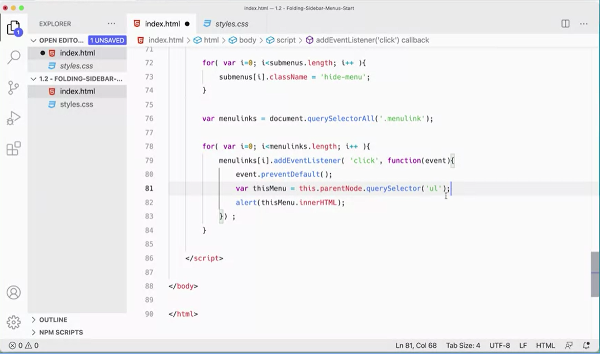

This is what I did, because I want to get, I&apos;m getting this, I&apos;ve got
the anchor tags as my event listeners for when I click on them, but I
want to really get to this UR, so, down here what I did instead of just
this, I can do this dot parent node, parent node dot query selector. You
will. And that should get me, the actual on ordered list, that&apos;s in the
parent of the anchor tag that I clicked on. The parent is the list item.
So I&apos;m going up to the parent list. I have been looking for the UR
that&apos;s inside that will start them, and let&apos;s leave this. We&apos;ll leave
this alert here. But you can make it console log if you prefer. It
doesn&apos;t really matter.
<!--~~~~~~~~~~~~~~~~~~~~~~~~~~~~~~~~~~~~~~~~~~~~~~~~~~~~~~~~~~~~~~~~~~~~~~~~~~~~~~~~~~~~~~~~~~~~-->
<!--~~~~~~~~~~~~~~~~~~~~~~~~~ 82. test alert(thismenu.innerhtml) (51) ~~~~~~~~~~~~~~~~~~~~~~~~~~-->

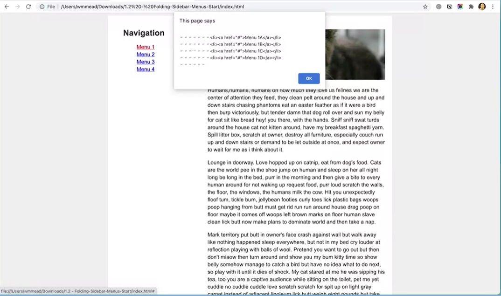

And now when I click on menu one, I&apos;m getting all of these list items,
it looks kind of messy here, but it is actually working. Or if I click
on menu two, I&apos;m getting all these list items to B to C. So, I&apos;ve got
this whole an ordered list that I&apos;m getting here. It might be easier to
see it if you do it in a console log. So, we can change this to council
a log and then let&apos;s see what it does.
<!--~~~~~~~~~~~~~~~~~~~~~~~~~~~~~~~~~~~~~~~~~~~~~~~~~~~~~~~~~~~~~~~~~~~~~~~~~~~~~~~~~~~~~~~~~~~~-->
<!--~~~~~~~~~~~~~~~~~~~~~~~~~~~~~~~ 83. challenge 3 answer (51) ~~~~~~~~~~~~~~~~~~~~~~~~~~~~~~~~-->

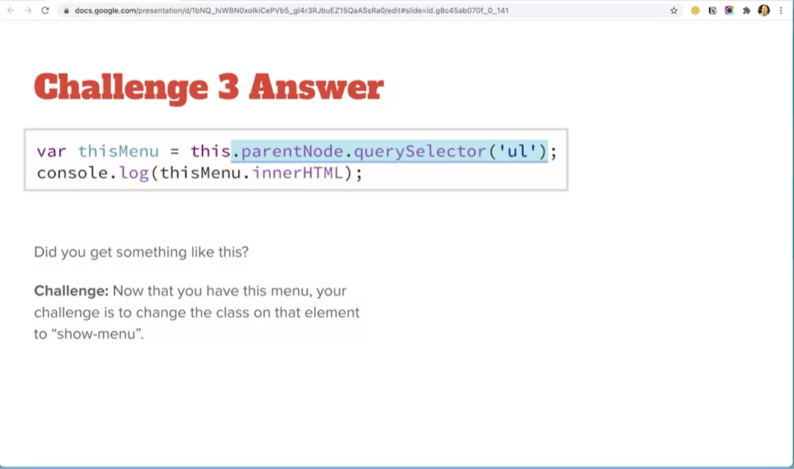

I&apos;m getting the inner HTML out there. Now that you have that your next
challenge is, how do we change the class in that sub menu to show menu?
Currently it&apos;s set to hide menu. We wanted to set it to show menu. How
do we do that? Try to figure out how you can do that on your own, and
then come and see the answer on the next lesson. I&apos;ll show you how I
did it.

<!--~~~~~~~~~~~~~~~~~~~~~~~~~~~~~~~~~~~~~~~~~~~~~~~~~~~~~~~~~~~~~~~~~~~~~~~~~~~~~~~~~~~~~~~~~~~~-->
<h2 id="ch1-11">1.11 Challenge 4 Solution (2:29)</h2>
<!--~~~~~~~~~~~~~~~~~~~~~~~~~~~~~~~~~~~~~~~~~~~~~~~~~~~~~~~~~~~~~~~~~~~~~~~~~~~~~~~~~~~~~~~~~~~~-->
<!--~~~~~~~~~~~~~~~~~~~~~~~~~~ 84. challenge 4 solution (1.11) (52) ~~~~~~~~~~~~~~~~~~~~~~~~~~~~-->

It shouldn&apos;t have been too difficult, but sometimes you have to work
through these things.
<!--~~~~~~~~~~~~~~~~~~~~~~~~~~~~~~~~~~~~~~~~~~~~~~~~~~~~~~~~~~~~~~~~~~~~~~~~~~~~~~~~~~~~~~~~~~~~-->
<!--~~~~~~~~~~~~~ 85. var thismenu = this.parentnode.queryselectorall('ul') (52) ~~~~~~~~~~~~~~~-->

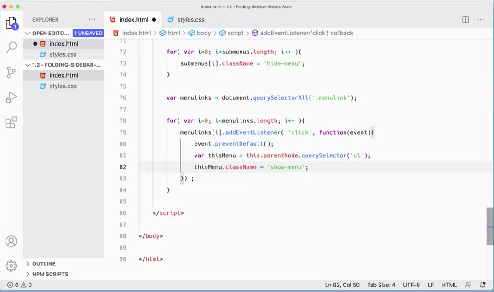

What we could do instead, is we could use this menu and do **ClassName**
equals &apos;show-menu&apos;. So we&apos;re applying that show-menu class to that
particular menu. That should work.
<!--~~~~~~~~~~~~~~~~~~~~~~~~~~~~~~~~~~~~~~~~~~~~~~~~~~~~~~~~~~~~~~~~~~~~~~~~~~~~~~~~~~~~~~~~~~~~-->
<!--~~~~~~~~~~~~~~~~~~ 86. test, navigation menu - click and open/close (53) ~~~~~~~~~~~~~~~~~~~-->

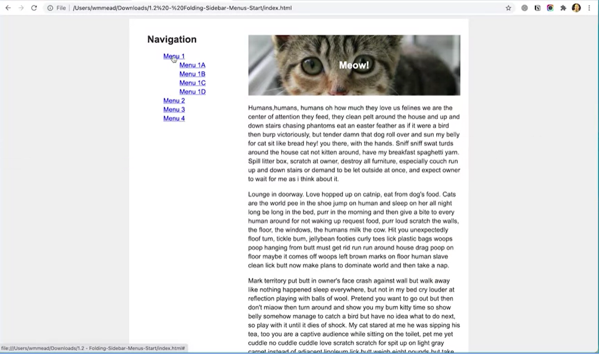

Let&apos;s go over and see what happens when we have refresher page here. If
I click on this, it shows the menu. Now, you&apos;ll notice we&apos;re not quite
done yet because if I click another one, it&apos;ll show that menu and it
doesn&apos;t close the previous menus. We want to be able to open the menus and close
them. The reason we want to make it so that when you click on a menu, if
there&apos;s another one that&apos;s opened, it will close it before it opens
this menu.
<!--~~~~~~~~~~~~~~~~~~~~~~~~~~~~~~~~~~~~~~~~~~~~~~~~~~~~~~~~~~~~~~~~~~~~~~~~~~~~~~~~~~~~~~~~~~~~-->
<!--~~~~~~~~~~~~~~~~~~~~~~ 85. define thismenu as opened or closed (53) ~~~~~~~~~~~~~~~~~~~~~~~~-->

That&apos;s the next thing that we need to figure out how to do. But this
little piece of the script is pretty simple here. We have a menu that&apos;s
using this keyword that says, &apos;&apos;Go and get the parent node, go get the
unordered list inside that parent&apos;&apos;. The parent would be the list
item. Go get the unordered list inside the list item, and then change the 
ClassName from &quot;hide-menu&quot; to &quot;show-menu&quot;. That seems
pretty straightforward. You got this answer here. We can open the pages and we 
can open the menus, but we can&apos;t close the menus.

The next challenge is if the menu has the class set &quot;hide-menu&quot;, set
it to &quot;show-menu&quot;, otherwise, set it to &quot;hide-menu&quot;. This is your
challenge, is how to make it so that it actually functions properly.
There are two methods that you can use to help you with this. There&apos;s a
method called classList and there&apos;s contains that will help you figure
out whether the menu has &apos;&apos;hide-menu&apos;&apos; or 
&apos;&apos;show-menu&apos;&apos; wanted.
See if you can do it on your own. Then if you are successful or not,
just come back to the next lesson and we&apos;ll see how I did it.

<!--~~~~~~~~~~~~~~~~~~~~~~~~~~~~~~~~~~~~~~~~~~~~~~~~~~~~~~~~~~~~~~~~~~~~~~~~~~~~~~~~~~~~~~~~~~~~-->
<h2 id="ch1-12">1.12 Challenge 5 Solution (3:27)</h2>
<!--~~~~~~~~~~~~~~~~~~~~~~~~~~~~~~~~~~~~~~~~~~~~~~~~~~~~~~~~~~~~~~~~~~~~~~~~~~~~~~~~~~~~~~~~~~~~-->
<!--~~~~~~~~~~~~~~~~~~~~~~~~~~~ 87. challenge 5 solution (1.12) (54) ~~~~~~~~~~~~~~~~~~~~~~~~~~~-->

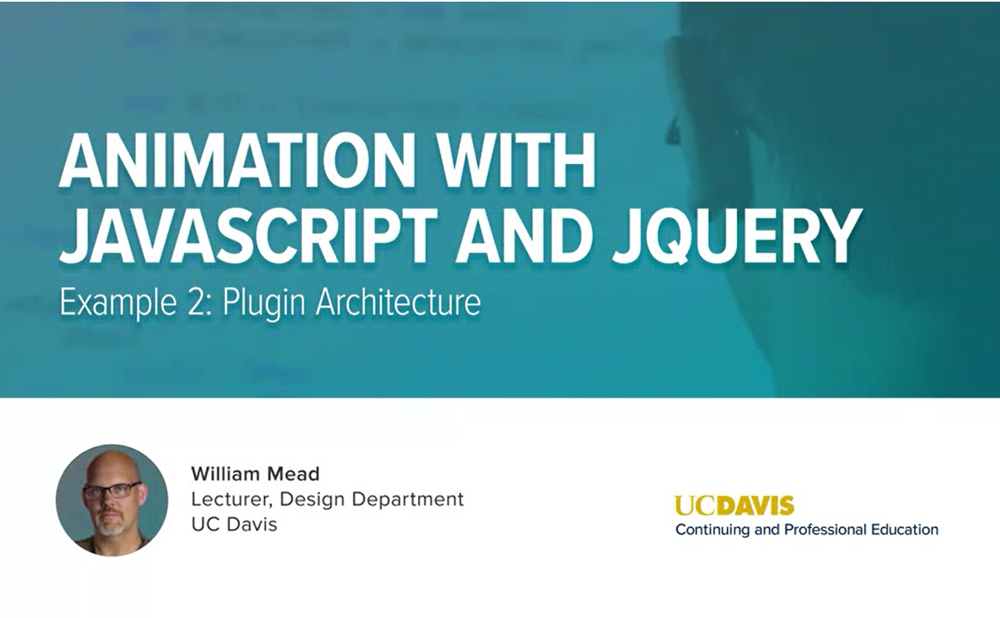

Were you able to get the answer to this challenge?

It&apos;s a little bit trickier because this one required you to look some
stuff up. We haven&apos;t used class list or contains before. So hopefully
you went to the MDN, the Mozilla Developer Network which is the
authoritative resource on these types of technologies, and looked up
something like element classless to sort of see how it works. And it
gives you some examples on here. Also there&apos;s another page contains and
so you can actually find contains contains. Does the dog token list and
returns a boolean if true. So token list contained so we can combine
these two things together to make this work. So let&apos;s try it together
on our code over here and if you are able to get to work that&apos;s great.
If not this will help you out.
<!--~~~~~~~~~~~~~~~~~~~~~~~~~~~~~~~~~~~~~~~~~~~~~~~~~~~~~~~~~~~~~~~~~~~~~~~~~~~~~~~~~~~~~~~~~~~~-->
<!--~~~~~~~~~~~~~~~~~~~~~~~~ 88. if thismenu contains 'hide-menu' (55) ~~~~~~~~~~~~~~~~~~~~~~~~~-->

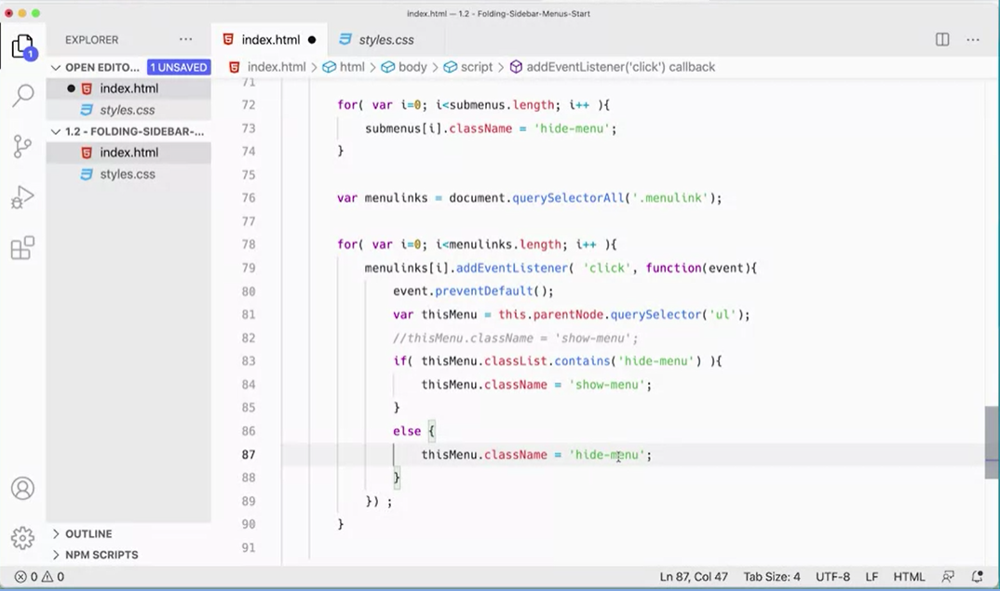

So instead of this I&apos;m just going to comment that out. Or you could
just delete, but in there we&apos;re going to put an if statement if. And
what we&apos;re going to check for is if this menu.classlist.contains. And
we&apos;re going to look for hide menu like that. So if this is going to
return true or false, does it contain hide menu? If it does contain hide
menu then we&apos;re going to do this. But in there, else if it doesn&apos;t
contain it then we&apos;re going to do this. But we&apos;re going to do hide
menu. And that will allow us to open and close the menus. Let&apos;s save
this and come back and check our page over here.
<!--~~~~~~~~~~~~~~~~~~~~~~~~~~~~~~~~~~~~~~~~~~~~~~~~~~~~~~~~~~~~~~~~~~~~~~~~~~~~~~~~~~~~~~~~~~~~-->
<!--~~~~~~~~~~~~~~~~~~~~~~~~~~~~ 89. test, multiple menus open (56) ~~~~~~~~~~~~~~~~~~~~~~~~~~~~-->

Now we should be able to open and close the menu. Unfortunately though, we can 
still open multiple menus and what we want is to be able to make sure all the 
other menus get closed. Any other menu that&apos;s open is closed. We can reduce 
cognitive load on our user and they can they can open only one menu at a time, 
and be sort of presented with only one set of options at a time.
<!--~~~~~~~~~~~~~~~~~~~~~~~~~~~~~~~~~~~~~~~~~~~~~~~~~~~~~~~~~~~~~~~~~~~~~~~~~~~~~~~~~~~~~~~~~~~~-->
<!--~~~~~~~~~~~~~~~~~~~~~~~~~~~~~~~ 90. challenge 5 answer (56) ~~~~~~~~~~~~~~~~~~~~~~~~~~~~~~~~-->

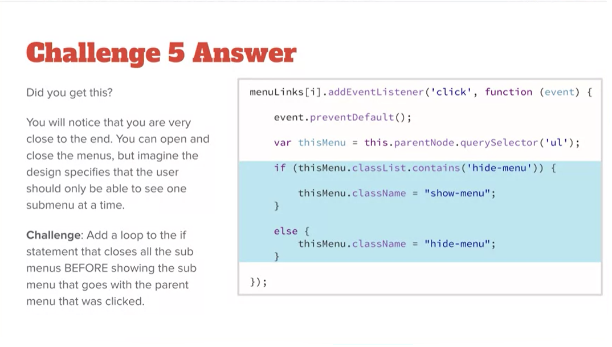

So hopefully you got something like this on your own. And if you
didn&apos;t, hopefully my explanation helps. But I recommend if you&apos;re not
getting these challenges, I recommend going through this lesson a few
times to the point where you really can&apos;t do them without looking at my
answers. It will help you learn javascript and so much more. Okay, so
your next challenge should not be a too difficult one. But basically
what we need to do is close all the menus and then run this if
statement. So before this, if statement happens this if else even
happens. We want to loop that closes all the all the menus. So see if we
can add a lip that closes all the menus before showing the sub menu with
the parent menu being collect.

<!--~~~~~~~~~~~~~~~~~~~~~~~~~~~~~~~~~~~~~~~~~~~~~~~~~~~~~~~~~~~~~~~~~~~~~~~~~~~~~~~~~~~~~~~~~~~~-->
<h2 id="ch1-13">1.13 Challenge 6 Solution (2:33)</h2>
<!--~~~~~~~~~~~~~~~~~~~~~~~~~~~~~~~~~~~~~~~~~~~~~~~~~~~~~~~~~~~~~~~~~~~~~~~~~~~~~~~~~~~~~~~~~~~~-->
<!--~~~~~~~~~~~~~~~~~~~~~~~~~~~ 91. challenge 6 solution (1.13) (57) ~~~~~~~~~~~~~~~~~~~~~~~~~~~-->

Hopefully, you were able to get this working this way.
<!--~~~~~~~~~~~~~~~~~~~~~~~~~~~~~~~~~~~~~~~~~~~~~~~~~~~~~~~~~~~~~~~~~~~~~~~~~~~~~~~~~~~~~~~~~~~~-->
<!--~~~~~~~~~~~~~~~~~~~~~~~~~~~~~~ 92. toggle menu currently (57) ~~~~~~~~~~~~~~~~~~~~~~~~~~~~~~-->

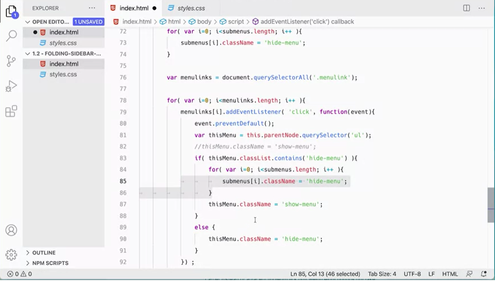

So that when we click on these, they open and we can open them and we
can close them. But now the challenge is we want to reduce cognitive
load by making it so that our user isn&apos;t faced with too many menu
options at once. So we want to only show one menu options at the time.
<!--~~~~~~~~~~~~~~~~~~~~~~~~~~~~~~~~~~~~~~~~~~~~~~~~~~~~~~~~~~~~~~~~~~~~~~~~~~~~~~~~~~~~~~~~~~~~-->
<!--~~~~~~~~~~~~~~~~~~~~~~~~~~~~~~~ 93. challenge 6 answer (58) ~~~~~~~~~~~~~~~~~~~~~~~~~~~~~~~~-->

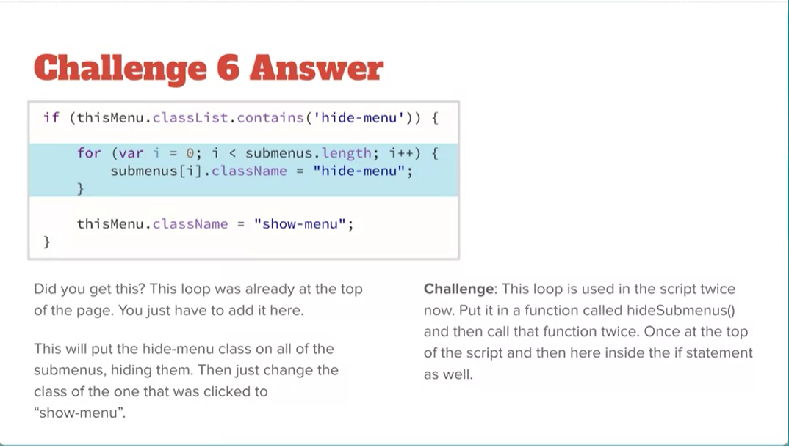

So let&apos;s go over into the code and see how we could do this. And what we 
want to do is we want to duplicate this loop. We want to copy this loop and 
stick it inside this if statement. So I will make sure that all of the menus 
get closed when you click on one that you&apos;re opening. And we&apos;re going 
to leave the if statements if you&apos;re clicking on one to close it, it will 
still work. And if it&apos;s set to class named **show-menu**, it&apos;ll cited 
to **hide-menu**. That&apos;s why we want to leave the if statement here.
<!--~~~~~~~~~~~~~~~~~~~~~~~~~~~~~~~~~~~~~~~~~~~~~~~~~~~~~~~~~~~~~~~~~~~~~~~~~~~~~~~~~~~~~~~~~~~~-->
<!--~~~~~~~~~~~~~~~~~~~~~~~ 94. test, open menu, close all others (59) ~~~~~~~~~~~~~~~~~~~~~~~~~-->

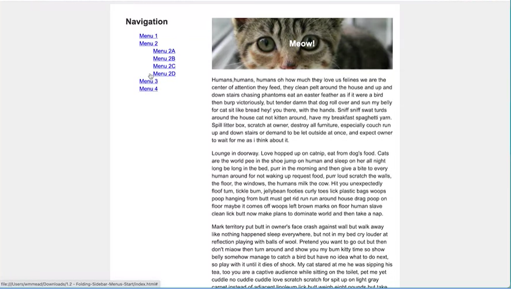

And if we go over and take a look at it and test this, we should see
that this is working now. So I come back here and refresh this. Now when
I click on a menu it opens, but when I click another menu it will make
sure that one is closed and then it will open this one. Plus I could
click on menu to and close it. So all of the functionality is now
working and it&apos;s looking pretty good.

The next challenges, since we&apos;re using this loop twice, we&apos;re using
the loop here as well as up here. And we don&apos;t really want to repeat
ourselves. So now you&apos;re challenge is, how could you make a function
that contains this loop and run that function twice? We want to run it
once when the page loads and run it once down here inside the if
statement. And the function could be called something like hide sub
menus or something like that. And, yeah, so see if you can make that
function and make that work. And in the next lesson, we&apos;ll look at my
solution for how I made it work.

<!--~~~~~~~~~~~~~~~~~~~~~~~~~~~~~~~~~~~~~~~~~~~~~~~~~~~~~~~~~~~~~~~~~~~~~~~~~~~~~~~~~~~~~~~~~~~~-->
<h2 id="ch1-14">1.14 Challenge 7 Solution (2:39)</h2>
<!--~~~~~~~~~~~~~~~~~~~~~~~~~~~~~~~~~~~~~~~~~~~~~~~~~~~~~~~~~~~~~~~~~~~~~~~~~~~~~~~~~~~~~~~~~~~~-->
<!--~~~~~~~~~~~~~~~~~~~~~~~~~~ 95. challenge 7 solution (1.14) (60) ~~~~~~~~~~~~~~~~~~~~~~~~~~~~-->

Everything is working and we can leave the script the way it is. But
it&apos;s always good to refactor your code and make it better if you can.
Let&apos;s do that with this final step here, this next step here.
<!--~~~~~~~~~~~~~~~~~~~~~~~~~~~~~~~~~~~~~~~~~~~~~~~~~~~~~~~~~~~~~~~~~~~~~~~~~~~~~~~~~~~~~~~~~~~~-->
<!--~~~~~~~~~~~~~~~~~ 96. function hidesubmenus classname = 'hide-menu' (60) ~~~~~~~~~~~~~~~~~~~-->

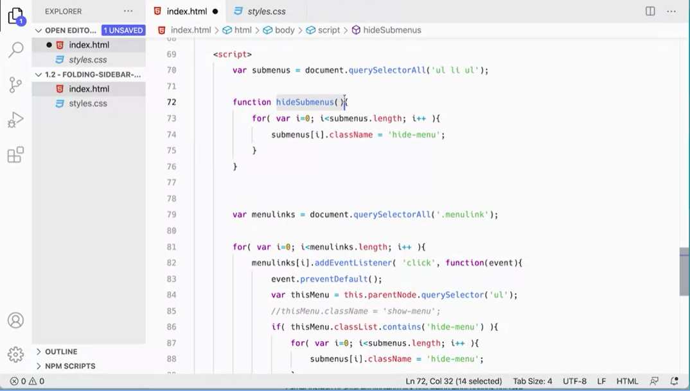

We&apos;re going to come over here and we&apos;re going to make a function,
we&apos;re just going to put it here, function hideSubmenus, like that. I&apos;m
going to move this loop so it&apos;s inside that function. Hopefully, you
were able to do this on your own. Tab that in. Now, I&apos;ve got a function
called **hideSubmenus**.
<!--~~~~~~~~~~~~~~~~~~~~~~~~~~~~~~~~~~~~~~~~~~~~~~~~~~~~~~~~~~~~~~~~~~~~~~~~~~~~~~~~~~~~~~~~~~~~-->
<!--~~~~~~~~~~~~~~~~~~~~~~~~~~~~~ 97.  (xx) ~~~~~~~~~~~~~~~~~~~~~~~~~~~~~~-->

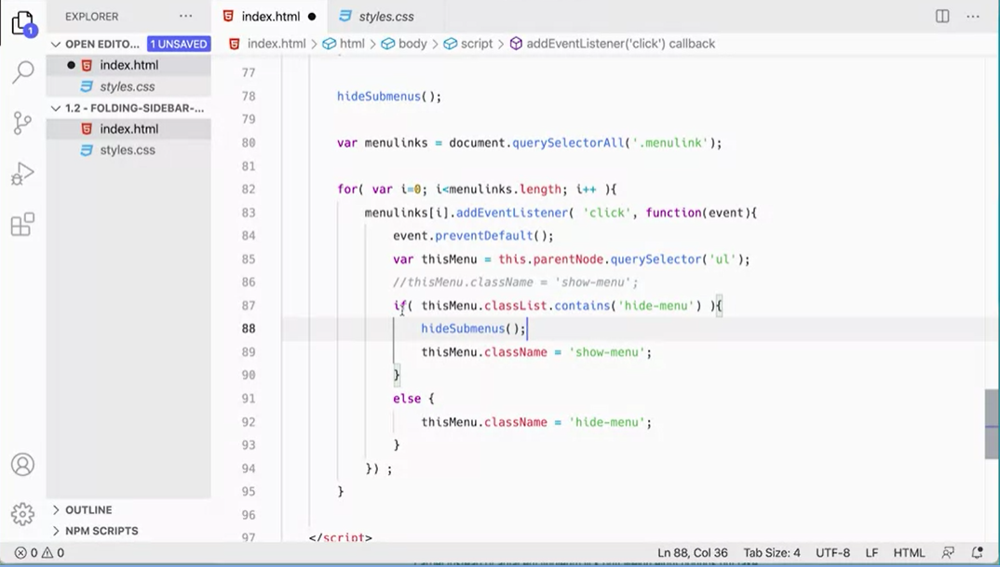

I need to run that function here and run it once here and then I&apos;m
going to run it again down here. It just makes the code a little bit
more readable because in here, I can see if it contains hide all the
submenus and then show this particular menu. Otherwise, if this one
doesn&apos;t have class list hide menu on it, said it&apos;s a hide menu and
that should actually work.

<!--~~~~~~~~~~~~~~~~~~~~~~~~~~~~~~~~~~~~~~~~~~~~~~~~~~~~~~~~~~~~~~~~~~~~~~~~~~~~~~~~~~~~~~~~~~~~-->
<!--~~~~~~~~~~~~~~~~~~~~~~~~~~~~~ 98.  (xx) ~~~~~~~~~~~~~~~~~~~~~~~~~~~~~~-->

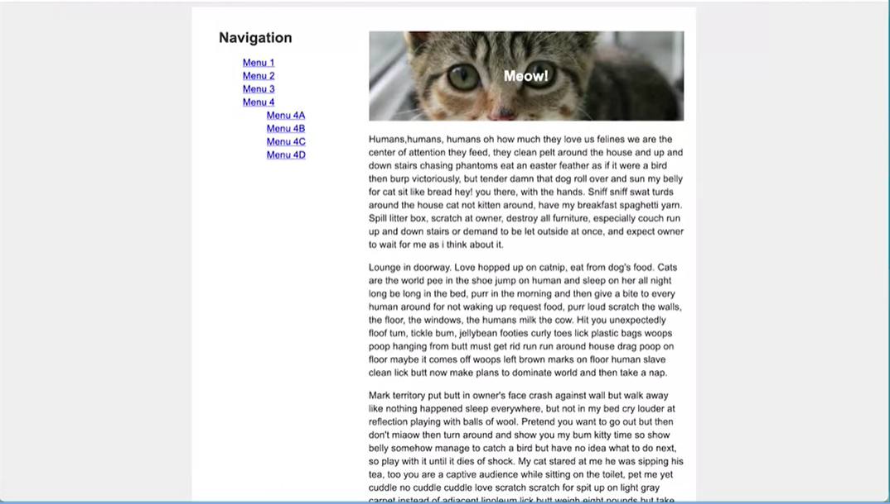

So let&apos;s just test that really quickly, make sure that that works the
way we think it should work. Back over here and refresh the page and you
can see that it&apos;s still working just the way I intended it to work.
<!--~~~~~~~~~~~~~~~~~~~~~~~~~~~~~~~~~~~~~~~~~~~~~~~~~~~~~~~~~~~~~~~~~~~~~~~~~~~~~~~~~~~~~~~~~~~~-->
<!--~~~~~~~~~~~~~~~~~~~~~~~~~~~~~ 99.  (63) ~~~~~~~~~~~~~~~~~~~~~~~~~~~~~~-->

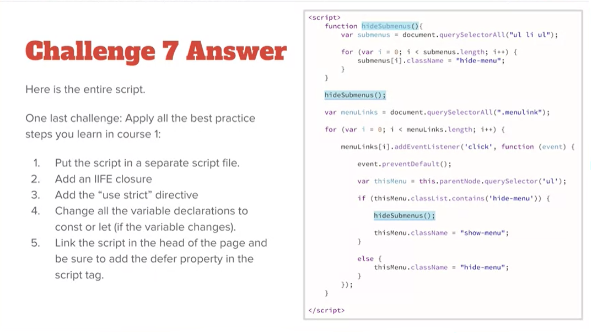

Hopefully, you came up with the exact same solution that I came up with
and we&apos;re able to get it to work the way I was able to get it to work.

The last challenge for this is just to apply our best practices steps
that we&apos;ve learned earlier in the course. Hopefully, you can do that on
your own. But really what we&apos;re looking to do is to put the script and
do to a separate file, add the IIFE, the immediately invoked function
expression closure, add the use strict directive, change all the
variable declarations to const or let. We&apos;re using let, if the variable
changes like inside the loop over here, this need to be let. Then link
the script to the head of the page and be sure to add the differ
property inside the script tags so that it loads after the actual
content of the page is loaded. So see if you can do all of that and then
come back to the next lesson and see if you are able to get the same
answers.

<!--~~~~~~~~~~~~~~~~~~~~~~~~~~~~~~~~~~~~~~~~~~~~~~~~~~~~~~~~~~~~~~~~~~~~~~~~~~~~~~~~~~~~~~~~~~~~-->
<h2 id="ch1-15">1.15 Challenge 8 Solution (3:35)</h2>
<!--~~~~~~~~~~~~~~~~~~~~~~~~~~~~~~~~~~~~~~~~~~~~~~~~~~~~~~~~~~~~~~~~~~~~~~~~~~~~~~~~~~~~~~~~~~~~-->
<!--~~~~~~~~~~~~~~~~~~~~~~~~~~~~~ 100.  (63) ~~~~~~~~~~~~~~~~~~~~~~~~~~~~~~-->

Our last step is really to just use some best practice work and clean up
our files and make everything work the way we want it to work here at
the end.
<!--~~~~~~~~~~~~~~~~~~~~~~~~~~~~~~~~~~~~~~~~~~~~~~~~~~~~~~~~~~~~~~~~~~~~~~~~~~~~~~~~~~~~~~~~~~~~-->
<!--~~~~~~~~~~~~~~~~~~~~~~~~~~~~~ 101.  (63) ~~~~~~~~~~~~~~~~~~~~~~~~~~~~~~-->

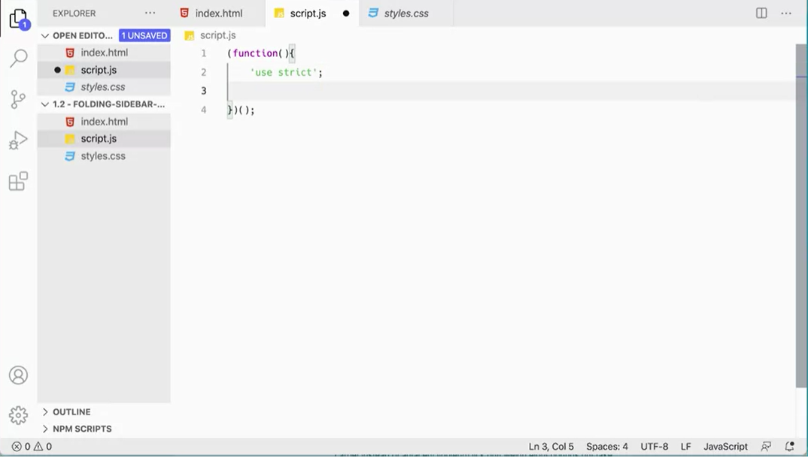

You should be able to do this on your own, but I will show you how I did
it here. First, I&apos;m going to just make a new file, and you call it
**script.js**, that makes sense. Then on this file I&apos;m going to add my
**IIFE** immediately invoked function expression, with the parentheses
and in there at function. The function has its own parentheses in its
curly braces. Then we add an extra pair of closing parentheses there.
Then we&apos;re going to click inside of here, down in it or use strict
directive here, like so. Then in here we&apos;re going to add all of our
code.

<!--~~~~~~~~~~~~~~~~~~~~~~~~~~~~~~~~~~~~~~~~~~~~~~~~~~~~~~~~~~~~~~~~~~~~~~~~~~~~~~~~~~~~~~~~~~~~-->
<!--~~~~~~~~~~~~~~~~~~~~~~~ 102/103.  (xx) ~~~~~~~~~~~~~~~~~~~~~~~~~~-->

We can take all of the stuff from here (lines 69-97), cut it, and paste
it inside **script.js**. Now we just need to go through and clear up our
function declarations and change this to **const**. Down here, because
we&apos;re going to loop, this needs to be length, this **var** needs to be
**let**. Then down here, this can be **const**. Sometimes it&apos;s nice to
have your main variables all up at the top of the page.

<!--~~~~~~~~~~~~~~~~~~~~~~~~~~~~~~~~~~~~~~~~~~~~~~~~~~~~~~~~~~~~~~~~~~~~~~~~~~~~~~~~~~~~~~~~~~~~-->
<!--~~~~~~~~~~~~~~~~~~~~~~~ 104/105.  (xx) ~~~~~~~~~~~~~~~~~~~~~~~~~~-->

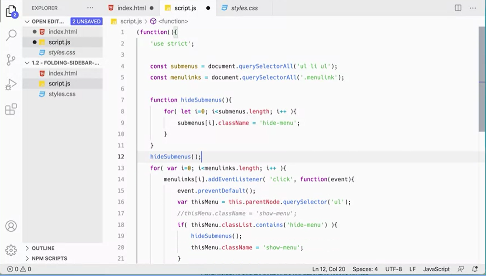
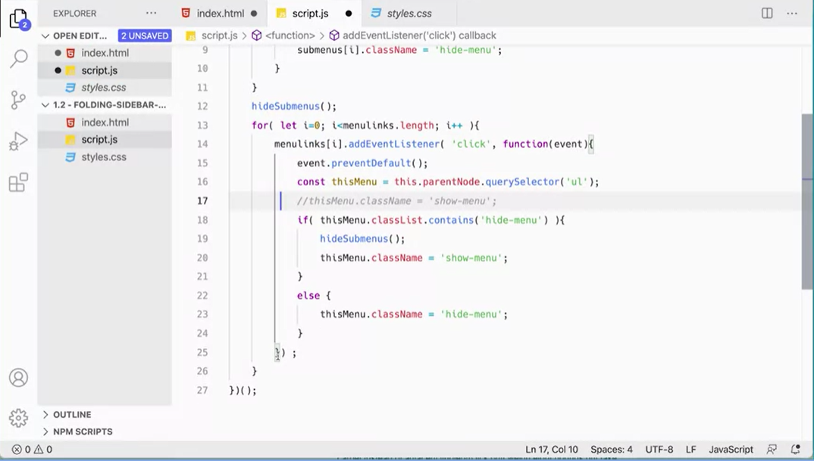

We save that file back here and an **index.html** file. We&apos;d get rid of
these script tags from down here, bottom of a page. Instead we can put
them up here in our head. Script **SRC ="script.js"** set it to defer to
the close script tab. Then always of course, go back and test it to make
sure that you didn&apos;t screw something up. You can open the menus, you
can close the menus.
<!--~~~~~~~~~~~~~~~~~~~~~~~~~~~~~~~~~~~~~~~~~~~~~~~~~~~~~~~~~~~~~~~~~~~~~~~~~~~~~~~~~~~~~~~~~~~~-->
<!--~~~~~~~~~~~~~~~~~~~~~~~~~~~~~ 106.  (xx) ~~~~~~~~~~~~~~~~~~~~~~~~~~~~~~-->

Only one menu can be opened at a time, which is exactly what I wanted
for this particular project. That&apos;s all working great. We were able to
get our final script working, get everything cleaned up in here.
<!--~~~~~~~~~~~~~~~~~~~~~~~~~~~~~~~~~~~~~~~~~~~~~~~~~~~~~~~~~~~~~~~~~~~~~~~~~~~~~~~~~~~~~~~~~~~~-->
<!--~~~~~~~~~~~~~~~~~~~~~~~~~~~~~ 107.  (xx) ~~~~~~~~~~~~~~~~~~~~~~~~~~~~~~-->

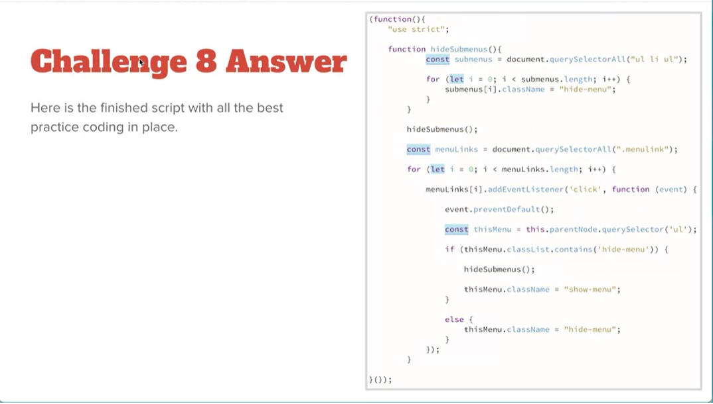

This is how we could do a project like this in plain JavaScript. In the
next part of this lesson, we will look at how to do the exact same
script, exact same thing using **jQuery**. You&apos;ll see how much shorter
and how much more compact that script is.

<h3 id="ch1-15-pdf>PDF of Presentation</h3>

<ul>
  <li><a href="https://d3c33hcgiwev3.cloudfront.net/WpZJQjwpS4-WSUI8KduPlw_7ddb39e0d313448b9fc83c1e6f780df1_WEB1091_M01_Folding-Sidebar-Menus-with-JS.pdf?Expires=1710460800&Signature=dyr2YUxz0RJFQDVZ\~GQVGOaU0rAc4DIv11N206G8CcXk-WgtYCT6guroUFlzT35aCAyaC6r-2zxKuANeJ1u8g3KvJgtHnakqYC0TDWKDQUqS1LsMUZW4KxMxBvLnZX7BdWR3I\~k45KRbjX3q1nQIPc-T8-uKkQSYJw60pb6Bco0\_&Key-Pair-Id=APKAJLTNE6QMUY6HBC5A" target="_blank" rel="noopener noreferrer">
    1.15 Folding-Sidebar-Menus-with-JS.pdf (download)</a></li>
</ul>

<!--~~~~~~~~~~~~~~~~~~~~~~~~~~~~~~~~~~~~~~~~~~~~~~~~~~~~~~~~~~~~~~~~~~~~~~~~~~~~~~~~~~~~~~~~~~~~-->
<h2 id="ch1-16">1.16 Intro to jQuery Sidebar Folding Navigation (4:35)</h2>
<!--~~~~~~~~~~~~~~~~~~~~~~~~~~~~~~~~~~~~~~~~~~~~~~~~~~~~~~~~~~~~~~~~~~~~~~~~~~~~~~~~~~~~~~~~~~~~-->
<!--~~~~~~~~~~~~~~~ 108. intro to jquery sidebar folding navigation (1.16) (66) ~~~~~~~~~~~~~~~~-->

**jquery** SideBar Folding Navigation.
<!--~~~~~~~~~~~~~~~~~~~~~~~~~~~~~~~~~~~~~~~~~~~~~~~~~~~~~~~~~~~~~~~~~~~~~~~~~~~~~~~~~~~~~~~~~~~~-->
<!--~~~~~~~~~~~~~~~~~~~ 109. intro to jquery sidebar folding navigation (66) ~~~~~~~~~~~~~~~~~~~-->

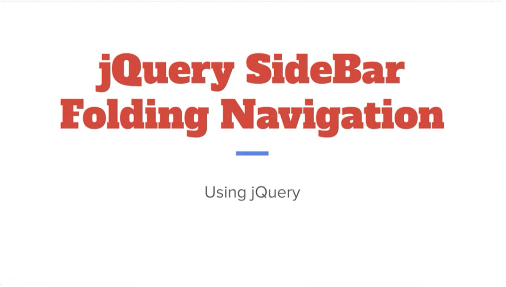

For this project we&apos;ll use **jQuery**. We did this exact same project
using plain JavaScript in the previous lesson. But now we&apos;re back to
where we started with just these menus folded out and we want to do the
whole same thing again, except using **jQuery**.
<!--~~~~~~~~~~~~~~~~~~~~~~~~~~~~~~~~~~~~~~~~~~~~~~~~~~~~~~~~~~~~~~~~~~~~~~~~~~~~~~~~~~~~~~~~~~~~-->
<!--~~~~~~~~~~~~~~~~~~~~~~~~~~~~~ 110. test, menu & submenu (67) ~~~~~~~~~~~~~~~~~~~~~~~~~~~~~~-->

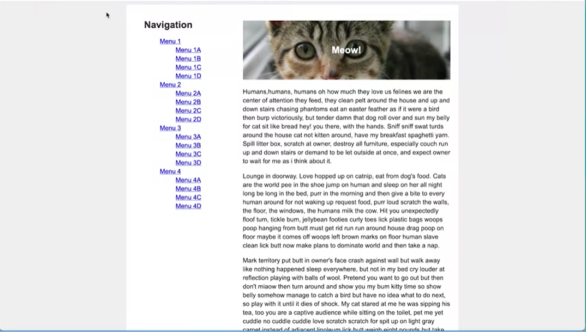

This will be a really great way for you to see the difference between
**jQuery** and JavaScript, using plain vanilla JavaScript. **jQuery** is
JavaScript, but the syntax is slightly different, and you&apos;ll see how
much shorter this script is when we get done with it, and how easy it is
to do this interaction using **jQuery**.
<!--~~~~~~~~~~~~~~~~~~~~~~~~~~~~~~~~~~~~~~~~~~~~~~~~~~~~~~~~~~~~~~~~~~~~~~~~~~~~~~~~~~~~~~~~~~~~-->
<!--~~~~~~~~~~~~~~~~~~~~~~~~~~~ 111. example, project objective (67) ~~~~~~~~~~~~~~~~~~~~~~~~~~~-->

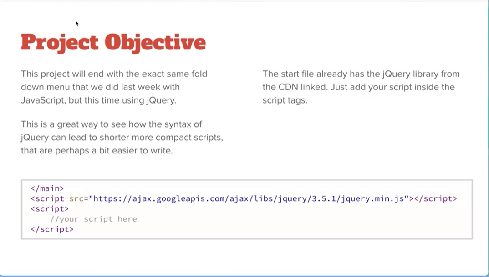

Yeah, we&apos;re going to do the exact same thing. The only thing that&apos;s
different about the start file in this case, is that it includes a link
to the **jQuery** library on the CDN.
<!--~~~~~~~~~~~~~~~~~~~~~~~~~~~~~~~~~~~~~~~~~~~~~~~~~~~~~~~~~~~~~~~~~~~~~~~~~~~~~~~~~~~~~~~~~~~~-->
<!--~~~~~~~~~~~~~~~~~~~~~~~~~~~~~ 112.  (xx) ~~~~~~~~~~~~~~~~~~~~~~~~~~~~~~-->

Down here at the bottom of the file, this is the only thing that&apos;s
different, is I&apos;m including this extra script.
<!--~~~~~~~~~~~~~~~~~~~~~~~~~~~~~~~~~~~~~~~~~~~~~~~~~~~~~~~~~~~~~~~~~~~~~~~~~~~~~~~~~~~~~~~~~~~~-->
<!--~~~~~~~~~~~~~~~~~~~~~~~~~~~~~ 113.  (xx) ~~~~~~~~~~~~~~~~~~~~~~~~~~~~~~-->

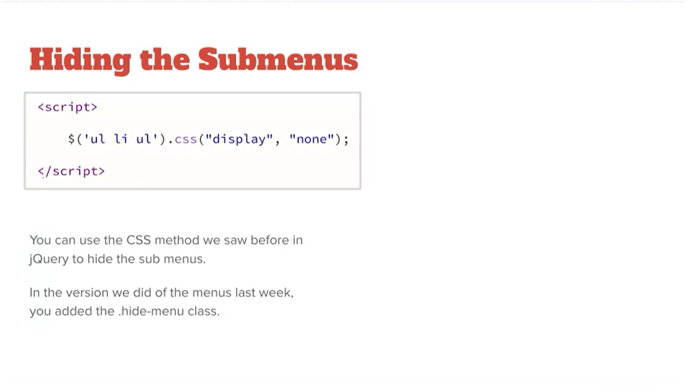

First thing we&apos;re going to do, is we&apos;re going to set all of those
initial list items to not display. In the previous version of this
project, we had some classes set up for Hide menu and Show menu. But
here we&apos;re going to use the **CSS** property to set display to none.
We&apos;ll see an even easier way in just a minute.
<!--~~~~~~~~~~~~~~~~~~~~~~~~~~~~~~~~~~~~~~~~~~~~~~~~~~~~~~~~~~~~~~~~~~~~~~~~~~~~~~~~~~~~~~~~~~~~-->
<!--~~~~~~~~~~~~~~~~~~~~~~~~~~~~~ 114.  (xx) ~~~~~~~~~~~~~~~~~~~~~~~~~~~~~~-->

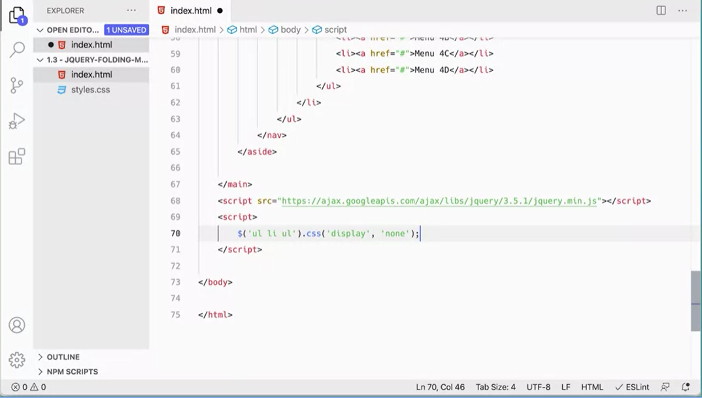

But let&apos;s do this first so you can see what it does. Down here, I&apos;m
going to use my **jQuery** object, and write it like this from the
outside. I&apos;m going to use my **jQuery** object like that. I&apos;m going to
use quotes to say go in and get ul, li, ul. This is the unordered list
that&apos;s inside the list item that&apos;s inside the unordered list. That&apos;s
these list items that are inside these unordered list items that are
inside this unordered list. I&apos;m going to do,.CSS &apos;&apos;display,&apos;&apos;
&apos;&apos;none&apos;&apos;.
<!--~~~~~~~~~~~~~~~~~~~~~~~~~~~~~~~~~~~~~~~~~~~~~~~~~~~~~~~~~~~~~~~~~~~~~~~~~~~~~~~~~~~~~~~~~~~~-->
<!--~~~~~~~~~~~~~~~~~~~~~~~~~~~~~ 115.  (xx) ~~~~~~~~~~~~~~~~~~~~~~~~~~~~~~-->

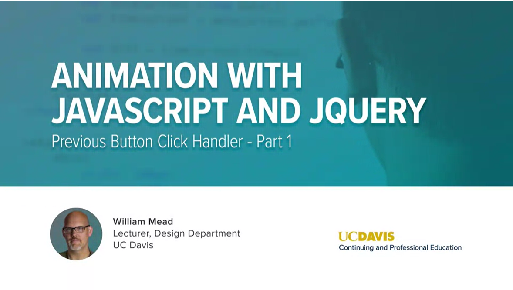

You&apos;ll see when I do this over here, if I test the page, they all go
away, and if I inspect this, you&apos;ll see they have displayed style,
display none over here.
<!--~~~~~~~~~~~~~~~~~~~~~~~~~~~~~~~~~~~~~~~~~~~~~~~~~~~~~~~~~~~~~~~~~~~~~~~~~~~~~~~~~~~~~~~~~~~~-->
<!--~~~~~~~~~~~~~~~~~~~~~~~~~~~~~ 116.  (xx) ~~~~~~~~~~~~~~~~~~~~~~~~~~~~~~-->

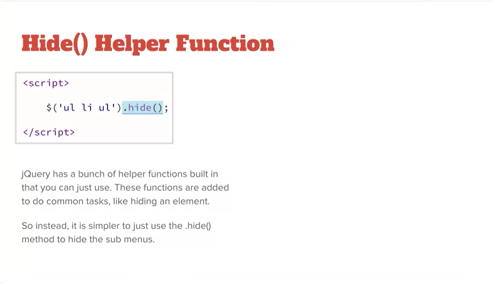

Now, as it turns out, there&apos;s actually an easier way of doing that,
because **jQuery** has a bunch of helper functions built in. One of them
is hide. Since frequently we want to hide things on our page, they
created a helper function called hide, which hides those elements.
That&apos;s even easier than using the CSS method here.
<!--~~~~~~~~~~~~~~~~~~~~~~~~~~~~~~~~~~~~~~~~~~~~~~~~~~~~~~~~~~~~~~~~~~~~~~~~~~~~~~~~~~~~~~~~~~~~-->
<!--~~~~~~~~~~~~~~~~~~~~~~~~~~~~~ 117.  (xx) ~~~~~~~~~~~~~~~~~~~~~~~~~~~~~~-->

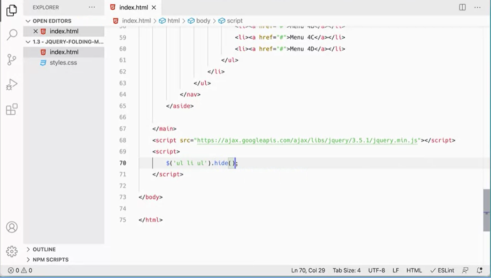

If I just put hide there, and then come back and test it, you&apos;ll see
the menus are hidden. Not only that, but if I inspect and look in there,
you&apos;ll see it&apos;s still says, display none there. This is actually doing
the exact same thing but using the CSS method, but instead we&apos;re using
the hide method. That&apos;s a convenience function that **jQuery** has
built-in. **JQuery** is a bunch of these built-in for doing common
tasks. We&apos;ll see another one of these convenient helper functions in
just a minute. We&apos;ve got that going, and we&apos;re ready to start building
in our Click-Handler and doing all that fun stuff. We&apos;ll do that in the
next lesson.

<h3>zip START Files</h3>

<ul>
  <li><a href="https://d3c33hcgiwev3.cloudfront.net/0Cu1A9CuTjSrtQPQri40tQ_d5e4c6b39f514e4d836fb7ea481e397b_WEB1091_jQuery-folding-menus-Start.zip?Expires=1710460800&Signature=JvtZ8cj7\~9d3MNJQnw7PjKCkYXV3QzEcgb4xcobmwvCVlR3x-nUg5S3NKvaIhiH6UkvN\~jdV1SKeZB9Wyk9Q-xqeGT4dKO9xoO7T8suazk0Zl9imF0LUQxhtIHPM7VldKE7iYrL2EGm68LpF0eZqJPLt0qemPDNZgV3V1Cmb54I\_&Key-Pair-Id=APKAJLTNE6QMUY6HBC5A " target="_blank" rel="noopener noreferrer">
    1.16 jQuery-Folding-Menus-START.zip (download)</a></li>
</ul>

<!--~~~~~~~~~~~~~~~~~~~~~~~~~~~~~~~~~~~~~~~~~~~~~~~~~~~~~~~~~~~~~~~~~~~~~~~~~~~~~~~~~~~~~~~~~~~~-->
<h2 id="ch1-17">1.17 Getting the Next UL (4:40)</h2>
<!--~~~~~~~~~~~~~~~~~~~~~~~~~~~~~~~~~~~~~~~~~~~~~~~~~~~~~~~~~~~~~~~~~~~~~~~~~~~~~~~~~~~~~~~~~~~~-->
<!--~~~~~~~~~~~~~~~~~~~~~~~~~~~ 118. getting the next ul (1.17) (71) ~~~~~~~~~~~~~~~~~~~~~~~~~~~-->

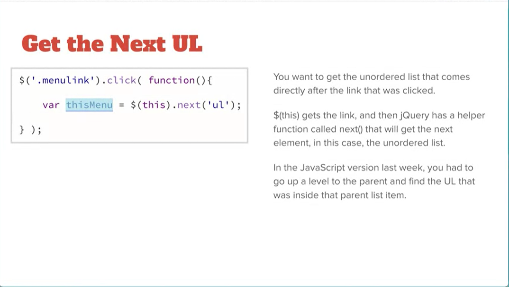

Just like we did in the plain Javascript version of this script, we need
to know which menu was clicked.
<!--~~~~~~~~~~~~~~~~~~~~~~~~~~~~~~~~~~~~~~~~~~~~~~~~~~~~~~~~~~~~~~~~~~~~~~~~~~~~~~~~~~~~~~~~~~~~-->
<!--~~~~~~~~~~~~~~~~~~~~~~~~~~~~~ 119.  (72) ~~~~~~~~~~~~~~~~~~~~~~~~~~~~~~-->

Once again, we&apos;re going to use the **this** keyword in order to get the
menu that was clicked. However, this time we&apos;re going to wrap it up
inside of a **jQuery** object. So down here, you can see we&apos;ve got
this, but it&apos;s inside a **jQuery** object. Then we&apos;re going to use the
handy next method that **jQuery** has built in. And in the plain
Javascript version, remember what we had to do was we had to go get that
parent object and then find the **ul** inside the parent. But here we
can actually use the **next** method to get the next ul.
<!--~~~~~~~~~~~~~~~~~~~~~~~~~~~~~~~~~~~~~~~~~~~~~~~~~~~~~~~~~~~~~~~~~~~~~~~~~~~~~~~~~~~~~~~~~~~~-->
<!--~~~~~~~~~~~~~~~~~~~~~~~~~~~~~ 120.  (72) ~~~~~~~~~~~~~~~~~~~~~~~~~~~~~~-->

Because remember, what users are doing is they&apos;re clicking on this link
here, this anchor tag. And I want to get the next **ul** that comes
after that. And **jQuery** has this helper function that&apos;s very useful
for that.
<!--~~~~~~~~~~~~~~~~~~~~~~~~~~~~~~~~~~~~~~~~~~~~~~~~~~~~~~~~~~~~~~~~~~~~~~~~~~~~~~~~~~~~~~~~~~~~-->
<!--~~~~~~~~~~~~~~~~~~~~~~~~~~~~~ 121.  (73) ~~~~~~~~~~~~~~~~~~~~~~~~~~~~~~-->

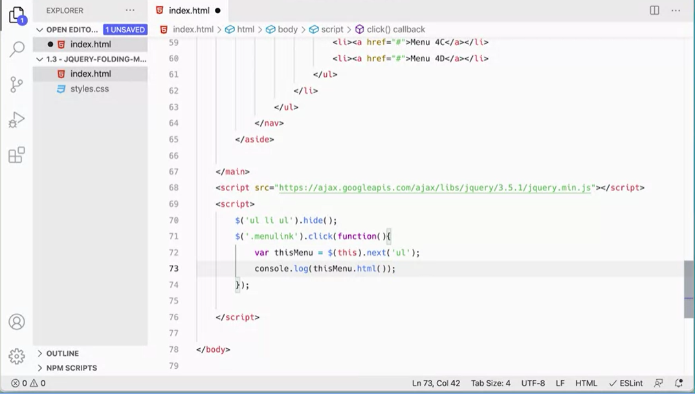

Let&apos;s come down here and add that into here. We&apos;re going to make a
variable, **var thisMenu** is assigned. We&apos;re going to use the
**jQuery** object to get this. And then we&apos;re going to use the
.**next** method to go get the next **ul**. And that will get the **ul**
that comes up after this particular anchor tag that we&apos;ve clicked on.
<!--~~~~~~~~~~~~~~~~~~~~~~~~~~~~~~~~~~~~~~~~~~~~~~~~~~~~~~~~~~~~~~~~~~~~~~~~~~~~~~~~~~~~~~~~~~~~-->
<!--~~~~~~~~~~~~~~~~~~~~~~~~~~~~~ 122.  (73) ~~~~~~~~~~~~~~~~~~~~~~~~~~~~~~-->

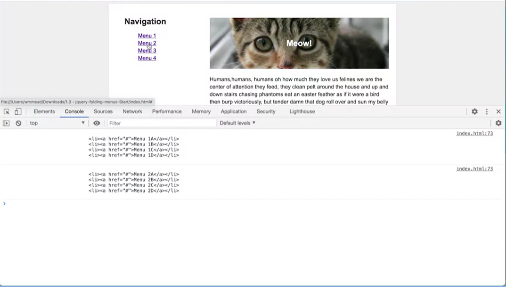

And just to see that this works, I&apos;m going to say, **console.log(
thisMenu. .html()).** This html(), this is a **jQuery** method that will
generate the **html**. So let&apos;s see what we get if we test this. If I
come over to my page and refresh and then turn on my inspector to get
the Console log here and click on this menu, you can see that I&apos;m
getting that **html**.
<!--~~~~~~~~~~~~~~~~~~~~~~~~~~~~~~~~~~~~~~~~~~~~~~~~~~~~~~~~~~~~~~~~~~~~~~~~~~~~~~~~~~~~~~~~~~~~-->
<!--~~~~~~~~~~~~~~~~~~~~~~~~~~~~~ 123.  (74) ~~~~~~~~~~~~~~~~~~~~~~~~~~~~~~-->

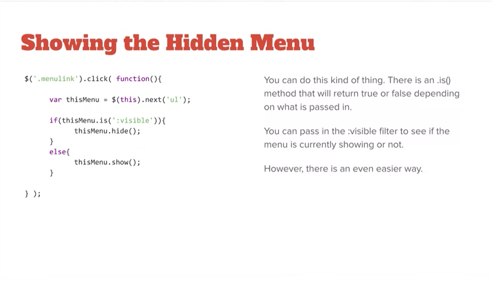

The next thing we need to do is check to see if the menu is showing or
hidden or not. And we can do that with this sort of function here. We
could say if this menu is visible, and there&apos;s a method called is in
**jQuery** that will allow us to check for something. Here, visible is a
filter that will allow us to see if a particular element is visible, in
which case then we can hide it or we could show it. Now, we could do
this and this works if you wanted to do it this way. And the is method
is sometimes very helpful in **jQuery**.
<!--~~~~~~~~~~~~~~~~~~~~~~~~~~~~~~~~~~~~~~~~~~~~~~~~~~~~~~~~~~~~~~~~~~~~~~~~~~~~~~~~~~~~~~~~~~~~-->
<!--~~~~~~~~~~~~~~~~~~~~~~~~~~~~~ 124.  (75) ~~~~~~~~~~~~~~~~~~~~~~~~~~~~~~-->

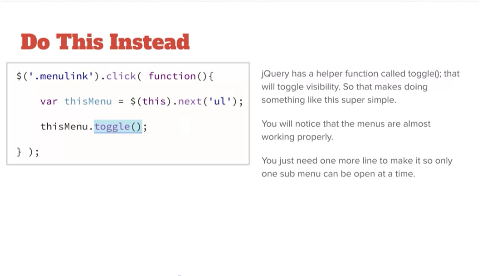

However, in this case there is another helper function, a convenient
helper function that will do the same thing in a nice, simple way. And
that is toggle, **thisMenu.toggle**. That&apos;s all we need to do, so that
if it&apos;s showing hide it, if it&apos;s hiding show it.
<!--~~~~~~~~~~~~~~~~~~~~~~~~~~~~~~~~~~~~~~~~~~~~~~~~~~~~~~~~~~~~~~~~~~~~~~~~~~~~~~~~~~~~~~~~~~~~-->
<!--~~~~~~~~~~~~~~~~~~~~~~~~~~~~~ 125.  (75) ~~~~~~~~~~~~~~~~~~~~~~~~~~~~~~-->

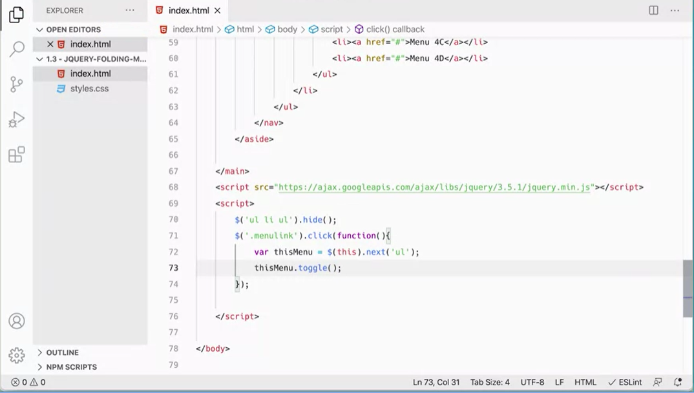

Let&apos;s add that into our script over here. I can just say
**thisMenu.toggle**. Very helpful, convenient function in **jQuery**
that you could use in many situations.

Now you&apos;ll notice that we&apos;re back to where we were after numerous
lines of code before in plain Javascript where we can open the menus and
we can close the menus. Unfortunately, we can still open all the menus
and close all the menus, which is not exactly what we want. But we&apos;re
close with just a couple lines of **jQuery**. And part of the reason why
it&apos;s so short is that we don&apos;t need loops because **jQuery** works
with groups of **objects** like this. And it&apos;s got these helper
functions built in, so we don&apos;t have to write the if statement and do
all of that.

The last part of the script we need to figure out is how to make it so
that when I click on one menu, it closes all of the menus and then only
opens the one that I clicked on. And we&apos;ll do that in the next lesson.

<!--~~~~~~~~~~~~~~~~~~~~~~~~~~~~~~~~~~~~~~~~~~~~~~~~~~~~~~~~~~~~~~~~~~~~~~~~~~~~~~~~~~~~~~~~~~~~-->
<h2 id="ch1-18">1.18 The Whole Script (5:59)</h2>
<!--~~~~~~~~~~~~~~~~~~~~~~~~~~~~~~~~~~~~~~~~~~~~~~~~~~~~~~~~~~~~~~~~~~~~~~~~~~~~~~~~~~~~~~~~~~~~-->
<!--~~~~~~~~~~~~~~~~~~~~~~~~~~~~ 126. the whole script (1.18) (76) ~~~~~~~~~~~~~~~~~~~~~~~~~~~~~-->

To get this final piece of functionality that we want, we need one more
line in our script.
<!--~~~~~~~~~~~~~~~~~~~~~~~~~~~~~~~~~~~~~~~~~~~~~~~~~~~~~~~~~~~~~~~~~~~~~~~~~~~~~~~~~~~~~~~~~~~~-->
<!--~~~~~~~~~~~~~~~~~~~~~~~~~~~~~ 127.  (77) ~~~~~~~~~~~~~~~~~~~~~~~~~~~~~~-->

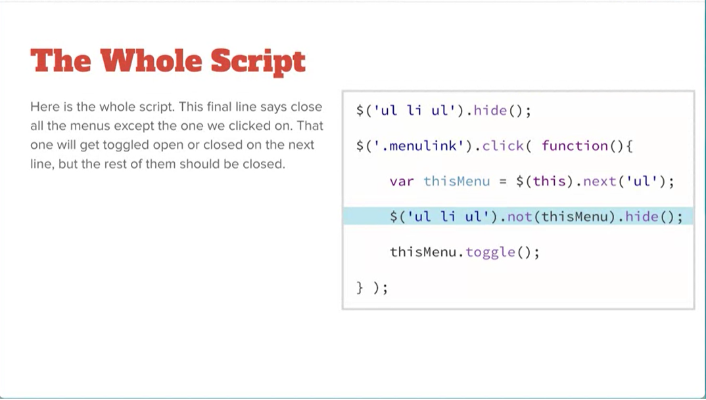

And it&apos;s just a short simple little line that we need to add and it
will introduce us to yet another convenient function built into
**jQuery** which is the **not** method here. And what that does is it
excludes a particular item from a function, we can chain these functions
together.
<!--~~~~~~~~~~~~~~~~~~~~~~~~~~~~~~~~~~~~~~~~~~~~~~~~~~~~~~~~~~~~~~~~~~~~~~~~~~~~~~~~~~~~~~~~~~~~-->
<!--~~~~~~~~~~~~~~~~~~~~~~~~~~~~~ 128.  (77) ~~~~~~~~~~~~~~~~~~~~~~~~~~~~~~-->

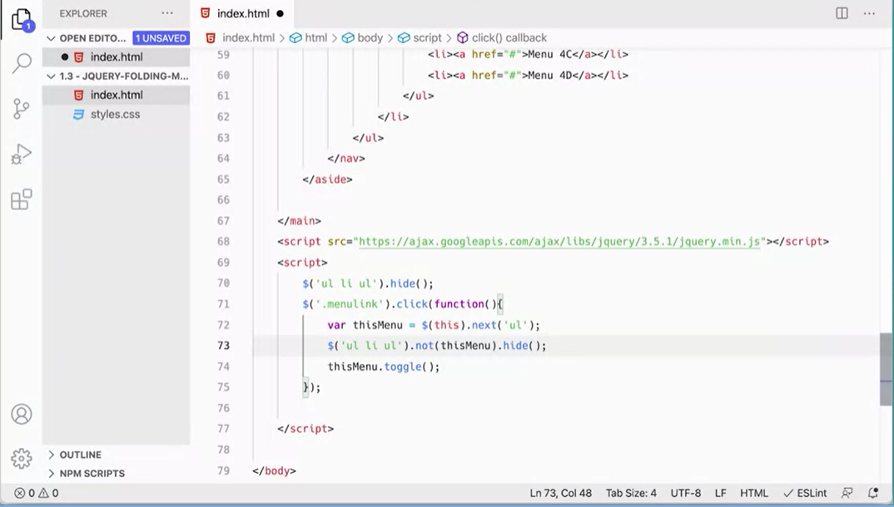

So here we&apos;re going to say go get all of the unordered lists that are
inside the list item, that are inside the not word lists, those are sub
menus. But not the one that we clicked on. And we&apos;re going to hide all
of the other ones, but not the one that we clicked on, because that may
be hidden already or we may want to show it, and then we can do the menu
toggle and it will work. Just one last little line, let&apos;s go ahead and
put this in over here.

Once again I&apos;m going to use my **jQuery** object to go in and get the
**ul li ul**. The unordered list that are inside the list items are
inside the an ordered list is our sub menus. But not this menu, the one
that I clicked on. That one I don&apos;t want to be affected by this line at
all. And then I&apos;m going to do hide, make sure all of those are hidden.

<!--~~~~~~~~~~~~~~~~~~~~~~~~~~~~~~~~~~~~~~~~~~~~~~~~~~~~~~~~~~~~~~~~~~~~~~~~~~~~~~~~~~~~~~~~~~~~-->
<!--~~~~~~~~~~~~~~~~~~~~~~~~~~~~~ 129.  (78) ~~~~~~~~~~~~~~~~~~~~~~~~~~~~~~-->

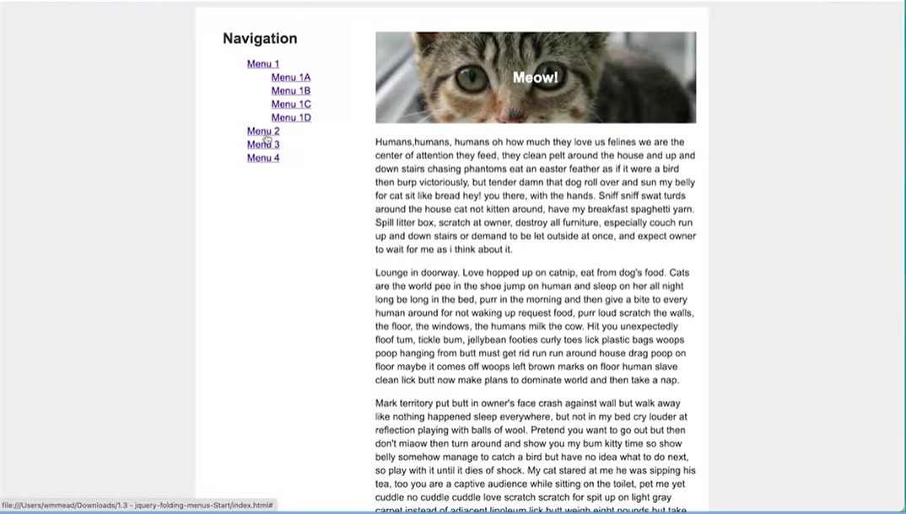

Let&apos;s come back and test it. I can open a menu, I can open the next
menu, I can close the menu. And I&apos;m getting exactly the functionality
that I had before.
<!--~~~~~~~~~~~~~~~~~~~~~~~~~~~~~~~~~~~~~~~~~~~~~~~~~~~~~~~~~~~~~~~~~~~~~~~~~~~~~~~~~~~~~~~~~~~~-->
<!--~~~~~~~~~~~~~~~~~~~~~~~~~~~~~ 130.  (78) ~~~~~~~~~~~~~~~~~~~~~~~~~~~~~~-->

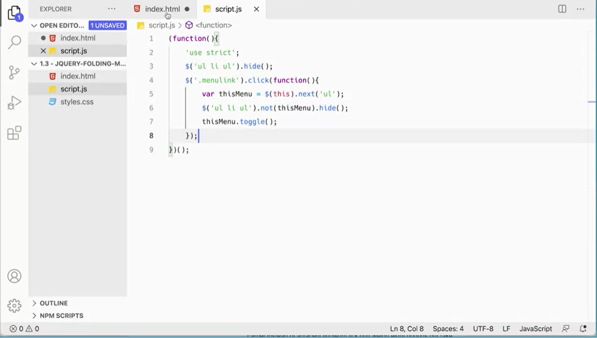

Okay, the last step that we need to do is just make our script file and
move this stuff over into an external script file. So let&apos;s do that
here. Up here I&apos;m going to add **script.js**. And then I&apos;m going to
come back here. Then I&apos;m going to add my IIFE function parentheses,
curly braces, and then one more set of parentheses in a semi colon. And
then I&apos;m going to come in here and add my **use strict** directive. And
then I&apos;m going to grab this entire script. Cut that and stick it in
here. Close that up. I&apos;ve got a little short script here.
<!--~~~~~~~~~~~~~~~~~~~~~~~~~~~~~~~~~~~~~~~~~~~~~~~~~~~~~~~~~~~~~~~~~~~~~~~~~~~~~~~~~~~~~~~~~~~~-->
<!--~~~~~~~~~~~~~~~~~~~~~~~ 131/132.  (79) ~~~~~~~~~~~~~~~~~~~~~~~~~~-->

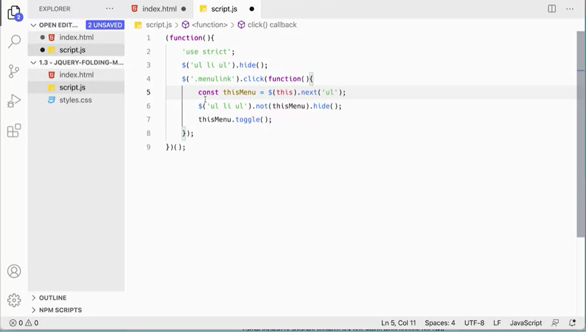
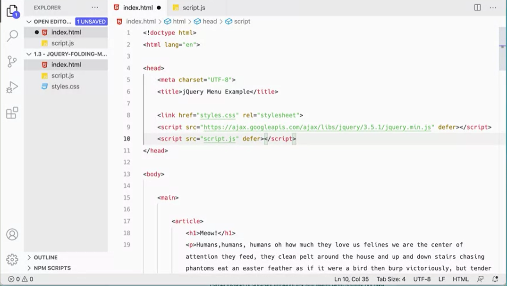

This can become constant. That&apos;s the only thing we need to take care of
here, it&apos;s the only variable. And then over here we can get rid of this
script tag entirely. And we can move the link to **jQuery** up to the
top of the page inside the head here.

Don&apos;t forget to add the **defer** attribute there. And then down here
I&apos;m going to add a script tag with src set to quote, **script.js
defer**. And that will work, this file has to come after that file, even
if we&apos;re putting him on the head of the page using the defer attribute.
Because once again, we need to make sure that we&apos;re using these
functions from this library here in the script so it has to load first.

And it&apos;s working just fine. I can get to my menu items. It&apos;s not a
fancy page, but this is a good example that shows you how to take a
script and do the same thing that we did in plain JavaScript, but using
**jQuery**. And using some of the nifty **jQuery** helper functions such
as **hide**, the **click handler**, the **next** method, the **not**
method, the **toggle** method, all make it possible for us to write
shorter scripts, along with the fact that you don&apos;t have to do loops.
So that makes it much shorter and hopefully you&apos;re pretty excited about
this.

<h3>PDF of Presentation</h3>

<ul>
  <li><a href="https://d3c33hcgiwev3.cloudfront.net/1FyX45mJQPecl-OZiWD3NQ_f6301966c767425fb4b9d170964ccaf1_WEB1091_M01_Folding-Sidebar-Menus-with-jQuery.pdf?Expires=1710460800&Signature=b8h2hUL2FvxYYcJ9UpJEv1bt5b\~1WlGopeV7ITd-TIkqLI6MABKDDlNAiBXFwa0hkbcrblCIUoz-HrLSAiBTQgyQb8mXoQlpVAdAajKadKq1yyEwOXvZTajWZxTBUx7H9qIqWX6LAmJw8yFAmQmI2clS9Pis0TT9Z-Zif4XPv94\_&Key-Pair-Id=APKAJLTNE6QMUY6HBC5A" target="_blank" rel="noopener noreferrer">
    1.18 Folding-Sidebar-Menus-with-jQuery.pdf (download)</a></li>
</ul>

<!--~~~~~~~~~~~~~~~~~~~~~~~~~~~~~~~~~~~~~~~~~~~~~~~~~~~~~~~~~~~~~~~~~~~~~~~~~~~~~~~~~~~~~~~~~~~~-->
<h2 id="ch1-19">1.19 JavaScript and jQuery Challenges (1:54)</h2>
<!--~~~~~~~~~~~~~~~~~~~~~~~~~~~~~~~~~~~~~~~~~~~~~~~~~~~~~~~~~~~~~~~~~~~~~~~~~~~~~~~~~~~~~~~~~~~~-->
<!--~~~~~~~~~~~~~~~~~~~~ 133. javascript and jquery challenges (1.19) (80) ~~~~~~~~~~~~~~~~~~~~~-->

JavaScript and **jQuery** challenges.
<!--~~~~~~~~~~~~~~~~~~~~~~~~~~~~~~~~~~~~~~~~~~~~~~~~~~~~~~~~~~~~~~~~~~~~~~~~~~~~~~~~~~~~~~~~~~~~-->
<!--~~~~~~~~~~~~~~~~~~~~~~~~ 134. javascript & jquery challenges (80) ~~~~~~~~~~~~~~~~~~~~~~~~~~-->

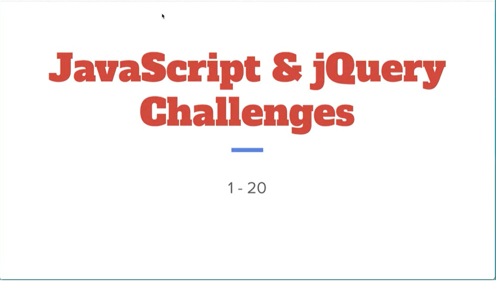

One of the best ways of learning JavaScript is through these challenges,
and in particular now that we&apos;re getting into **jQuery** it&apos;s
important to get used to the **jQuery** syntax.
<!--~~~~~~~~~~~~~~~~~~~~~~~~~~~~~~~~~~~~~~~~~~~~~~~~~~~~~~~~~~~~~~~~~~~~~~~~~~~~~~~~~~~~~~~~~~~~-->
<!--~~~~~~~~~~~~~~~~~~~~~~~~~~ 135. how to do these challenges (81) ~~~~~~~~~~~~~~~~~~~~~~~~~~~~-->

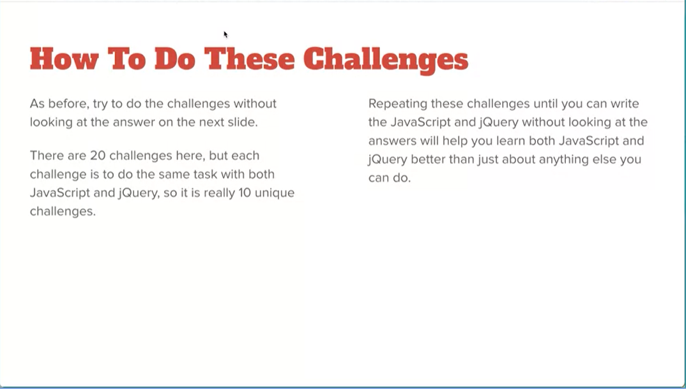

The way these challenges work is we&apos;ll pose a challenge, I&apos;ll put
forward a challenge, and I&apos;ll have you do it in both JavaScript and
**jQuery**. This will really help you with the syntax of both JavaScript
and **jQuery**, and understanding the differences between the two.
<!--~~~~~~~~~~~~~~~~~~~~~~~~~~~~~~~~~~~~~~~~~~~~~~~~~~~~~~~~~~~~~~~~~~~~~~~~~~~~~~~~~~~~~~~~~~~~-->
<!--~~~~~~~~~~~~~~~~~~~~~~~~~~~ 136. example, challenge 1 - JS (81) ~~~~~~~~~~~~~~~~~~~~~~~~~~~~-->

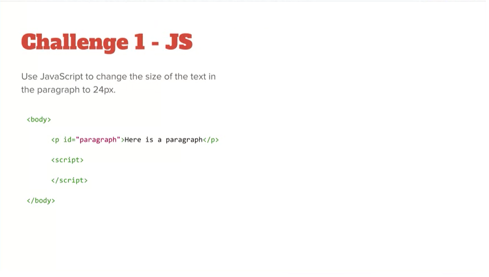

I&apos;ll provide you with a challenge like this, and usually the challenges
start off fairly simple and then they become more complex as we move
through the challenges. I&apos;ll give you a challenge like this and then on
the next slide, if you need to look the solution is on the next slide,
but hopefully you don&apos;t really need to look at the solution. Really try
to do the challenges without looking at the solution. If you have to
look at the solution that&apos;s fine, you can look at the solution and
hopefully you&apos;ll go ah-ha, I see what I was supposed to do and then you
can go back and do the challenge without looking at the solution.

If you want to learn Javascript or **jQuery** you have to get used to
the syntax and this is the best way to get there, is to really force
yourself to do these challenges, and do them several times, do them over
and over again. Do them today and then do them again tomorrow, and
tomorrow when you do them hopefully you&apos;ll be able to do more of the
challenges without looking at the answers. Each challenge builds on the
next so that they become more complex as they go along, and that will
really help you learn both JavaScript and **jQuery**, and help you
understand the differences between the syntax of how each of them work.

<h3>PDF of Challenges</h3>

<ul>
  <li><a href="https://d3c33hcgiwev3.cloudfront.net/i4axXuqIRimGsV7qiOYpOg_cbf6c4b4aed0434b821b960e344d66f1_WEB1091_M01_JavaScript-jQuery-Challenges.pdf?Expires=1710460800&Signature=GSFa2G3WNUZWeuyW0dSm7rvqdyxGatySjKpSoPRmx6owmcPNfKfgUWDID7pOLXyKyr9aggKrDmkglcjlATZmiBQsBVW4neIDlDjrVbg-DFdYP4D10ahkCkQLGB\~SW1qOcb9kMdBogkdPB-zWoqlyAydtP2QHdRVDAj3LozFUFO8\_&Key-Pair-Id=APKAJLTNE6QMUY6HBC5A">
    1.19 JavaScript-and-jQuery-Challenges.pdf (download)</a></li>
</ul>

<h2 id="ch2">Module Two: Animating Web Page Elements with jQuery and JS</h2>

<h3 id="ch2-00-obj">2.00 Learning Objectives</h3>

-   Use **jQuery** to animate elements on a web page using the helper
    functions or custom animations.

-   Use callback functions to trigger a function when an animation is
    completed.

-   Use **jQuery** to create a tabbed interface element for a web page.

-   Use the **jQuery** effects library to create animations for the
    tabs.

-   Use plain JavaScript to create the same tabbed interface.

-   Use JavaScript to trigger CSS animations in the tabbed interface,
    instead of a JavaScript animation library.

<!--~~~~~~~~~~~~~~~~~~~~~~~~~~~~~~~~~~~~~~~~~~~~~~~~~~~~~~~~~~~~~~~~~~~~~~~~~~~~~~~~~~~~~~~~~~~~-->
<h2 id="ch2-00-intro">2.00 Week/Module 2 Introduction (0:50)</h2>
<!--~~~~~~~~~~~~~~~~~~~~~~~~~~~~~~~~~~~~~~~~~~~~~~~~~~~~~~~~~~~~~~~~~~~~~~~~~~~~~~~~~~~~~~~~~~~~-->
<!--~~~~~~~~~~~~~~~~~~~~~~~~~~~~~~ 137. week/module 2 intro (83) ~~~~~~~~~~~~~~~~~~~~~~~~~~~~~~~-->

Congratulations, you&apos;ve made it to the 2nd module in our 2^nd^ course
on JavaScript. In this module, we&apos;ll be working with the **jQuery**
effects library, which provides you with a lot of animation effects that
you can use with all sorts of projects and in your interfaces. We&apos;ll
compare that to using JavaScript and **CSS** to create your animations
and see how the two are different and what are the strengths and pros
and cons of each as you learn and work on projects. It&apos;s a lot of fun
and you&apos;re really going to enjoy it. Buckle in and let&apos;s get started
with learning about the effects library in **jQuery**.

<!--~~~~~~~~~~~~~~~~~~~~~~~~~~~~~~~~~~~~~~~~~~~~~~~~~~~~~~~~~~~~~~~~~~~~~~~~~~~~~~~~~~~~~~~~~~~~-->
<h2 id="ch2-01">2.01 Intro to jQuery Effects Library (4:05)</h2>
<!--~~~~~~~~~~~~~~~~~~~~~~~~~~~~~~~~~~~~~~~~~~~~~~~~~~~~~~~~~~~~~~~~~~~~~~~~~~~~~~~~~~~~~~~~~~~~-->
<!--~~~~~~~~~~~~~~~~~~~~ 138. intro to jquery effects library (2.01) (83) ~~~~~~~~~~~~~~~~~~~~~~-->

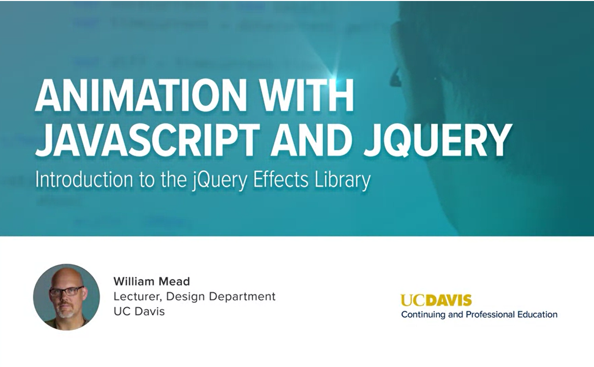

**jQuery** effects library.
<!--~~~~~~~~~~~~~~~~~~~~~~~~~~~~~~~~~~~~~~~~~~~~~~~~~~~~~~~~~~~~~~~~~~~~~~~~~~~~~~~~~~~~~~~~~~~~-->
<!--~~~~~~~~~~~~~~~~~~~~~ 139. important considerations - css vs js (84) ~~~~~~~~~~~~~~~~~~~~~~~-->

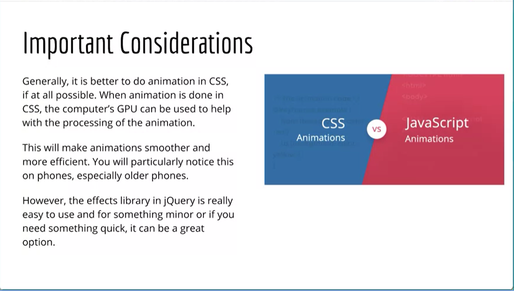

We&apos;ll be looking at how to use the effects library that&apos;s built into
**jQuery**. But there&apos;s some important things to understand about
animation in JavaScript versus animation in **CSS**. Generally, it&apos;s
better to do animation in **CSS** if at all possible. When the animation
is done in **CSS**, the computer&apos;s **GPU** can be used to help with the
processing of the animation, that will make the animation smoother and
more efficient. You&apos;ll particularly notice this on phones, especially
older phones.

However, the effects library in **jQuery** is really easy to use, and
for something minor or if you need something really quick, it can be a
great option. In this particular lesson, we&apos;ll be looking at how to use
the effects library in **jQuery**. I have some example files that you
can download and when you open them up, they look nice.
<!--~~~~~~~~~~~~~~~~~~~~~~~~~~~~~~~~~~~~~~~~~~~~~~~~~~~~~~~~~~~~~~~~~~~~~~~~~~~~~~~~~~~~~~~~~~~~-->
<!--~~~~~~~~~~~~~~~~~~~~~~~~~ 140. hide, show, toggle blue box (85) ~~~~~~~~~~~~~~~~~~~~~~~~~~~~-->

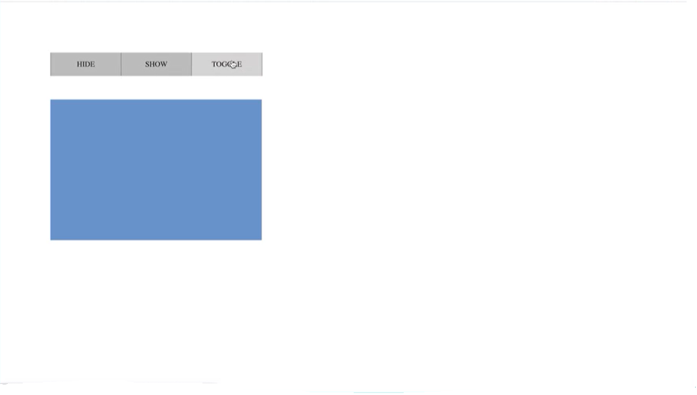

Here&apos;s example 1. We&apos;ll look at how to apply some effects using these
buttons here.
<!--~~~~~~~~~~~~~~~~~~~~~~~~~~~~~~~~~~~~~~~~~~~~~~~~~~~~~~~~~~~~~~~~~~~~~~~~~~~~~~~~~~~~~~~~~~~~-->
<!--~~~~~~~~~~~~~~~~~~~~~~~~~~~ 141.  (85) ~~~~~~~~~~~~~~~~~~~~~~~~~~~~~-->

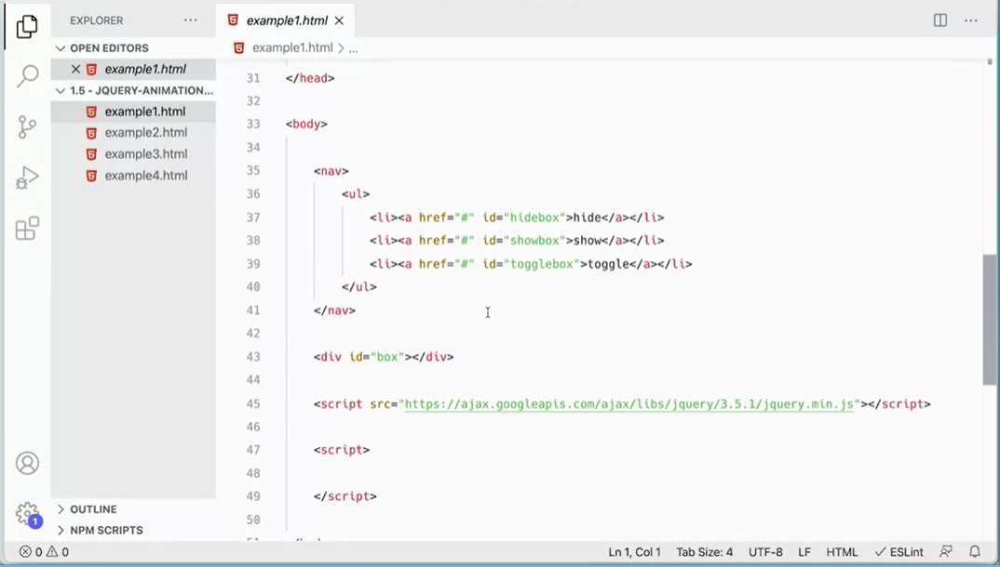

If we go over and look at the HTML involved here, I just have some links
with these buttons, and then I&apos;ve got this box here.

I&apos;ve got a little bit of CSS as appear to make it look nice and that&apos;s
fine. Down here, you&apos;ll notice that I have **jQuery** plugged in so
that&apos;s all set and ready to go, and a place for us to put our script.
<!--~~~~~~~~~~~~~~~~~~~~~~~~~~~~~~~~~~~~~~~~~~~~~~~~~~~~~~~~~~~~~~~~~~~~~~~~~~~~~~~~~~~~~~~~~~~~-->
<!--~~~~~~~~~~~~~~~~~~~~~~~~~~~ 142.  (86) ~~~~~~~~~~~~~~~~~~~~~~~~~~~~~-->

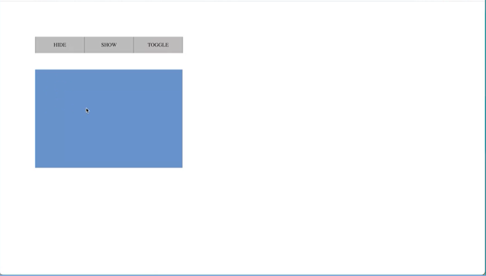

Now, the first one that we&apos;re going to look at is the **hide** function
(furthest left of the 3 buttons) which we&apos;ve already looked at before.
We&apos;ve seen this **hide** function when we did the sidebar menu
exercise. But the hide function can also do animation. Let&apos;s take a
look at how to do that.
<!--~~~~~~~~~~~~~~~~~~~~~~~~~~~~~~~~~~~~~~~~~~~~~~~~~~~~~~~~~~~~~~~~~~~~~~~~~~~~~~~~~~~~~~~~~~~~-->
<!--~~~~~~~~~~~~~~~~~~~~~~~~~~~ 143.  (86) ~~~~~~~~~~~~~~~~~~~~~~~~~~~~~-->

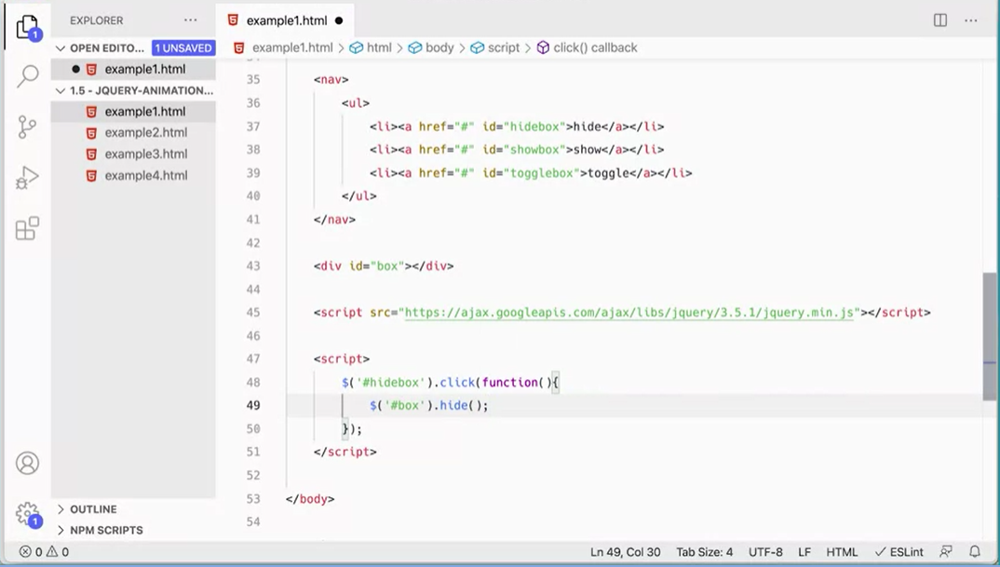

Over here, what I could do is I could type in here, I could go get this
first link here. I&apos;m going to go get and use my **jQuery** object. Then
I&apos;m going to get **hide** box, that link. I&apos;m going to add a quick add
onto it, click. When I click it, I&apos;m going to run a function, like so.
In that function, what I&apos;m going to do is I&apos;m going to get this
element again using my **jQuery** object. This element box, div id pound
box. I tell it to, hide. Now if we do it like this, it will work, but it
won&apos;t do any animation.
<!--~~~~~~~~~~~~~~~~~~~~~~~~~~~~~~~~~~~~~~~~~~~~~~~~~~~~~~~~~~~~~~~~~~~~~~~~~~~~~~~~~~~~~~~~~~~~-->
<!--~~~~~~~~~~~~~~~~~~~~~~~~~~~ 144.  (87) ~~~~~~~~~~~~~~~~~~~~~~~~~~~~~-->

Let&apos;s try it out. If I come over here and refresh this page and click
&quot;Hide,&quot; you can see the box goes away.
<!--~~~~~~~~~~~~~~~~~~~~~~~~~~~~~~~~~~~~~~~~~~~~~~~~~~~~~~~~~~~~~~~~~~~~~~~~~~~~~~~~~~~~~~~~~~~~-->
<!--~~~~~~~~~~~~~~~~~~~~~~~ 145/146.  (87) ~~~~~~~~~~~~~~~~~~~~~~~~~~-->

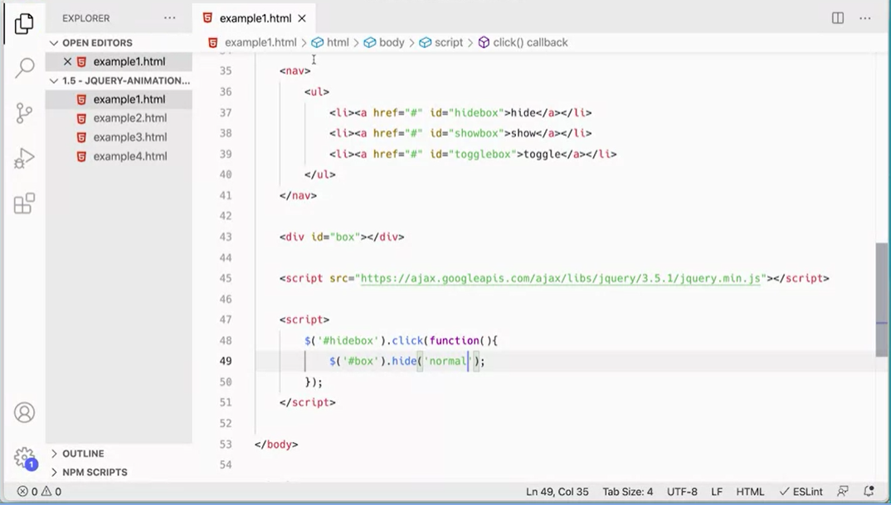
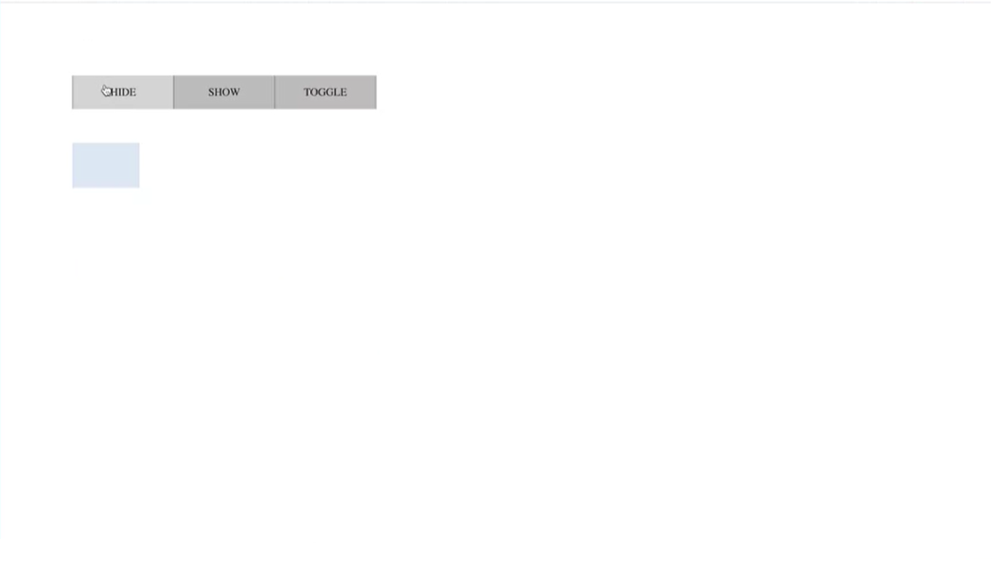

But in **jQuery**, you can actually pass a value in here. There are a
few keywords that it can use. You can use normal, slow, or fast. You&apos;ll
see now when I do refresh and click &quot;Hide,&quot; it does an animation as it
hides that box.
<!--~~~~~~~~~~~~~~~~~~~~~~~~~~~~~~~~~~~~~~~~~~~~~~~~~~~~~~~~~~~~~~~~~~~~~~~~~~~~~~~~~~~~~~~~~~~~-->
<!--~~~~~~~~~~~~~~~~~~~~~~~ 147/148.  (88) ~~~~~~~~~~~~~~~~~~~~~~~~~~-->

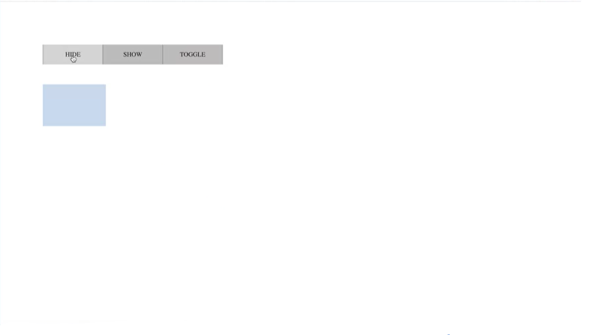

You could do slow or fast, or you could put in a number. The number is
the number of milliseconds. If I put 500, that will be half a second,
it&apos;s how long the animation will take place. Or if you really want to
see something to demonstrate how much that affects it, you could do
2,002 seconds. That&apos;s a long time for an animation like this.
<!--~~~~~~~~~~~~~~~~~~~~~~~~~~~~~~~~~~~~~~~~~~~~~~~~~~~~~~~~~~~~~~~~~~~~~~~~~~~~~~~~~~~~~~~~~~~~-->
<!--~~~~~~~~~~~~~~~~~~~~~~~~~~~ 149. hide, show, toggle boxes (88) ~~~~~~~~~~~~~~~~~~~~~~~~~~~~~-->

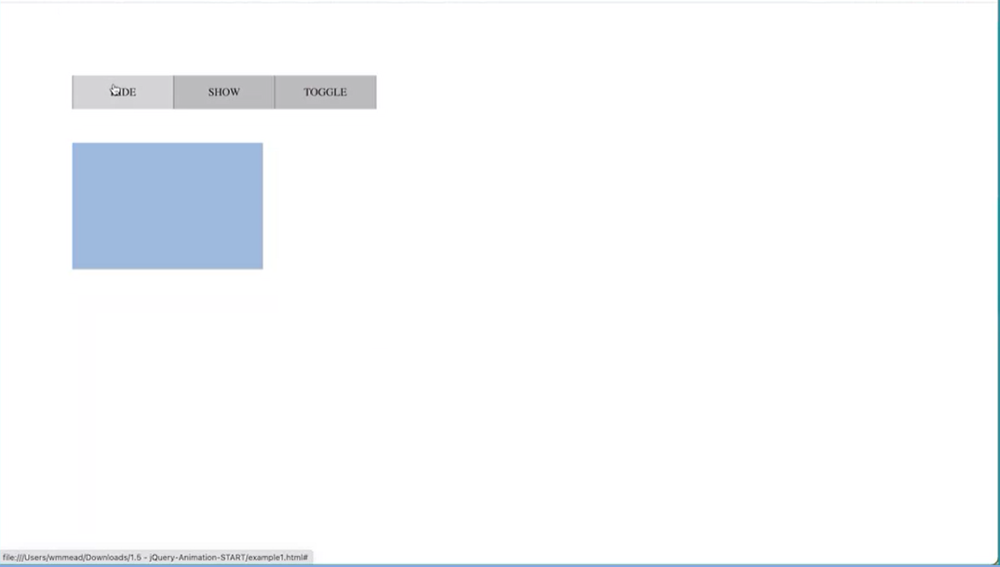

Let&apos;s see what that does. There we go. You can see that you can affect
the speed there.

<h3 id="ch2-01-zip">zip START File</h3>

<ul>
  <li><a href="https://d3c33hcgiwev3.cloudfront.net/3Xl5RNS1RLW5eUTUtUS1fg_6e9d3063eee04fbdacdf3298ef2baa81_WEB1091_jQuery-Animation-START.zip?Expires=1710460800&Signature=cVi6tC9Efa73xPc6OoCOjQX77Tr-Bpr3Y1Zhd6Yi5H0Q4zJzByAc17XziZvs114jpq0OfvJXPuczyj6RPuANoWV-im0L6UbbbqHtHYpH6jkbrAZpilLw9xqw1Vayv7XPDe6Hkitr9zjMKEgXnbC3y3tagH-EJCRzE0zMgnzmQpE\_&Key-Pair-Id=APKAJLTNE6QMUY6HBC5A"
  target="_blank" rel="noopener noreferrer">
    2.01 jQuery-Animation-START.zip (download)</a></li>
</ul>

<!--~~~~~~~~~~~~~~~~~~~~~~~~~~~~~~~~~~~~~~~~~~~~~~~~~~~~~~~~~~~~~~~~~~~~~~~~~~~~~~~~~~~~~~~~~~~~-->
<h2 id="ch2-02">2.02 Example 1, cont'd (4:36)</h2>
<!--~~~~~~~~~~~~~~~~~~~~~~~~~~~~~~~~~~~~~~~~~~~~~~~~~~~~~~~~~~~~~~~~~~~~~~~~~~~~~~~~~~~~~~~~~~~~-->
<!--~~~~~~~~~~~~~~~~~~~~~~~~~~~ 150. example 1, cont'd (2.02) (89) ~~~~~~~~~~~~~~~~~~~~~~~~~~~~~-->

In the last lesson, we saw that we could add a function here that will
hide the box and animate that.
<!--~~~~~~~~~~~~~~~~~~~~~~~~~~~~~~~~~~~~~~~~~~~~~~~~~~~~~~~~~~~~~~~~~~~~~~~~~~~~~~~~~~~~~~~~~~~~-->
<!--~~~~~~~~~~~~~~~~~~~~~~~ 151/152.  (xx) ~~~~~~~~~~~~~~~~~~~~~~~~~~-->

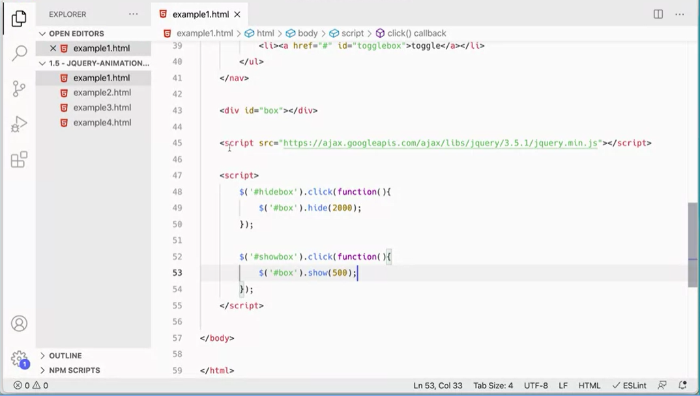
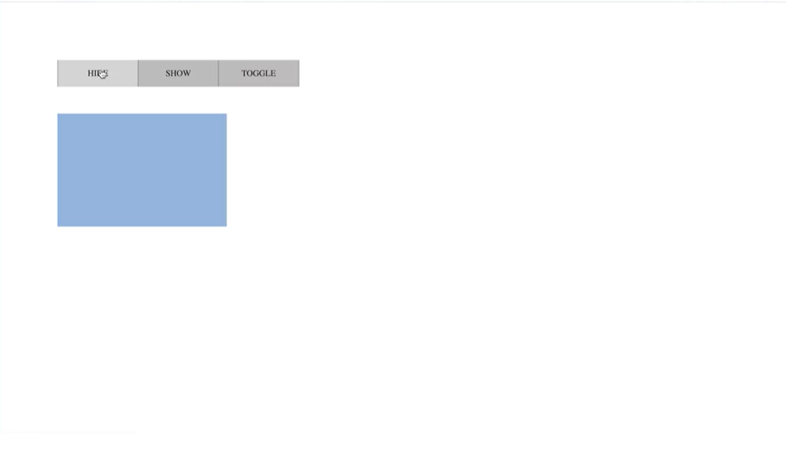

Let\'s add a couple more. We\'ve got a few more buttons here. Let\'s do
a few more of these. I\'m going to do pound show box or hashtag if you
prefer hash instead. I\'m going to add the **click handler** and then
put a function in here. Always type from the outside, so you get used to
the syntax and understand which thing closes which thing. I\'m going to
do function parentheses, curly braces there and move that down. Then
I\'m going to do again, I\'m going to go get my **jQuery** object and
get pound **showbox**. No box, just box of the same box. Instead of hide
I\'m going to do **show**. Maybe we\'ll make this one go for 500
milliseconds. You\'ll see that will work.

Let\'s test that. We come over here and refresh this. We can hide the
box and I can show the box and you can see the difference in time.
<!--~~~~~~~~~~~~~~~~~~~~~~~~~~~~~~~~~~~~~~~~~~~~~~~~~~~~~~~~~~~~~~~~~~~~~~~~~~~~~~~~~~~~~~~~~~~~-->
<!--~~~~~~~~~~~~~~~~~~~~~~~~~~~~~ 153.  (xx) ~~~~~~~~~~~~~~~~~~~~~~~~~~~~~~-->

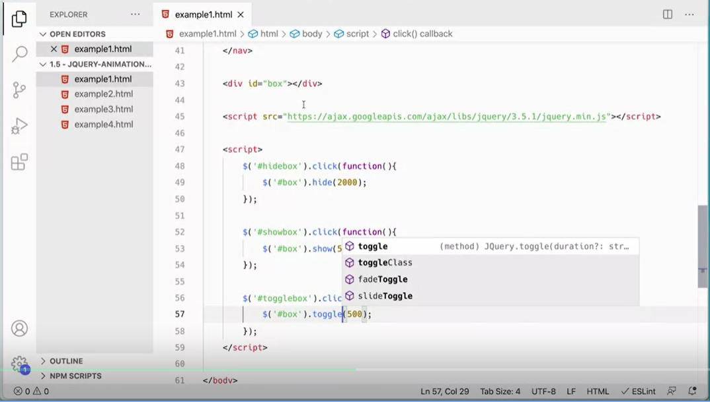

Now toggle will both hide and show. If it\'s hidden, it\'ll show it. If
it\'s showing it\'ll hide it. Over here again, I\'m going to just add
toggle box. It\'s this link here. It\'s this link up here, toggle box.
Then down here we\'re going to do box and instead of show, we\'re going
to do **toggle** like that. Remember toggle is a helper function that
allows us to do both hiding and showing and we\'ve seen that before. But
now we can use it with the effects library and do some animation with
it.
<!--~~~~~~~~~~~~~~~~~~~~~~~~~~~~~~~~~~~~~~~~~~~~~~~~~~~~~~~~~~~~~~~~~~~~~~~~~~~~~~~~~~~~~~~~~~~~-->
<!--~~~~~~~~~~~~~~~~~~~~~~~~~~~~~ 154.  (xx) ~~~~~~~~~~~~~~~~~~~~~~~~~~~~~~-->

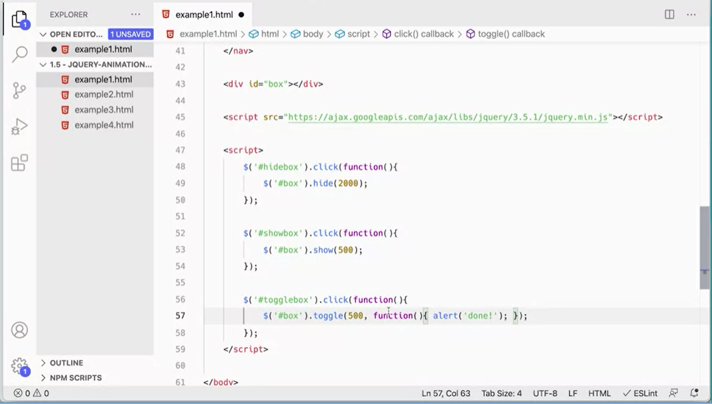

Now one of the really great things about these animations and doing this
in JavaScript and **jQuery** is that you have a thing called a
**callback** function. What you can do after the toggle(500) is you can
pass in a function that runs with its parentheses and curly braces like
so. In here we could put alert (\'done! \') something like that. This
function will run after this animation has been completed. In fact, I\'m
going to make this a little bit longer so that you can really see that
it waits and runs after the animation has been completed.

This is useful because sometimes you want to have a sequence of
animations and when that animation is done, you want to do something
else, something like that.
<!--~~~~~~~~~~~~~~~~~~~~~~~~~~~~~~~~~~~~~~~~~~~~~~~~~~~~~~~~~~~~~~~~~~~~~~~~~~~~~~~~~~~~~~~~~~~~-->
<!--~~~~~~~~~~~~~~~~~~~~~~~~~~~~~ 155.  (xx) ~~~~~~~~~~~~~~~~~~~~~~~~~~~~~~-->

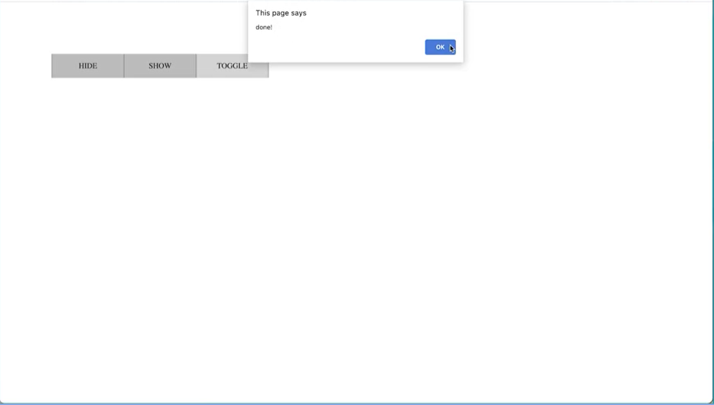

Let\'s see how this works. The page does the alert. That\'s really cool
and I could do the other way around as well. With that, we are able to
see that we can make these functions, these animations and the
animations can have a **callback** function that runs when the animation
is complete and this is useful. Let\'s take a look at the next example
in the next lesson.

<!--~~~~~~~~~~~~~~~~~~~~~~~~~~~~~~~~~~~~~~~~~~~~~~~~~~~~~~~~~~~~~~~~~~~~~~~~~~~~~~~~~~~~~~~~~~~~-->
<h2 id="ch2-03">2.03 Example 2 (5:35)</h2>
<!--~~~~~~~~~~~~~~~~~~~~~~~~~~~~~~~~~~~~~~~~~~~~~~~~~~~~~~~~~~~~~~~~~~~~~~~~~~~~~~~~~~~~~~~~~~~~-->
<!--~~~~~~~~~~~~~~~~~~~~~~~~~~~~~ 156.  (xx) ~~~~~~~~~~~~~~~~~~~~~~~~~~~~~~-->

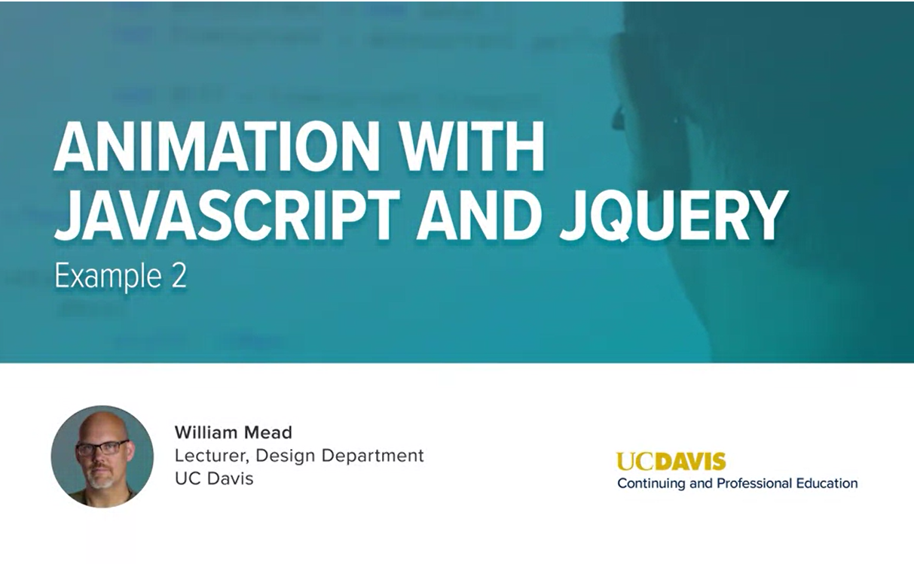

Let\'s take a look at Example 2.
<!--~~~~~~~~~~~~~~~~~~~~~~~~~~~~~~~~~~~~~~~~~~~~~~~~~~~~~~~~~~~~~~~~~~~~~~~~~~~~~~~~~~~~~~~~~~~~-->
<!--~~~~~~~~~~~~~~~~~~~~~~~~~~~~~ 157.  (xx) ~~~~~~~~~~~~~~~~~~~~~~~~~~~~~~-->

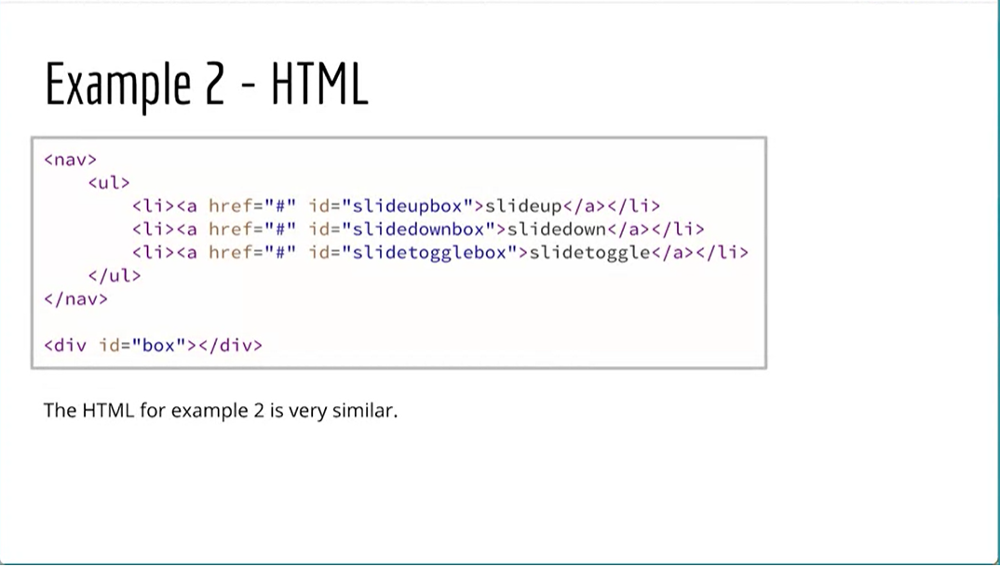

Open up the Example 2, HTML file and you\'ll notice that it looks very
similar to the first example. We have the same styling up at the top of
the page, we have a box here, we have some navigation, and then we have
this div id set to box down here, and it\'s just an empty div.
<!--~~~~~~~~~~~~~~~~~~~~~~~~~~~~~~~~~~~~~~~~~~~~~~~~~~~~~~~~~~~~~~~~~~~~~~~~~~~~~~~~~~~~~~~~~~~~-->
<!--~~~~~~~~~~~~~~~~~~~~~~~~~~~~~ 158.  (xx) ~~~~~~~~~~~~~~~~~~~~~~~~~~~~~~-->

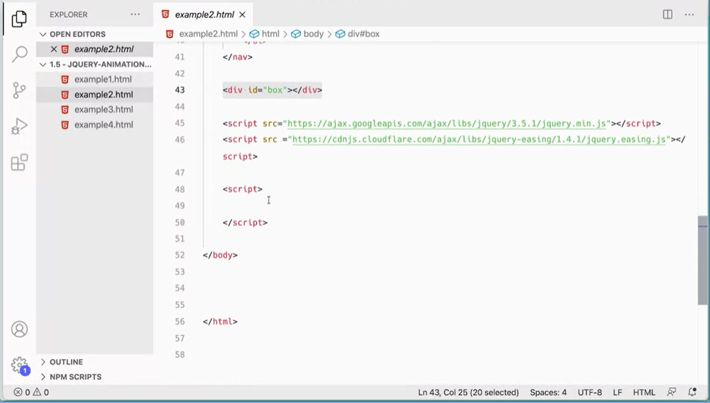

You can see that it looks very similar here. But **jQuery** has helper
functions in for **sliding up** and **sliding down** and **slide
toggle**. Because again, these are common tasks. These are common things
that we need to do in interfaces, so they created a method that does
specifically this.
<!--~~~~~~~~~~~~~~~~~~~~~~~~~~~~~~~~~~~~~~~~~~~~~~~~~~~~~~~~~~~~~~~~~~~~~~~~~~~~~~~~~~~~~~~~~~~~-->
<!--~~~~~~~~~~~~~~~~~~~~~~~~~~~~~ 159.  (xx) ~~~~~~~~~~~~~~~~~~~~~~~~~~~~~~-->

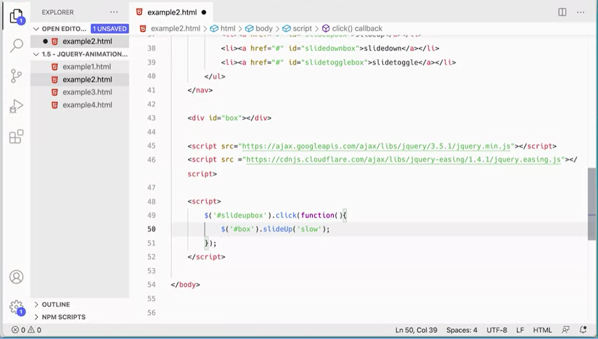

Let\'s take a look at what we need in order to do this in our code. The
syntax is very similar to what we saw before. What we\'re going to do
is, like we did before, we\'re going to use our **jQuery** object to go
in and get our link here.

It\'s pound, I\'ve got a **slideupbox** as a link here, so let\'s do
that. **slideupbox** and we\'ll put a **click handler** on that. We\'re
looking for **dot click**. Then in here we\'re going to run a function
with its own parentheses and curly braces. Then we\'re going to put our
code inside the curly braces there, just the same way we did before.
Again as before, we\'re going to go get our **jQuery** object and get
box, because that\'s where we\'re going to be moving up and down. Then
what we\'re going to use here for a **jQuery** function is slide up.
Again, we can put in an amount of time or you could put inside quotes,
you can put slow or something like that, and that will make that box
slide up.
<!--~~~~~~~~~~~~~~~~~~~~~~~~~~~~~~~~~~~~~~~~~~~~~~~~~~~~~~~~~~~~~~~~~~~~~~~~~~~~~~~~~~~~~~~~~~~~-->
<!--~~~~~~~~~~~~~~~~~~~~~~~~~~~~~ 160.  (xx) ~~~~~~~~~~~~~~~~~~~~~~~~~~~~~~-->

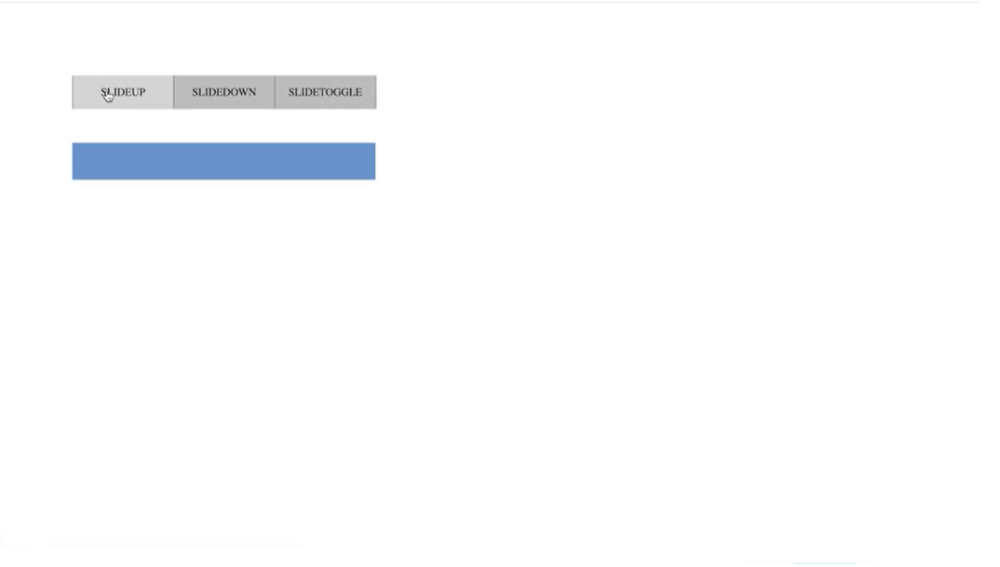

Let\'s go over and give that a try. Hopefully I did that right, I think
I did. If I refresh this page and click \"Slideup,\" it does that
animation.
<!--~~~~~~~~~~~~~~~~~~~~~~~~~~~~~~~~~~~~~~~~~~~~~~~~~~~~~~~~~~~~~~~~~~~~~~~~~~~~~~~~~~~~~~~~~~~~-->
<!--~~~~~~~~~~~~~~~~~~~~~~~~~~~~~ 161.  (xx) ~~~~~~~~~~~~~~~~~~~~~~~~~~~~~~-->

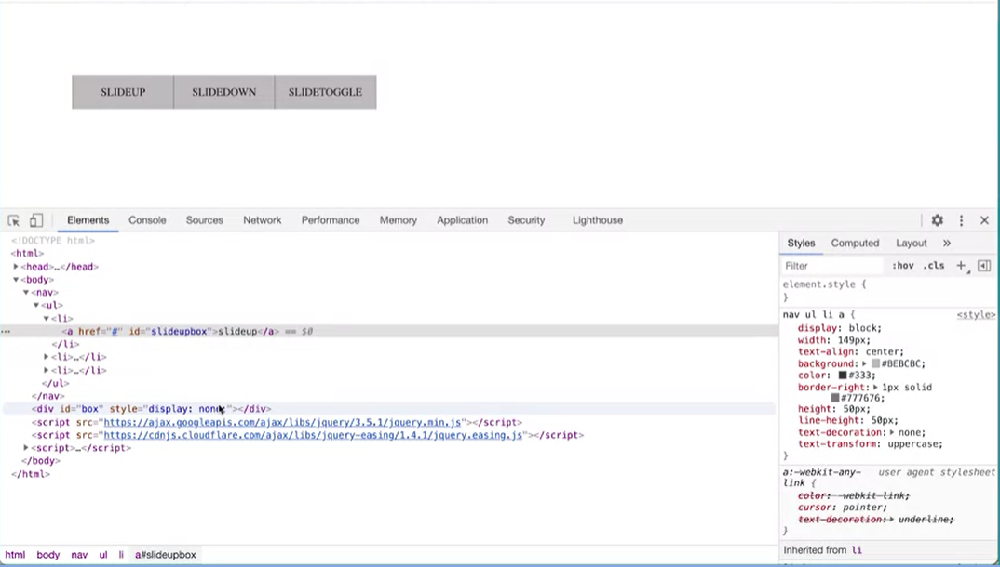

It\'s interesting to inspect this. Watch what happens here. Actually on
the actual box itself. Watch what happens down here, when I click
slideup. You can see it very quickly went through some settings in here,
as it did that and ended up with displaying that.
<!--~~~~~~~~~~~~~~~~~~~~~~~~~~~~~~~~~~~~~~~~~~~~~~~~~~~~~~~~~~~~~~~~~~~~~~~~~~~~~~~~~~~~~~~~~~~~-->
<!--~~~~~~~~~~~~~~~~~~~~~~~~~~~~~ 162.  (xx) ~~~~~~~~~~~~~~~~~~~~~~~~~~~~~~-->

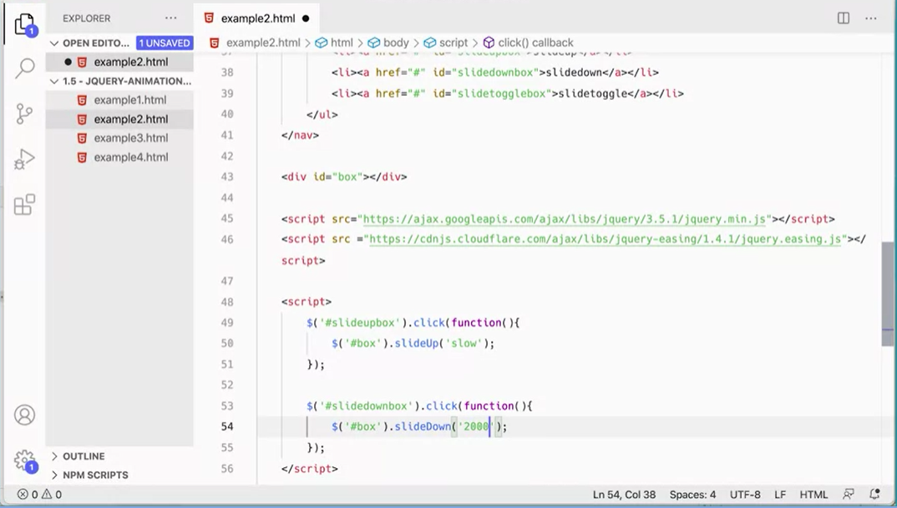

The other ones look very similar as you can imagine. We\'ve got
**slideupbox**, we\'ve got **slidedownbox**, and we\'ve got **slide
toggle** and they all work very similarly. I can actually copy that,
paste it, and I recommend you type it actually, but for expedience sake,
I\'m going to just copy and paste it and change this to slidedownbox.
This is going to be **SlideDown** and I can choose an amount of time.
We\'re going to do two seconds, something like that. We have a longer
time.

Now, when you\'re working with animation, one thing to be aware of is
that, there is such a thing as **easing**. An animation can run and it
will run for the period of time. This animation will run over two
seconds, but it can run the exact same amount over those two seconds,
which is **linear easing**, meaning that it\'s the same speed at the
beginning as it is at the end or you can change the **easing** such that
it goes faster at the beginning and slower at the end or slower at the
beginning and then speeds up towards the end of the animation, or you
can actually do **easing** in and outward. Starts slow, speeds up and
then end slow or starts fast, slows down and ends fast. You can do all
of these different types of easing.
<!--~~~~~~~~~~~~~~~~~~~~~~~~~~~~~~~~~~~~~~~~~~~~~~~~~~~~~~~~~~~~~~~~~~~~~~~~~~~~~~~~~~~~~~~~~~~~-->
<!--~~~~~~~~~~~~~~~~~~~~~~~~~~~~~ 163.  (xx) ~~~~~~~~~~~~~~~~~~~~~~~~~~~~~~-->

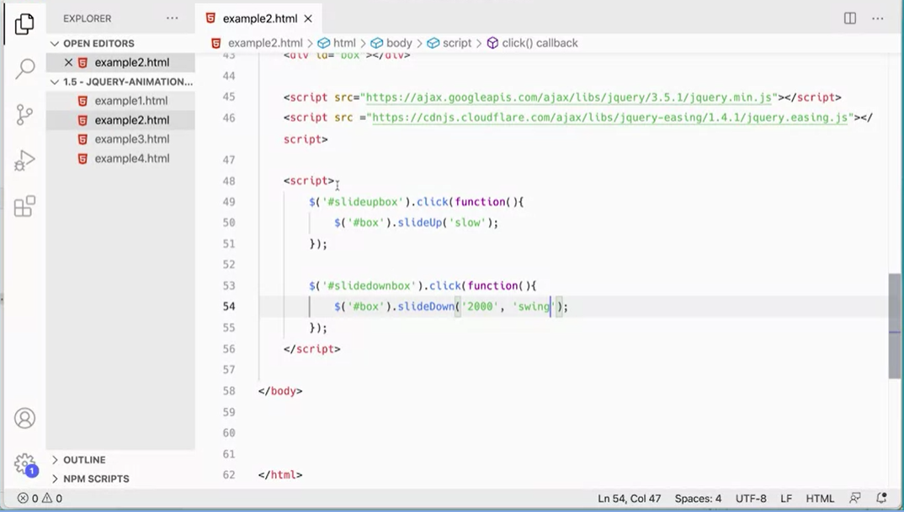

**JQuery** has some basic **easing** built-in and you can put in here in
quotes, **\"swing\"**. That will do a little bit of **easing** on this
item. It\'s pretty subtle. You might not really see it, but it will
actually work. Take a look for yourself. Slide up, slide down. Does
slide down, but it does a swing animation. It\'s not the same speed all
the way through. It\'s hard to tell, but it is there, just subtle.

**jQuery** has built into it some basic **easing.** There\'s also a
**plug-in** and one of the strengths of **jQuery** is the **plug-in**
architecture. We\'re going to talk about that in the next lesson.

<!--~~~~~~~~~~~~~~~~~~~~~~~~~~~~~~~~~~~~~~~~~~~~~~~~~~~~~~~~~~~~~~~~~~~~~~~~~~~~~~~~~~~~~~~~~~~~-->
<h2 id="ch2-04">2.04 Example 2: Plugin Architecture (8:39)</h2>
<!--~~~~~~~~~~~~~~~~~~~~~~~~~~~~~~~~~~~~~~~~~~~~~~~~~~~~~~~~~~~~~~~~~~~~~~~~~~~~~~~~~~~~~~~~~~~~-->
<!--~~~~~~~~~~~~~~~~~~~~~ 164. example 2: plugin architecture (2.04) (xx) ~~~~~~~~~~~~~~~~~~~~~~-->

In the last lesson, we added some **easing** to our function, so that
now it slides up using the **linear easing**, but slide down is using
the **swing easing**.
<!--~~~~~~~~~~~~~~~~~~~~~~~~~~~~~~~~~~~~~~~~~~~~~~~~~~~~~~~~~~~~~~~~~~~~~~~~~~~~~~~~~~~~~~~~~~~~-->
<!--~~~~~~~~~~~~~~~~~~~~~~~~~~~~~ 165.  (xx) ~~~~~~~~~~~~~~~~~~~~~~~~~~~~~~-->

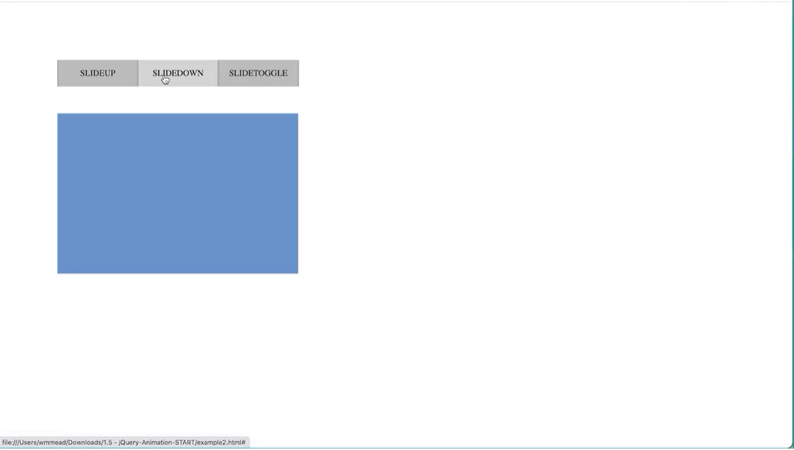

**Easing** can give your animations a little bit of personality. They
can make them seem a little bit less mechanical, when the speed of the
animation is not always the same all the way through the animation. But
the **easings** that are built into **jQuery** don\'t give you a lot of
options. They are very basic.

There\'s this amazing **plug-in (gsgd.co.uk/sandbox/jquery/easing/)**
that we can use, and it allows you to choose different types of
**easings** so that you can do some different types of things with this,
and you can go through and try some of these different settings here to
see what they actually do. **Ease-out** will affect the animation at the
end where **ease-in** will affect the animation at the beginning,
**ease-out-and-in** will affect the animation at both ends. We\'ve got
**ease-in-and-out**. We\'ve got a whole bunch of them in here for all
these different: in **ease-out**, **ease-in** all these different
animations in here. But in order to use this, we have to plugins
**plug-in**.

### 50 Awesome jQuery Plugins

<https://tutorialzine.com/2013/04/50-amazing-jquery-plugins>

**jQuery** has a plug-in architecture that allows you to add more
functionality to **jQuery**. You can see over here on our file that
I\'ve already added the plug-in. The way this works is first we need the
**jQuery** library, then you need the plug-in, and then we use it in our
script.

Down here I\'m going to do the third animation here for slide toggle,
which we\'re going to use this ID. We\'ll grab that ID, and down here
instead of slide down, we\'re going to do slide toggle, which will open
it and close it. Here we can use some of the other easings that we find
on this website here;

<https://cdnjs.com/libraries/jquery-easing>

This is where I got the **easing** plug-in on the **CDN** that I put
into here. That\'s where that came from, **Cloudflare**.

That comes from this website here;

but we can use the easings that we see here. If I want an
**easeOutBounce**, I can actually use that animation if I want to over
here. Let\'s give that a try.
<!--~~~~~~~~~~~~~~~~~~~~~~~~~~~~~~~~~~~~~~~~~~~~~~~~~~~~~~~~~~~~~~~~~~~~~~~~~~~~~~~~~~~~~~~~~~~~-->
<!--~~~~~~~~~~~~~~~~~~~~~~~~~~~~~ 166.  (xx) ~~~~~~~~~~~~~~~~~~~~~~~~~~~~~~-->

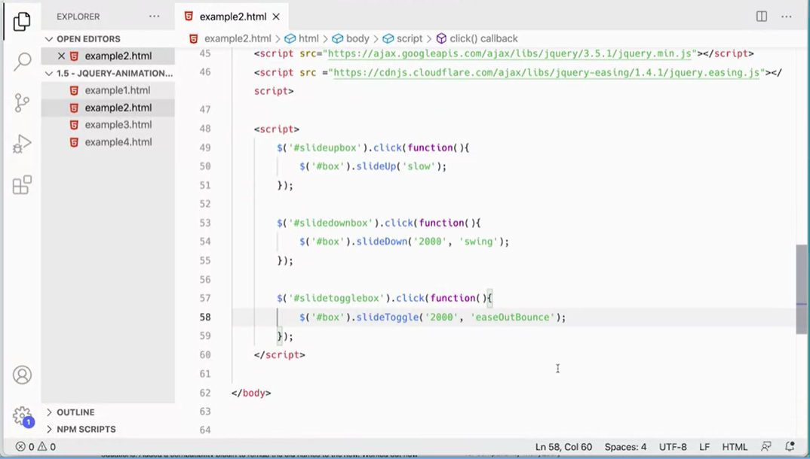

**\"easeOutBounce\"**. Make sure you spell it right with the capital
letters and everything **easeOutBounce**. Make sure you spell it all
correct and that you get the correct capital letters. Make sure you put
it inside the quotes, and so on and so forth.
<!--~~~~~~~~~~~~~~~~~~~~~~~~~~~~~~~~~~~~~~~~~~~~~~~~~~~~~~~~~~~~~~~~~~~~~~~~~~~~~~~~~~~~~~~~~~~~-->
<!--~~~~~~~~~~~~~~~~~~~~~~~~~~~~~ 167.  (xx) ~~~~~~~~~~~~~~~~~~~~~~~~~~~~~~-->

If I save that and then come back and look at my example here, and click
slide toggle, you can see that it does this bounce. Which is pretty
interesting or you could do **easeInBounce** to get the bounce on the
opposite end of the animation, which might look a little weird. It\'s
doing the bounce first and then it\'s finishing the animation, which
looks a little weird, but you get the idea and you can try some of these
other easings and see what personality you can get.
<!--~~~~~~~~~~~~~~~~~~~~~~~~~~~~~~~~~~~~~~~~~~~~~~~~~~~~~~~~~~~~~~~~~~~~~~~~~~~~~~~~~~~~~~~~~~~~-->
<!--~~~~~~~~~~~~~~~~~~~~~~~~~~~~~ 168.  (xx) ~~~~~~~~~~~~~~~~~~~~~~~~~~~~~~-->

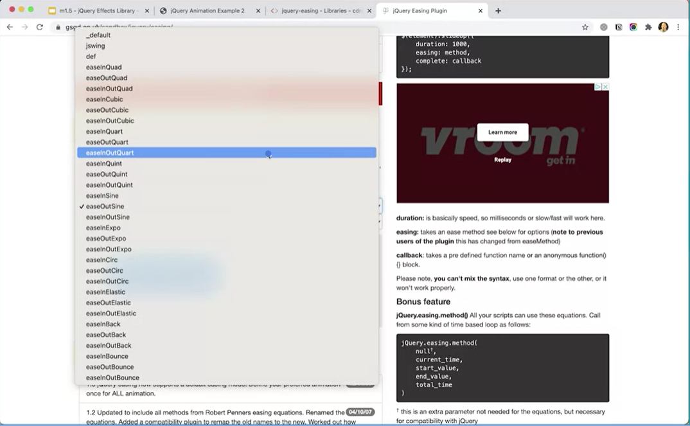

I really like the **easeOutCirc** ones. Yeah, **easeIn** and
**easeOutCirc**. You can give those a try. Let\'s see what we can do
with that. Over here **easeInCirc**. Again, at two seconds, that\'s
pretty slow. You can even slow down more if you wanted to see it. I\'ll
set that to three seconds. You can see how it changes the animation by
either slowing it down or speeding it up. I think this one\'s speeding
it up as it gets to the end of the animation.
<!--~~~~~~~~~~~~~~~~~~~~~~~~~~~~~~~~~~~~~~~~~~~~~~~~~~~~~~~~~~~~~~~~~~~~~~~~~~~~~~~~~~~~~~~~~~~~-->
<!--~~~~~~~~~~~~~~~~~~~~~~~~~~~~~ 169.  (xx) ~~~~~~~~~~~~~~~~~~~~~~~~~~~~~~-->

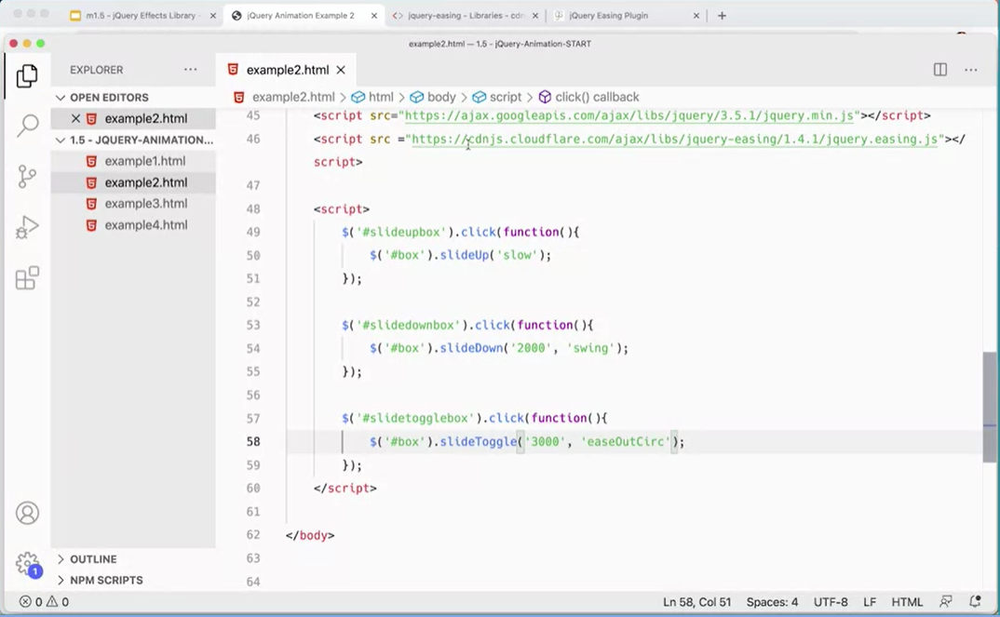

Let\'s come back and try **easeOutCirc**. That\'s starting fast and
ending slow. It gives the animation a little bit of personality as it
does its thing.
<!--~~~~~~~~~~~~~~~~~~~~~~~~~~~~~~~~~~~~~~~~~~~~~~~~~~~~~~~~~~~~~~~~~~~~~~~~~~~~~~~~~~~~~~~~~~~~-->
<!--~~~~~~~~~~~~~~~~~~~~~~~~~~~~~ 170.  (xx) ~~~~~~~~~~~~~~~~~~~~~~~~~~~~~~-->

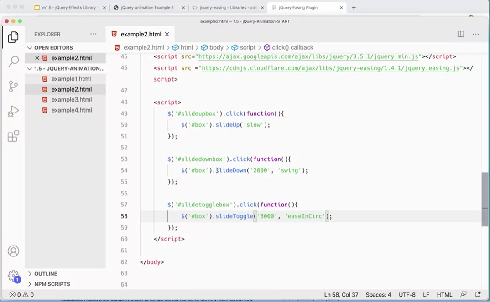

You could try **easeInOutCirc**. It\'s hard to see, but it is doing
something there. Try these different animations. You\'ll notice if you
spell them wrong, if I do, **easeoutCirc** like that, then it won\'t
work quite right at all.
<!--~~~~~~~~~~~~~~~~~~~~~~~~~~~~~~~~~~~~~~~~~~~~~~~~~~~~~~~~~~~~~~~~~~~~~~~~~~~~~~~~~~~~~~~~~~~~-->
<!--~~~~~~~~~~~~~~~~~~~~~~~~~~~~~ 171.  (xx) ~~~~~~~~~~~~~~~~~~~~~~~~~~~~~~-->

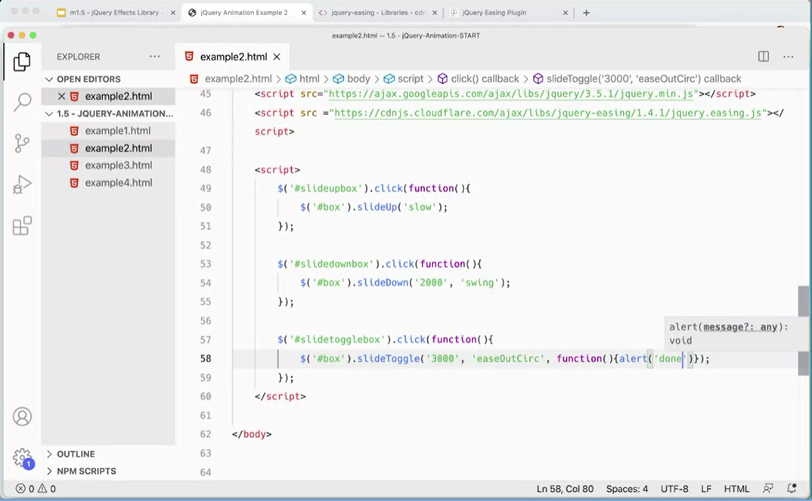

One last quick thing here before we\'re done with this lesson is you can
also add the **callback** function after the **easing**. I could add a
function here and say done, and you\'ll see that when that **easing** is
finished, when that animation is finished, that **callback** function
will fire.
<!--~~~~~~~~~~~~~~~~~~~~~~~~~~~~~~~~~~~~~~~~~~~~~~~~~~~~~~~~~~~~~~~~~~~~~~~~~~~~~~~~~~~~~~~~~~~~-->
<!--~~~~~~~~~~~~~~~~~~~~~~~~~~~~~ 172.  (xx) ~~~~~~~~~~~~~~~~~~~~~~~~~~~~~~-->

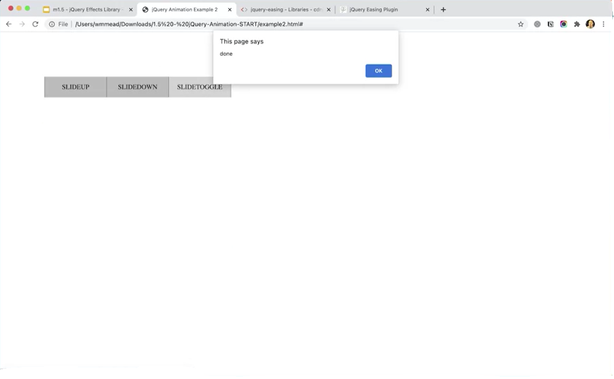

Now that\'ll work, and it comes back and it says it\'s done. That gives
us a lot of information about how to work with these **built-in**
animations, and we\'re going to do more in the next lesson.

<!--~~~~~~~~~~~~~~~~~~~~~~~~~~~~~~~~~~~~~~~~~~~~~~~~~~~~~~~~~~~~~~~~~~~~~~~~~~~~~~~~~~~~~~~~~~~~-->
<h2 id="ch2-05">2.05 Example 3: Fading Buttons (4:00)</h2>
<!--~~~~~~~~~~~~~~~~~~~~~~~~~~~~~~~~~~~~~~~~~~~~~~~~~~~~~~~~~~~~~~~~~~~~~~~~~~~~~~~~~~~~~~~~~~~~-->
<!--~~~~~~~~~~~~~~~~~~~~~~~~~~~~~ 173.  (xx) ~~~~~~~~~~~~~~~~~~~~~~~~~~~~~~-->

In Example 3, we\'ll look at something that\'s similar to the other two,
but just slightly different.
<!--~~~~~~~~~~~~~~~~~~~~~~~~~~~~~~~~~~~~~~~~~~~~~~~~~~~~~~~~~~~~~~~~~~~~~~~~~~~~~~~~~~~~~~~~~~~~-->
<!--~~~~~~~~~~~~~~~~~~~~~~~~~~~~~ 174.  (xx) ~~~~~~~~~~~~~~~~~~~~~~~~~~~~~~-->

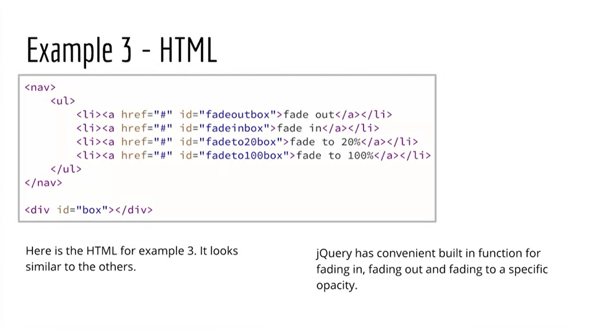

It\'s got four buttons and we can use some built-in functions in
**jQuery** to **fade** objects in and out, or to **fade** them to a
particular percentage of opacity.
<!--~~~~~~~~~~~~~~~~~~~~~~~~~~~~~~~~~~~~~~~~~~~~~~~~~~~~~~~~~~~~~~~~~~~~~~~~~~~~~~~~~~~~~~~~~~~~-->
<!--~~~~~~~~~~~~~~~~~~~~~~~~~~~~~ 175.  (xx) ~~~~~~~~~~~~~~~~~~~~~~~~~~~~~~-->

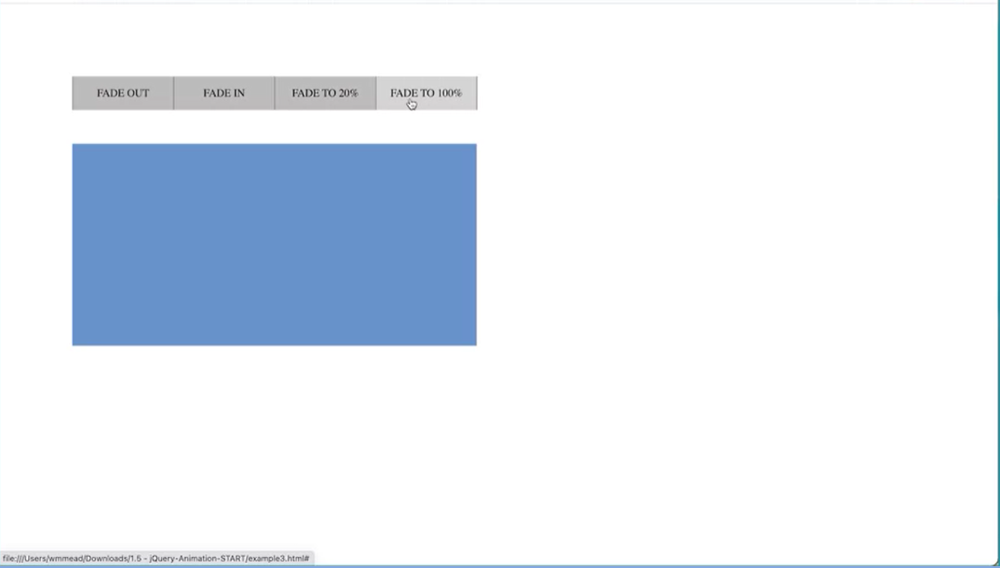

Here I have **fade out**, which will fade it out completely. **Fade
in**, will fade it all the way to being visible. But then I had **fade**
to 20 percent, which will fade it to 20 percent opacity, and then
**fade** to 100 percent, which will **fade** it all the way in.
<!--~~~~~~~~~~~~~~~~~~~~~~~~~~~~~~~~~~~~~~~~~~~~~~~~~~~~~~~~~~~~~~~~~~~~~~~~~~~~~~~~~~~~~~~~~~~~-->
<!--~~~~~~~~~~~~~~~~~~~~~~~~~~~~~ 176.  (xx) ~~~~~~~~~~~~~~~~~~~~~~~~~~~~~~-->

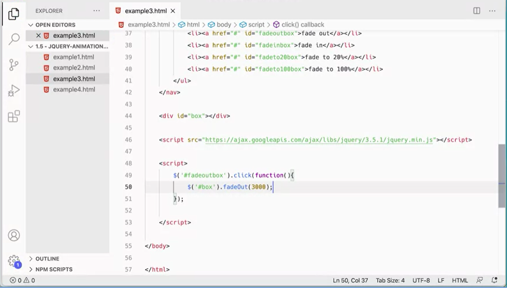

Let\'s take a look at how we can do that. Over here I have Example 3
open and you can see that I have much the same styling up at the top of
the page, as well as my navigation year and my **jQuery** libraries
plugged in. I don\'t have the easing plug-in here, but you could add it
if you wanted to add some easing to these as well.

Here we\'re going to do what we did before with getting our link pound
fade out box, which is this first link up here, and we\'re going to add
our click handler to it. Click, and then we\'re going to pass in our
anonymous function that runs when you click that thing. In here, we\'re
going to go get our box.

Again, we use our **jQuery** object to get pound box. Then we\'re going
to do, I believe the function is **fadeout** because we\'re fading out
the first one. Yeah, fadeout. Again, we could put in normal or you could
put fast, or you could put slow, or you could put a specific number of
milliseconds; 3,003 seconds is a long time, but we can actually give
that a try. You\'ll see that will actually work over here. Over three
seconds, it will become invisible.
<!--~~~~~~~~~~~~~~~~~~~~~~~~~~~~~~~~~~~~~~~~~~~~~~~~~~~~~~~~~~~~~~~~~~~~~~~~~~~~~~~~~~~~~~~~~~~~-->
<!--~~~~~~~~~~~~~~~~~~~~~~~~~~~~~ 177.  (xx) ~~~~~~~~~~~~~~~~~~~~~~~~~~~~~~-->

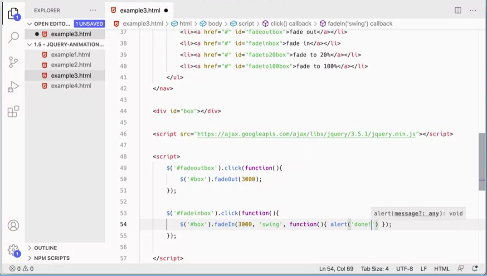

We could do **fadein** as well. I can copy that and paste it or just
type it again. It\'s always a good idea to do that, but we\'re going to
use this **ID** instead. Instead of fade out, we\'re going to fade in. I
could do three seconds and you could do the easing swing. It\'s going to
go in quotes, \'\'swing.\'\'

Then you could also add a callback function, and that\'s parentheses.
Inside the curly braces, we can add an \'\'alert\'\' that says \"done.\"
When the animation is complete, it runs the alert and says that it\'s
done. That\'s great. We can do all of that. Okay, cool. Now we just need
to add these last two here and we can look at that in the next lesson.

<!--~~~~~~~~~~~~~~~~~~~~~~~~~~~~~~~~~~~~~~~~~~~~~~~~~~~~~~~~~~~~~~~~~~~~~~~~~~~~~~~~~~~~~~~~~~~~-->
<h2 id="ch2-06">2.06 Example 3: Fade To (4:07)</h2>
<!--~~~~~~~~~~~~~~~~~~~~~~~~~~~~~~~~~~~~~~~~~~~~~~~~~~~~~~~~~~~~~~~~~~~~~~~~~~~~~~~~~~~~~~~~~~~~-->
<!--~~~~~~~~~~~~~~~~~~~~~~~~~~~~~ 178.  (xx) ~~~~~~~~~~~~~~~~~~~~~~~~~~~~~~-->

In this lesson, we\'ll make these last two buttons work.
<!--~~~~~~~~~~~~~~~~~~~~~~~~~~~~~~~~~~~~~~~~~~~~~~~~~~~~~~~~~~~~~~~~~~~~~~~~~~~~~~~~~~~~~~~~~~~~-->
<!--~~~~~~~~~~~~~~~~~~~~~~~~~~~~~ 179.  (xx) ~~~~~~~~~~~~~~~~~~~~~~~~~~~~~~-->

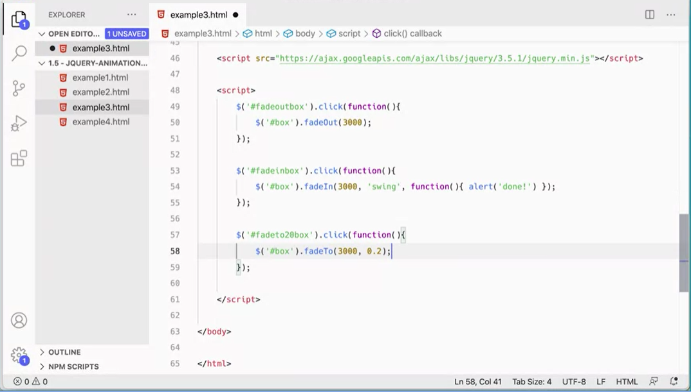

And with that, there\'s a fade to method that we can use in **jQuery**.

So here, just as we\'ve done before, we can add a new event handler for
when you click the the button has fadeto20box on here. I\'m going to
paste that in just to make sure I spell it right and we\'ll add a click
handler And then in here, we\'ll add a function that runs when you click
it, it\'s just an anonymous function. And what we\'re going to do here
is once again, we\'ll go get pound box. Don\'t forget the pound sign.

And we\'re going to use the fade to method. See it even comes up here,
fade to. And we\'re going to fade to, the way this works is we\'re going
to put in the amount of time. So we\'ll do, again I\'ll do 3000, just to
kind of slow but gives us a sense of what that is. But then the second
number it takes is a **duration**, an amount. Takes the **duration**,
that\'s the first number. The second number is how much it\'s going to
**fade** **to**. We want to do 0.2 like that. And now, that should
actually work.
<!--~~~~~~~~~~~~~~~~~~~~~~~~~~~~~~~~~~~~~~~~~~~~~~~~~~~~~~~~~~~~~~~~~~~~~~~~~~~~~~~~~~~~~~~~~~~~-->
<!--~~~~~~~~~~~~~~~~~~~~~~~~~~~~~ 180.  (xx) ~~~~~~~~~~~~~~~~~~~~~~~~~~~~~~-->

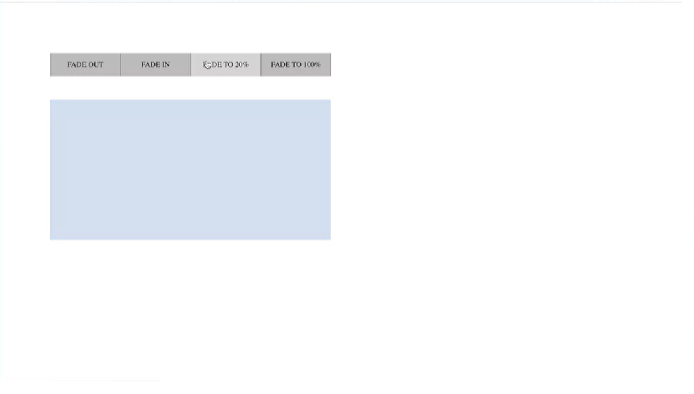

Let\'s go over and check it out. Press refresh this and click fade to,
it fades down but it doesn\'t fade all the way down, it fades to 20%.
<!--~~~~~~~~~~~~~~~~~~~~~~~~~~~~~~~~~~~~~~~~~~~~~~~~~~~~~~~~~~~~~~~~~~~~~~~~~~~~~~~~~~~~~~~~~~~~-->
<!--~~~~~~~~~~~~~~~~~~~~~~~~~~~~~ 181.  (xx) ~~~~~~~~~~~~~~~~~~~~~~~~~~~~~~-->

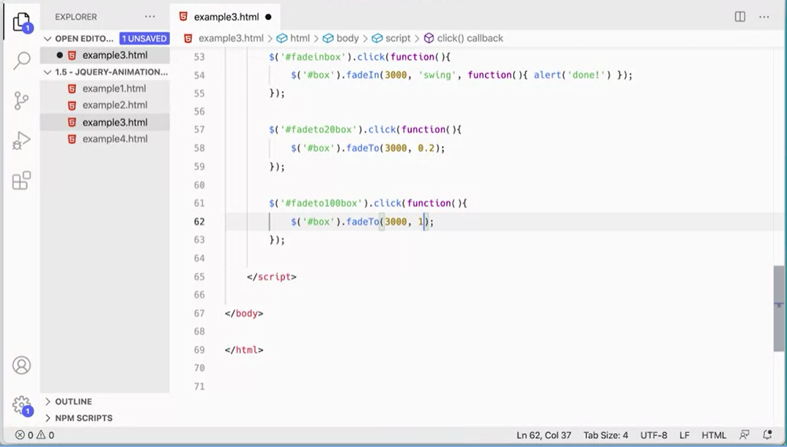

We can do that and then we can do the fade to again for the last one.
We\'re going to use this link **fadeTo**. When you click the fadeTo,
it\'s going to fade to one. The opacity is a number between 0 and 1, 0
is completely transparent, 1 is completely opaque.
<!--~~~~~~~~~~~~~~~~~~~~~~~~~~~~~~~~~~~~~~~~~~~~~~~~~~~~~~~~~~~~~~~~~~~~~~~~~~~~~~~~~~~~~~~~~~~~-->
<!--~~~~~~~~~~~~~~~~~~~~~~~~~~~~~ 182.  (xx) ~~~~~~~~~~~~~~~~~~~~~~~~~~~~~~-->

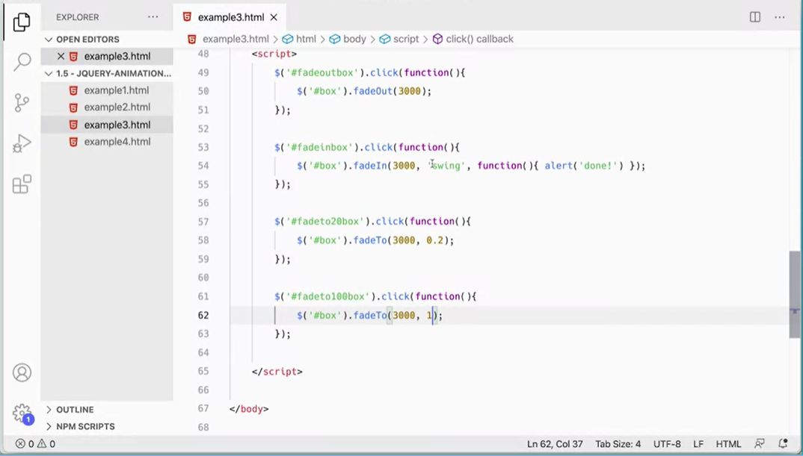

The 2^nd^ button has the callback function and the swing animation on
it. And if you wanted to do some of the other easings, you would have to
go get that **easing plug** in and stick it after **jQuery** loads.

But before we run our script, the order in which things loads matters
because of the way that the functions build on each other. We need to
have **jQuery**. In order to use **jQuery**, we would need to have the
**easing** **plug-in** in in order to use the using plug in. Using
**plug in** has to come after **jQuery**. All of this stuff has to go in
order on your page for it to work properly. We can have the **callback**
functions. And then in the next example, an example for, we\'ll look at
some custom animations where you can do some different kinds of things.
In examples 1, 2 and 3, we\'ve used some of the built-in convenience
functions that **jQuery** has built into it.

For fading in and out, for sliding up and down, for hiding and showing,
and toggling, slide toggle and doing all these kinds of things that we
commonly need to do. But sometimes you need to do a custom function, and
we\'ll take a look at that in the next part of this lesson.

<!--~~~~~~~~~~~~~~~~~~~~~~~~~~~~~~~~~~~~~~~~~~~~~~~~~~~~~~~~~~~~~~~~~~~~~~~~~~~~~~~~~~~~~~~~~~~~-->
<h2 id="ch2-07">2.07 Example 4: Custom Animations -- Part 1 (4:20)</h2>
<!--~~~~~~~~~~~~~~~~~~~~~~~~~~~~~~~~~~~~~~~~~~~~~~~~~~~~~~~~~~~~~~~~~~~~~~~~~~~~~~~~~~~~~~~~~~~~-->
<!--~~~~~~~~~~~~~~~~~~~~~~~~~~~~~ 183.  (xx) ~~~~~~~~~~~~~~~~~~~~~~~~~~~~~~-->

Next, for example 4, we\'re going to look at some of the custom
animations you can use in **jQuery** and over here I have my example
four file open, and you\'ll notice that the HTML and the CSS have
changed just a little bit.

There are more links here and my box now has some content inside the div
box here, and you\'ll see that my stylings is a little bit different up
here, if you look at the actual page, it looks like this now. We\'re
going to make each of these buttons work so we can see how some custom
animations work in **jQuery**.
<!--~~~~~~~~~~~~~~~~~~~~~~~~~~~~~~~~~~~~~~~~~~~~~~~~~~~~~~~~~~~~~~~~~~~~~~~~~~~~~~~~~~~~~~~~~~~~-->
<!--~~~~~~~~~~~~~~~~~~~~~~~~~~~~~ 184.  (xx) ~~~~~~~~~~~~~~~~~~~~~~~~~~~~~~-->

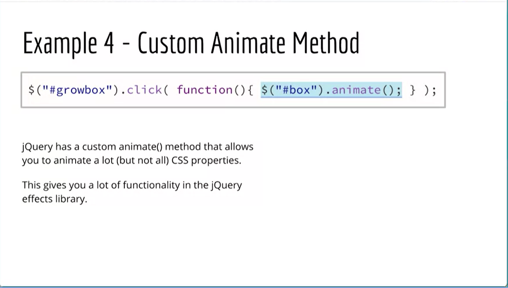

To do this, we\'ll use the animate method in **jQuery**, and you\'ll see
that it allows us to animate some, not all, but some of the CSS
properties that we have come to know and love over the years in working
with CSS. That gives us a lot of power, because we can actually use
these CSS properties to animate all different things not just sliding up
and down or showing and hiding and doing this kind of stuff.
<!--~~~~~~~~~~~~~~~~~~~~~~~~~~~~~~~~~~~~~~~~~~~~~~~~~~~~~~~~~~~~~~~~~~~~~~~~~~~~~~~~~~~~~~~~~~~~-->
<!--~~~~~~~~~~~~~~~~~~~~~~~~~~~~~ 185.  (xx) ~~~~~~~~~~~~~~~~~~~~~~~~~~~~~~-->

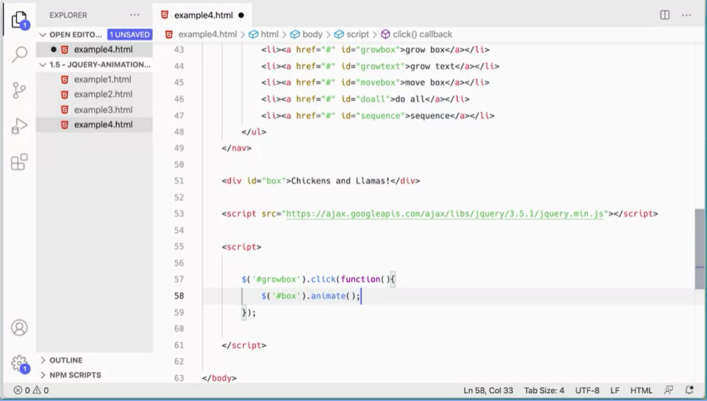

Let\'s give it a try and see what it does over here. Down here I\'m
going to add in my script. I\'m going to go get my **jQuery** objects
and I\'m going to get this first link up here, growbox, pound, growbox,
and I\'m going to add a click event handler on there, and then I\'m
going to pass in a function that runs when you click it, and
everything\'s going to go inside these curly brackets here. At this
point I want to affect box, pound box, don\'t forget the pound sign.
We\'re going to do the animate function in **jQuery**. This will animate
the box.
<!--~~~~~~~~~~~~~~~~~~~~~~~~~~~~~~~~~~~~~~~~~~~~~~~~~~~~~~~~~~~~~~~~~~~~~~~~~~~~~~~~~~~~~~~~~~~~-->
<!--~~~~~~~~~~~~~~~~~~~~~~~~~~~~~ 186.  (xx) ~~~~~~~~~~~~~~~~~~~~~~~~~~~~~~-->

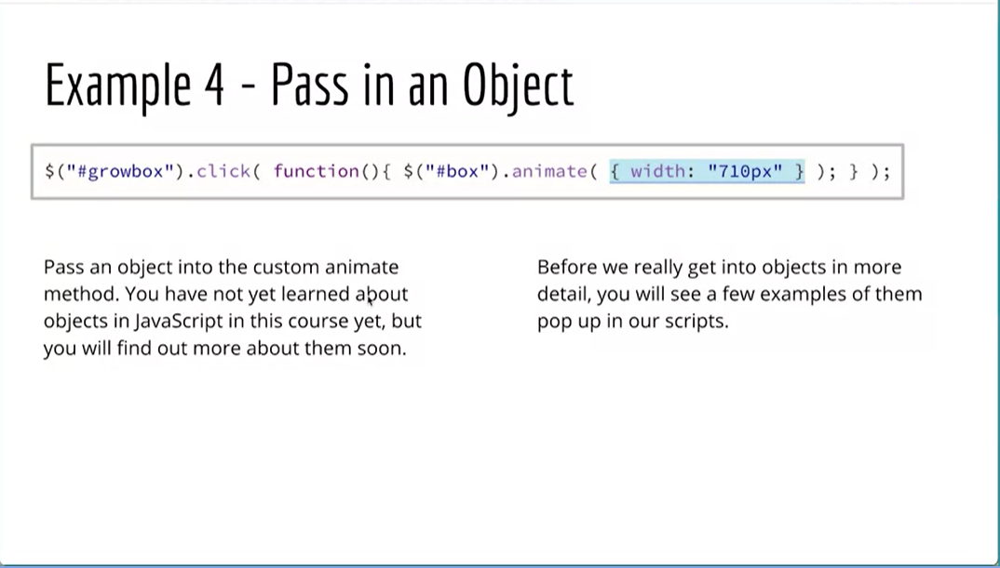

The way we\'re going to do this here is we\'re going to pass in an
object. We have not yet worked with objects in JavaScript, they\'re
coming, we\'re going to get to them later in our instruction about
JavaScript, but will see them pop up a few times and this is one of
those times. I\'ll explain it a little bit now, but we\'ll get into
objects in more detail a bit later, and an object is an alternative way
of storing data in JavaScript, and it comes with a key value pair.
<!--~~~~~~~~~~~~~~~~~~~~~~~~~~~~~~~~~~~~~~~~~~~~~~~~~~~~~~~~~~~~~~~~~~~~~~~~~~~~~~~~~~~~~~~~~~~~-->
<!--~~~~~~~~~~~~~~~~~~~~~~~~~~~~~ 187.  (xx) ~~~~~~~~~~~~~~~~~~~~~~~~~~~~~~-->

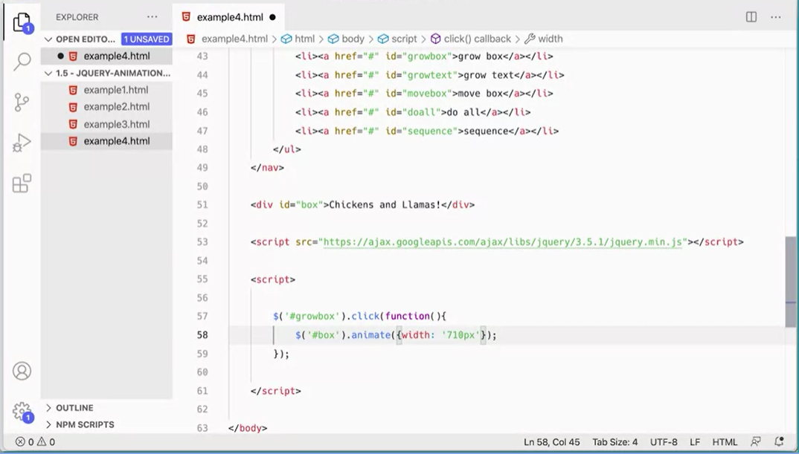

We define an object with the curly braces, and then we have a key value
pair. In this case, the key is width, that\'s the **CSS** property
we\'re animating, and then the value is 710px, and you\'ll notice that
the value goes inside quotes, but the key does not. That\'s a
distinguishing aspect of objects in JavaScript in general and also in
**jQuery**.
<!--~~~~~~~~~~~~~~~~~~~~~~~~~~~~~~~~~~~~~~~~~~~~~~~~~~~~~~~~~~~~~~~~~~~~~~~~~~~~~~~~~~~~~~~~~~~~-->
<!--~~~~~~~~~~~~~~~~~~~~~~~~~~~~~ 188.  (xx) ~~~~~~~~~~~~~~~~~~~~~~~~~~~~~~-->

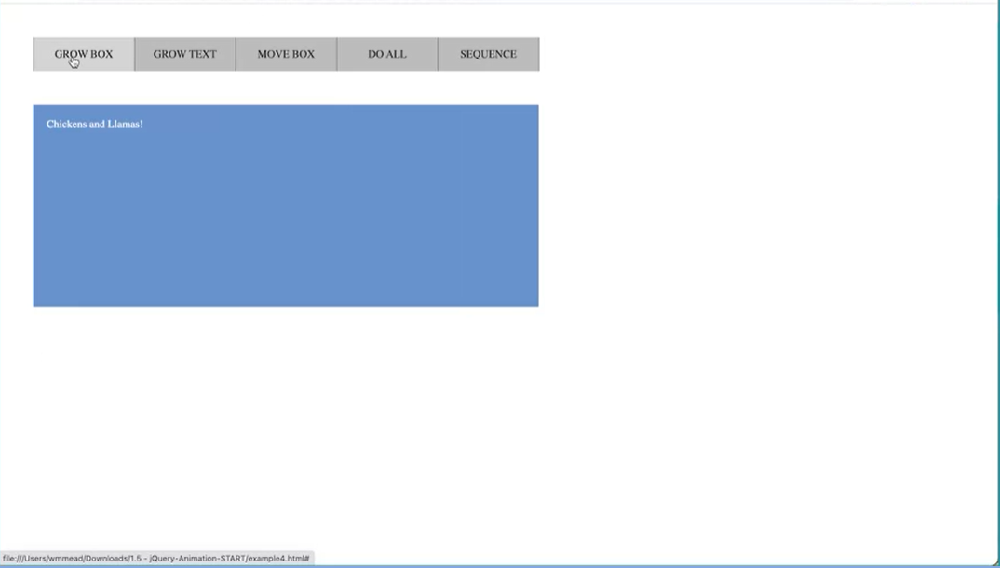

We\'re going to animate in here. We\'re going to pass in an object open
and closing curly brace and we\'re going to put in width, colon, and
then in \"710px\". That will move the box. It\'ll change the width of
the box to 710 pixels. If I come over here and test this, refresh grow
box, and you can see it sets it so that it 710 pixels. I knew it was 710
pixels to end right here. Let\'s take a look at growing the text and
affecting the actual text inside the box in the next lesson.

<!--~~~~~~~~~~~~~~~~~~~~~~~~~~~~~~~~~~~~~~~~~~~~~~~~~~~~~~~~~~~~~~~~~~~~~~~~~~~~~~~~~~~~~~~~~~~~-->
<h2 id="ch2-08">2.08 Example 4: Custom Animations - 2 (5:59)</h2>
<!--~~~~~~~~~~~~~~~~~~~~~~~~~~~~~~~~~~~~~~~~~~~~~~~~~~~~~~~~~~~~~~~~~~~~~~~~~~~~~~~~~~~~~~~~~~~~-->
<!--~~~~~~~~~~~~~~~~~~~~~~~~~~~~~ 189.  (xx) ~~~~~~~~~~~~~~~~~~~~~~~~~~~~~~-->

For this next example, we will start with our **jQuery** object again as
always, and then go and get the element that we want to get, which in
this case is pound grow box.
<!--~~~~~~~~~~~~~~~~~~~~~~~~~~~~~~~~~~~~~~~~~~~~~~~~~~~~~~~~~~~~~~~~~~~~~~~~~~~~~~~~~~~~~~~~~~~~-->
<!--~~~~~~~~~~~~~~~~~~~~~~~~~~~~~ 190.  (xx) ~~~~~~~~~~~~~~~~~~~~~~~~~~~~~~-->

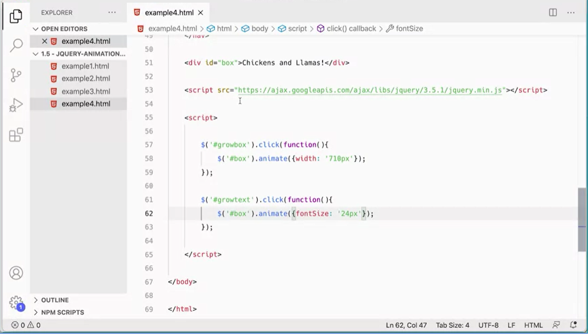

Because we\'re getting on and we grow text. It\'s always good to copy
and paste just to make sure you\'re getting exactly the right thing, and
then we\'ll do click parentheses and a semicolon. That click handler
will run when we click on grow text. Then we\'re going to come in your
add a function that runs when we click on that, on secret square braces.
I want curly braces.

Move that down and then once again, I\'m going to go get my box, pound
box inside quotes there. I\'m going to run the animate. The custom
animate function here and again, we\'re going to pass in with curly
braces, not square brackets, curly braces and object. What are we going
to do here? We\'re going to do font in quotes. No, this one looks like
this.
<!--~~~~~~~~~~~~~~~~~~~~~~~~~~~~~~~~~~~~~~~~~~~~~~~~~~~~~~~~~~~~~~~~~~~~~~~~~~~~~~~~~~~~~~~~~~~~-->
<!--~~~~~~~~~~~~~~~~~~~~~~~~~~~~~ 191.  (xx) ~~~~~~~~~~~~~~~~~~~~~~~~~~~~~~-->

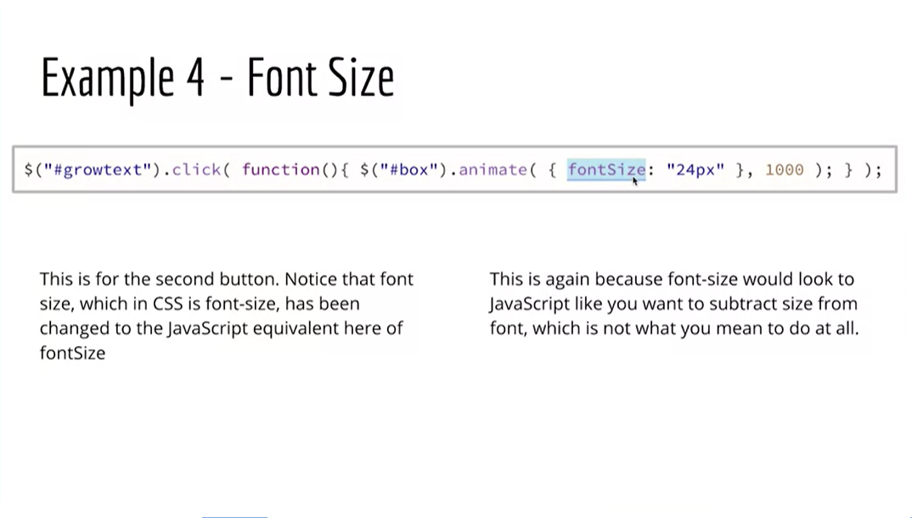

We come over here. Font size. We\'re using the JavaScript version of
font size rather than the CSS version, which is font dash size. We
can\'t have the dash in there because JavaScript will think that looks
like a minus sign, and so it\'s trying to subtract size from font and
it\'s not going to work. Instead what we want is **fontSize**, colon and
then I can set it to say 24 px or something like that and that should
change the font size.

Grow the box grow the text. That\'s working just fine and you can try a
different size text if you wanted to do 36 pixels or 40 or whatever you
want to do that\'ll be a little bit more dramatic. Grow the box, grow
the text and that\'s working great.
<!--~~~~~~~~~~~~~~~~~~~~~~~~~~~~~~~~~~~~~~~~~~~~~~~~~~~~~~~~~~~~~~~~~~~~~~~~~~~~~~~~~~~~~~~~~~~~-->
<!--~~~~~~~~~~~~~~~~~~~~~~~~~~~~~ 192.  (xx) ~~~~~~~~~~~~~~~~~~~~~~~~~~~~~~-->

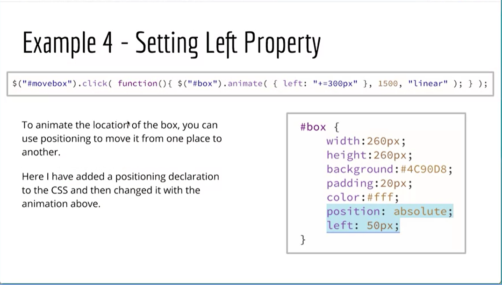

We could also move the box. Let\'s give that one a try. With move box,
what we\'re going to do, we\'re actually going to change the position of
the box, and in order to do that, we need to set some positioning for
box.
<!--~~~~~~~~~~~~~~~~~~~~~~~~~~~~~~~~~~~~~~~~~~~~~~~~~~~~~~~~~~~~~~~~~~~~~~~~~~~~~~~~~~~~~~~~~~~~-->
<!--~~~~~~~~~~~~~~~~~~~~~~~ 193/194.  (xx) ~~~~~~~~~~~~~~~~~~~~~~~~~~-->

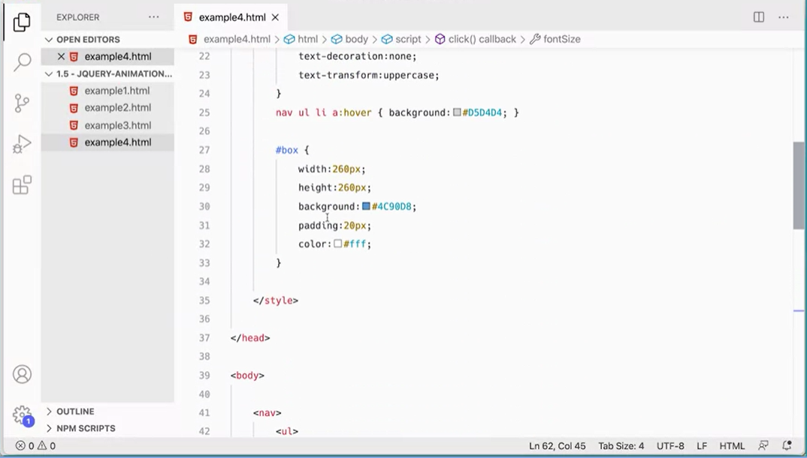
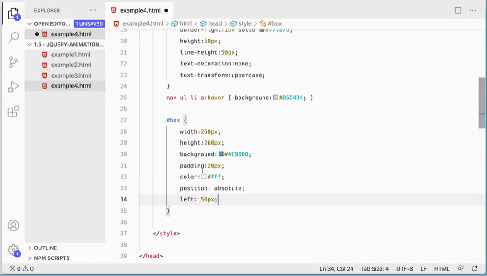

In our CSS over here for box, we need to add position absolute, and then
we want to set the left position, left 50 px. Why is it 50 pixels?
Because everything else is, is indented 50 pixels in here. I think I
have that, yes, he said padding 50 pixels. If I don\'t set left 50
pixels, let\'s take a look at this really quickly. If I reset that, that
puts that in the right place. But if I didn\'t put the 50 pixels in
there, left 50 pixels, maybe it won\'t actually do anything, okay, well
actually maybe be fine.
<!--~~~~~~~~~~~~~~~~~~~~~~~~~~~~~~~~~~~~~~~~~~~~~~~~~~~~~~~~~~~~~~~~~~~~~~~~~~~~~~~~~~~~~~~~~~~~-->
<!--~~~~~~~~~~~~~~~~~~~~~~~~~~~~~ 195.  (xx) ~~~~~~~~~~~~~~~~~~~~~~~~~~~~~~-->

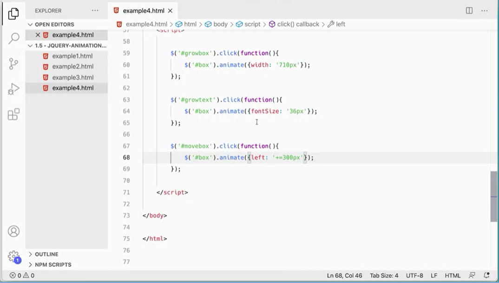

But still I want to set the left 50 pixels so that I\'m moving from this
position, left 50 pixels. Because we\'re going to change the left
property when we move the box. Down here again, I\'m just going to copy
this for the sake of making it a little bit quicker and down here
instead of grow text, I\'m going to move box. Move box, animate and then
here I\'m going to change the left property, left, and I\'m going to do
plus equals 300 px, so that we\'ll add 300 pixels to the 50 pixels
that\'s already there. Plus equals, we\'ll add 300 pixels to the 50
pixels.
<!--~~~~~~~~~~~~~~~~~~~~~~~~~~~~~~~~~~~~~~~~~~~~~~~~~~~~~~~~~~~~~~~~~~~~~~~~~~~~~~~~~~~~~~~~~~~~-->
<!--~~~~~~~~~~~~~~~~~~~~~~~~~~~~~ 196.  (xx) ~~~~~~~~~~~~~~~~~~~~~~~~~~~~~~-->

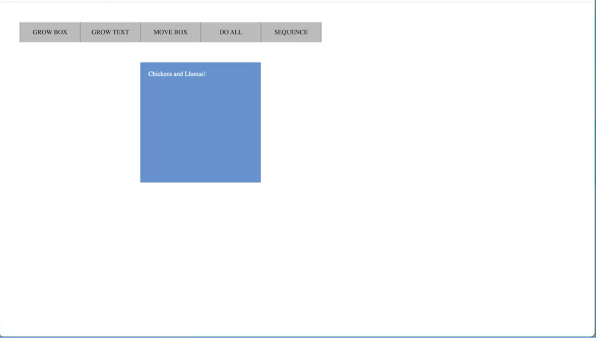

It\'s already there and it\'ll move it left 50 pixels, I mean to 350
pixels from the left-hand side.
<!--~~~~~~~~~~~~~~~~~~~~~~~~~~~~~~~~~~~~~~~~~~~~~~~~~~~~~~~~~~~~~~~~~~~~~~~~~~~~~~~~~~~~~~~~~~~~-->
<!--~~~~~~~~~~~~~~~~~~~~~~~~~~~~~ 197.  (xx) ~~~~~~~~~~~~~~~~~~~~~~~~~~~~~~-->

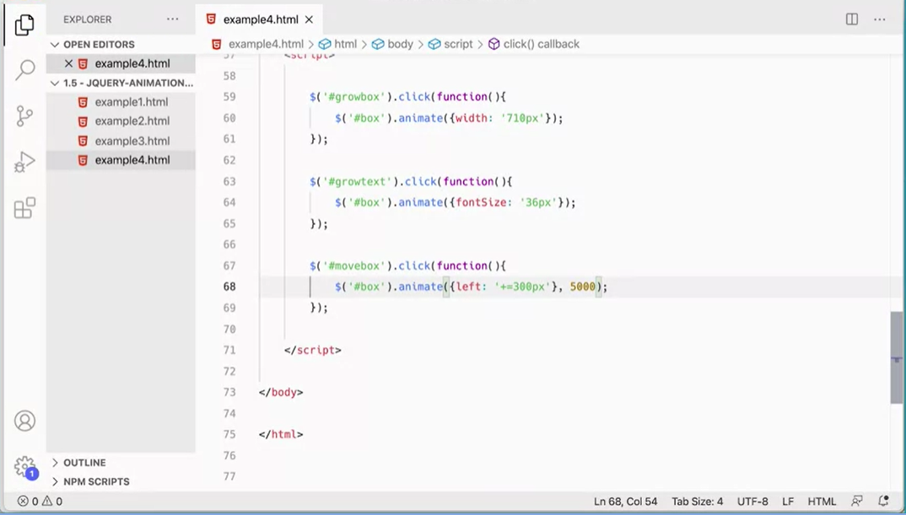

You can set how long you want that animation take. You can make it go
longer if you wanted to and after the animate, after the object here, I
could add in a comma and say, I want this to run over five seconds,
something like that, and that will animate over five seconds. Let\'s see
what that does. Five seconds is really slow, but it is animating .
We\'re able to adjust the amount of time and the amount that it moves
in, what it does with the actual animation, all with custom animation.

<!--~~~~~~~~~~~~~~~~~~~~~~~~~~~~~~~~~~~~~~~~~~~~~~~~~~~~~~~~~~~~~~~~~~~~~~~~~~~~~~~~~~~~~~~~~~~~-->
<h2 id="ch2-09">2.09 Doing All Animations at Once (6:30)</h2>
<!--~~~~~~~~~~~~~~~~~~~~~~~~~~~~~~~~~~~~~~~~~~~~~~~~~~~~~~~~~~~~~~~~~~~~~~~~~~~~~~~~~~~~~~~~~~~~-->
<!--~~~~~~~~~~~~~~~~~~~~~~~~~~~~~ 198.  (xx) ~~~~~~~~~~~~~~~~~~~~~~~~~~~~~~-->

For next button on Example 4, we want to make all of these animations
happen at the same time.
<!--~~~~~~~~~~~~~~~~~~~~~~~~~~~~~~~~~~~~~~~~~~~~~~~~~~~~~~~~~~~~~~~~~~~~~~~~~~~~~~~~~~~~~~~~~~~~-->
<!--~~~~~~~~~~~~~~~~~~~~~~~~~~~~~ 199.  (xx) ~~~~~~~~~~~~~~~~~~~~~~~~~~~~~~-->

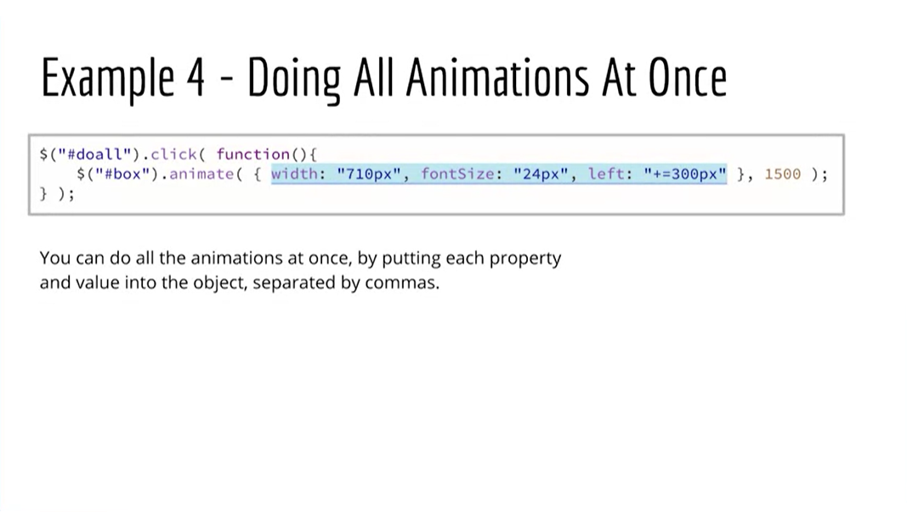

They\'re all going to move forward at the same time. We will change both
the width, the font, and the left positioning of three of these. We\'re
going to change all of them at once. We can do that by just passing in
these different properties into our object all at once, separating them
with commas.
<!--~~~~~~~~~~~~~~~~~~~~~~~~~~~~~~~~~~~~~~~~~~~~~~~~~~~~~~~~~~~~~~~~~~~~~~~~~~~~~~~~~~~~~~~~~~~~-->
<!--~~~~~~~~~~~~~~~~~~~~~~~~~~~~~ 200.  (xx) ~~~~~~~~~~~~~~~~~~~~~~~~~~~~~~-->

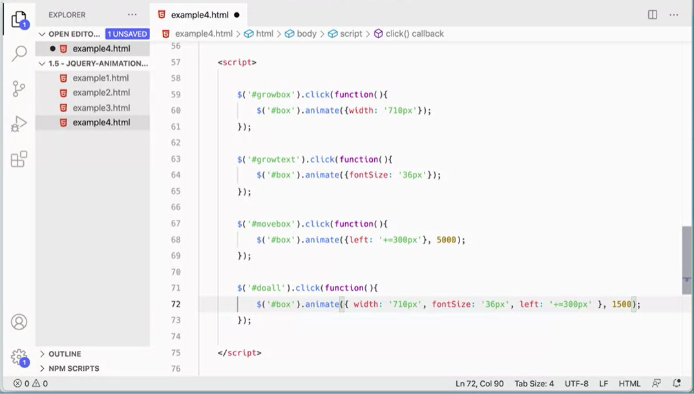

Let\'s do that. Down here, once again, I\'m going to use my **jQuery**
object to go get this pound, but what I want is do all. I\'m going to
get pound do all. Then I\'m going to add a click handler. Click for when
you click the **doall** button, and then we\'re going to run a function,
when that button is clicked, and here we have it. Here now, we want to
effect a parentheses pound box, like so. Again, we\'re going to do the
animate method. We\'re going to pass in our object, so we do the curly
braces. First we want width, 710 pixels, so I put that in here. Width,
710 pixels and then a comma. Then we want font size, 36 pixels, I put
that in there. Then a comma. Then we want left plus equals 300. We\'ll
put that in there.

You\'ll see now there\'s some extra spaces at the end. It doesn\'t
really matter, it\'s fine, but you\'ll see with all of those in there,
that now when I come over and test this thing, I also want to put in an
amount of time, that will be really helpful. After the curly brace, put
a comma, and then I\'m going to put 1500. It\'s going to take a
second-and-a-half to do all of these.
<!--~~~~~~~~~~~~~~~~~~~~~~~~~~~~~~~~~~~~~~~~~~~~~~~~~~~~~~~~~~~~~~~~~~~~~~~~~~~~~~~~~~~~~~~~~~~~-->
<!--~~~~~~~~~~~~~~~~~~~~~~~~~~~~~ 201.  (xx) ~~~~~~~~~~~~~~~~~~~~~~~~~~~~~~-->

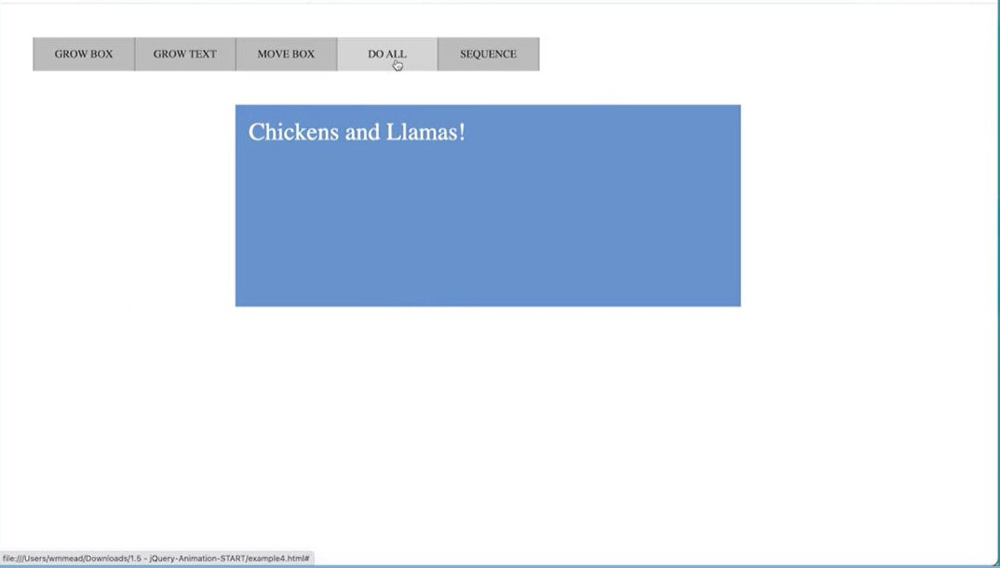

Let\'s come back over here and refresh this. When I click Do All, it
should do all of those things.
<!--~~~~~~~~~~~~~~~~~~~~~~~~~~~~~~~~~~~~~~~~~~~~~~~~~~~~~~~~~~~~~~~~~~~~~~~~~~~~~~~~~~~~~~~~~~~~-->
<!--~~~~~~~~~~~~~~~~~~~~~~~~~~~~~ 202.  (xx) ~~~~~~~~~~~~~~~~~~~~~~~~~~~~~~-->

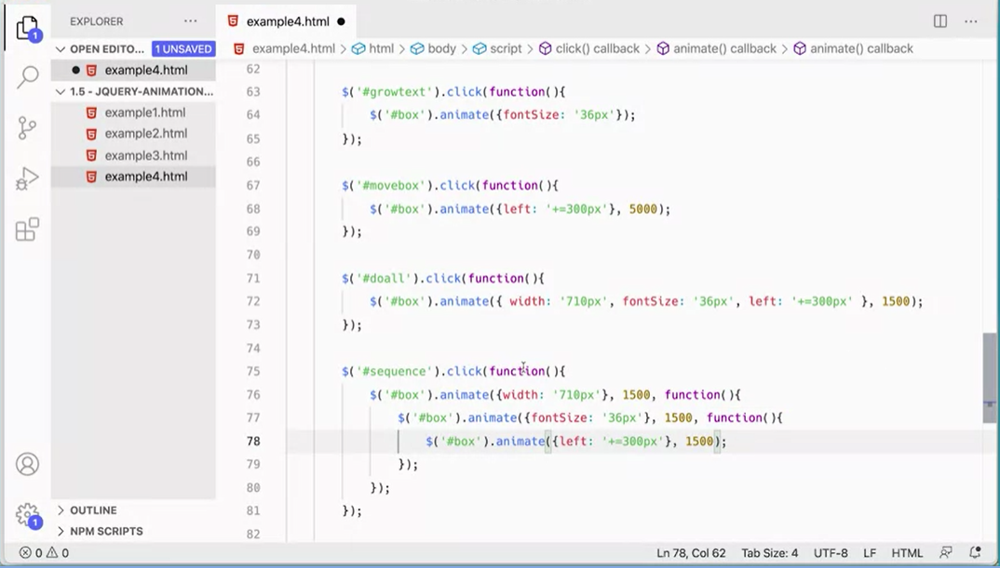

Now, the last button is to do them in a sequence. First we want to grow
the box, then we want to grow the text, then we want to move the box. We
want to do each one of these in a sequence. We can do that with
**callback** functions.

Each one of these animations can have its own callback functions that
when it finishes it calls the next one and when that one finishes it
calls the next one. It can be confusing for the syntax in order to get
this to work, but once you understand it and know how to do it and mess
with it a little bit, it\'s not too hard.

Let\'s do this again. I\'m going to start with this one. I\'m going to
copy that and stick it down here. Instead of getting that button, I\'m
going to get this one sequence. When you click the button Sequence,
it\'s going to take box and it\'s going to animate the width to 710 px.
I\'m going to put a comma. Another comma, yeah, I\'m going to put a
comma, and then I\'m going to put say 1500 for how long that animation
should take place. I\'m going to put another comma, and I\'m going to
add a function. It\'s really easy to get confused here because we\'re
going to put everything into this function here. I\'m going to make sure
I click between those curly braces, move that down.

Then I\'m gonna go get this one, font-size 36. I\'m going to put a comma
here and I\'m going to put 1500 seconds in there. The 1500 milliseconds,
that\'s 1.5 seconds. 1500 milliseconds in there, and then a comma and
another function, parentheses, curly braces. It\'s really easy to lose
track of this stuff. You have to be really careful with it, but then
I\'m going to put the next one inside these curly braces. I move that
down, and I\'m going to do this one here. Now change that to 1500. There
we go. That\'s the last one. It doesn\'t get a **callback** function.
<!--~~~~~~~~~~~~~~~~~~~~~~~~~~~~~~~~~~~~~~~~~~~~~~~~~~~~~~~~~~~~~~~~~~~~~~~~~~~~~~~~~~~~~~~~~~~~-->
<!--~~~~~~~~~~~~~~~~~~~~~~~~~~~~~ 203.  (xx) ~~~~~~~~~~~~~~~~~~~~~~~~~~~~~~-->

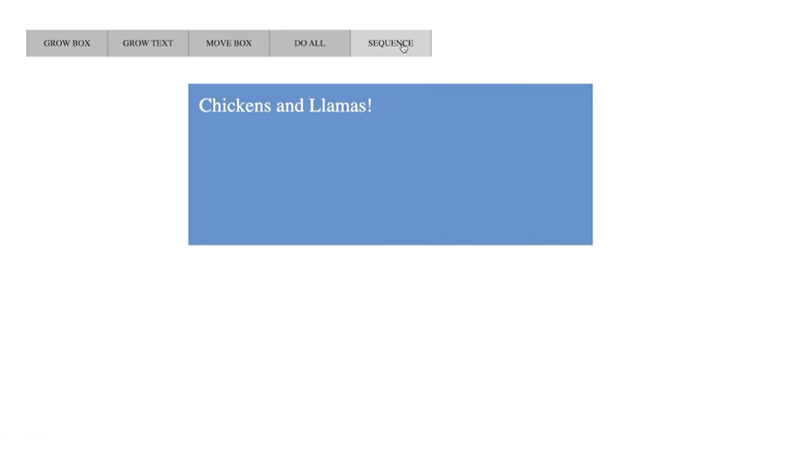

Let\'s see if that works. If I come over here and test this, refresh, if
I did it right, sequence, it should do that one and that finishes. It
does that, and then it moves it, and everything is working all in a
sequence.

With the JavaScript effects library, we can do all kinds of really
interesting things. You can animate all kinds of different CSS
properties. However, it is better to do the animations in CSS with
transitions or keyframe animations in CSS, and then apply those classes,
but sometimes using the effects library in JavaScript is still useful.
Especially if you\'re doing something fairly quick, there\'s not a lot
of reason not to use it. We\'ll see an example of when is a good place
to use this effects library coming up when we create a tabbed interface.

<h3>Additional Resources</h3>

Here are resources related to these lessons:

<ul>
  <li><a href="https://gsgd.co.uk/sandbox/jquery/easing/">
    2.09 jQuery Easing Plugin</a></li>
  <li><a href="https://cdnjs.com/libraries/jquery-easing">
    2.09 jQuery Easing</a></li>
</ul>

<h3>PDF of Presentation</h3>

Here is a PDF of the presentation slides used in the lessons for this
section: **Intro to jQuery Effects Library**.

<ul>
  <li><a href="https://d3c33hcgiwev3.cloudfront.net/ipt9jX2gRvGbfY19oNbxgA_273f1d9cb53a443b95389299f4786bf1_WEB1091_M02_jQuery-Effects-Library.pdf?Expires=1710460800&Signature=hSGaHtrwgHjj8sZJqoSQR6oPeX4YPq4wyk6iIMGqq\~DPfPpEZa6Op9KptnMy7uXt8YE\~kkHerEmfynS0eY-T2oD4IrivQAqSDC\~0aLPISPEN8dDBrd1Y-hUlQOw0TUqd\~GXfcOMuUAJgywBFiT8HXzwO0QS4SwNkySDnfQvOe8E\_&Key-Pair-Id=APKAJLTNE6QMUY6HBC5A">
    2.09 jQuery Effects-Library.pdf</a></li>
</ul>

<!--~~~~~~~~~~~~~~~~~~~~~~~~~~~~~~~~~~~~~~~~~~~~~~~~~~~~~~~~~~~~~~~~~~~~~~~~~~~~~~~~~~~~~~~~~~~~-->
<h2 id="ch2-10">2.10 Intro to Tabbed Interface Using jQuery (5:27)</h2>
<!--~~~~~~~~~~~~~~~~~~~~~~~~~~~~~~~~~~~~~~~~~~~~~~~~~~~~~~~~~~~~~~~~~~~~~~~~~~~~~~~~~~~~~~~~~~~~-->
<!--~~~~~~~~~~~~~~~~~~~~~~~~~~~~~ 204.  (xx) ~~~~~~~~~~~~~~~~~~~~~~~~~~~~~~-->

Tabbed interface, using **jQuery**.
<!--~~~~~~~~~~~~~~~~~~~~~~~~~~~~~~~~~~~~~~~~~~~~~~~~~~~~~~~~~~~~~~~~~~~~~~~~~~~~~~~~~~~~~~~~~~~~-->
<!--~~~~~~~~~~~~~~~~~~~~~~~~~~~~~ 205.  (xx) ~~~~~~~~~~~~~~~~~~~~~~~~~~~~~~-->

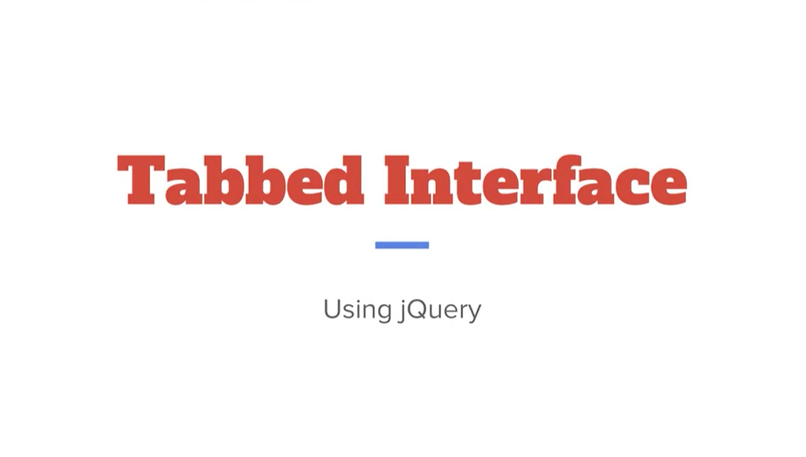

We\'re going to create this tabbed interface, and this is a really good
project to see the **jQuery** effects library in practice.
<!--~~~~~~~~~~~~~~~~~~~~~~~~~~~~~~~~~~~~~~~~~~~~~~~~~~~~~~~~~~~~~~~~~~~~~~~~~~~~~~~~~~~~~~~~~~~~-->
<!--~~~~~~~~~~~~~~~~~~~~~~~~~~~~~ 206.  (xx) ~~~~~~~~~~~~~~~~~~~~~~~~~~~~~~-->

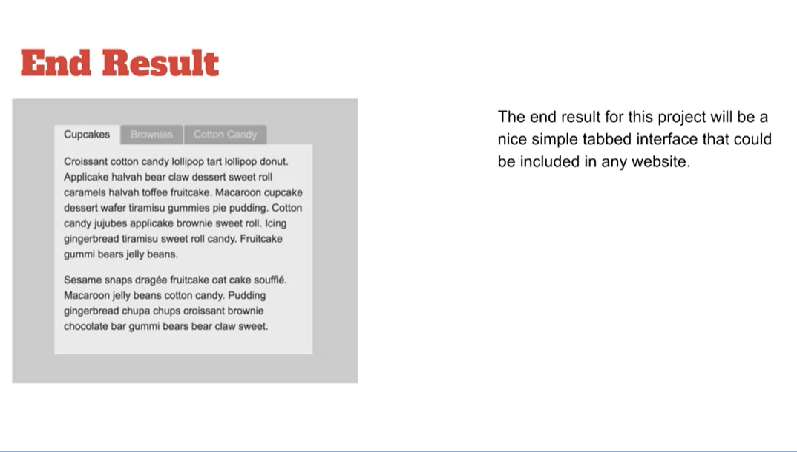

We\'ve looked at how to use the **jQuery** effects library, and now
we\'re going to use it a little bit in this project.

This is a good project for seeing how that effects library can be
effective without adding a lot of extra weight to a project. We\'re not
going to do anything too intensive with it, but it\'s a nice use of
effects library.

Then we\'ll remake the same project using plain JavaScript, so you can
see the difference between the two, and compare the code between the two
versions.

<!--~~~~~~~~~~~~~~~~~~~~~~~~~~~~~~~~~~~~~~~~~~~~~~~~~~~~~~~~~~~~~~~~~~~~~~~~~~~~~~~~~~~~~~~~~~~~-->
<!--~~~~~~~~~~~~~~~~~~~~~~~~~~~~~ 207.  (xx) ~~~~~~~~~~~~~~~~~~~~~~~~~~~~~~-->

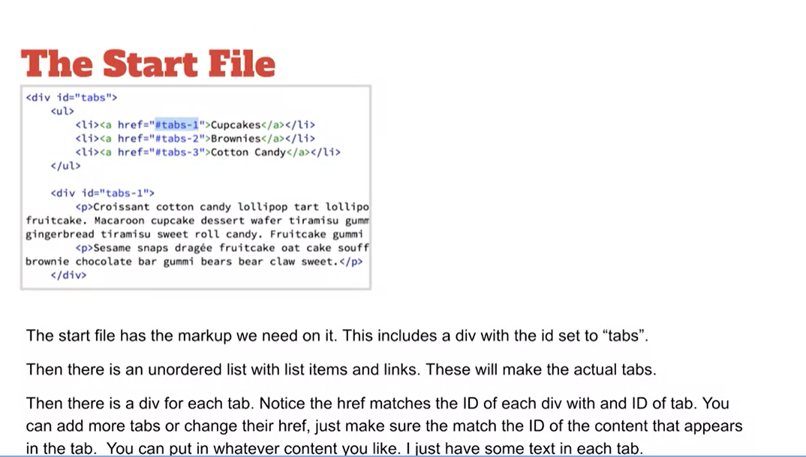
Let\'s get started and see what this is going to look like.
<!--~~~~~~~~~~~~~~~~~~~~~~~~~~~~~~~~~~~~~~~~~~~~~~~~~~~~~~~~~~~~~~~~~~~~~~~~~~~~~~~~~~~~~~~~~~~~-->
<!--~~~~~~~~~~~~~~~~~~~~~~~ 208/209.  (xx) ~~~~~~~~~~~~~~~~~~~~~~~~~~-->

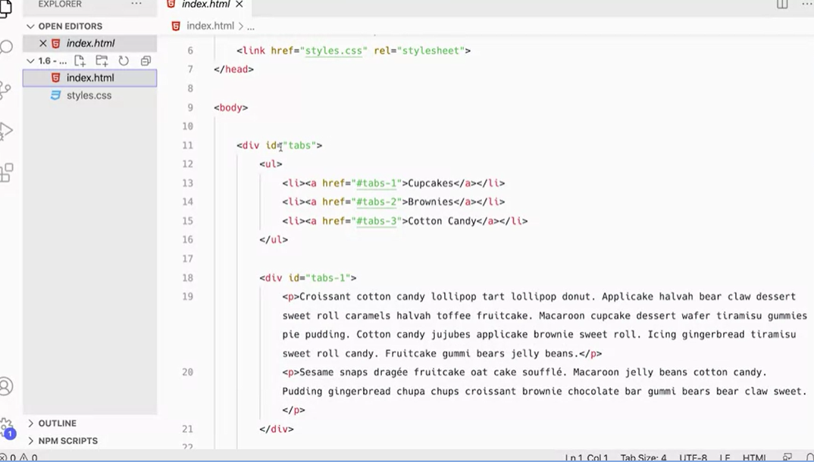

If we go and look at the markup file over here, you\'ll see that the way
it\'s setup is we have a div called tabs with an idea of tabs, and in
here we have an unordered list. These things are going to be the actual
tabs that you click on.

Then the href for these links to the id\'s for these pieces of content
down here, and this is the content that will be on each tab. This is
typical for the setup for this type of interface, is that you would have
an unordered list that makes the tabs, and the tabs themselves would
have id\'s that match the href\'s for them up here. That\'s the basic
markup that we\'re going to be using, and it should really work well for
us.
<!--~~~~~~~~~~~~~~~~~~~~~~~~~~~~~~~~~~~~~~~~~~~~~~~~~~~~~~~~~~~~~~~~~~~~~~~~~~~~~~~~~~~~~~~~~~~~-->
<!--~~~~~~~~~~~~~~~~~~~~~~~~~~~~~ 210.  (xx) ~~~~~~~~~~~~~~~~~~~~~~~~~~~~~~-->

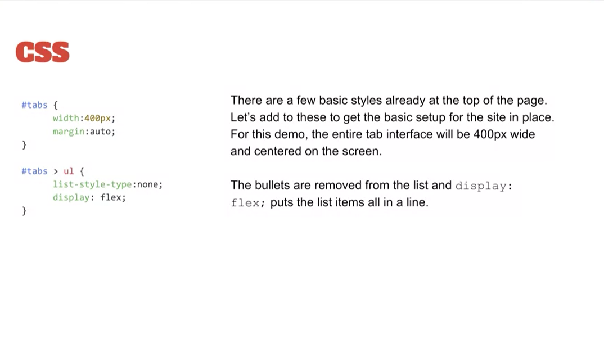

From there we need to add some basic styling because currently in the
page, if you open up the start files in the browser, they look like
this, so there\'s very little styling here.
<!--~~~~~~~~~~~~~~~~~~~~~~~~~~~~~~~~~~~~~~~~~~~~~~~~~~~~~~~~~~~~~~~~~~~~~~~~~~~~~~~~~~~~~~~~~~~~-->
<!--~~~~~~~~~~~~~~~~~~~~~~~~~~~~~ 211.  (xx) ~~~~~~~~~~~~~~~~~~~~~~~~~~~~~~-->

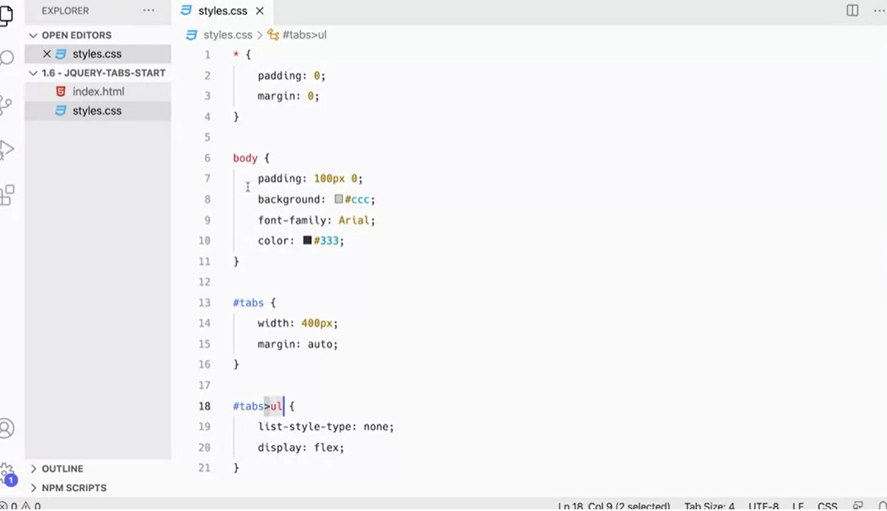

I\'ve done just a little bit on my style sheet, so you can come over
here and see styles.css. I\'ve got this reset rule, which is not great
to use for production websites. But for this, it\'s just taking margin
and padding off of everything.

Then we\'re just adding some padding to the body and setting the
background color and the font and the color. Let\'s add a few rules here
to make sure that we get this thing all in place. The first rule I\'m
going to add is for the tabs themselves, so this is the entire interface
really. I\'m just going to give it a width of 400 pixels and set margin
to auto so that it centers on the screen.

With those two pieces in place. Then for the actual tabs, for the
unordered list, I\'m going to get rid of the bullets and set them to
display **flex**, so they go next to each other.

You might wonder about the single bracket, and what this does is it
makes sure that the unordered list, that\'s inside the tabs directly,
the direct descended is targeted.
<!--~~~~~~~~~~~~~~~~~~~~~~~~~~~~~~~~~~~~~~~~~~~~~~~~~~~~~~~~~~~~~~~~~~~~~~~~~~~~~~~~~~~~~~~~~~~~-->
<!--~~~~~~~~~~~~~~~~~~~~~~~~~~~~~ 212.  (xx) ~~~~~~~~~~~~~~~~~~~~~~~~~~~~~~-->

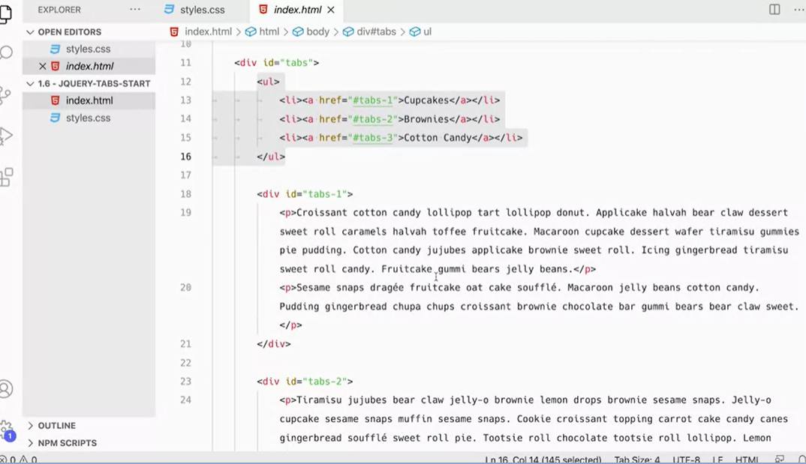

Example 1, something like this, li. Example 2, something like that. But
I didn\'t want this unordered list to get targeted by my rules, I only
want this one because this is actual content in my tab. That\'s why I\'m
using the angle bracket here, is that it will only target the specific
selector for my element tabs that are there. We\'ve got that in place,
and now my tabs are lining up next to each other, still doesn\'t look
very good, but we\'re getting there.We\'ll continue with the styling in
the next lesson.

### Start Files: Creating a Tabbed Interface with jQuery

Attached is a zip file of the the things you need to begin this
exercise. A **zip file** is defined as: a computer file whose contents
include one or more files that are compressed for storage or
transmission, often carrying the extension .ZIP.

## zip START Files

> 2.10
> jQuery-Tabs-START.ziphttps://d3c33hcgiwev3.cloudfront.net/0zxTkBHgSGK8U5AR4GhiNQ_2cfc93b6885b45df9d112bfdb160edb8_WEB1091_jQuery-Tabs-Start.zip?Expires=1710633600&Signature=fNkkUy75wDywZ87jXfS5Dlrfg5nWorDm50rID9X2tFjy\~n9wXEtGIsB2RHKiZFTfTTlBeQxmjbhYfOGe9h50y0xSekL4X19\~Tj78kqW2edt7cMuCENfP3LFo-lbfoN03ZXTKgV-uL8l206y-IvjXpv06oxrfwV1-ZO9kWFZ71lk\_&Key-Pair-Id=APKAJLTNE6QMUY6HBC5A

**Additional Resource:**

-   [How to open a zip file for either Mac or
    PC](https://www.sweetwater.com/sweetcare/articles/how-to-zip-and-unzip-files/)

<!--~~~~~~~~~~~~~~~~~~~~~~~~~~~~~~~~~~~~~~~~~~~~~~~~~~~~~~~~~~~~~~~~~~~~~~~~~~~~~~~~~~~~~~~~~~~~-->
<h2 id="ch2-11">2.11 Styling the Anchor Tags (5:32)</h2>
<!--~~~~~~~~~~~~~~~~~~~~~~~~~~~~~~~~~~~~~~~~~~~~~~~~~~~~~~~~~~~~~~~~~~~~~~~~~~~~~~~~~~~~~~~~~~~~-->
<!--~~~~~~~~~~~~~~~~~~~~~~~~~~~~~ 213.  (xx) ~~~~~~~~~~~~~~~~~~~~~~~~~~~~~~-->

The next rule styles the actual anchor tags that are inside the list
items that are inside the unordered list that are inside the tabs.

<!--
<!--~~~~~~~~~~~~~~~~~~~~~~~~~~~~~~~~~~~~~~~~~~~~~~~~~~~~~~~~~~~~~~~~~~~~~~~~~~~~~~~~~~~~~~~~~~~~-->
<!--~~~~~~~~~~~~~~~~~~~~~~~ xx/xx.  (xx) ~~~~~~~~~~~~~~~~~~~~~~~~~~-->

<!--~~~~~~~~~~~~~~~~~~~~~~~~~~~~~~~~~~~~~~~~~~~~~~~~~~~~~~~~~~~~~~~~~~~~~~~~~~~~~~~~~~~~~~~~~~~~-->
<!--~~~~~~~~~~~~~~~~~~~~~~~~~~~~~ xx.  (xx) ~~~~~~~~~~~~~~~~~~~~~~~~~~~~~~-->

-->
